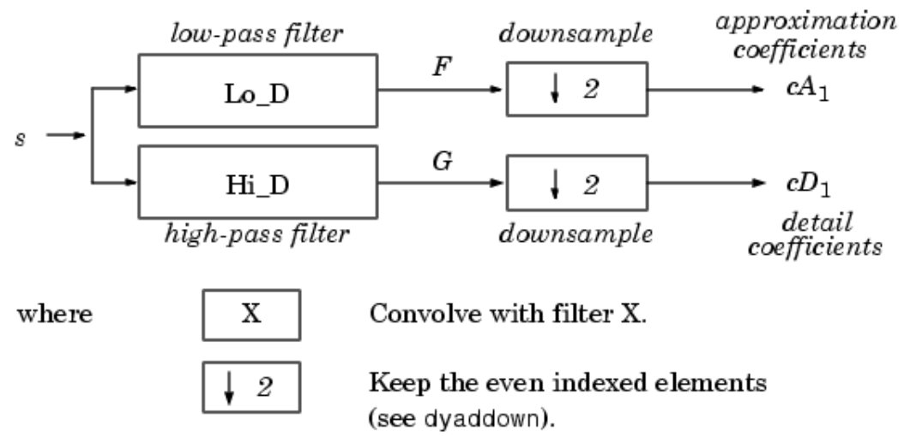
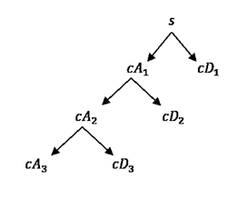
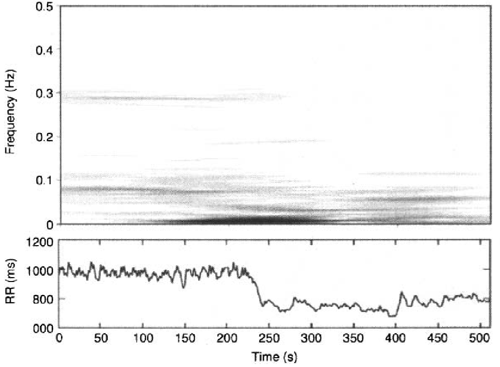
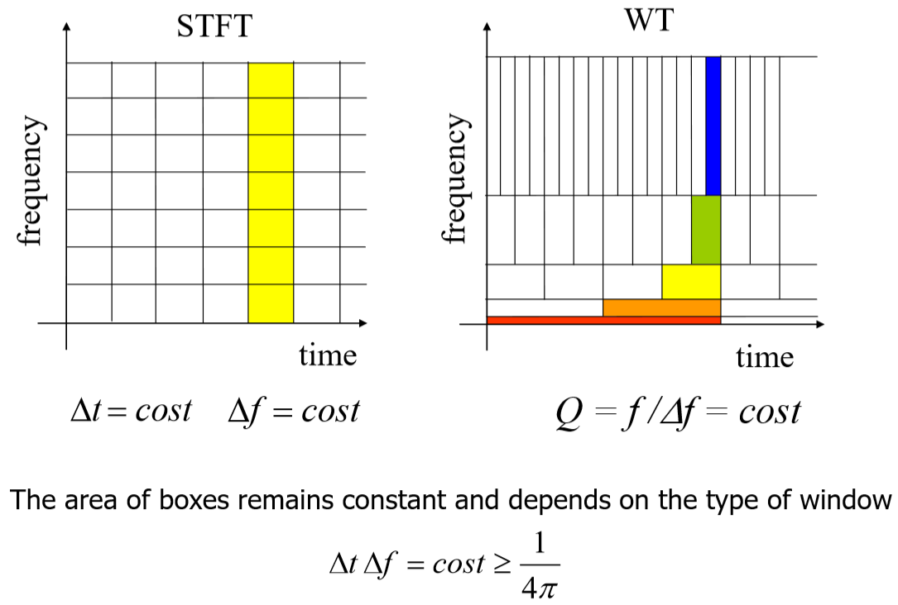
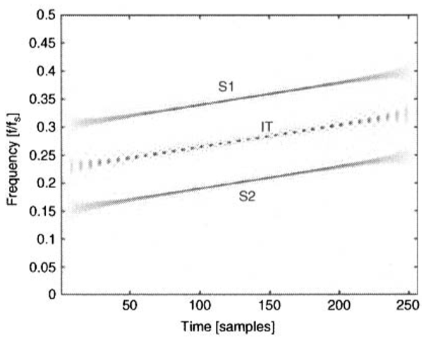
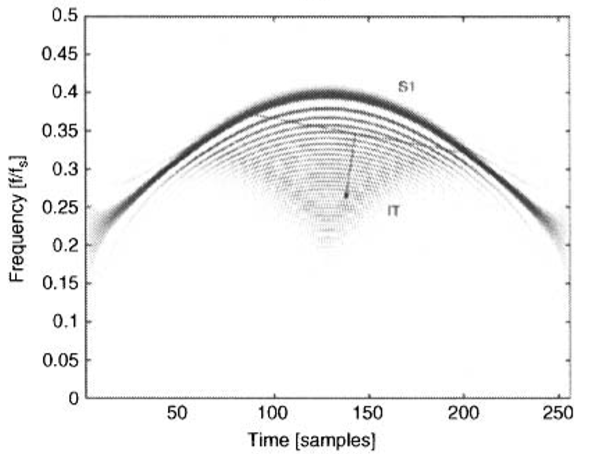
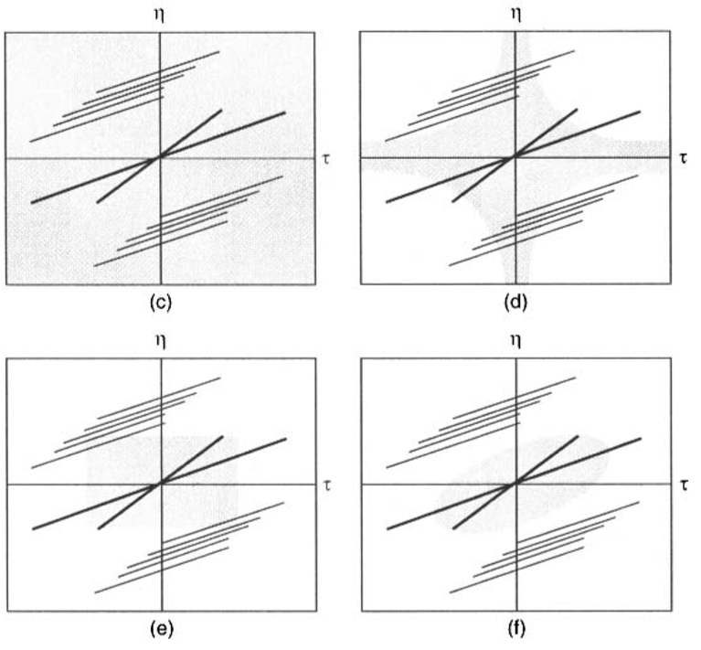

### Advanced Signals and Data Processing in Medicine

*A series of notes on the "Advanced SIgnals and Data Processing in Medicine" course as taught by Sergio Cerutti and Riccardo Barbieri during the second semester of the academic year 2018-2019 at Politecnico di Milano.*

## Exam Questions *Cerutti*

- ***Talk me about the Wiener filter (in both frequency and time domains) and its applications.***

  The *Wiener Filter* is a non-recursive filter used to produce an estimate of a desired or target random process by linear time-invariant filtering of an observed noisy process, assuming known *stationary* signal and noise spectra, and additive noise. The Wiener filter minimizes the mean square error between the estimated random process and the desired process.

  So...hypothesis behind the Wiener Filter:

  - $y(k) = x + v(k) \space$

    Where $x​$ is the signal we are interested in and $v​$ is a random noise. 
    $x​$  and  ​$v​$ are not necessarily linked by an additive relationship

  - $x$ and $v$ are stationary stochastic processes.

  - $M$ (number of samples) must be sufficiently large ( $M\to \infty $).

  Given these hypothesis *Wiener* designed a LTI filter able to minimize the quadratic error.

  The filter is non-recursive and $h(i)$ will be the coefficients of the Wiener Filter.
  Since we have to "clean" the $y$ signal we must choose the right values of $h(i)$ in order to reduce the effect of the noise. To do so we compute the derivative of the error function *w.r.t.* the $h(i)$ coefficients and put it to $0$ to find the minimum.
  $$
  \hat{x} = \sum_{i= 1}^{M}h(i)\cdot y(i) \\
  
  p_{e} = E[e^{2}] = E[(x-\hat{x})^{2}] = E[(x - \sum_{i= 1}^{M}h(i)\cdot y(i))^{2}] \\
  
  \frac{\partial{p_{e}}}{\partial{h(j)}} = -2E[(x - \sum_{i= 1}^{M}h(i)\cdot y(i))]\cdot y(j) = 0  \\
  
  \text{   $j =
  1,2,$..$,M$} \\
  $$
  We drop $(-2)$ (useless) and obtain
  $$
  E[(x-\sum_{i=1}^{M}h(i) \cdot y(i)) ]\cdot y(j) = 0 \\
  \sum_{i}^{M}h(i) \cdot E[y(i) \cdot y(j)] = E[x \cdot y(j)] \\
  $$
  We define
  $$
  E[y(i) \cdot y(j)] = p_{y}(i,j) = R_{yy} \text{   (autocorrelation)} \\
  E[x \cdot y(j)] = p_{xy}(j) = R_{xy} \text{   (correlation between x and y)}
  $$
  And reach the *Wiener-Hopf* equation:
  $$
  \color{red}\sum_{i}^{M}h(i) \cdot p_y(i,j) = p_{xy}(j) \\
  h(i) = Unknown \\
  p_y(i,j) = Known \\
  p_{xy}(j) = Known \\\ \\
  \text{From here it follows that...}\\\ \\
  p_{e} = E[(x-\hat{x})^{2}] = E[(x - \sum_{i= 1}^{M}h(i)\cdot y(i))^{2}]\\
  \color{red}\text{Come diavolo si ricava la formula qui sotto?}\\
  p_e = E[x^{2}] - \sum_{i=1}^{M}h(i) \cdot E[x \cdot y(i) ] = E[x^{2}] - \sum_{i=1}^{M} h(i) \cdot p_{xy}(i)
  $$
  In *matricial form*:
  $$
  \begin{cases}
  \overline{h} = P_{y}^{-1}\overline{p_{xy}} \\
  \hat{x} = \overline{h^{T}}\overline{y} = \overline{p_{xy}^{T}}P_{y}^{-1}\overline{y} \\
  p_{e} = E[x^{2}] - \overline{p_{xy}^{T}}P_{y}^{-1}\overline{p_{xy}}
  \end{cases}
  $$
  The *Wiener Filter* is *optimal* among the time-invariant linear filters but, obviously, if the hypothesis are not fulfilled is *sub-optimal*.

- ***What is the Adaptive filter?***

  Source: [Paper from Stanford](http://isl-www.stanford.edu/~widrow/papers/b1971adaptivefilters.pdf)

  Here we present an approach to signal filtering using an *adaptive filter* that is in some sense self-designing (really self-optimizing). The adaptive filter described here bases its own "design" (its internal adjustment settings) upon *estimated* (measured) statistical characteristics of input and output signals. The statistics are not measured explicitly and then used to design the filter; rather, the filter design is accomplished in a single process by  a recursive algorithm that automatically updates the system adjustments with the arrival of each new data sample. How do we build such system?

  A set of stationary input signals is weighted and summed to form an output signal. The input signals in the set are assumed to occur simultaneously and discretely in time. The $j_{th}$ set of input signals is designated by the vector $\mathbf{X}^T(j) = [x_1(j),x_2(j),....x_n(j)]$ , the set of weights is designed by the vector $\mathbf{W}^T(j) = [w_1(j),w_2(j),...,x_n(j)]$, the $j_{th}$ output signal is:
  $$
  y(t) = \sum_{l=1}^{n}w_l(j)x_l(j)
  $$
  This can be written in matrix form as:
  $$
  y(j) = \bold{W}^T(j)\bold{X}(j) = \bold{X}^T(j)\bold{W}(j)
  $$
  Denoting the desired response for the $j_{th}$ set of input signals as $ d(j) $, the error at the $J_{th}$ time is:
  $$
  \bold{\epsilon}(j) = \bold{d}(j) - \bold{y}(j) = \bold{d}(j) - \bold{W}^T(j)\bold{X}(j)
  $$
  The square of this error is:
  $$
  \bold{\epsilon^{2}}(j) = \bold{d}^{2}(j) -2\bold{d}(j)\bold{X}^T(j)\bold{W}(j) + \bold{W}^T(j)\bold{X}(j)\bold{X}^T(j)\bold{W}(j)
  $$
  The mean-square error, the expected value of  $\bold{\epsilon^{2}}(j)​$ is
  $$
  E[\bold{\epsilon^{2}}(j)] = \bold{d}^{2}(j) -2\bold{\Phi}(x,d)\bold{W}(j) + \bold{W}^T(j)\bold{\Phi}(x,x)\bold{W}(j)
  $$
  where the vector of cross-correlation between the input signals and the desired response is defined as
  $$
  \bold{\Phi}(x,d) =
  	E\left[ {\begin{array}{cc}
  	x_1(j)d(j) \\
  	x_2(j)d(j) \\
  	.\\
  	.\\
  	.\\
  	x_n(j)d(j)
  	\end{array}} \right]
  $$
  and where the correlation matrix of the input signals is defined as
  $$
  E[\bold{X}(j)\bold{X}^T(j)] =
  	E\left[ {\begin{array}{cc}
  	x_1(j)x_1(j) & x_1(j)x_2(j) & ... &  \\
  	x_2(j)x_1(j) & x_1(j)x_2(j) & ... &  \\
  	.\\
  	.\\
  	.\\
  	& & x_n(j)x_n(j)
  	\end{array}} \right] = \bold{\Phi}(x,x)
  $$
  It may be observed that for stationary input signals, the mean-square error is precisely a second-order function of the weights. The mean-square-error performance function may be visualized as a *bowl* shaped surface, a parabolic function of the weight variables. The adaptive process has the job of continually seeking the "bottom of the bowl". A means of accomplishing this by the well-known method of steepest descent is discussed below.

  In the nonstationary case, the bottom of the bowl *may be moving*, while the orientation and curvature of the bowl may be changing. The adaptive process has to track the bottom of the bowl when inputs are non-stationary. It will be assumed that the input and desired-response signals are stationary. Here we are concerned with transient phenomena that take place when a system is adapting to an unknown stationary input process, and in addition, it is concerned with steady-state behaviour after the adaptive transients die out.

  The method of steepest descent uses gradients of the performance surface in seeking its minimum. The gradient at any point on the performance surface may be obtained by differentiating the mean-square-error function with respect to the weight vector.

  The gradient is
  $$
  \nabla[\overline{\epsilon}^{2}(j)] = -2\bold{\Phi}(x,d) + 2\bold{\Phi}(x,x)\bold{W}(j)
  $$
  To find the "optimal" weight vector $\bold{W}_{LMS}$ that yields the last mean-square error, set the gradient to zero. Accordingly:
  $$
  \bold{\Phi}(x,d) = \bold{\Phi}(x,x)\bold{W}_{LMS} \\
  \bold{W}_{LMS} = \bold{\Phi^{-1}}(x,x)\bold{\Phi}(x,d)
  $$
  The equation above is the *Wiener-Hopf equation* in matrix form.

  However it is also possible to evaluate the optimal vector *iteratively*, where in each step we change the vector *proportionally to the negative of the gradient vector*.
  $$
  \bold{W}_{j+1} = \bold{W}_j - \mu\nabla_j
  $$
  where $\mu$ is a scalar that controls the stability and rate of convergence of the algorithm. It is easy to demonstrate that 
  $$
  \nabla[\overline{\epsilon}^{2}(j)] = -2\bold{\Phi}(x,d) + 2\bold{\Phi}(x,x)\bold{W}(j) = -2\bold{\epsilon}_j\bold{X}_j
  $$
  And the optimal weight vector is estimated as 
  $$
  \bold{\overline{W}}_{j+1} = \bold{\overline{W}}_j + 2\mu\bold{\epsilon}_j\bold{X}_j
  $$
  A necessary and sufficient condition for convergence is:
  $$
  \lambda_{max}^{-1} > \mu > 0
  $$
  where $\lambda_{max}​$ is the largest eigenvalue of the correlation matrix $\bold{\Phi}(x,x)​$.

- ***What is the Lyapunov Exponent?***

  It's a number that tells us how sensitive a system is to its initial conditions.

  Let's suppose we have two initial conditions $x_{0}$ and $y_{0}$.
  We define measure of the distance $D_{0}$ as follows:
  $D_{0} = |x_{0} - y_{0}|$
  and we keep track of it over the time :
  $D(t) = | x_{t} - y_{t}|$

  For many systems this is an exponential function of time:
  $D(t) =D_{0}e^{\lambda t} $

  $\lambda ​$ is the Lyapunov Exponent

  We can see that when $\lambda > 0​$ we have SDIC (Sensitive Dependency on Initial Conditions) and when $\lambda < 0 ​$ we don't have SDIC.

- ***Talk me about the Mane-Takens theorem***.

- ***What are Wavelets?***

  Source:[A Really Friendly Guide For Wavelets](https://www.cs.unm.edu/~williams/cs530/arfgtw.pdf)

  It is well known from Fourier theory that a signal can be expressed as the sum of a, possibly infinite, series of sines and cosines. This sum is also referred to as a Fourier expansion. The big disadvantage of a Fourier expansion however is that it has only frequency resolution and no time resolution. This means that although we might be able to determine all the frequencies present in a signal, we do not know when they are present. To overcome this problem  several solutions have been developed which are more or less able to represent a signal in the time and frequency domain at the same time.

  The idea behind these time-frequency joint representations is to cut the signal of interest into several parts and then analyze the parts separately. It is clear that analyzing a signal this way will give more information about the when and where of different frequency components, but it leads to a fundamental problem as well: how to cut the signal?
  Suppose that we want to know exactly all the frequency components present at a certain moment in time. We cut out only this very short time window using a *Dirac pulse*, transform it to the frequency domain and … something is very wrong.
  The problem here is that cutting the signal corresponds to a convolution between the signal and the cutting window.
  Since convolution in the time domain is identical to multiplication in the frequency domain and since the Fourier transform of a Dirac pulse contains all possible frequencies the frequency components of the signal will be smeared out all over the frequency axis. In fact this situation is the opposite of the standard Fourier transform since we now have time resolution but no frequency resolution whatsoever.

  The *wavelet transform* or *wavelet analysis* is probably the most recent (`this was written in 1999`) solution to overcome the shortcomings of the Fourier transform. In wavelet analysis the use of a fully scalable modulated window solves the signal-cutting problem. The window is shifted along the signal and for every position the spectrum is calculated. Then this process is repeated many times with a slightly shorter (or longer) window for every new cycle. In the end the result will be a collection of time-frequency representations of the signal, all with different resolutions.

  - *Continuous Wavelet Transform:*

    ​				  						  *(1)*
    $$
    \gamma(s,\tau) = \int{f(t)\Psi^{*}_{s,\tau}(t)dt}\\
    $$
    Where * denotes complex conjugation.
    This equation shows how a function $f(t)$ is decomposed into a set of basis functions $\Psi_{s,\tau}(t)$, called the wavelets. 
    The variables $s$ and $\tau$ are the new dimensions, scale and translation, after the wavelet transforms. For completeness sake the following equation gives the inverse wavelet transform:

    ​										  *(2)*
    $$
    f(t) = \int\int\gamma(s,\tau)\Psi_{s,\tau}(t)d\tau ds
    $$
    The wavelets are generated from a single basic wavelet, the so-called *mother wavelet*
    $$
    \Psi_{s,\tau}(t) = \frac{1}{\sqrt{s}}\Psi(\frac{t-\tau}{s}) \\
    \text{where $s$ is the scale factor, $\tau$ is the translation factor and $s^{-\frac{1}{2}}$ is for } \\
    \text{energy normalisation across the different scales.}
    $$

  - *Discrete Wavelet Transform:*

    Now that we know what the wavelet transform is, we would like to make it practical. However, the wavelet transform as described so far still has three properties that make it difficult to use directly in the form of *(1)*. The first is the redundancy of the *CWT*. In *(1)* the wavelet transform is calculated by continuously shifting a continuously scalable function over a signal and calculating the correlation between the two. It will be clear that these scaled functions will be nowhere near an orthogonal basis and the obtained wavelet coefficients will therefore be highly redundant. For most practical applications we would like to remove this redundancy.

    Even without the redundancy of the CWT we still have an infinite number of wavelets in the wavelet  transform and we would like to see this number reduced to a more manageable count. This is the second problem we have.
    The third problem is that for most functions the wavelet transforms have no analytical solutions and they can be calculated only numerically or by an optical analog computer. Fast algorithms are needed to be able to exploit the power of the wavelet transform and it is in fact the existence of these fast algorithms *(like the Mallat's one, see question below)* that have put wavelet transforms where they are today.  Discrete wavelets are not continuously scalable and translatable but can only be scaled and translated in discrete steps. 
    $$
    \Psi_{j,k}(t) = \frac{1}{\sqrt{s_0^j}}\Psi\left(\frac{t-k\tau_0s_0^j}{s_0^j}\right) \\
    $$
    where $j$ and $k$ are integers and $s_0 > 1$ is a fixed dilatation step.
    The translation factor $\tau_0$ depends on the dilation step. The effect of discretizing the
    wavelet is that the time-scale space is now sampled at discrete intervals. 
    We usually choose $s_0 = 2$ so that the sampling of the frequency axis corresponds to dyadic sampling.
    This is a very natural choice for computers, the human ear and music for instance.
    For the translation factor we usually choose $\tau_0 = 1$ so that we also have dyadic
    sampling of the time axis.

- **Talk me about the Mallat's algorithm for FWT.** 

  Sources:

  [Mathworks](https://it.mathworks.com/help/wavelet/ref/wavedec.html)

  [Andreadd](https://www.andreadd.it/appunti/polimi/ingegneria/corsi/ing_biomedica/Magistrale/SPEC/Signals_data_processing/viewer.html?file=altro/Algoritmo_mallat.pdf)

  The *Fast Wavelet Transform* is a mathematical algorithm designed to turn a waveform or signal in the time domain into a sequence of coefficients based on an orthogonal basis of small finite waves, or wavelets. The transform can be easily extended to multidimensional signals, such as images, where the time domain is replaced with the space domain. This algorithm was introduced in 1989 by *Stéphane Mallat*. 

  Given a signal $s$ of length $N$, the $DWT$ consists of $log_{2}N$ stages at most. Starting from $s$, the first step produces two sets of coefficients: approximation coefficients $cA_1$ and detail coefficients $cD_1$. These vectors are obtained by convolving $s$ with the low-pass filter $Lo\_D$ for approximation and with the high-pass filter $Hi\_D$ for detail, followed by dyadic decimation.

  More precisely, the first step is:

  

  

  the length of each filter is equal to $2n$. if $N = length(s)$, the signal $F$ and $G$ are of length $N + 2n -1$  and the coefficients $cA_1$ and $cD_1$ are of length $floor(\frac{N−1}{2})+n​$.

  ```python
  # e.g. we convolve a filter of dimension 2*2 (expressed as "++++" ) (n = 2)
  # to a signal s of 5 samples (expressed as "-----" ) (N = 5)
  
  ...-----... # signal s
  ++++....... # 1
  .++++...... # 2
  ..++++..... # 3
  ...++++.... # 4
  ....++++... # 5
  .....++++.. # 6
  ......++++. # 7
  .......++++ # 8
  
  # and we will obtain a new signal composed by 
  # N + 2n - 1  = 5 + 4 - 1 = 8 samples.
  # if we downsample it the samples become 4.
  ```

  The next step splits the approximation coefficients $cA_1$ in two parts using the same scheme, replacing $s$ by $cA_1$, and producing $cA_2$ and $cD_2​$, and so on.

  The wavelet decomposition of the signal $s$ analyzed at level $j$ has the following structure: $[cA_j, cD_j, ..., cD_1]​$.

  This structure contains, for $j = 3$, the terminal nodes of the following tree:

  

  To go into further detail: *Mallat* suggests to decompose the signal utilizing two families of wavelet functions:

  $ h_{j,k}(t) = 2^{\frac{j}{2}}h(2^jt-k)$  to extract Low-Frequency content from the signal (Approximation).

  $ g_{j,k}(t) = 2^{\frac{j}{2}}g(2^jt-k)$   to extract High-Frequency content from the signal (Detail).

  The index $k$ determines the position in time of the filter *w.r.t.* the signal.

  The couple of functions just described is known as "*quadrature mirror filters*" since presents the following property:
  $$
  g[L-1-n] = (-1)^n\cdot h[n]
  $$
  where $L​$ is the number of samples. Starting from $j = 1​$, the *Mallat* algorithm decompose the signal in two equal sub-bands, each of which is equal to half the spectrum of the former signal.  The further subdivisions in sub-bands can be obtained by fixing the two filters $g[n]​$ and $h[n]​$  and compressing the signal exiting from the same filters.

  In the image below we can sees an example of the two functions $g[n]$ and $h[n]$.

  

- **Example of application of DWT in biomedical signals:**

  Source: *Course's Slides*

  

  Four-Level DWT of the EEG trace at the top of the figure using the matched Mayer spindle wavelet. The four detail functions on the right correspond to the frequency bands associated with the *beta* (16-32 Hz), *alpha* (8-16 Hz), *theta* (4-8 Hz) and *high delta* (2-4 Hz) regimes. The A4 low resolution signals on the left corresponds to the frequency band associated with the *low delta* regime (0-2 Hz). Each of the remaining three low resolution signals on the left illustrate the effect of successively adding each detail function into the next lower low resolution signal to reconstruct the ERP at the top left of the figure. Good frequency selectivity by the matched Meyer spindle wavelet in the *alpha* band is evident in the figure.

- **Talk me about parametric methods and AR models**

- ***What is the  STFT*?**

  Source: *Cerutti*'s book.

  The Fourier series for periodic signals and, more generally, the Fourier transform (*FT*)  decomposes a signal into sinusoidal components invariant over time. Considering a signal $x(t)$, its Fourier transform is 
  $$
  FT_{x}(f) = \int_{-\infty}^{\infty}x(t)e^{-j2\pi ft}dt
  $$
  The amplitude of the complex value $FT_x(f)$ represents the strength of the oscillatory component at frequency $f$ contained in the signal $x(t)$; however, no information is given on the time localization of such component. Since a non-stationary signal can not be analyzed using the traditional Fourier Analysis we hypothesize that the signal is stationary in short windows and we introduce the *Short Time Fourier Transform* (STFT), which introduces a temporal dependence, applying the *FT* not to all of the signal but to the portion of it contained in an interval moving in the time.
  $$
  STFT_{x,w}(t,f) = \int_{-\infty}^{\infty}x(\tau)w^{*}(\tau-t)e^{-j2\pi f\tau}d\tau
  $$
  At each time instant $t$, we get a spectral decomposition obtained by applying the *FT* to the portion of signal $x(\tau)$ viewed through the window $w^{*}(\tau-t)$ centered at the time $t$. This $w(\tau)$ is a function of limited duration, such as to select the signal belonging to an analysis interval centered around the time $t$ and deleting parts outside the window.

  

  The *STFT* is, therefore, made up of those spectral components relative to a portion of the signal around the time instant $t$.

  In order to preserve energy and to get the energy distribution in the time-frequency plane, the window $w^{*}(\tau-t)​$ should be normalized to unitary energy.

  The *STFT* is a linear operator with properties similar to those of the *FT* :

   - *Invariance for time shifting apart from the phase factor:*

     $ \tilde{x}(t) = x(t-t_0) \implies STFT_{\tilde{x},w}(t,f) = STFT_{x,w}(t-t_{0},f)e^{-j2\pi t_0f} ​$

   - *Invariance for frequency shifting:*

     $\tilde{x}(t) = x(t)e^{j2\pi f_{0}t} \implies STFT_{\tilde{x},w}(t,f) = STFT_{x,w}(t,f-f_0) $

  The *STFT* can be expressed as a convolution and then as the output of a filter. In particular we consider the *STFT* as frequency shifting the signal $x(t)$ by $-f$, followed by a low-pass filter given by convolution with the function $w(-t)$:
  $$
  STFT_{x,w}(t,f) = \int_{-\infty}^{\infty}\left[ x(\tau)e^{-j2\pi ft}\right]w(\tau-t)d\tau
  $$
  Otherwise, the *STFT* can be considered as a band-pass filter. filtering the signal $x(t)$ around the frequency $f$, obtained by convolution with the function $w(-t)e^{j2\pi ft}$, followed by a shift in frequency by $-f$ .
  $$
  STFT_{x,w}(t,f) = e^{-j2\pi tf}\int_{-\infty}^{\infty} x(\tau)\left[w(\tau-t)e^{-j2\pi f(\tau-t)}\right]d\tau
  $$
  It should be noted that the filter impulse response is merely given by the window function modulated at the frequency $f​$.

  In addition, the convolution between $x(t)​$ and $w(-t)e^{j2\pi ft} ​$ can be written as an inverse transform of the product $X(v)W^{*}(v-f)​$, where $W(f)​$ is the transform of the window function $w(t)​$:
  $$
  STFT_{x,w}(t,f) = e^{-j2\pi tf}\int_{-\infty}^{\infty} X(v)W^{*}(v-f)e^{j2\pi tv}dv
  $$
  (*Remember that convolution in time domain corresponds to multiplication in frequency domain*)

  This expression reinforces the interpretation of the *STFT* as a *filter bank*. Indeed, the product $X(v)W^{*}(v-f)$ represents the transform of the output of a filter with a frequency response given by $W^{*}(v-f)$, which is a band-pass filter centered at frequency $f$ , obtained by shifting the frequency of the response of the low-pass ($\color{red}\text{band-pass?}$) filter $W(v)​$.

  

  The continuous *STFT* is extremely redundant. The discrete version of STFT can be obtained by discretizing the time-frequency plane with a grid of equally spaced points $(nT,k/NT)$ where $1/T$ is the sampling frequency, $N$ is the number of samples, and $n$ and $k$  are integers.

  What about Time-Frequency resolution?

  The *STFT* is the local spectrum of the signal around the analysis time $t$ . To get a good resolution in time, analysis windows of short duration should be used, that is, the function $w(t)$ should be concentrated in time. However, to get a good resolution in frequency, it is necessary to have a filter with a narrow band, that is, $W(f)$ must be concentrated in frequency. it can be proved that the product of the time and of the frequency resolutions is lower bounded:
  $$
  \Delta t\Delta f \ge \frac{1}{4\pi}
  $$
  The lower limit is reached only by $w(t)$ functions of Gaussian type. This inequality is often referred as the *Heisenberg uncertainty principle* and it highlights that the frequency resolution $\Delta f$ can be improved only at the expense of time resolution $\Delta t$ and vice versa.

- **Applications of STFT:**

  Source: *Cerutti*'s book.

  An example of application of the methods of time-frequency representation is shown in the figure below. The series of time intervals between two successive heartbeats ($RR$), represented on the bottom of the figure, is relative to a tilt test and consists of two periods. In the first, the subject is in clinostatism (A near-extinct term for *lying down*); the $RR$ duration is about one second and shows an oscillatory component of respiratory origin. In the second, the subject is under orthostatism (*erect standing* position of the body); the $RR$ interval is much shorter and the respiratory component is absent. The panel in the figure below has been achieved with $STFT$, using a Von Hann window with resolution in time $\Delta t  = 36 s$ . Although this choice allows a discrete frequency resolution in the low-frequency band, it provides an inadequate temporal localization of the changes in power in the high-frequency band related to the tilt maneuver.  

  

  The example in the next figure shows the time-frequency representation relative to a series of $RR$ intervals with high variability of respiratory component. The three-dimensional view allows us to grasp the small details of nonstationary oscillatory phenomena. The series in this case has been analyzed with the $STFT$ using a relatively narrow window. The good temporal resolution obtained allows us to assess the power of the respiratory component of origin ($0.3-0.4 \;Hz​$) and its evolution over time. 

  

- **Difference between STFT and WT.**

  Source: [Quora](https://www.quora.com/What-is-the-difference-between-wavelet-transform-and-STFT)

  Traditionally, the techniques used for signal processing are realized in either the time or frequency domain. For instance, the Fourier Transform (TF) decomposes a signal into it’s frequency components; However, *information in time is lost.*

  One solution is to adopt Short-Time-Fourier-Transform (STFT) that get frequency components of local time intervals of *fixed duration*. But if you want to analyze signals that contain *non-periodic and fast transients features* (i.e. high frequency content for short duration), you have to use *Wavelet Transform* (WT).

  Unlike the TF or the STFT, the WT analyzes a signal at *different frequencies with different resolutions*. It can provide good time resolution and relatively poor frequency resolution at high frequencies while good frequency resolution and relatively poor time resolution at low frequencies. Wavelet transform shows excellent advantages for the analysis of *transient signals*.

  

- **Quadratic TF representation & Wigner-Ville distribution**

  Source: *Cerutti*'s book.

  In the previous questions/answers, we learned how to decompose a signal using elementary blocks of different shapes and dimensions: sinusoids, mother functions, or time-frequency distributions. These blocks are efficient tools for describing, in a synthetic way, morphological features of signals, such as waves, trends, or spikes. In a dual way, the same signal can be investigated in the frequency domain by using the Fourier transforms of these elementary functions. However, time and frequency domains are treated as separate worlds, often in competition because the need to locate a feature in time is usually paid for in terms of frequency resolution. A conceptually different approach aims to jointly look at the two domains and to derive a joint representation of a signal $x(t)$ in the combined time and frequency domain. A quadratic time-frequency distribution is designed to represent the signal energy simultaneously in the time and frequency domains and, thus, it provides temporal information and spectral information simultaneously.

  A link between time and frequency domains may be obtained through the signal energy $E_x$ The following relation holds:
  $$
  E_x = \int{|x(t)|^{2}dt = \int|X(\omega)|^{2}d\omega}
  $$
  where $X(\omega)$ is the Fourier transform of the signal and $|X(\omega)|^2$ is its power spectrum. It is therefore intuitive to derive a *joint* time-frequency representation, $TFR(t,\omega)$, able to describe the energy distribution in the $t-f$ plane and to combine the concept of instantaneous power $|x(t)|^2$ with that of the power spectrum $|X_t(\omega)|^2$. Such a distribution, to be eligible as an *energetic* distribution, should satisfy the marginals
  $$
  \int{TFR_x(t,\omega)d\omega = |x(t)|^2} \\
  \int{TFR_x(t,\omega)dt = |X(\omega)|^2}
  $$
  Thus, for every instant $t$ , the integral of the distribution over all the frequency should be equal to the instantaneous power, whereas, for every angular frequency ω, the integral over time should equal the power spectral density of the signal. As a consequence of the marginals, the total energy is obtained by integration of the $TFR$ over the whole $t-f​$ plane: 
  $$
  E_x = \int\int TFR_x(t,\omega)d\omega dt
  $$
  As the energy is a quadratic function of the signal, the $TFR(t,\omega)​$ is expected to be quadratic.   An interesting way to define energetic $TFR​$ starts from the definition of a time-varying spectrum (Page, 1952). Using the relationship that links power spectral density and TFR imposed by marginals, we derive a simple definition of a TFR:
  $$
  TFR(t,\omega) = \frac{\partial}{\partial t}|X_t(\omega)|^2
  $$
  The subscript $t​$ indicates that the quantity is a function of time and, thus, $|X_t(\omega)|^2​$is a time-varying spectrum. The latter can be derived by generalization of the relationship between the power spectrum of a signal and its autocorrelation function $R_t(\tau)​$:
  $$
  |X_t(\omega)|^2 = \frac{1}{2\pi}\int R_t(\tau)e^{-j\omega \tau}d\tau
  $$
  where
  $$
  R_t(\tau) = \int x(t)x^*(t-\tau)dt = \int x\left(t + \frac{\tau}{2}\right)x^*\left(t - \frac{\tau}{2}\right)dt
  $$
  is a function of time. By substitution, a new definition of TFR is obtained:
  $$
  TFR(t,\omega) = \frac{1}{2\pi}\int \frac{\partial}{\partial t}R_t(\tau)e^{-j\omega \tau}d\tau = \frac{1}{2\pi}\int K_t(\tau)e^{-j\omega \tau}d\tau
  $$
  where $K_t(\tau)$  is known as a *local autocorrelation function*. The above relation shows that a $TFR$ can be obtained as the Fourier transform of a time-dependent autocorrelation function. We may observe that due to the derivative operation, the integral that characterizes the $R_t(\tau)$ disappears in $K_t(\tau)$ which de facto describes local properties of the signal. Among all the possible choices of $K_t(\tau)$ the most simple (Mark, 1970) is to select
  $$
  K_t(\tau) = x\left(t + \frac{\tau}{2}\right)x^*\left(t - \frac{\tau}{2}\right) \\
  $$
  The derived time-frequency distribution
  $$
  TFR(t,\omega) = = \frac{1}{2\pi}\int K_t(\tau)e^{-j\omega \tau}d\tau
  $$
  is known as the *Wigner-Ville (WV) distribution* .

  This distribution was originally introduced by *Wigner* (1932) in the field of quantum mechanics and successively applied to signal analysis by *Ville* (1948). It plays a fundamental role among the quadratic time-frequency distributions and it is a fundamental part of the *Cohen class* ( *we'll talk about that in the next question*).

  For a *linear chirp* (a signal whose instantaneous frequency varies linearly with time according to $ f_x(t) =f_0 + \alpha t $ ) it can be shown that 
  $$
  W_{xx}(t,f) = \delta[t,f-f_x(t)]
  $$
  and the WV is a line in the $t-f$ plane, concentrated at any instant around the instantaneous frequency of the signal. From a practical point of view, this property shows that the representation is able to correctly localize (jointly in *time* and *frequency*) a sinusoidal component whose properties are varying with time.

  

  Even if the *WV* representation is attractive for representing single-component, nonstationary signals, it becomes of poor utility when multicomponent signals are considered. In these cases, the distribution may assume negative values (and this is in contrast with the interpretation of energetic distribution) and interference terms (or cross terms) appear. The cross terms disturb the interpretation of the $TFR $as they are redundant information that may mask the true characteristics of the signal.

  

  In the case of an N-component signal the representation will be characterized by N signal terms and 
  $$
  {N\choose 2}=\frac{N(N-1)}{2}
  $$
  interference terms. The latter grows quadratically in respect to the number of components and may overwhelm the signal contributes quite rapidly. 

  An example is shown in the figure below where two signal terms are centered in $(t_1,f_1)$ and $(t_2,f_2)$ It is possible to observe that interference terms are located around the central point $[\;t_{12} = \frac{t_1+t_2}{2} \:,\:f_{12} = \frac{f_1+f_2}{2}\;]$ and their amplitude oscillates in time with a period of $\frac{1}{|f_1-f_2|}$ and in frequency with a period of  $\frac{1}{|t_1-t_2|}$. Therefore, the oscillation frequency grows with the distance between signal terms and the direction of oscillation is perpendicular to the line connecting the signal points $(t_1,f_1)$and  $(t_2,f_2)$. 

  

  It is worth noting that the interference terms may be located in time intervals where no signal is present, for example between $t_1$ and $t_2$ in Figure 10.2, showing signal contributions in an area where no activity is expected (like a mirage in the desert),  Interferences are located in the concavity of the distribution and are related to the interaction between past and future signal frequencies. 

  

  These effects make the WV hardly readable, especially when a wideband noise is superimposed, and many authors have labeled the WV as a *"noisy"* representation (Cohen, 1989). 

   Finally it is worth noting that any real signal generates interference between positive and negative frequencies of their spectrum, to avoid this effect in practical applications, the Hilbert transform is applied to the real signal to generate the analytic signal in which the negative frequencies are canceled.

- **Talk me about Cohen's Class**

  Source: *Cerutti's* book

  Let's talk now about *Cohen's Class*... The characteristics of cross terms (*oscillating*) suggest the strategy for their suppression: the idea is to perform a *two-dimensional low-pass filtering* of the $TFR$, in order to suppress the higher frequency oscillations.

  If the properties of the selected filter do not depend on their position in the $t-f$ plane (i.e., the filter characteristics are invariant to shifts in the $t-f$ plane), we derive the class of shift-invariant, quadratic $TFRs$, known as *Cohen's Class*.
  $$
  C_{x,x}(t,f) = \int \int \Psi(u-t,v-f)W_{xx}(u,v)dudv
  $$
  As evident from the above relation, every member of the class can be obtained as the convolution between the $W_{xx}$ and a function $\Psi$ , the *kernel*. 

  Every $TFR$ of this class can be interpreted as a filtered version of $W_{xx} $.  By imposing constraints on the *kernel* one obtains a subclass of $TFR$ with a particular property.

   A few examples of $TFRs$ obtained using different *kernels* are shown in the next figure:

  

  

  It is worth noting that the lines corresponding to the *chirps* are larger than in the figure shown in the previous question; thus, the *kernels* reduce time-frequency localization.

  In fact, the useful property (Equation 10.10) is lost in $C_{xx}$ due to the low-pass filtering effect of $\Psi$. Therefore, we are facing a compromise between the entity of the cross term and the preservation of joint time-frequency resolution in the $t-f$ plane.

  *Whereas in the linear time-frequency representations the compromise is between time or frequency resolution, in the quadratic $TFR$ the compromise is between the maximization of joint $t-f$ resolution and the minimization of cross terms.*

  The question is...*which tools* should be used to project the $TFR$ with desired properties? An important tool is the *ambiguity function* ($AF$)
  $$
  A_{xx}(\theta,\tau) = \int x\left(t + \frac{\tau}{2}\right)x^*\left(t - \frac{\tau}{2}\right)e^{j\theta t}dt
  $$
  It is worth noting the structural analogy with the $WV$, with the difference that integration is performed over time. The $AF$ is the projection of $W_{xx}$ in the plane $\theta - \tau$ (known as the *correlative domain* ).

  In this plane, signal and cross terms tend to separate. The former are mainly located close to the origin; the latter are located far from it. The effect is evident in the next figure:

  

  A nice property of the *Cohen's Class* is that its representation in the correlative domain is simply described by a product:
  $$
  C_{xx}(\theta,\tau) = \phi(\theta,\tau)A(\theta,\tau)
  $$
  where $\phi(\theta,\tau)​$ is the two-dimensional Fourier transform of $\Psi​$ . 

  From this equation the effect of the *kernel* can be immediately appreciated; it weights the points of the $\theta - \tau​$ plane. Therefore, in order to perform an efficient reduction of cross terms, the function $\phi(\theta,\tau)​$ should have higher values close to the origin than far from it. Thus $\phi(\theta,\tau)​$ should be the transfer function of a two-dimensional low-pass filter, to get an idea just look at the grey zones in figures $(c)\space,\space (d) \space,\space (e)\space​$ and $\space (f)​$ below .

  

  $(a)$ represents the $TFR$ of the signal and $(b)$ represents its projection in the $\theta - \tau$ plane, . signal terms are the two lines passing from the origin; the others are the IT (*interference terms*).

  

  Here different *kernels* are superimposed on the $AF$:

  $(c)$ *WV* kernel (*Wigner-Ville*)				$\phi(\theta,\tau) = 1$

  $(d)$ BJD (*Born and Jordan*)				$\phi(\theta,\tau) = \frac{sin(\pi \tau\theta)}{\pi \tau \theta}$

  $(e)$ SPWV (*Smoothed Pseudo Wigner-Ville*)			$\phi(\theta,\tau) = \eta(\frac{\tau}{2})\eta^{*}(-\frac{\tau}{2})G(\theta)$

  $(f)​$ generic *time-frequency* filter.

- **Applications of Quadratic TFR**

  - Heart Rate (HR) Variability signal analysis
  - ECG signal analysis
  - EEG and ECoG (*Electrocochleography* ) signal analysis
  - Evoked Potentials
  - Electromyographic signal (EMG) analysis

- **Talk me about Time-Variant methods**

  

- **Brief overview of TF methods:**

  - *STFT* *(Short Time Fourier Transform)* :

    uses time windows with constant duration and this allows obtaining a good frequency resolution with long time windows (bad time resolution) and viceversa.

  - *WT*  *(Wavelet Transform)* :

    allows a multiresolution analysis that optimizes the time resolution and the frequency resolution for each frequency value.

  - *WVD* *(Wigner-Ville Distribution)*:

    has a good time and frequency resolution, but it introduces interferences (cross-terms) that make the distribution hardly interpretable.

  - *Time-Variant Models* :

    allow a good time and frequency resolution, but the performance is highly dependent on the morphology of the forgetting factor.

- **What is  a Spectrogram? and a Scalogram?**

- ***What is the Hurst exponent?***

- ***Which kind of signals have a chaotic behaviour?***

- ***How can we measure the fractal dimension of a signal?***


