# Artificial Neural Networks & Deep Learning

*A Q&A on the course ANN2DL as taught by Matteo Matteucci, Giacomo Boracchi, and Francesco Lattari in Politecnico di Milano during the academic year 2019/2020*

*Edited by: William Bonvini, Lorenzo Carnaghi*

[TOC]

# Machine vs Deep Learning 

#### What is machine learning 

Machine Learning is a category of research and algorithms focused on finding patterns in data and using those patterns to make predictions.

A computer program is said to learn from experience $E$ with respect to some class of task $T$ and a performance measure $P$, if its performance at tasks $T$, as measured by $P$, improves because of experience $E$.

#### What are the machine learning paradigms and their characteristics

- Supervised Learning
- Unsupervised Learning
- Reinforcement Learning

#### What are the machine learning tasks and their characteristics

- Image recognition tasks
  - classification
  - object detection
- Regression
- Image captioning
- image/text generation
- Clustering
- Text Analysis
- Speech Recognition

#### What is deep learning and how it differs from machine learning

It is a branch of ML, has hidden layers. not easily explicable.

Usage of Big Data! Massive computational power.

deep learning is about learning data representation from data.

#### Examples of successful deep learning applications

classification, text generation, speech recognition, object detection,...

#### What is transfer learning and what it is used for

take a pretrained model and use it for the same task, eventually on a different type of dataset.

in neural networks for image processing tasks we could copy the architecture and the weights of the part of the network that is in charge of finding the high level features and concatenate to it fully connected layers to be able to solve the problem in hand.

in transfer learning the weights are freezed, while in fine tuning such weights are initialized with the successful architecture's weight and updated via gradient descent for the task in hand.

#### What is a feature and its role in machine and deep learning

A feature is the basic element to recognize patterns in the task. They can be crafted or learned, with pros and cons.   
They allow the NN to understand what information carries the data wrt the task, and correctly give an answer.

Data are made out of features, so features are data's intrinsic information. 

features are based on domain knowledge or heuristics, however they need to be carefully designed depending on the task. they are fixed and sometimes they do not generalize between datasets.

We need to get features right.

Deep Learning assumes it is possible to learn a hierarchy of descriptors with increasing abstraction

#### What is cross-validation and what it is used for

It's a technique used when not much data is available to train/validate, so the model is trained on the majority of the data and validated on a set of size n/k. This process is repeated k times, training every time on a different subset and validate on the n/k items out of the training data.  
If k is n, meaning validation dataset has size 1, is LOOCV (leave one out Cross validation)

#### What are hyperparameters and identify those for all the models presented in the course

- number of hidden layers
- number of neurons of hidden layers
- penalization rate
- filter size, filter number
- stride
- activation function

#### What is Maximum likelihood estimation and how does it work in practice

= choose parameters which maximize data probability.
	In practice: 
	-write $L = P(Data|\Theta)$
	-[optional] $l = \log(L)$
	-calculate $\frac{dl}{d\Theta}$
	-solve $\frac{dl}{d\Theta} = 0$
	-check that the result is a maximum

#### What is Maximum a posteriori and how does it work in practice 

Is $argmax_w P(w|Data) = argmax_w P(D|w)P(w)$ meaning P(w) is an assumption on parameters distribution. Reduces model freedom with an assumption made by us. e.g. small weights to improve generalization of neural networks

# Feed Forward Neural Networks

#### The perceptron and its math

the perceptron is a linear classifier. It is the basic block of neural networks. it consists in a neuron with $n$ inputs, an activation function and a single output. the activation function is the step function with threshold zero.  

#### The Hebbian Learning paradigm, its math, and its application

“The strength of a synapse increases according to the simultaneous activation of the relative input and the desired target” 

it is a method to update weights used in the perceptron model.  
it consists in iteratively updating the weights of the inputs only in case of misprediction.

$w^{k+1}_i \leftarrow w^{k}_i + \eta x_i^kt^k$.

the main idea is that you have a training set, and you keep on iterating on it until a full batch of such training set is analyzed without any update on the weights.  
it works fine when the separation boundary is linear, it doesn't work when we have meshed shapes or non linear boundaries (like xor), etc.

#### the feed forward neural architecture and its improvement wrt the Perceptron

it introduces more layers. we have an arbitrary number of neurons. improvement: it is able to classify inputs with any shape. A single hidden layer feedforward neural network with S shaped activation functions can approximate any measurable function to any desired degree of accuracy on a compact set. It doesn't mean that is always possible to practically find the right weights for a certain task, but theoretically it is.

#### number of parameters of any model you can build

The number of parameters correspond to the number of weights that are present in the neural network. being such neural networks feed forward and fully connected we have that each node is linked to each node in the subsequent layer.  
the hyperparameters are the number of hidden layers and the number of neurons in each layer of the network.

#### Activation functions, their math, their characteristics, and their practical use 

they are functions associated to each node of the neural network. the input is the dot product between the neurons in the previous layer and the weights associated to them. they model the activation of the considered neuron given the inputs. A characteristic is that they must be differentiable.  

The most typical activation functions for the *output layer* are the following:

*in regression*

we want an output that spans the whole $\R$ domain.

- Linear $g(a)=a$
  - no vanishing gradient
- ReLu

*in classification*

- sigmoid $g(a)=\frac{1}{1+e^{-a}}; \ g(a)'=g(a)(1-g(a))$
  - if the classes are encoded as $0$ and $1$, we want the output to span from $0$ to $1$ (it can be interpreted as posterior probability).
- tanh $g(a)=\frac{e^{a} - e^{-a}}{e^{a} + e^{-a}}; \ \ \ \ \ \ \ g(a)'=1-g(a)^2 $
  - if the classes are encoded as $-1$ and $+1$, we want the output to span from $-1$ to $1$.
- $\text{softmax}_i(a)=\frac{e^{a_i}}{\sum_je^{a_j}}$ used as output layer in neural networks for multiclass classification

#### What is backpropagation and how does it work

backpropagation is the technique used in neural networks to update weights. it is divided in two steps.

- forward pass: error propagation
  - a batch of data and an error metric are considered. it consist in computing the error of such batch with such metric. an example is the $MSE=\frac{1}{N}\sum_n(y_n-\color{blue}g(x_n|w)\color{black})^2$. 
- backward pass: weights update
  - $w^{k+1}=w^k -\eta\frac{\part E(w)}{\part w}|_{w^k}$

#### The relationship with non-linear optimization and gradient descent

it is not linear the problem of finding the weights of a neural network. this means that there is no closed form solution (compute the partial derivatives of the function and set them to zero) $\to$ we use an iterative approach, like gradient descent. we can use momentum to avoid local minima. we can use different initializations for the weights, it would make sense to start from a distribution that makes sense for the problem in hand. 

#### Backpropagation computation for standard feedforward models

$RSS=\sum_{n}(t_n-g(x_n|w))^2$
$$
\frac{dRSS}{dw_{\bar{i}\bar{j}}^{(1)}}=-2\sum_{n}\bigg(t_n-g(x_n|w)\bigg)g'\bigg(\sum_j h_j(\cdot) w^{(2)}_{1j}\bigg)w^{(2)}_{1\bar{j}}h'_{\bar{j}}\bigg(\sum_ix_{\bar{i},n}w^{(1)}_{\bar{j}i}\bigg)x_{\bar{i}}
$$

#### Online vs batch, vs mini-batch learning and their characteristics

Online gradient descent is a synonym of stochastic gradient descent (this is what Bishop says).

they are three variations of gradient descent. 

-  batch gradient descent
  - $\frac{\part E(w)}{\part w}=\frac{1}{N}\sum_{i=1}^N\frac{\part E(x_i,w)}{\part w}$
  - it consists in iteratively averaging the gradient of $E$ with respect to every sample in the dataset and then performing the weight update.
- mini-batch gradient descent
  - $\frac{\part E(w)}{\part w}=\frac{1}{M}\sum_{i\in \text{MiniBatch}}^{M<N}\frac{\part E(x_i,w)}{\part w}$  
  - it iteratively computes the average gradient over a subset of the training data and performs the weights update
  - good bias-variance tradeoff
- online/stochastic gradient descent
  - $\frac{\part E(w)}{\part w}=\frac{\part E(x_i,w)}{\part w}$
  - it computes the gradient and performs the update considering only one sample at the time
  - unbiased, but high variance!!

#### Forward-backward algorithm for backpropagation

the forward pass consists in computing the gradient after having seen some samples $n$.

the backward pass consists in updating each weight with gradient descent.

#### Derivatives chain rules

the chain rule is a formula to compute the derivative of a composite function. for example $\frac{\part f(g(x))}{\part x}=\frac{\part f(g(x))}{\part g(x)}\frac{\part g(x)}{\part x}$.

It consists in breaking down the gradient calculation $\frac{\part E(w)}{\part w}$ in a product of derivatives.

#### Error functions, their statistical rationale, their derivation, and their derivative

- Prediction
  - we can approximate $t_n$ as $g(x_n|w)+ \varepsilon_n= t_n$.   
  - let's assume $\varepsilon_n \sim N(0,\sigma^2)$.  
  - so $t_n \sim N(g(x_n|w),\sigma^2)$.    
  - maximize the (log) likelihood $P(D|w)=\prod_{i=1}^N\frac{1}{\sqrt{2\pi}\sigma}e^{-\frac{(t_n-g(x_n|w))^2}{2\sigma^2}}$
  - you'll obtain as error function the residual sum of squares.
  
- classification (binary)
  - we can approximate $t_n$ as a sample taken from a Bernoulli $Be(g(x_n|w))$. $t_n \sim Be(g(x_n|w))$
  - maximize the likelihood.
  - you'll find a minimization of the binary crossentropy.
  
- classification (multiclass)

  - use categorical crossentropy:  
    $$
    \text{Categorical Crossentropy}=-\sum_{i}^N\sum_c^Ct_{i,c}\log y_{i,c}
    $$

- perceptron
  - we can show that the perceptron's goal is the minimization of the distance of misclassified samples from the separating hyperplane.
  - in formulas it is $E(w,w_0)=-\sum_{i \in \text{Misclassified}}t_n(w^Tx+w_0)$ 
  - the formula above makes sense since false positives (predicted true, but negative) have $w^Tx+w_0>0$ and false negatives (predicted false, but positive) have $w^Tx+w_0 <0$.
  - by deriving the error $E(w,w_0)$ with respect to to $w$ and in parallel with respect to $w_0$ we obtain gradients that plugged in the weights update formula of gradient descent returns us the Hebbian learning algorithm.

#### The issue of overfitting and its relationship with model complexity

no generalization. performs well on training but not on the test. if model too complex it is prone to overfitting. early stopping: stop as as soon as validation error starts increasing. perform crossvalidation to have a good estimate of the performance of the model.

#### Regularization techniques, their rationale and their implementation

the technique Matteucci talked about is called ridge regression (weight decay) and it is an error function for the training data that penalizes weights with high absolute value. it is compute with a Bayesian approach by the computation of a maximum a posteriori likelihood on $P(w|D)$. 

- we assume that $t_n \sim N(g(x_n|w),\sigma^2)$.

- we assume that the weights are sampled from a normal distribution $w_j \sim N(0,\sigma^2_w)$ with a small $\sigma$.  

$L(w)=P(w|D)=P(D|w)P(w)$ if we maximize this we obtain the formula for ridge regression 
$$
\underset{w}{\text{argmax}}\prod_{n=1}^N\frac{1}{\sqrt{2 \pi}\sigma}e^{-\frac{(t_n-g(x_n|w))^2}{2\sigma^2}}\prod_{j=0}^{|W|}\frac{1}{\sqrt{2 \pi}\sigma_w}e^{-\frac{(w_j-0)^2}{2\sigma^2_w}}
$$

$$
\underset{w}{\text{argmax}}\sum_{n=1}^N\log\frac{1}{\sqrt{2 \pi}\sigma}e^{-\frac{(t_n-g(x_n|w))^2}{2\sigma^2}}+\sum_{j=0}^{|W|}\log\frac{1}{\sqrt{2 \pi}\sigma_w}e^{-\frac{(w_j-0)^2}{2\sigma^2_w}}
$$

$$
\underset{w}{\text{argmax}}\sum_{n=1}^N\log e^{-\frac{(t_n-g(x_n|w))^2}{2\sigma^2}}+\sum_{j=0}^{|W|}\log e^{-\frac{(w_j-0)^2}{2\sigma^2_w}}
$$

$$
\underset{w}{\text{argmin}}\sum_{n=1}^N\frac{(t_n-g(x_n|w))^2}{2\sigma^2}+\sum_{j=0}^{|W|} \frac{w_j^2}{2\sigma^2_w}
$$

$$
\underset{w}{\text{argmin}}\sum_{n=1}^N(t_n-g(x_n|w))^2+\gamma \sum_{j=0}^{|W|} w_j^2
$$

$Ridge(X,W)=\sum_{i=1}^N(y-g(x_i|w))^2 + \gamma \sum_{j=1}^{|W|}w_j^2 $

 another one is Lasso regression (that we didn't do it in this course).

another regularization technique is dropout. come on, you know how it works.

#### Techniques for hyperparameters' tuning and model selection

crossvalidation to choose hyperparameters ($\gamma$, number of hidden units, learning rate)

#### Techniques for weights initialization and their rationale

- all zeros: bad, no learning happening
- big: not convergence
- $w \sim N(0,0.01)$ is good just for small networks
- Xavier
  - consider $h_j(\cdot)= \sum_{i}w_{ji}x_i$
  - $Var( w_{ji} x_i)=E[w_{ji}]^2Var(x_i)+E[x_i]^2Var(w_{ji})+Var(x_i)Var(w_{ji})$
  - we consider both expected values to be zeros, so:
  - $Var( w_{ji} x_i)=Var(x_i)Var(w_{ji})$
  - if we consider all inputs i.i.d. we obtain that $Var(h_j(\cdot))=\color{orange}Var(\sum_i^nw_{ji}x_i)\color{black}=\sum_i^n Var(w_{ji}x_i)=nVar(w_{ji}x_i)=\color{orange}nVar(w_{ji})Var(x_i)$
  - since we want to impose the variance of the output (the first orange block) to be equal to the variance of the input (the $Var(x_i)$ term in the last orange block) we impose $nVar(w_{ji})=1$
  - $w \sim N(0,\frac{1}{n_{in}})$
- Bengio
  - $w \sim N(0,\frac{2}{n_{in}+n_{out}})$
- He
  - $w \sim N(0,\frac{2}{n_{in}})$

#### Batch-Normalization rationale and use 

it has been observed that networks work well if the input is whitened (zero mean and unitary variance). it would be wise to normalize inputs for every unit of the neural network, since, given a whitened input, it is not guaranteed that the subsequent inputs in the hidden layers are whitened as well. what we do is that we whiten every unit.

At each batch normalization we need to learn two parameters: $\alpha$ and $\beta$.

for each batch:

- compute mean $\mu$
- compute variance $\sigma=\frac{1}{N}\sum_i^N(x_i-\mu)^2$
- compute the normalized inputs $\hat{x}_i=\frac{x_i-\mu}{\sigma}$
- $y_i=\alpha \hat{x}_i+\beta$ ...Apply a linear transformation, to squash the range, so that the network can decide (learn) how much normalization needs.

it improves gradient flow through the network, allows higher learning rates, reduces the strong dependence on initialization, and acts as a form of regularization. Slightly reduces the need for dropout.

# Convolutional Neural Networks 

### **Convolution and correlation, linear classifier for images**

the correlation among a filter $h$ and an image is defined as  $I(r,c) \otimes h  =\sum_{v=-L}^{L}\sum_{u=-L}^Lh(u,v)I(r+v,c+u)$

Convolution is just like correlation, except that we flip over the filter before correlating. 

convolution is a function $I(r,c) * h  =\sum_{v=-L}^{L}\sum_{u=-L}^LI(r-v,c-u)h(u,v)$

the key difference between the two is that convolution is associative.

in general, people use convolution for image processing operations such as smoothing, and they use correlation to match a template to an image.

$\color{red}\text{normalization problem, to be understood completely}$.

A linear classifier is a function $f:\R^{n\cdot m\cdot 3}\to \R^l$, or $f:\R^{n\times m}\to \R^l$ that given an image as input it returns a vector of scores. the vector length $l$  denotes the number of classes of the classification problem and the $i $-th element denotes the score of the $i$-th class. the basic idea is that the element with the highest score should correspond to the target class, so such class is the returned predicted class.

the function is to be seen as $f=Wx+b$ where, in the RGB version:

- $W$ is the weights' matrix $l\times (n\cdot m\cdot 3)$(each line of the matrix tells you the importance of each pixel of the input image for the class correspondent to such line).
- $x$ is the input image written column-wise, $(n \cdot m \cdot 3)\times 1$
- $b$ is a bias vector $l\times1$

each line of $W$ can be seen as a template to be matched against the input image. the vector returns the score of the matchings.  

image classifiers are not good for generalization: they could learn a template for a class highly correlated with the the training data and have poor results when given a test image with some basic transformations, or with high inter-class variability.

we could talk about the geometric interpretation as well, and about the loss function to be minimized.

### The layers of a CNN 

convolution, activation, pooling, fully connected.

### Connections between CNN and Feedforward-NN, interpretations of CNN

first part to extract features. second part to learn relationships among features, it is meant to solve the specific task at hand.

### How to compute the number of parameters of a CNN

I know how to do it.

### Best practices to train CNN models: data augmentation, Transfer learning

data augmentation can be done via

- geometric transformations
  - shifts/rotation/perspective distortions
  - shear
  - scaling
  - flip
- photometric transformations
  - adding noise
  - modifying average intensity
  - superimposing other images
  - modifying image contrast

augmentation can help with class imbalance and data scarcity (obviously).

Transfer learning has already been described previously. it is a good option when little training data are provided and the pretrained model is expected to match the problem at hand.

### Design criteria from the most successful architectures shown during classes (no need to know exactly the architectures)

==LeNet-5==

- idea of using a sequence of $3$ layers: convolution, non linearity, pooling, as we do today.
- average pooling
- non linearities: tanh or sigmoid
- MLP as classifier for the final layer

==AlexNet==

- 5 convolutional layers with filters 11x11 and 5x5
- 3 MLP
- introduced
  - ReLu
  - Dropout, weight decay, norm layers
  - MaxPooling

==VGG16==

- deeper variant of AlexNet with smaller filters.
- winner of localization an classification in ImageNet 2014
- the paper presents a study on the role of network depth: fix other parameters of the architecture, and steadily increase the depth of the network by adding more convolutional layers, which is feasible due to the use of very small $3 \times 3$ convolution filters in all layers.
- multiple $3 \times 3$ convolutions in a sequence achieve a larger receptive field with 
  - less parameters
  - more non linearities

  

==GoogLeNet==

- at the beginning there are two blocks of conv + pool layers.
- then there are a stack of 9 ==inception modules==.
- it has some mid classifiers (for dying neuron problem)
- no fully connected in the end! simple averaging pooling, linear classifier + softmax.

***Inception Module***

- choosing the right kernel size for the convolution is difficult because images could show interesting features at different scales.

- moreover, deep networks tend to over fit and to become very computationally expensive.

- the solution is to exploit multiple filter size at the same level and then merge the output activation maps together.

- it is a module that performs in parallel 1x1, 3x3, 5x5 convolutions and a final pooling in order to avoid the problem of choosing the kernel size.  

- To decrease the computational load of the network we have a filter 1x1 added before the 3x3 and 5x5 convolutions.  
  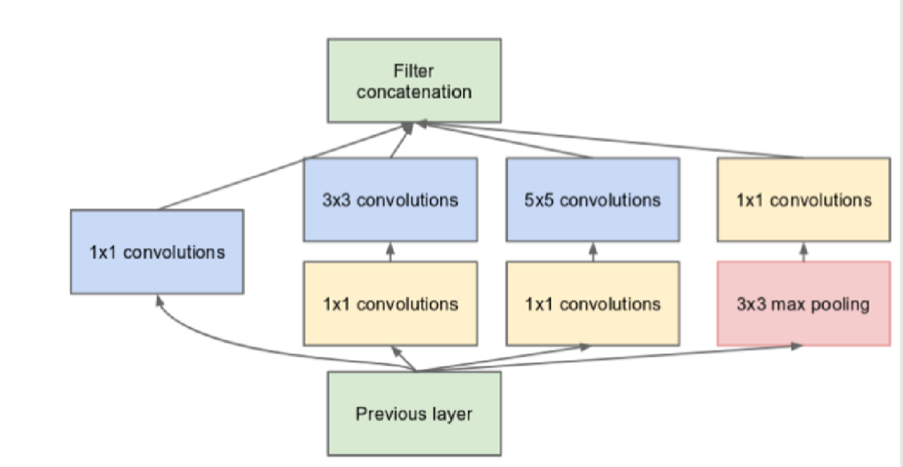

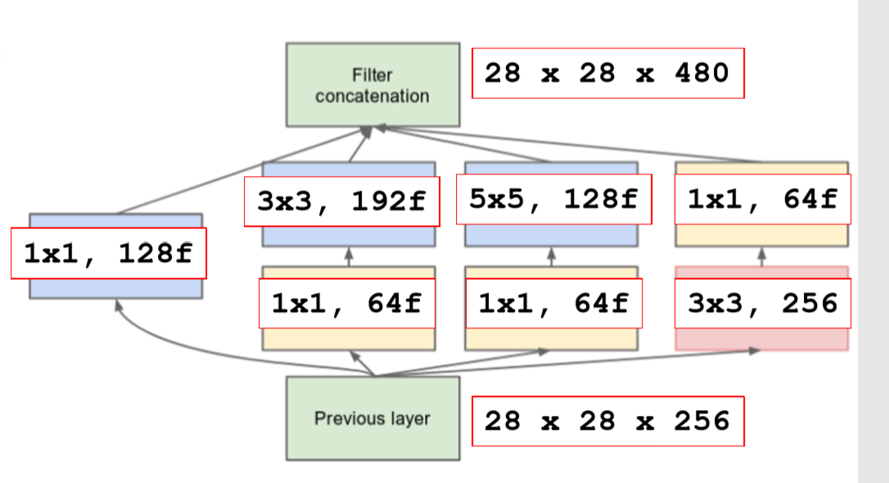

==ResNet==

- very deep network: 152 layers
- rationale:
  - deeper model are harder to optimize than shallower models (vanishing gradient)
  - we might in principle copy the parameters of the shallow network in the deeper  one, and then, in the remaining part, set the weights to the identity.
  - learn residuals
  - in the end no FC ,just a GAP to be fed in the final softmax

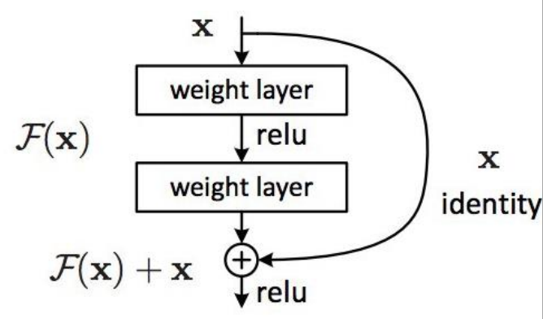

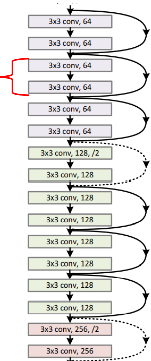

==ResNeXt==

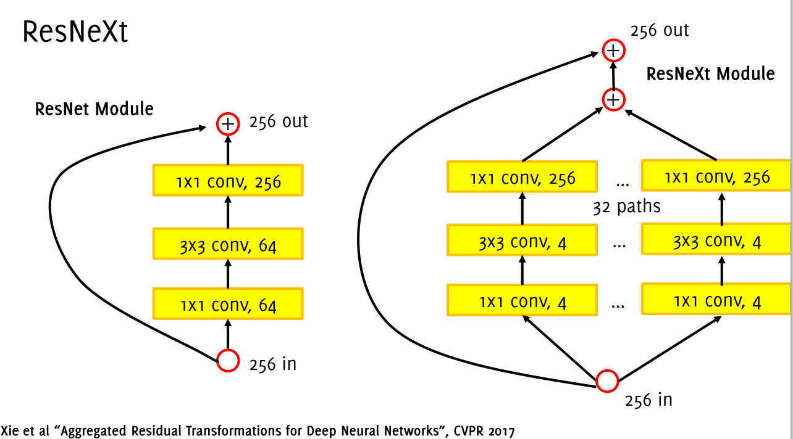

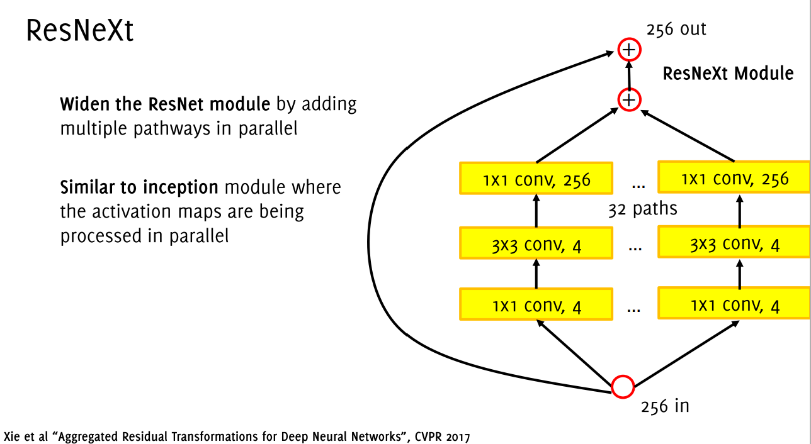

==DenseNet==

- each convolutional layer takes as input the output of the previous layers
- this alleviates the vanishing gradient problem
- promotes feature re-use since each feature is spread through the network
- made up of many dense blocks:

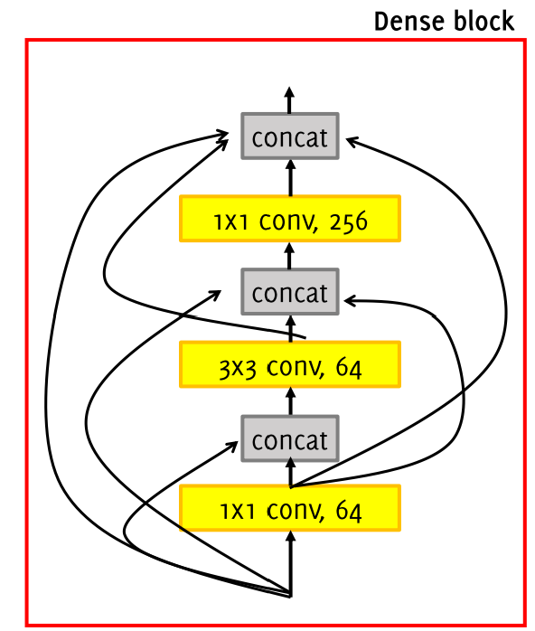

### Fully convolutional CNN 

in normal CNNs the FC layer constrains the input to a fixed size.  
==Since the FC is linear, it can be represented as convolution!==

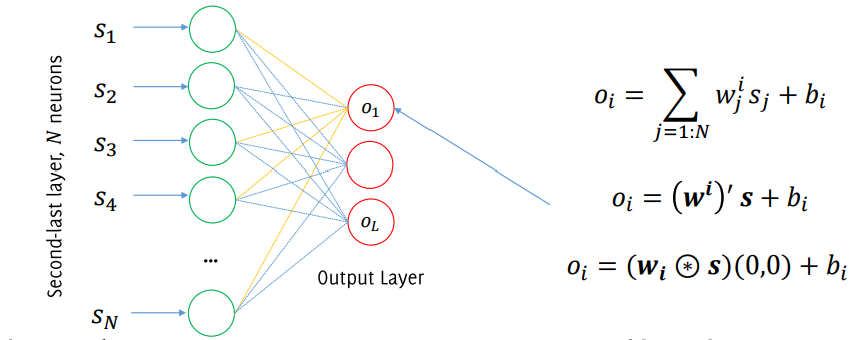

==A FC layer of L outputs is a 2DConv Layer against L filters of size $1\times1 \times N$==

Each of these convolutional filters contains the weights of the FC for the corresponding output neuron.

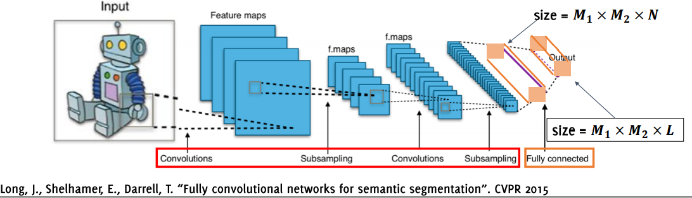

FCCNNs output, for each class:

- a lower resolution image than the input image
- class probabilities for the receptive filed of each pixel

the outputs of a Fully Convolutional are heatmaps!

### CNN for segmentation

*Semantic Segmentation, possible solutions*

<u>Direct Heatmap</u>

- assign the highest predicted class in the heatmaps to the whole receptive field of the input image $\to $ very coarse estimate.  
  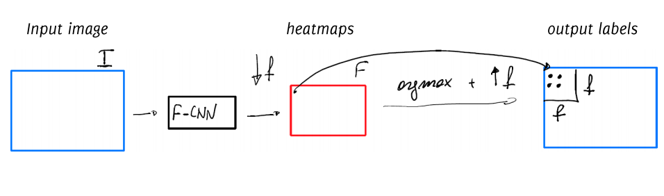

<u>Shift and Stitch</u>

- compute the class as in direct heatmap but stitch the predictions obtained by giving as input shifts of the input image  
  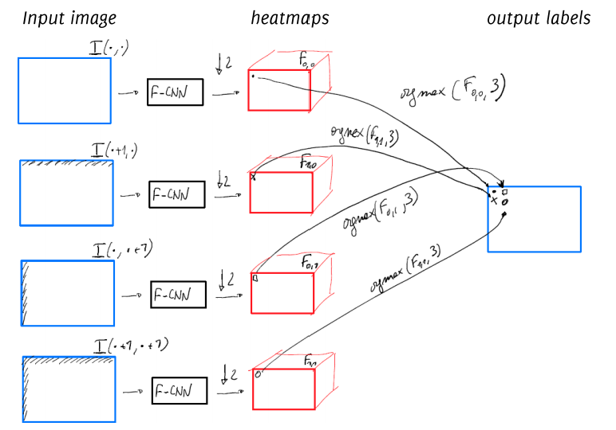

<u>Only convolutions with no pooling</u>

- very inefficient

***Problems of the approaches above***

on one hand we need to go deep to extract high level information on the image, but on the other end we want to stay local not to lose spatial information.  
We need both worlds to communicate better.

***Let's solve it***

We should use an architecture like the following:

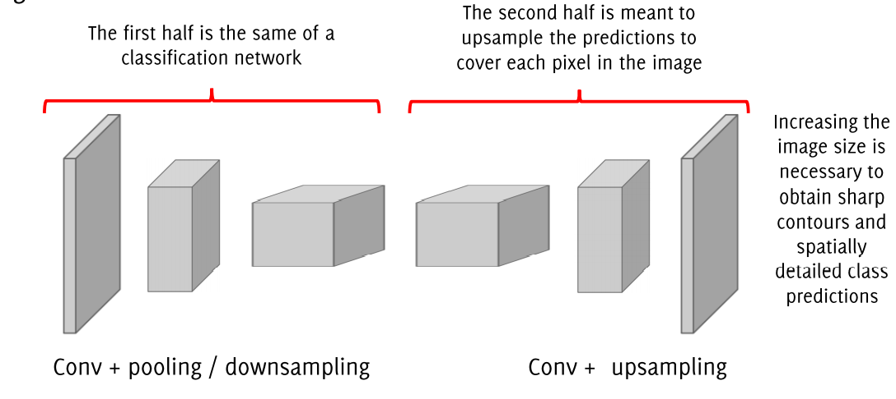

***How to perform upsampling?***

- nearest neighbor $\to$ coarse

- bed of nails $\to$ coarse

- max unpooling (remember which element was max)

- transpose convolution   $\to$ if ALONE it's coarse, but we are getting to the solution

  - they can be seen as a traditional convolution after having upsampled the input image
  - filters can be learned, so it gives us freedom!  
    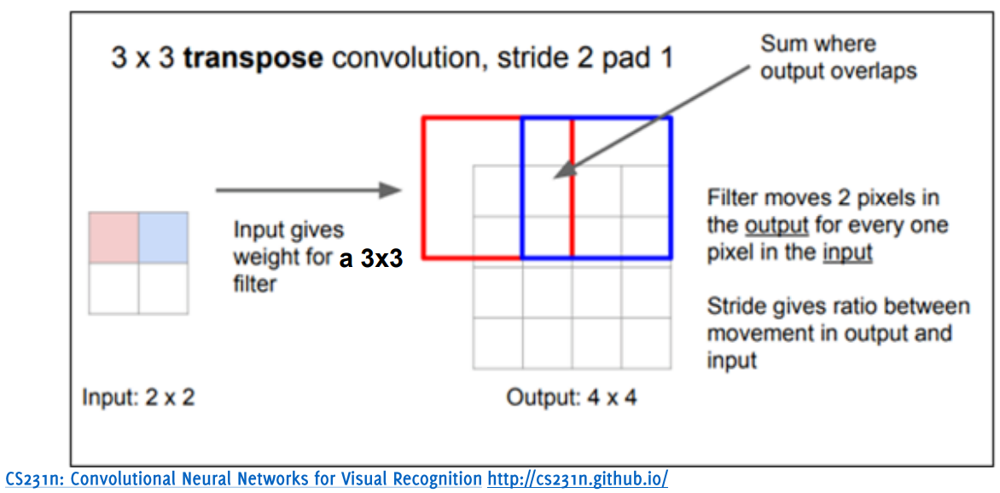

  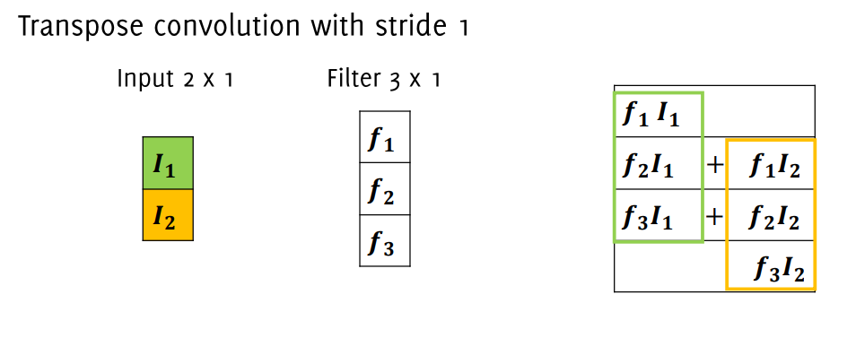  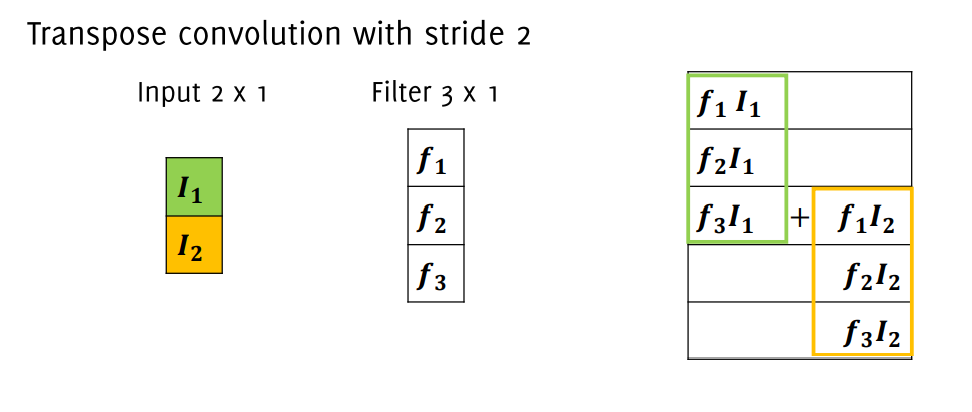

***Solution! :***

<u>Concept -  Skip Connections</u>

- combining fine layers and coarse layers lets the model make local prediction that respect global structure
- aggregation through summation  
  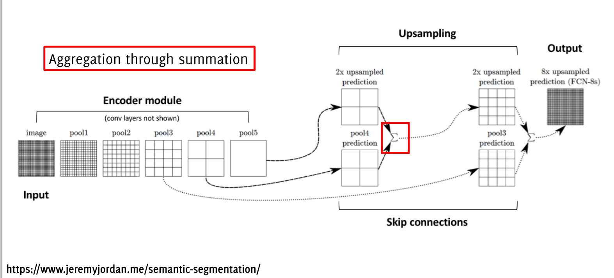  
    this image should sum it up: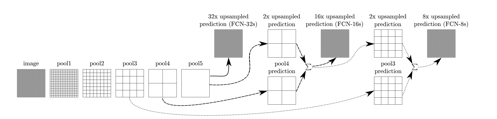  
  taken directly from the paper "Fully Convolutional CNNs for semantic segmentation"

<u>U-Net</u>  

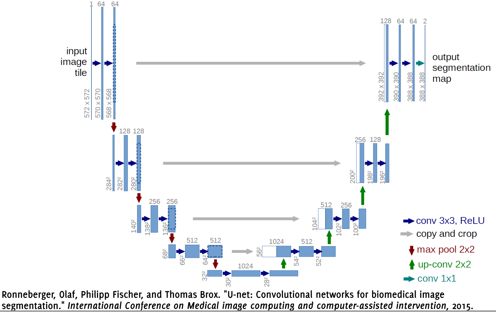

- a network formed by 
  - a contracting path
  - an expansive path
- uses a large number of features channels in the upsampling part.
- use excessive data-augmentation by applying elastic deformations to the training images
- ***Contracting Path***, at each downsampling, repeat blocks of
  - $3 \times 3$ convolution + ReLu
  - $3 \times 3$ convolution + ReLu
  - $2 \times 2$ max pooling
- ***Expansive Path***
  - $2 \times 2$ transpose convolutions
  - concatenation of corresponding cropped features
  - $3 \times 3$ convolution + ReLu
  - $3 \times 3$ convolution + ReLu
- ==aggregation through concatenation==
- full image training by a weighted loss function  $\hat{\theta}=\min \sum_{x_j}w(x_j)l(x_j, \theta)$  
  where 
  - $w(\bold{x})=w_c(\bold{x})+w_0e^{-\frac{(d_1(\bold{x})+d_2(\bold{x}))^2}{2 \sigma^2}}$
  - $w_c$ is used to balance class proportions
  - $d_1$ is the distance to the border of the closest cell
  - $d_2$ is the distance to the border of the second closest cell
  - the second term is used to enhance performance at objects' borders!
  
  

<u>FCNN training options:</u>

- patch based
- full-image
  - fcnn are trained in an end-to-end manner
  - no need to pass through a classification network
  - takes advantage of FCNN efficiency, does not have to re-compute convolutional features in overlapping regions.

one example of architecture for segmentation is the NiN architecture (Network in Network)

<u>Network in Network</u>

- a few layers of
  - MLP conv layers (RELU) + dropout
  - Max Pooling
- GAP layer
- Softmax

What is Gap?

- compute the average of each feature map

the GAP strategy is:

- remove the fully connected layer at the end of the network
- predict by a simple softmax after the GAP
- watch out: the number of feature maps has to be equal to the number of output classes.

Pros?

- simple, not so prone to overfitting
- more interpretability

### The key principles of CNN used for object detection

for object localization we have GAP and a FC afterwards (CAMs).

SO GET JUST A LITTLE MORE INFO ON GAP PLEAAASE. DOES IT ACTUALLY O AN AVERAGE OR NOT? JUDGING BY THE LAST SLIDES I'VE SEEN, THERE IS NO AVERAGE, WEEEIRD.

***Object Detection***

given a fixed set of categories and an input image which contains an unknown and varying number of object instances, a training set of annotated images with labels and bounding boxes for each object is required.

***straightforward solution***

slide on the image a window of a known size and classify each region (the input in the center of the window is classified with such class).

it is very inefficient because 

- you need to run the classification for each slice of the image and
- you have to create the background class as well.
- how to choose crop size?
- huge number of crops
- difficult to detect objects at different scales

***Region Proposal***

region proposal algorithms are meant to identify bounding boxes that correspond to a candidate object in the image. 

the idea is to 

- apply a region proposal algorithm
- classify by a CNN the image inside each proposal region

examples of this algorithm:

***R-CNN***

1. consider the input image
2. extract region proposals ($\sim 2k$) 
3. merge them in a hierarchical fashion
4. each region proposal, properly resized, is fed to a CNN that computes a 4096 deep feature vector 
5. the features vector is fed into 
   1. multiple SVM classifiers to identify class
   2. a linear regressor to adapt shape of bounding box

***Fast R-CNN***  

*reduces time consumption*

1. the whole image is fed to a CNN that extracts feature maps
2. Regions of Interest (ROI) are directly cropped from the feature maps with a selective search
3. fixed size is still required to feed data to a fully connected layer. ROI pooling layers extract a feature vector of fixed size from each region proposal. 
4. each RoI layer feeds fully-connected layers creating feature vectors
5. the FC layers estimate both classes and BB location. a convex combination of the two is used as a multitask loss to be optimized (as in R-CNN, but no SVM here).

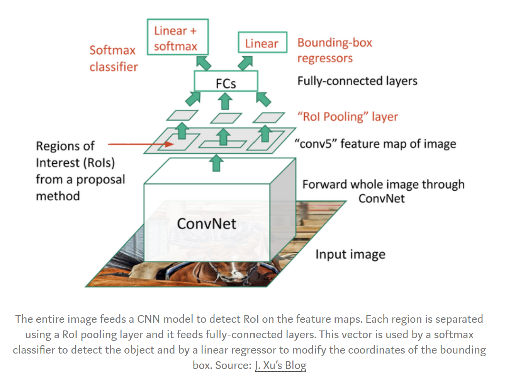

***Faster R-CNN***    

*no selective search anymore $\to$ introduced RPN (region proposal networks) to directly generate region proposals, predict bounding boxes and detect objects*

*combination between RPN and Fast-RCNN*

1. first stage
   1. run a backbone network (e.g. VGG16) to extract features
   2. run the Region Proposal Network to estimate $\sim 300 \  ROI$
2. second stage (the same as in Fast R-CNN)
   1. crop features through ROI pooling (with alignment)
   2. predict object class using FC + SoftMax
   3. predict bounding box offset to improve localization using FC + SoftMax

***YOLO***  

1. divide the image in a coarse grid (e.g. 7x7)

2. each grid cell contains $B$ base-bounding boxes associated

3. for each cell and base bounding box we want to predict

   1. the offset of the base bounding, to better match the object (dx, dy, dh, dw, objectness_score)
   2. the classification score of the base-bounding box over the $C$ considered categories (including background)

   so the output of the network has dimension $7\times 7 \times B \times (5+C)$

- rationale: region-based methods make it necessary to have two steps during inference. in YOLO "we reframe the object detection as a single regression problem. straight from image pixels to bounding box coordinates and class probabilities" and solve these regression problems all at once, with a large CNN
- the whole prediction is performed in a single forward pass over the image, by a single convolutional network
- 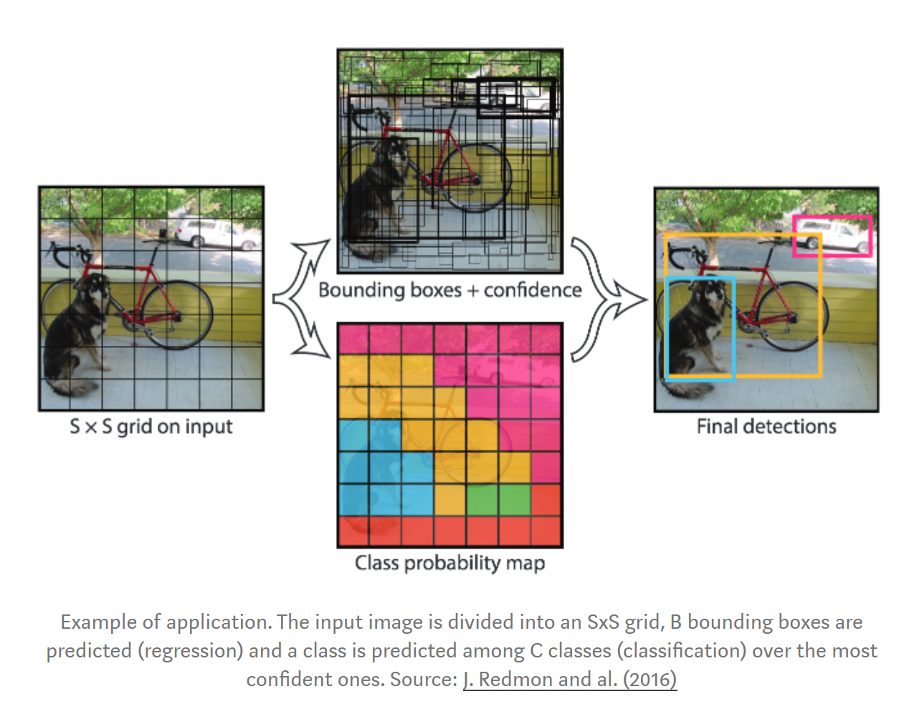

https://medium.com/zylapp/review-of-deep-learning-algorithms-for-object-detection-c1f3d437b852

___|||||||||||||||___ ||||

***Instance Segmentation***

it combines the challenges of

- object detection (multiple instances present in the image)
- semantic segmentation (associate a label to each pixel) separating object instances

***Mask R-CNN***

As in *Fast R-CNN* classify the whole ROI (Region Of Interest) and regress the bounding box (possibly estimate pose).

Mask is estimated for each ROI and each class.

then he starts talking about Inception, GoogLeNet, ResNet and friends... what are they actually for?

### ==Residual learning==

already written.

### ==GANs, what they are and how they are trained==

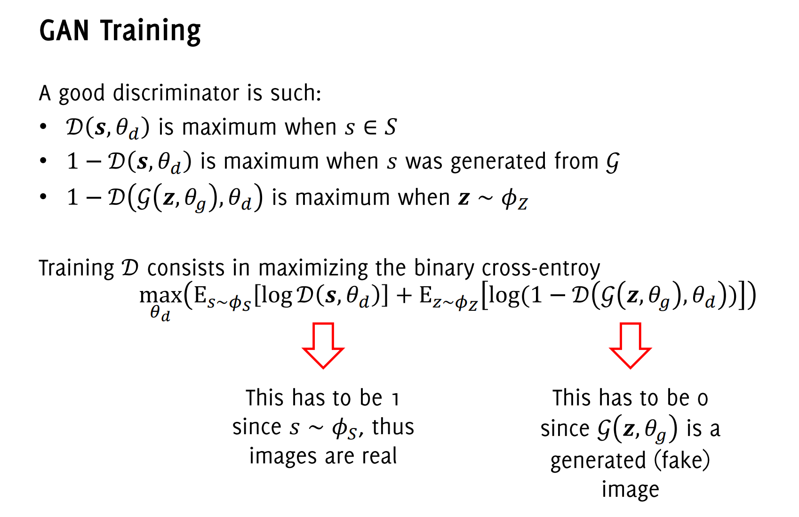

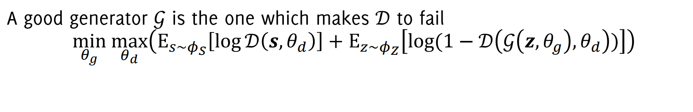

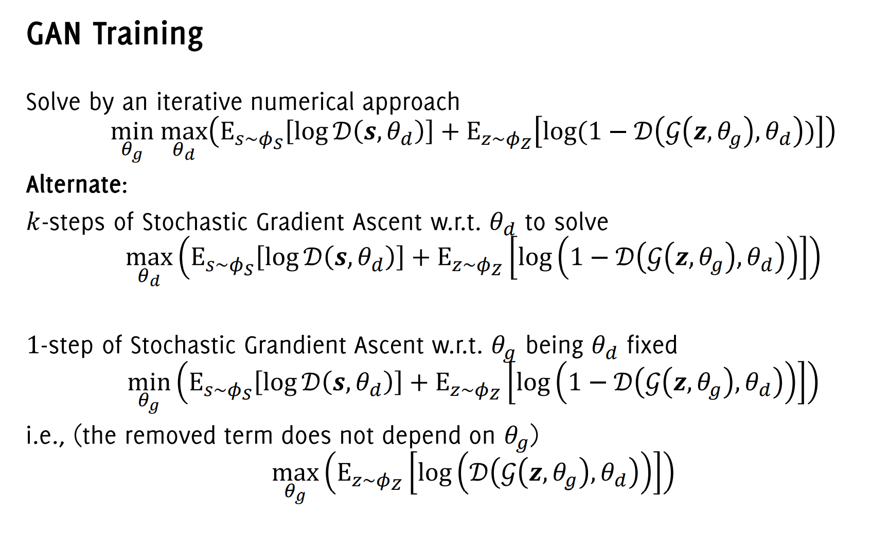

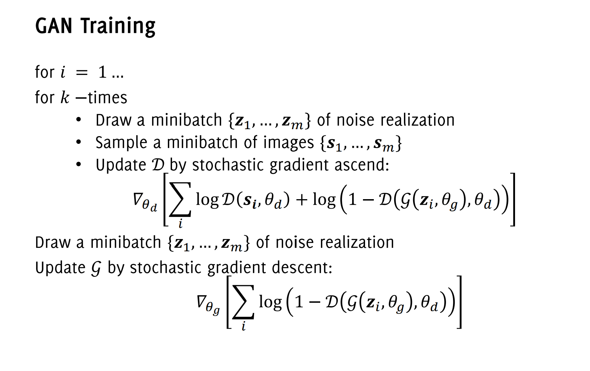

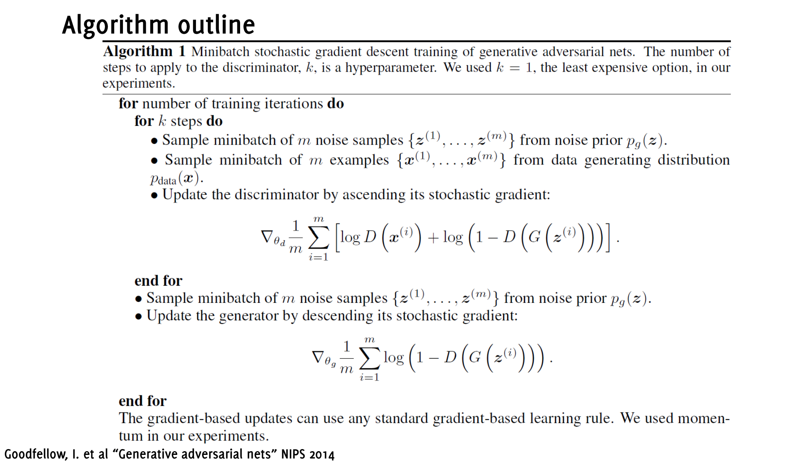

### **image processing tasks (optional)**

- image classification
- localization
- object detection
  - given a fixed set of categories and an input image which contains an unknown and varying number of instances, draw a bounding box on each object instance
- semantic segmentation
  - given an image $I$, associate to each pixel $(r,c)$ a label from a set of labels
  - does not separate different instances belonging to the same class
- instance segmentation
  - same as above, but distinguishes among different instances

### **image processing challenges (optional)**

- dimensionality
- label ambiguity
- transformations (illumination, deformations, view point change, occlusion...)
- inter-class variability
- perceptual similarity (pixelwise distance among original image and many image transformations could be same, but perception very different)

# Recurrent Neural Networks

#### Models for sequence modeling

Different ways to deal with «dynamic» data:

- Memoryless models

  - <u>Autoregressive models</u>  
    they predict the next input based on previous ones  
    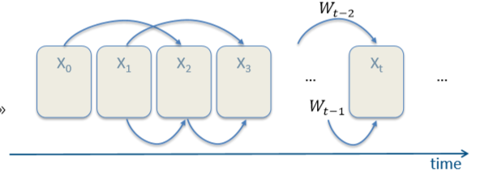    
  - <u>Feedforward neural networks</u>  
    they generalize the autoregressive models using non linear hidden layers.  
    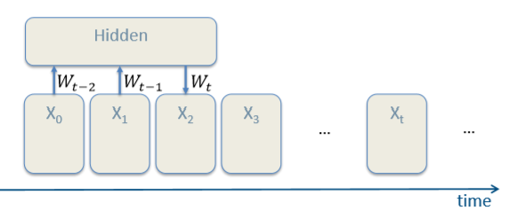  

- Models with memory:

  - <u>Linear dynamical systems</u>  
    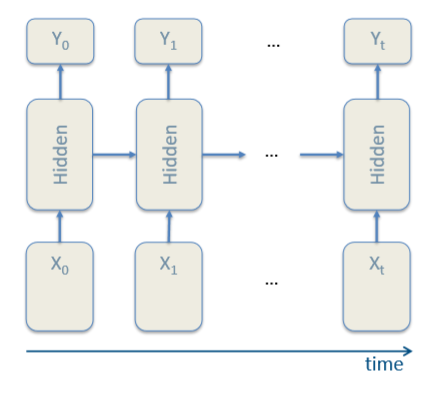  

  - <u>Hidden Markov models</u>  

  - <u>Recurrent Neural Networks</u>

### The architecture and math of a recurrent neural network

In RNNs we deal with the time dimension as well.  
We have $I$ input neurons, and $B$ input recurrent neurons that represent the state of the system at previous timesteps. Let's suppose to have the following architecture (image to be uploaded).

w can say that $g(x_n|...)=...$

RNNs are models used for sequence modeling and they are able to have memory of the past (FFNN can't). RNNs have been used for text generation and similar things involving word sequences.

 Distributed hidden state allows to store information efficiently.  

### Backpropagation through time rationale and math

- perform network unroll for U steps
- initialize $V,V_B$ replicas to be the same
- compute gradients and update replicas with the average of their gradients

$V=V - \eta \frac{1}{U}\sum_{u=0}^{U-1}V^{t-u}$

$V_B=V_B-\eta \frac{1}{U}\sum_{u=0}^{U-1}V_B^{t-u}$ 

*explained better:*

Backpropagation Through Time, or BPTT, is the application of the Backpropagation training algorithm to recurrent neural network applied to sequence data like a time series.

A recurrent neural network is shown one input each timestep and predicts one output.

Conceptually, BPTT works by unrolling all input timesteps. Each timestep has one input timestep, one copy of the network, and one output. Errors are then calculated and accumulated for each timestep. The network is rolled back up and the weights are updated.

Spatially, each timestep of the unrolled recurrent neural network may be seen as an additional layer given the order dependence of the problem and the internal state from the previous timestep is taken as an input on the subsequent timestep.

We can summarize the algorithm as follows:

1. Present a sequence of timesteps of input and output pairs to the network.
2. Unroll the network then calculate and accumulate errors across each timestep.
3. Roll-up the network and update weights.
4. Repeat.

BPTT can be computationally expensive as the number of timesteps increases.

If input sequences are comprised of thousands of timesteps, then this will be the number of derivatives required for a single update weight update.  
This can cause weights to vanish or explode (go to zero or overflow) and make slow learning and model skill noisy ([source](https://machinelearningmastery.com/gentle-introduction-backpropagation-time/))

### The limits of backpropagation through time and the vanishing/exploding gradient issue

backpropagation through time becomes difficult to deal with when we want to consider a huge number of preceding timesteps. this is due to the fact that when we compute the gradient of the error function with respect to each weight, we obtain very small numbers due to the multiplication of many small partial derivatives.   
As we have seen for FFNN, the vanishing/exploding gradient issue happens when the NN is very deep. Whenever we consider too many timestep in the past we obtain a proportionally deep unrolled RNN.

### The vanishing gradient math in a simple case

to better understand the problem let's consider the following simple RNN

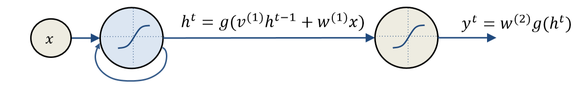

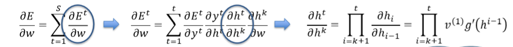

### The Long Short-Term Memory model, rationale, and math

rationale: we want to be able to read on, write in and forget a memory state based on an input and not on every step. to achieve this we introduced gates, which are trainable parameters: the network learns based on the input when to open and close these gates (when to read from its memory, update it with the new input, or forget it and replace it with the input).

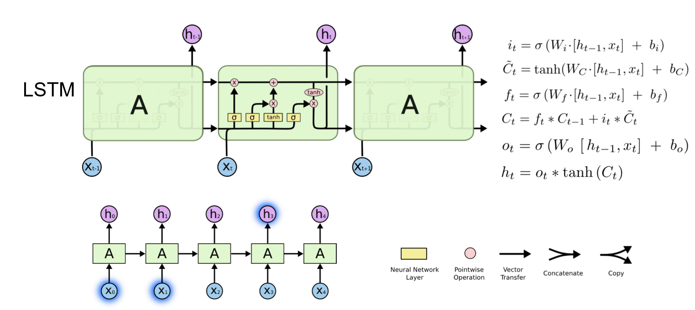

### The Gated Recurrent Unit

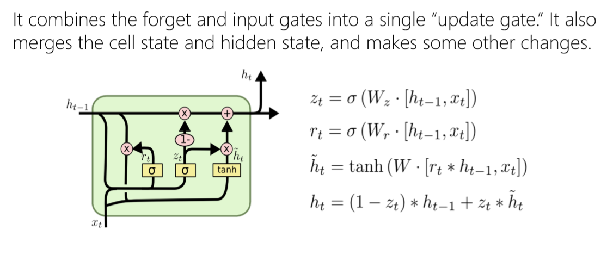

### LSTM Networks, hierarchical and bidirectional. 

***purposes***

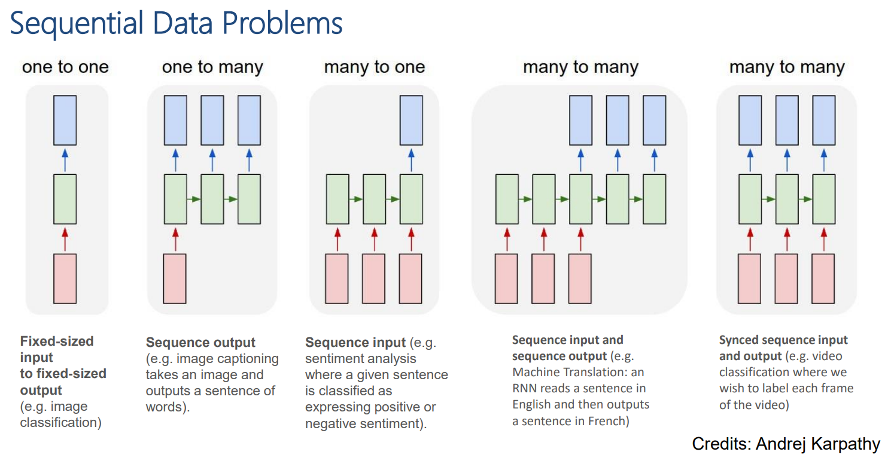

***Hierarchical and Bidirectional***

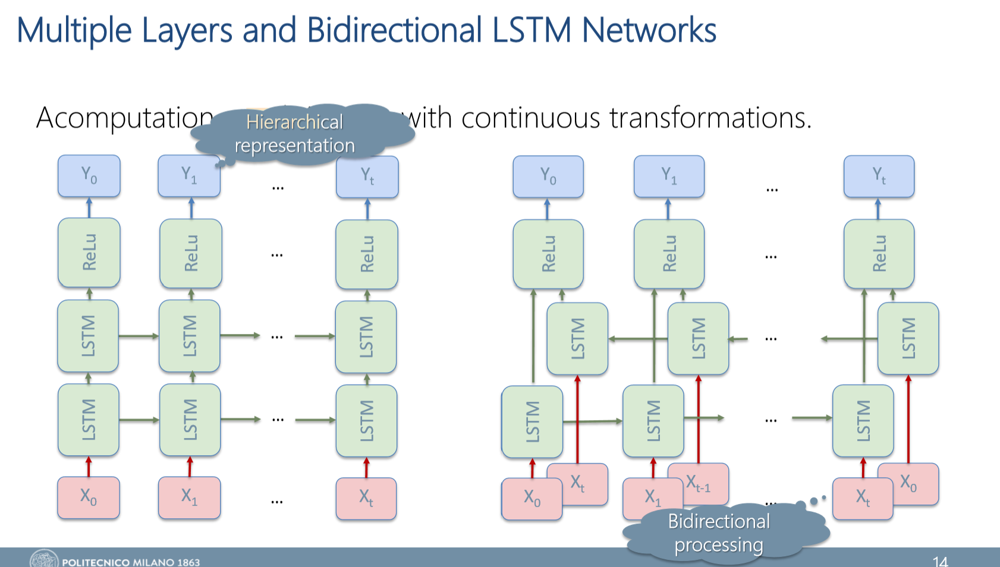

# Sequence to Sequence Learning

#### Sequential Data Problems, with examples

all the one/many to one/many problems

#### The Seq2Seq model, training, and inference 

you just need to remember picture.

#### Neural Turing Machine model and the attention mechanism

combine RNN  with an external memory bank.

we introduce with them the concept of attention $\to$ every step read and write everywhere at different extent.

#### Attention mechanism in Seq2Seq models 

draw the diagram of the seq2seq model. 

add drawing on probability distribution, context vector, and combine context vector with hidden state of target.

list the 4 steps to compute the attention vector for a specific target.

#### Chatbot: core models and context handling 

<u>Core Models</u>

- Generative  
  encode the question into a context vector and generate the answer word by word using conditioned probability distribution over answer’s vocabulary. E.g., an encoder-decoder model.
- Retrieval  
  rely on knowledge base of question-answer pairs. When a new question comes in, inference phase encodes it in a context vector and by using similarity measure retrieves the top-k neighbor knowledge base items. 

<u>Context Handling</u>

- Single-turn  
  build the input vector by considering the incoming question. They may lose important information about the history of the conversation and generate irrelevant responses.
- Multi-turn  
  the input vector is built by considering a multi-turn conversational context, containing also incoming question. 

#### The Transformer model  

- describe what it is 
- describe high level architecture
- each encoder has self-attention + ffnn
- each decoder has self-attention + encoder-decoder attention + ffnn
- a transformer model is made out of (rebus)

talk about 

- input
- self attention
- encoder-decoder attention

*Self Attention*

- say we decompose each word in 3 vectors: query, key, value

$$
\text{Attention}(Q,K,V)=\text{Softmax}\bigg(\frac{Q\cdot K^T} {\sqrt{d_k}}\bigg)\cdot V
$$

- say that  the NN can compute outputs in parallel

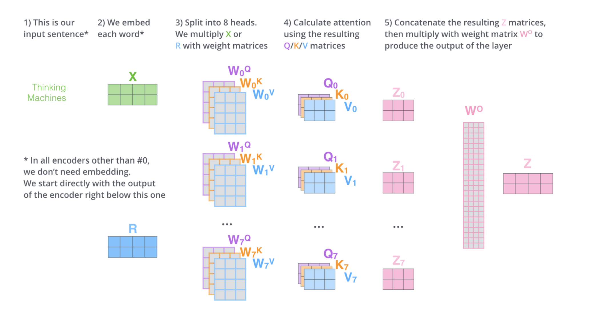

# Word Embedding 

#### Neural Autoencoder model, error function, and training

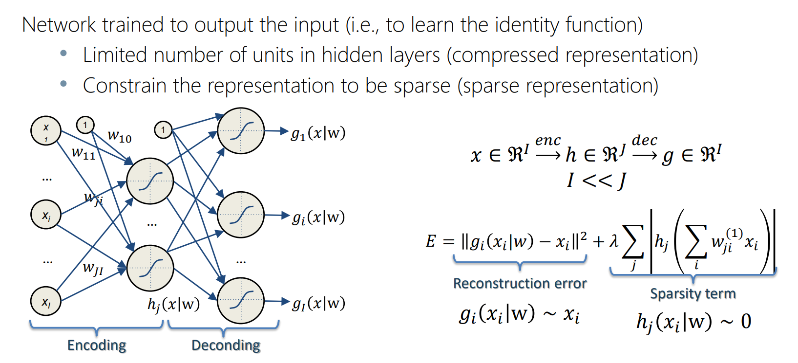

#### Language models and the N-grams model

- language models? don't know, talk a little about bag of words if you want

<u>N Grams</u>

- trigrams account for the last 2 words to predict the next word
- formula here
- problem: curse of dimensionality because we encode them with bag of words? gne don't know.

#### Limits of the N-gram model

#### The concept of embedding and its benefits

#### The Neural Language Model and its use for word embedding

#### Google’s word2vec model (CBOW)

#### Possible uses of word embedding

- <u>information retrieval</u>

  - query: restaurants in mountain view that are not very good
  - phrases: restaurants in (mountain view) that (not very good)
  - vectors: "restaurants+in+(mountain view)+that+are+(not very good)"  

  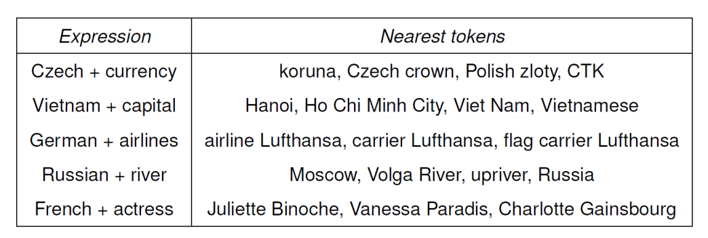

- <u>document classification /similarity</u> 
  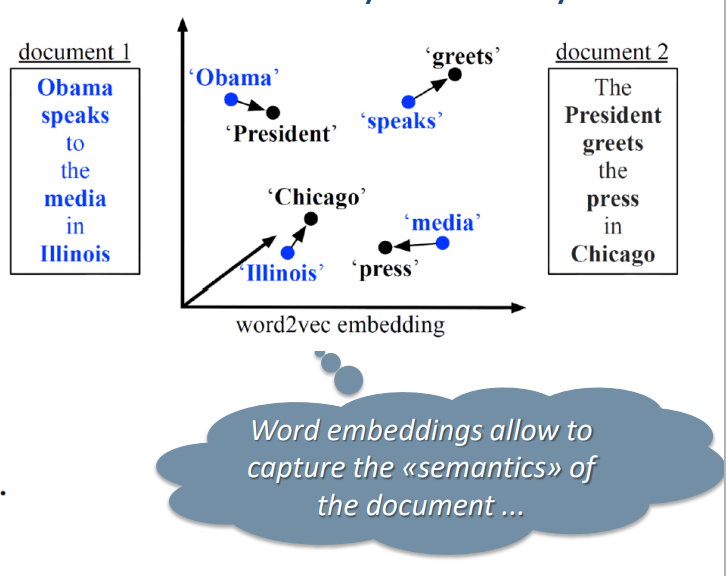

- <u>Sentiment Analysis</u>

  - no need for classifiers, just use cosine distance

