# Artificial Neural Networks & Deep Learning

*A Q&A on the course ANN2DL as taught by Matteo Matteucci, Giacomo Boracchi, and Francesco Lattari in Politecnico di Milano during the academic year 2019/2020*

*Edited by: William Bonvini, Lorenzo Carnaghi*

[TOC]

# Machine vs Deep Learning 

#### What is machine learning 

Machine Learning is a category of research and algorithms focused on finding patterns in data and using those patterns to make predictions.

A computer program is said to learn from experience $E$ with respect to some class of task $T$ and a performance measure $P$, if its performance at tasks $T$, as measured by $P$, improves because of experience $E$.

#### What are the machine learning paradigms and their characteristics

- Supervised Learning
- Unsupervised Learning
- Reinforcement Learning

#### What are the machine learning task and their characteristics

- Image recognition tasks
  - classification
  - object detection
- Regression
- Image captioning
- image/text generation
- Clustering
- Text Analysis
- Speech Recognition

#### What is deep learning and how it differs from machine learning

It is a branch of ML, has hidden layers. not easily explicable.

Usage of Big Data! Massive computational power.

deep learning is about learning data representation from data.

#### Examples of successful deep learning applications

classification, text generation, speech recognition, object detection,...

#### What is transfer learning and what it is used for

take a pretrained model and use it for the same task, eventually on a different type of dataset.

in neural networks for image processing tasks we could copy the architecture and the weights of the part of the network that is in charge of finding the high level features and concatenate to it fully connected layers to be able to solve the problem in hand.

in transfer learning the weights are freezed, while in fine tuning such weights are initialized with the successful architecture's weight and updated via gradient descent for the task in hand.

#### What is a feature and its role in machine and deep learning

A feature is the basic element to recognize patterns in the task. They can be crafted or learned, with pros and cons.   
They allow the NN to understand what information carries the data wrt the task, and correctly give an answer.

Data are made out of features, so features are data's intrinsic information. 

feature are based on domain knowledge or heuristics, however they need to be carefully designed depending on the task. they are fixed and sometimes they do not generalize between datasets.

We need to get features right.

Deep Learning assumes it is possible to learn a hierarchy of descriptor with increasing abstraction

#### What is cross-validation and what it is used for

It's a technique used when not much data is available to train/validate, so the model is trained on the majority of the data and validated on a set of size n/k. This process is repeated k times, training every time on a different subset and validate on the n/k items out of the training data.  
If k is n, meaning validation dataset has size 1, is LOOCV (leave one out Cross validation)

#### What are hyperparameters and identify those for all the models presented in the course

- number of hidden layers
- number of neurons of hidden layers
- penalization rate
- filter size, filter number
- stride
- activation function

#### What is Maximum likelihood estimation and how does it work in practice

= choose parameters which maximize data probability.
	In practice: 
	-write L = P(Data|Theta)
	-[optional] l = log(L)
	-calculate dl/dTheta or dl/dTheta
	-solve dl/dTheta = 0
	-check that the result is a maximum

#### What is Maximum a posteriori and how does it work in practice 

​	is argmax_w P(w|Data) = argmax_w P(D|w)*P(w) meaning P(w) is an assumption on parameters distribution. Reduces model freedom with an assumption made by us. e.g. small weights to improve generalization of neural networks

# Feed Forward Neural Networks

#### The perceptron and its math

the perceptron is a linear classifier. It is the basic block of neural networks. it consists in a neuron with $n$ inputs, an activation function and a single output. the activation function is the step function with threshold zero.  

#### The Hebbian Learning paradigm, its math, and its application

“The strength of a synapse increases according to the simultaneous activation of the relative input and the desired target” 

it is a method to update weights used in the perceptron model.  
it consists in iteratively updating the weights of the inputs only in case of misprediction.

$w^{k+1}_i \leftarrow w^{k}_i + \eta x_i^kt^k$.

the main idea is that you have a training set, and you keep on iterating on it until a full batch of such training set is analyzed without any update on the weights.  
it works fine when the separation boundary is linear, it doesn't work when we have meshed shapes or non linear boundaries (like xor), etc.

#### the feed forward neural architecture and its improvement wrt the Perceptron

it introduces more layers. we have an arbitrary number of neurons. improvement: it is able to classify inputs with any shape. A single hidden layer feedforward neural network with S shaped activation functions can approximate any measurable function to any desired degree of accuracy on a compact set. It doesn't mean that is always possible to practically find the right weights for a certain task, but theoretically it is.

#### number of parameters of any model you can build

The number of parameters correspond to the number of weights that are present in the neural network. being such neural networks feed forward and fully connected we have that each node is linked to each node in the subsequent layer.  
the hyperparameters are the number of hidden layers and the number of neurons in each layer of the network.

#### Activation functions, their math, their characteristics, and their practical use 

they are functions associated to each node of the neural network. the input is the dot product between the neurons in the previous layer and the weights associated to them. they model the activation of the considered neuron given the inputs. A characteristic is that they must be differentiable.  

The most typical activation functions for the *output layer* are the following:

*in regression*

we want an output that spans the whole $\R$ domain.

- Linear $g(a)=a$
  - no vanishing gradient
- ReLu

*in classification*

- sigmoid $g(a)=\frac{1}{1+e^{-a}}; \ g(a)'=g(a)(1-g(a))$
  - if the classes are encoded as $0$ and $1$, we want the output to span from $0$ to $1$ (it can be interpreted as posterior probability).
- tanh $g(a)=\frac{e^{a} - e^{-a}}{e^{a} + e^{-a}}; \ \ \ \ \ \ \ g(a)'=1-g(a)^2 $
  - if the classes are encoded as $-1$ and $+1$, we want the output to span from $-1$ to $1$.
- $\text{softmax}_i(a)=\frac{e^{a_i}}{\sum_je^{a_j}}$ used as output layer in neural networks for multiclass classification

#### What is backpropagation and how does it work

backpropagation is the technique used in neural networks to update weights. it is divided in two steps.

- forward pass: error propagation
  - a batch of data and an error metric are considered. it consist in computing the error of such batch with such metric. an example is the $MSE=\frac{1}{N}\sum_n(y_n-\color{blue}g(x_n|w)\color{black})^2$. 
- backward pass: weights update
  - $w^{k+1}=w^k -\eta\frac{\part E(w)}{\part w}|_{w^k}$

#### The relationship with non-linear optimization and gradient descent

it is not linear the problem of finding the weights of a neural network. this means that there is no closed form solution (compute the partial derivatives of the function and set them to zero) $\to$ we use an iterative approach, like gradient descent. we can use momentum to avoid local minima. we can use different initializations for the weights, it would make sense to start from a distribution that makes sense for the problem in hand. 

#### Backpropagation computation for standard feedforward models

$RSS=\sum_{n}(t_n-g(x_n|w))^2$
$$
\frac{dRSS}{dw_{\bar{i}\bar{j}}^{(1)}}=-2\sum_{n}\bigg(t_n-g(x_n|w)\bigg)g'\bigg(\sum_j h_j(\cdot) w^{(2)}_{1j}\bigg)w^{(2)}_{1\bar{j}}h'_{\bar{j}}\bigg(\sum_ix_{\bar{i},n}w^{(1)}_{\bar{j}i}\bigg)x_{\bar{i}}
$$

#### Online vs batch, vs mini-batch learning and their characteristics

Online gradient descent is a synonym of stochastic gradient descent (this is what Bishop says).

they are three variations of gradient descent. 

-  batch gradient descent
  - $\frac{\part E(w)}{\part w}=\frac{1}{N}\sum_{i=1}^N\frac{\part E(x_i,w)}{\part w}$
  - it consists in iteratively averaging the gradient of $E$ with respect to every sample in the dataset and then performing the weight update.
- mini-batch gradient descent
  - $\frac{\part E(w)}{\part w}=\frac{1}{M}\sum_{i\in \text{MiniBatch}}^{M<N}\frac{\part E(x_i,w)}{\part w}$  
  - it iteratively computes the average gradient over a subset of the training data and performs the weights update
  - good bias-variance tradeoff
- online/stochastic gradient descent
  - $\frac{\part E(w)}{\part w}=\frac{\part E(x_i,w)}{\part w}$
  - it computes the gradient and performs the update considering only one sample at the time
  - unbiased, but high variance!!

#### Forward-backward algorithm for backpropagation

the forward pass consists in computing the gradient after having seen some samples $n$.

the backward pass consists in updating each weight with gradient descent.

#### Derivatives chain rules

the chain rule is a formula to compute the derivative of a composite function. for example $\frac{\part f(g(x))}{\part x}=\frac{\part f(g(x))}{\part g(x)}\frac{\part g(x)}{\part x}$.

It consists in breaking down the gradient calculation $\frac{\part E(w)}{\part w}$ in a product of derivatives.

#### Error functions, their statistical rationale, their derivation, and their derivative

- Prediction
  - we can approximate $t_n$ as $g(x_n|w)+ \varepsilon_n= t_n$.   
  - let's assume $\varepsilon_n \sim N(0,\sigma^2)$.  
  - so $t_n \sim N(g(x_n|w),\sigma^2)$.    
  - maximize the (log) likelihood $P(D|w)=\prod_{i=1}^N\frac{1}{\sqrt{2\pi}\sigma}e^{-\frac{(t_n-g(x_n|w))^2}{2\sigma^2}}$
  - you'll obtain as error function the residual sum of squares.
- classification (binary)
  - we can approximate $t_n$ as a sample taken from a Bernoulli $Be(g(x_n|w))$. $t_n \sim Be(g(x_n|w))$
  - maximize the likelihood.
  - you'll find a minimization of the binary crossentropy.
- perceptron
  - we can show that the perceptron's goal is the minimization of the distance of misclassified samples from the separating hyperplane.
  - in formulas it is $E(w,w_0)=-\sum_{i \in \text{Misclassified}}t_n(w^Tx+w_0)$ 
  - the formula above makes sense since false positives (predicted true, but negative) have $w^Tx+w_0>0$ and false negatives (predicted false, but positive) have $w^Tx+w_0 <0$.
  - by deriving the error $E(w,w_0)$ with respect to to $w$ and in parallel with respect to $w_0$ we obtain gradients that plugged in the weights update formula of gradient descent returns us the Hebbian learning algorithm.

#### The issue of overfitting and its relationship with model complexity

no generalization. performs well on training but not on the test. if model too complex it is prone to overfitting. early stopping: stop as as soon as validation error starts increasing. perform crossvalidation to have a good estimate of the performance of the model.

#### Regularization techniques, their rationale and their implementation

the technique Matteucci talked about is called ridge regression (weight decay) and it is an error function for the training data that penalizes weights with high absolute value. it is compute with a Bayesian approach by the computation of a maximum a posteriori likelihood on $P(w|D)$. 

- we assume that $t_n \sim N(g(x_n|w),\sigma^2)$.

- we assume that the weights are sampled from a normal distribution $w_j \sim N(0,\sigma^2_w)$ with a small $\sigma$.  

$L(w)=P(w|D)=P(D|w)P(w)$ if we maximize this we obtain the formula for ridge regression 
$$
\underset{w}{\text{argmax}}\prod_{n=1}^N\frac{1}{\sqrt{2 \pi}\sigma}e^{-\frac{(t_n-g(x_n|w))^2}{2\sigma^2}}\prod_{j=0}^{|W|}\frac{1}{\sqrt{2 \pi}\sigma_w}e^{-\frac{(w_j-0)^2}{2\sigma^2_w}}
$$

$$
\underset{w}{\text{argmax}}\sum_{n=1}^N\log\frac{1}{\sqrt{2 \pi}\sigma}e^{-\frac{(t_n-g(x_n|w))^2}{2\sigma^2}}+\sum_{j=0}^{|W|}\log\frac{1}{\sqrt{2 \pi}\sigma_w}e^{-\frac{(w_j-0)^2}{2\sigma^2_w}}
$$

$$
\underset{w}{\text{argmax}}\sum_{n=1}^N\log e^{-\frac{(t_n-g(x_n|w))^2}{2\sigma^2}}+\sum_{j=0}^{|W|}\log e^{-\frac{(w_j-0)^2}{2\sigma^2_w}}
$$

$$
\underset{w}{\text{argmin}}\sum_{n=1}^N\frac{(t_n-g(x_n|w))^2}{2\sigma^2}+\sum_{j=0}^{|W|} \frac{w_j^2}{2\sigma^2_w}
$$

$$
\underset{w}{\text{argmin}}\sum_{n=1}^N(t_n-g(x_n|w))^2+\gamma \sum_{j=0}^{|W|} w_j^2
$$

$Ridge(X,W)=\sum_{i=1}^N(y-g(x_i|w))^2 + \gamma \sum_{j=1}^{|W|}w_j^2 $

 another one is Lasso regression (that we didn't do it in this course).

another regularization technique is dropout. come on, you know how it works.

#### Techniques for hyperparameters' tuning and model selection

crossvalidation to choose hyperparameters ($\gamma$, number of hidden units, learning rate)

#### Techniques for weights initialization and their rationale

- all zeros: bad, no learning happening
- big: not convergence
- $w \sim N(0,0.01)$ is good just for small networks
- Xavier
  - $Var( w_{ji} x_i)=E[w_{ji}]^2Var(x_i)+E[x_i]^2Var(w_{ji})+Var(x_i)Var(w_{ji})$
  - we assume both expected values to be zeros, so:
  - $Var( w_{ji} x_i)=Var(x_i)Var(w_{ji})$
  - if we consider all inputs i.i.d. we obtain that $\color{orange}Var(\sum_i^nw_{ji}x_i)\color{black}=\sum_i^n Var(w_{ji}x_i)=nVar(w_{ji}x_i)=\color{orange}nVar(w_{ji})Var(x_i)$
  - since we want the variance of the output (the first orange block) to be equal to the variance of the input (the $Var(x_i)$ term in the last orange block) we impose $nVar(w_{ji})=1$
  - $w \sim N(0,\frac{1}{n_{in}})$
- Bengio
  - $w \sim N(0,\frac{2}{n_{in}+n_{out}})$
- He
  - $w \sim N(0,\frac{2}{n_{in}})$

#### Batch-Normalization rationale and use 

it has been observed that networks work well if the input is whitened (zero mean and unitary variance). it would be wise to normalize inputs for every unit of the neural network, since, given a whitened input, it is not guaranteed that the subsequent inputs in the hidden layers are whitened as well. what we do is that we whiten every unit.

for each batch:

- compute mean $\mu$
- compute standard deviation $\sigma=\frac{1}{N}\sum_i^N(x_i-\mu)^2$
- compute the normalized inputs $\hat{x}_i=\frac{x_i-\mu}{\sigma}$
- $y_i=\alpha \hat{x}_i+\beta$ ...Apply a linear transformation, to squash the range, so that the network can decide (learn) how much normalization needs.

it improves gradient flow through the network, allows higher learning rates, reduces the strong dependence on initialization, and acts as a form of regularization slightly reduces the need for dropout.

# Convolutional Neural Networks 

**Convolution and correlation, linear classifier for images**

the correlation among a filter $h$ and an image is defined as  $I(r,c) \otimes h  =\sum_{v=-L}^{L}\sum_{u=-L}^Lh(u,v)I(r+v,c+u)$

Convolution is just like correlation, except that we flip over the filter before correlating. 

convolution is a function $I(r,c) * h  =\sum_{v=-L}^{L}\sum_{u=-L}^LI(r-v,c-u)h(u,v)$

the key difference between the two is that convolution is associative.

in general, people use convolution for image processing operations such as smoothing, and they use correlation to match a template to an image.

$\color{red}\text{normalization problem, to be understood completely}$.

A linear classifier is a function $f:\R^{n\cdot m\cdot 3}\to \R^l$, or $f:\R^{n\times m}\to \R^l$ that given an image as input it returns a vector of scores. the vector length $l$  denotes the number of classes of the classification problem and the $i $-th element denotes the score of the $i$-th class. the basic idea is that the element with the highest score should correspond to the target class, so such class is the returned predicted class.

the function is to be seen as $f=Wx+b$ where, in the RGB version:

- $W$ is the weights' matrix $l\times (n\cdot m\cdot 3)$(each line of the matrix tells you the importance of each pixel of the input image for the class correspondent to such line).
- $x$ is the input image written column-wise, $(n \cdot m \cdot 3)\times 1$
- $b$ is a bias vector $l\times1$

each line of $W$ can be seen as a template to be matched against the input image. the vector returns the score of the matchings.  

image classifiers are not good for generalization: they could learn a template for a class highly correlated with the the training data and have poor results when given a test image with some basic transformations, or with high inter-class variability.

we could talk about the geometric interpretation as well, and about the loss function to be minimized.

#### The layers of a CNN 

convolution, activation, pooling, fully connected.

#### Connections between CNN and Feedforward-NN, interpretations of CNN

first part to extract features. second part to learn relationships among features, it is meant to solve the specific task at hand.

#### How to compute the number of parameters of a CNN

I know how to do it.

#### Best practices to train CNN models: data augmentation, Transfer learning

data augmentation can be done via

- geometric transformations
  - shifts/rotation/perspective distortions
  - shear
  - scaling
  - flip
- photometric transformations
  - adding noise
  - modifying average intensity
  - superimposing other images
  - modifying image contrast

augmentation can help with class imbalance and data scarcity (obviously).

Transfer learning has already been described previously. it is a good option when little training data are provided and the pretrained model is expected to match the problem at hand.

#### Design criteria from the most successful architectures shown during classes (no need to know exactly the architectures)

- LeNet-5
  - idea of using a sequence of $3$ layers: convolution, non linearity, pooling, as we do today.
  - average pooling
  - tanh or sigmoid
  - MLP as classifier for the final layer
- AlexNet
  - 5 convolutional layers with filters 11x11 and 5x5
  - 3 MLP
  - introduced
    - ReLu
    - Dropout
    - MaxPooling
- VGG16
  - deeper variant of AlexNet with smaller filters.
  - winner of localization an classification in ImageNet 2014
  - the paper presents a study on the role of network depth: fix other parameters of the architecture, and steadily increase the depth of the network by adding more convolutional layers, which is feasible due to the use of very small $3 \times 3$ convolution filters in all layers.
  - multiple $3 \times 3$ convolutions in a sequence achieve a large receptive field with 
    - less parameters
    - more non linearities
- Inception Module
  - choosing the right kernel size for the convolution is difficult because images could show interesting features at different scales.
  
  - moreover, deep networks tend to over fit and to become very computationally expensive.
  
  - the solution is to exploit multiple filter size at the same level and then merge the output activation maps together.
  
  - it is a module that performs in parallel 1x1, 3x3, 5x5 convolutions and a final pooling in order to avoid the problem of choosing the kernel size.  
  
  - To decrease the computational load of the network we have a filter 1x1 added before the 3x3 and 5x5 convolutions.  
    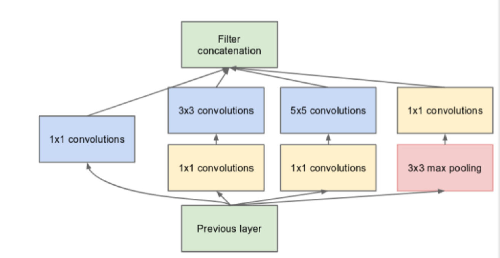
  
    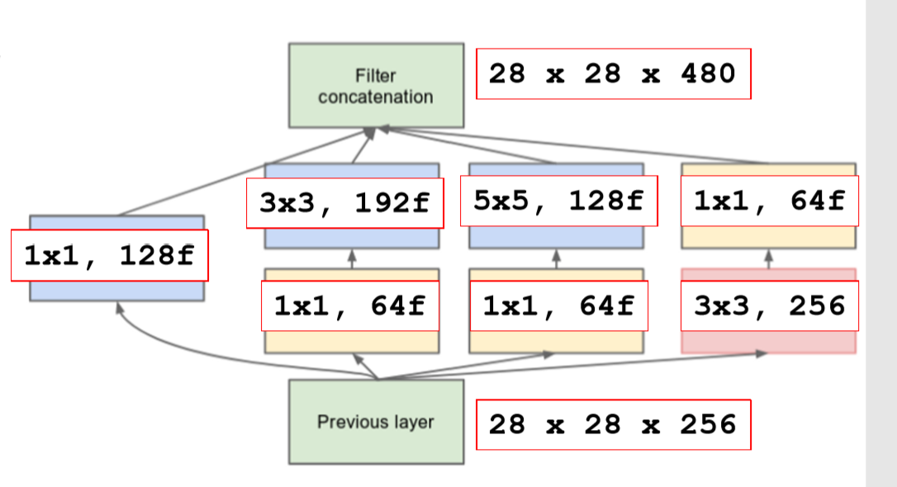  
- GoogLeNet
  - at the beginning there are two blocks of conv + pool layers.
  - then there are a stack of 9 inception modules.
  - it has some mid classifiers (for dying neuron problem)
  - no fully connected in the end! simple averaging pooling, linear classifier + softmax.

#### Fully convolutional CNN and CNN for segmentation

in normal CNNs the FC layer constrains the input to a fixed size.  
Fully Convolutional CNNs are networks that don't have FC layers in the end, but output, for each class:

- a lower resolution image than the input image
- class probabilities for the receptive filed of each pixel.

the outputs of a Fully Convolutional are heatmaps!

*Semantic Segmentation, possible solutions*

- Direct Heatmap
  - assign to each pixel of the input image the predicted class with the highest probability in the output heatmaps.
- Shift and Stitch
  - compute the class as in direct heatmap but stitch the predictions obtained by giving as input shifts of the input image
- Only convolutions with no pooling
- concept: skip connections
  - aggregation through summation  
    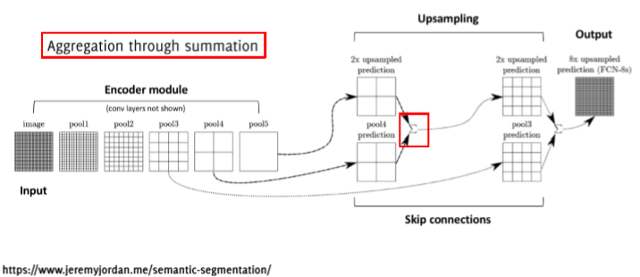  

- U-Net
  - a network formed by 
    - a contracting path
    - an expansive path
  - uses a large number of features channels in the upsampling part.
  - use excessive data-augmentation by applying elastic deformations to the training images
  - ***Contracting Path***, at each downsampling, repeat blocks of
    - $3 \times 3$ convolution + ReLu
    - $3 \times 3$ convolution + ReLu
    - $2 \times 2$ max pooling
  - ***Expansive Path***
    - $2 \times 2$ transpose convolutions
    - concatenation of corresponding cropped features
    - $3 \times 3$ convolution + ReLu
    - $3 \times 3$ convolution + ReLu
  - aggregation through concatenation
  - full image training by a weighted loss function  $\hat{\theta}=\min \sum_{x_j}w(x_j)l(x_j, \theta)$  
    where 
    - $w(\bold{x})=w_c(\bold{x})+w_0e^{-\frac{(d_1(\bold{x})+d_2(\bold{x}))^2}{2 \sigma^2}}$
    - $w_c$ is used to balance class proportions
    - $d_1$ is the distance to the border of the closest cell
    - $d_2$ is the distance to the border of the second closest cell

FCNN training options:

- patch based
- full-image
  - fcnn are trained in an end-to-end manner
  - no need to pass through a classification network
  - takes advantage of FCNN efficiency, does not have to re-compute convolutional features in overlapping regions.

one example of architecture for segmentation is the NiN architecture (Network in Network)

*NIN*:

- a few layers of
  - MLP conv layers (RELU)+ dropout
  - Max Pooling
- GAP layer
- Softmax

#### The key principles of CNN used for object detection

for object localization we have GAP and a FC afterwards (CAMs)

#### Residual learning

#### GANs, what they are and how they are trained

**image processing tasks (optional)**

- image classification
- localization
- object detection
  - given a fixed set of categories and an input image which contains an unknown and varying number of instances, draw a bounding box on each object instance
- image segmentation
- instance segmentation

**image processing challenges (optional)**

- dimensionality
- label ambiguity
- transformations (illumination, deformations, view point change, occlusion...)
- inter-class variability
- perceptual similarity (pixelwise distance among original image and many image transformations could be same, but perception very different)

# Recurrent Neural Networks

#### Models for sequence modeling

Different ways to deal with «dynamic» data:

- Memoryless models

  - <u>Autoregressive models</u>  
    they predict the next input based on previous ones  
    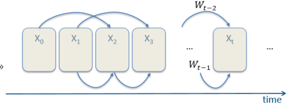    
  - <u>Feedforward neural networks</u>  
    they generalize the autoregressive models using non linear hidden layers.  
    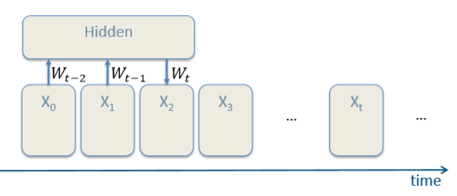  

- Models with memory:

  - <u>Linear dynamical systems</u>  
    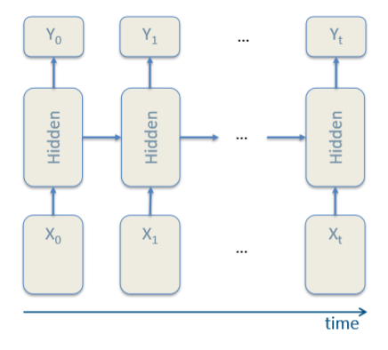  

  - <u>Hidden Markov models</u>  

  - <u>Recurrent Neural Networks</u>

#### The architecture and math of a recurrent neural network

In RNNs we deal with the time dimension as well.  
We have $I$ input neurons, and $B$ input recurrent neurons that represent the state of the system at previous timesteps. Let's suppose to have the following architecture (image to be uploaded).

w can say that $g(x_n|...)=...$

RNNs are models used for sequence modeling and they are able to have memory of the past (FFNN can't). RNNs have been used for text generation and similar things involving word sequences.

 Distributed hidden state allows to store a information efficiently.  

#### Backpropagation through time rationale and math

- perform network unroll for U steps
- initialize $V,V_B$ replicas to be the same
- compute gradients and update replicas with the average of their gradients

$V=V - \eta \frac{1}{U}\sum_{u=0}^{U-1}V^{t-u}$

$V_B=V_B-\eta \frac{1}{U}\sum_{u=0}^{U-1}V_B^{t-u}$ 

*explained better:*

Backpropagation Through Time, or BPTT, is the application of the Backpropagation training algorithm to recurrent neural network applied to sequence data like a time series.

A recurrent neural network is shown one input each timestep and predicts one output.

Conceptually, BPTT works by unrolling all input timesteps. Each timestep has one input timestep, one copy of the network, and one output. Errors are then calculated and accumulated for each timestep. The network is rolled back up and the weights are updated.

Spatially, each timestep of the unrolled recurrent neural network may be seen as an additional layer given the order dependence of the problem and the internal state from the previous timestep is taken as an input on the subsequent timestep.

We can summarize the algorithm as follows:

1. Present a sequence of timesteps of input and output pairs to the network.
2. Unroll the network then calculate and accumulate errors across each timestep.
3. Roll-up the network and update weights.
4. Repeat.

BPTT can be computationally expensive as the number of timesteps increases.

If input sequences are comprised of thousands of timesteps, then this will be the number of derivatives required for a single update weight update.  
This can cause weights to vanish or explode (go to zero or overflow) and make slow learning and model skill noisy ([source](https://machinelearningmastery.com/gentle-introduction-backpropagation-time/))

#### The limits of backpropagation through time and the vanishing/exploding gradient issue

backpropagation through time becomes difficult to deal with when we want to consider a huge number of preceding timesteps. this is due to the fact that when we compute the gradient of the error function with respect to each weight, we obtain very small numbers due to the multiplication of many small partial derivatives.   
As we have seen for FFNN, the vanishing/exploding gradient issue happens when the NN is very deep. Whenever we consider too many timestep in the past we obtain a proportionally deep unrolled RNN.

#### The vanishing gradient math in a simple case

to better understand the problem let's consider the following simple RNN

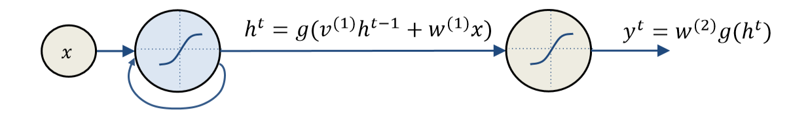

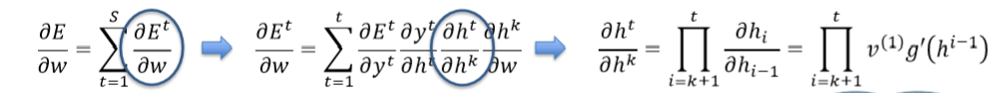

#### The Long Short-Term Memory model, rationale, ad math

rationale: we want to be able to read on, write in and forget a memory state based on an input and not on every step. to achieve this we introduced gates, which are trainable parameters: the network learns based on the input when to open and close these gates (when to read from its memory, update it with the new input, or forget it and replace it with the input).

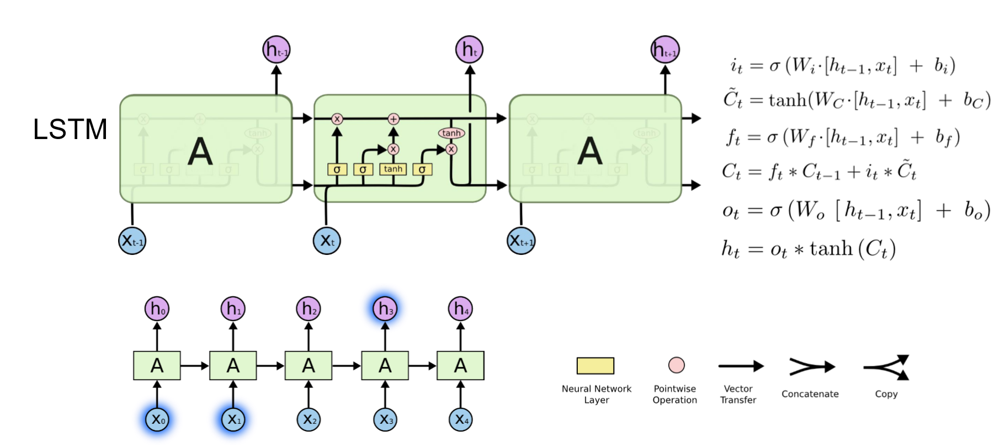

#### The Gated Recurrent Unit

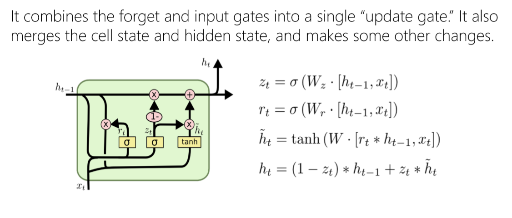

#### LSTM Networks, hierarchical and bidirectional. 

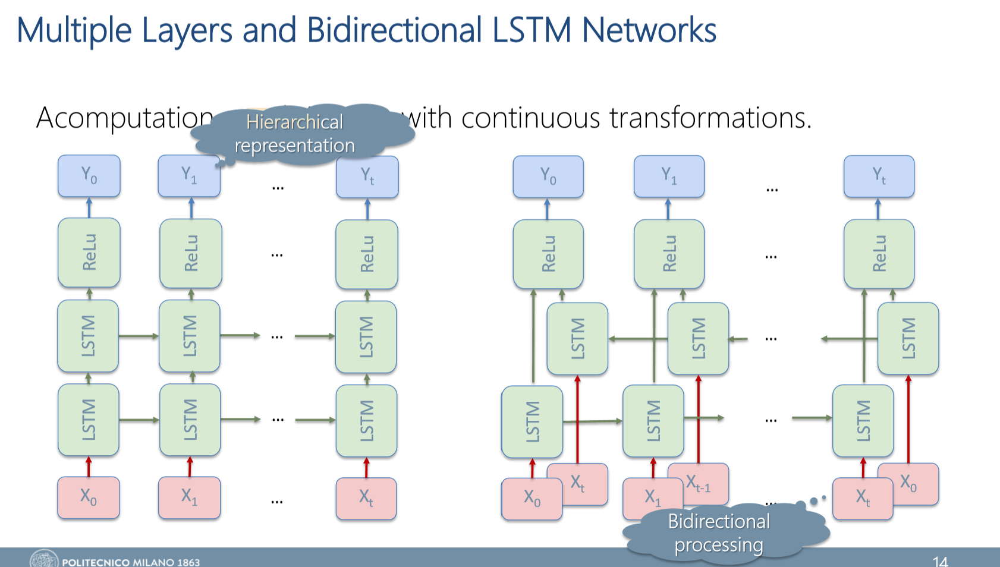

# Sequence to Sequence Learning

#### Sequential Data Problems, with examples

all the one/many to one/many problems

#### The Seq2Seq model, training, and inference 

asked it last time.

#### Neural Turing Machine model and the attention mechanism

todo

#### Attention mechanism in Seq2Seq models 

todo

#### Chatbot: core models and context handling 

#### The Transformer model  

# Word Embedding 

#### Neural Autoencoder model, error function, and training

#### Language models and the N-grams model

#### Limits of the N-gram model

#### The concept of embedding and its benefits

#### The Neural Language Model and its use for word embedding

#### Google’s word2vec model (CBOW)

#### Possible uses of word embedding

