# Formulae

[TOC]

# General

- ***Subgame Perfect Equilibria***  
  Remember it is a subset of the NE of the game, so just look at them and check if they would be senseful choices.   
  If you have a tree representation I'm positive you can find one of them (maybe that's it) by doing backtracking on the tree.

- ***Nash Equilibria*** can be found by doing the intersection between the best response functions

# Markov Decision Processes

### ==Definition==

- $S$
- $A$
- $P:S \times S \times A \to [0,1]$
- $R:S \times A \to \R$
- $\lambda$

### ==Bellman Equations==

***Bellman Expectation Equation***
$$
V^\pi(s)= \sum_{a \in A}\pi(a|s)\bigg[R(s,\pi(s))+\lambda\sum_{s' \in S}P\big(s'|s,\pi(s)\big)V^\pi(s')\bigg]
$$
***Bellman Optimality Equation***
$$
V^*(s)=\max_{a\in A}\bigg\{R(s,a)+\lambda\sum_{s' \in S}P(s'|s,a)V^*(s')\bigg\}
$$

alternative version (in case $R$ is defined as $R:S \to \R$) :
$$
V^*(s)=R(s)+ \lambda\max_{a\in A}\bigg\{\sum_{s' \in S}P(s'|s,a)V^*(s')\bigg\}
$$

### ==Value Iteration==

Iteratively find a better value function until convergence.

$(S,A,P,R,\lambda)$ returns $\hat{V}^*$m that is an approximation of $V^*$

***Algorithm***

_____________________________________________________________________________________________________________________________________________________________________________________________________________________________________

$\text{initialize }\hat{V}^*$

$\text{repeat}$

​			$V \leftarrow \hat{V}^*$

​			$\text{for each $s \in S$ do}$

​						$\hat{V}^*(s) \leftarrow \max_{a \in A}\big[R(s,a)+\lambda\sum_{s'\in S}P(s'|s,a)V(s')\big]$

​			$\text{end for}$

$\text{until }\max_{s \in S}|V(s)-\hat{V}^*(s)|< \varepsilon$

_____________________________________________________________________________________________________________________________________________________________________________________________________________________________________

Be careful: i think Amigoni prefers  the alternative version of the update (see *Bellman Optimality Equation*).

Here I'm not looking for something that is in my equation, I have an estimate of $V$!

### ==Exercises==

***First***

***Second***

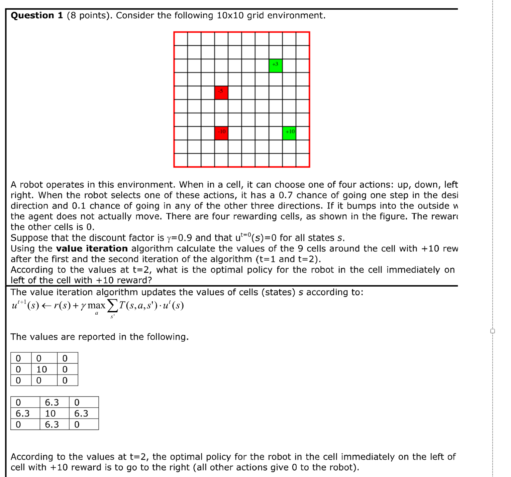

# Negotiation

### ==Definitions==

<u>Alternatives</u>
$$
A=\{z | \text{condition on $z$}\} \cup D
$$
where $D$ is the disagreement

<u>Bargaining Set</u>
$$
S=\{(U^a(z),U^b(z))|z \in A \}
$$
<u>Disagreement Point</u>
$$
d=(U^a(D),U^b(D))=(d^a,d^b)
$$
<u>Bargaining Problem</u>
$$
(S,d)
$$
<u>Bargaining Solution</u>
$$
f:\{(S,d)\} \to S
$$
<u>Nash Bargaining Solution</u>
$$
f(S,d)= \underset{x=(x^a,x^b)\in S \text{ and }x \ge d}{\text{argmax}}(x^a-d^a)(x^b-d^b)
$$

### ==Solutions' properties==

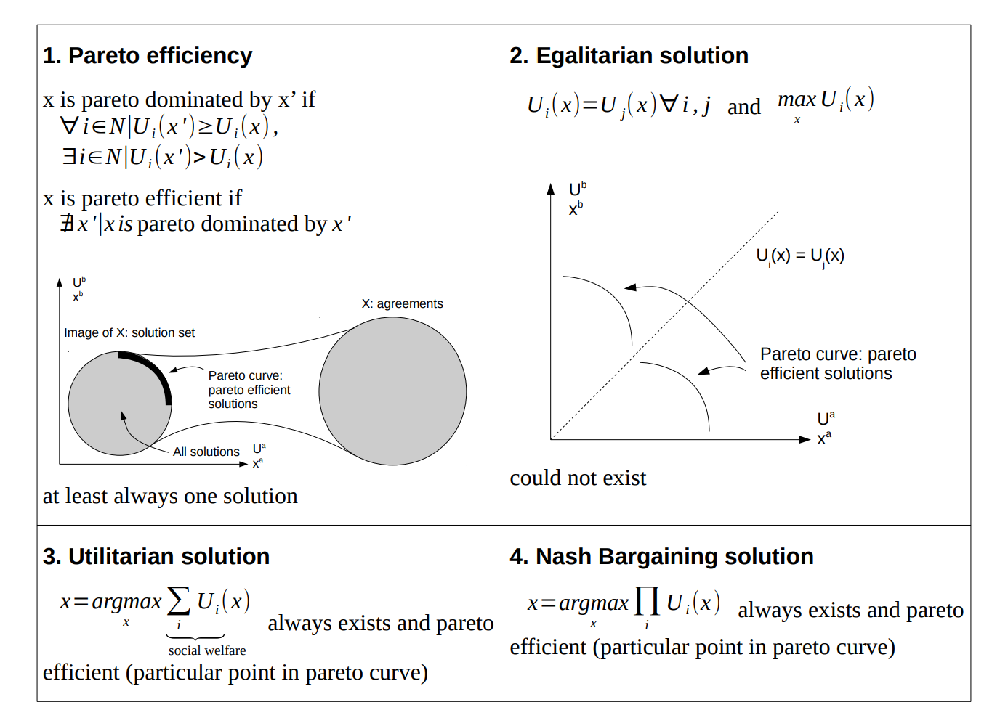

$\bar{x}=[x_1,\dots,x_n]$

***Pareto Efficiency***

if $n=2$:	  

1. plot $(U_1(\bar{x}),U_2(\bar{x}))$
2. if the point corresponding to such pair of utilities doesn't have other pairs of utilities above or on the right, it is a Pareto Efficient solution.

***Egalitarian***

$\bar{x}=[x_1,\dots,x_n]$

$\forall i,j \ \ \  U_i(\bar{x})=U_j(\bar{x})$

$\max U_i(\bar{x})$

***Utilitarian***

(maybe, I could refer to the solution that satisfy this property also as social welfare solutions... not sure!)

$\bar{x}=[x_1,\dots,x_n]$

$x^*=\underset{\bar{x}}{\text{argmax}}{\bigg(\sum_iU_i(\bar{x})\bigg)}$

***Nash Bargaining Solution***

$\bar{x}=\underset{\bar{x}}{\text{argmax}}\bigg(\prod_iU_i(x)\bigg)$

***Other types of solution*** (I think they have not been mentioned in class)

- Egalitarian Social Welfare - guarantees pareto optimal solution
- Kalai-Smorodinski - does not guarantee p.o. solution, but yes if the set of deals is continuous

### ==Rubinstein's Alternating Offer Protocol==

- two agents, $a$ and $b$
- a good that can be shared, with shares $x^a+x^b=1$
- discrete time $t=1,2,\dots$
- discount factors $\delta^a,\delta^b$ with $0\le \delta^a,\delta^b\le 1$

***Utilities***
$$
U^a(x_a,t)=x^a \cdot \delta^{t-1}​
$$

$$
U^b(x_b,t)=x^b \cdot \delta^{t-1}
$$

***Equilibrium Shares***
$$
x^a=\frac{1-\delta^b}{1-\delta^a\delta^b}
$$

$$
x^b=\frac{\delta_b - \delta_a\delta_b}{1-\delta_a\delta_b}
$$

### ==Monotonic Concession Protocol==

***General***

- agents $a,b$ ;  
- utilities $U^a,U^b$
- simultaneous offer protocol. the offer is usually referred to as $x$
- $t=1,2,... $

***Algorithm***

From the point of view of agent $a$:

$\text{1. } x^{(a)}\leftarrow \arg\max_{x \in O}{U^a}(x)$  

$\text{2. propose }x^{(a)}$

$\text{3. receive }x^{(b)}$

$\text{4. if }U^a(x^{(b)})\ge U^a(x^{(a)}) \text{ then ACCEPT } x^{(b)} \text{ and RETURN}
\\
 \ \ \ \ \ \ \ \ \ \ \ \ \ \ \ \ \ \ \ \ \ \ \ \ \ \ \ \ \ \ \ \ \ \ \ \ \ \ \ \ \ \  \  \text{else }x^{(a)}\leftarrow \underset{x \in (O \ \setminus \ x^a) }{\text{argmax}}{U^b(x)} \text{ such that }\color{green}U^{b}(x)\ge U^b(x^{(a)}) \color{black}\text{ and }U^a(x)\ge0
\\$

$\text{5. goto 2}$

The $\color{green}\text{green}$ part is usually re-written as follows: $\color{green}U_{t+1}^b(x)=U^b_t(x)+\varepsilon$, with $\varepsilon$ being a specified constant.

***Exercise Example***

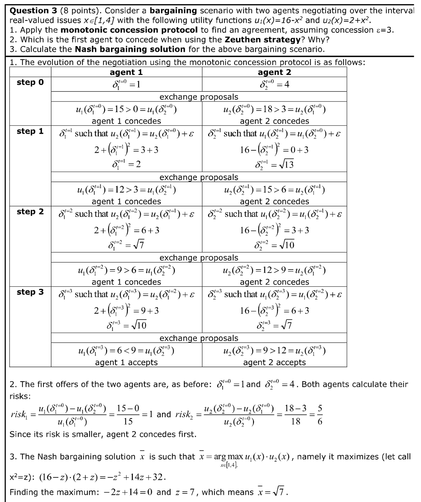

### ==Zeuthen Strategy==

***General***

The idea is that you have a high risk when you are close to the situation in which your utility is very small, when you are close to the no-agreement. The agent that has the smallest risk will <u>concede and make the next offer</u>.  
Property: <u>the final agreement found via this algorithm is a pareto optimal agreement</u>, which means that there is no another agreement that is not worse for one agent and strictly better for the other one.

<u>It finds an agreements which is a Nash BARGAINING solution</u>. It is an agreement that maximizes the product of the two utilities.

***Algorithm***

This is the point of view of $a$

$\text{1. } x^{(a)}\leftarrow \arg\max_{x \in O}{U^a}(x)$  

$\text{2. propose }x^{(a)}$

$\text{3. receive }x^{(b)}$

$\text{4. if }U^a(x^{(b)})\ge U^a(x^{(a)}) \text{ then ACCEPT } x^{(b)} \text{ and RETURN}
\\$

$\text{5. }\text{risk}_a \leftarrow \frac{U^a(x^{(a)})-U^a(x^{(b)})}{U^a(x^{(a)})}; \text{risk}_b \leftarrow \frac{U^b(x^{(b)})-U^b(x^{(a)})}{U^b(x^{(b)})}$ 

$\text{6. if } \text{risk}_a <\text{risk}_b \text{ then } x^{(a)}\leftarrow x \in O \text{ such that }\color{green}\text{risk}_a>\text{risk}_b$

$\text{7. goto 2}$

The $\color{green}\text{green part}$ is explicated as follows (suppose agent $1$ is the one that needs to come up with the new offer) 
$$
\color{green}\frac{U^1(x_{t+1}^{(a)})-U^1(x_t^{(b)})}{U^1(x^{(a)}_{t+1})}\ge \frac{U^2(x_t^{(b)})-U^2(x_{t+1}^{(a)})}{U^2(x_t^{(b)})}
$$
in short you need:

- the utility functions of both agents
- the utility of both agents with the old offer of the agent that is waiting for the new offer

# Computational Social Choice

### ==Voting Rules and Definitions==

<u>Disclaimers</u>

- voting rules means scoring rules
- Strict Majority Voting differs from Plurality Voting!

***Plurality Voting***

One point for each vote, everyone votes for his preferred alternative. The winner is the alternative with the highest score.

***Borda Count***

Consider the preference relation expressed by each agent.  
Suppose you have $m$ alternatives. weight first alternative $m-1$, second alternative $m-2$, and so on.

***Pile wise majority voting***

a voting where you have only 2 alternatives and the alternative that gets more points is the winner

<u>Condorcet Winner</u>

An alternative that wins against every other alternative in a pile wise majority voting

<u>Condorcet Extension</u>

Voting rule that selects a Condorcet winner if a Condorcet winner exists.

- Sequential Majority voting *is* a condorcet extension
- Borda Count *is NOT* a condorcet extension

<u>Copeland's Rule</u>

In order to determine the winner you give to each alternative one point every time it is winning against another alternative, you give $1/2$ when there is a tie, $0$ points when it loses. 

***Plurality with Runoff***

In the first stage you run a plurality voting.  
Then you take the 2 most voted candidates and run a pairwise majority voting between the 2 (a ballot).

*Example*

| 6    | 5    | 4    |
| ---- | ---- | ---- |
| milk | beer | wine |
| wine | wine | beer |
| beer | milk | milk |

after $1^{st}$ stage:

| milk | beer |
| ---- | ---- |
| 6    | 5    |

after $2^{nd}$ stage:

beer wins over milk ($9$ over $6$):

Conclusion: Beer wins.

***Single Transferable Vote (SVT)***

Run a plurality voting, then the alternatives that are ranked first by the lowest number of agents are eliminated, then you run a new plurality voting without considering the eliminated candidates.  
$N$ candidates $\to$ $N-1$ round to perform. 

*Example*

| 6    | 5    | 4    |
| ---- | ---- | ---- |
| milk | beer | wine |
| wine | wine | beer |
| beer | milk | milk |

I eliminate wine.

| 6    | 5    | 4    |
| ---- | ---- | ---- |
| milk | beer | beer |
| beer | milk | milk |

beer wins over milk ($9$ over $6$):

I eliminate milk. Beer wins. Is it a condorcet winner extension? no.

***Sequential Majority Voting***

Combine in different ways a sequence of majority voting.

Sequential Majority Voting is a condorcet extension because the condorcet winner can never lose in a pair wise comparison.

<u>Gibbard–Satterthwaite Theorem</u>

*Any voting system is prone to strategic manipulation.*

So you can not avoid strategic manipulation, but you can make it harder to happen.

<u>Another Gibbard-Satterthwaite Theorem</u>

*when*

- *there are more than 2 alternatives*
- *you use a probabilistic voting rule*
- *you impose that your probabilistic voting system is Pareto optimal*
- *and it is no manipulable*  

*then the only probabilistic voting system that is satisfying it is probabilistic dictatorship.*

### ==Example on Condorcet Winner==

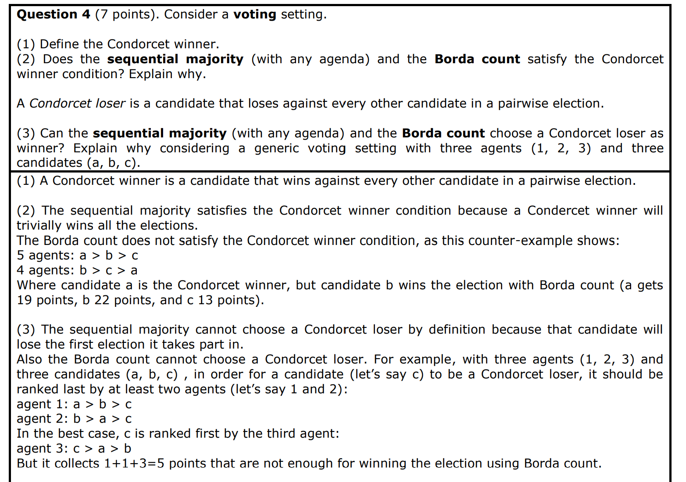

# Auctions

### ==Single Item Canonical Auctions==

<u>General Disclaimer</u>

- the goal of the agents is not to get the item paying their private value, but to maximize their utility

***English Auctions***   
The auctioneer announces an initial price (the reservation price).  
The agent can make a new offer with the following constraint: the new offer should be larger than the largest offer made so far by any of the other agents.  
When the auction in this case ends? when there is no new offer.  
The agent will pay exactly the amount of money that he has offered.

- offer made by agents
- usually big jump of prices
- the auctioneer is more passive. he has no control
- the winning strategy is to offer an increase until my true evaluation

***Japanese Auctions***  
At the beginning all the agents will be standing up. The auctioneer will start from his reservation price and he will call increasing prices.  
If an agent sits down he is out of the auction forever.  
The winner is the last standing agent.  
The amount of money he will pay is the price that the auctioneer has proposed at last.  
What happens if we have two agents standing and they sit down at the same time?  
One tie-breaking mechanism is: a new auction is run just for those agents.

- offer made by auctioneer.
- more linear.
- the auctioneer is more in control of the situation.
- the winning strategy is to stay up until the auctioneer reaches your evaluation

***Dutch Auctions***  
there is a clock. it does not show the time but the price.  
it starts from a really high price and goes down.   
the auction ends when one of the agents stops the clock.  
The winner is the agent that stopped the clock and the amount of money he will pay is the price that is displayed by the clock at time of stopping.  
(i.e. for selling flowers, for selling fish. it is really fast. used for selling things that are not of a big value and you have to sell them fast.   
the auctioneer can set the speed of the clock)

- there is no dominant strategy

<u>Sealed-bid Auctions</u>  
the agents send their bids (offer) to the auctioneer using a sealed envelope.  
There are several families of sealed-bid auctions, but we'll see just two:

***First Price Sealed-bid Auctions***   
The auctioneer selects the largest possible offer.  
The agent that made the best offer will get the item and pays exactly the amount he has offered.

- Dutch and FPSB are strategically equivalent
- there is no dominant strategy in this case

***Second Price Sealed-bid Auctions (also called Vickrey auctions)***   
The auctioneer selects the largest possible offer.  
the winner is the one that made the largest offer but he does not pay his offer, but the second highest.

- offering your true evaluation of the object is the dominant strategy

### ==Example==

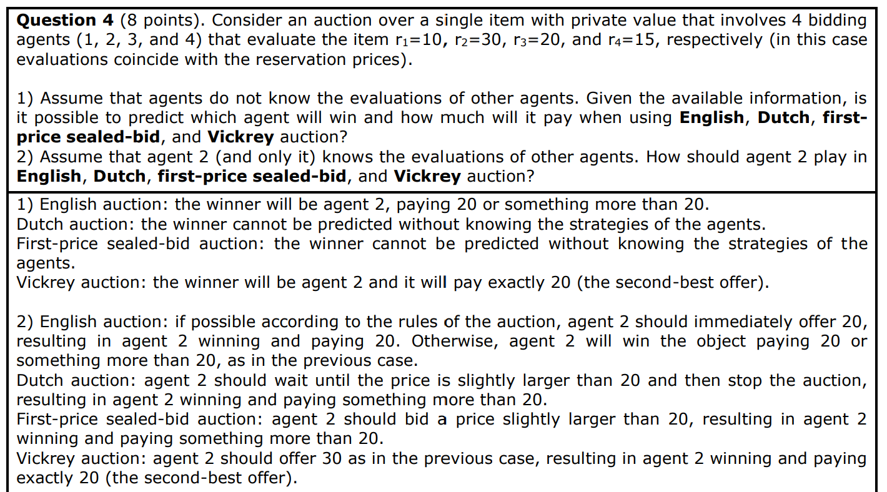

# Coalition Formation

### ==Superadditivity==

$$
v(\{C \cup D\}) \ge v(C) + v(D) \ \ \ \ \ \text{$C$ and $D$ disjoint}
$$

### ==Convex Game==

$$
v(C \cup D) +v(C \cap D)\ge v(C)+v(D) \ \  \forall C,D\subseteq A
$$

if a game is convex then it is even superadditive.

for convex games, the payoff vector composed of Shapley Values is always in the core (is always stable).

### ==Simple Game==

$$
v(C) \in \{0,1\} \ \forall C \in A
$$

### ==Shapley Value==

It embeds the idea of fairness.
$$
\varphi_i(v)=\sum_{S\subseteq N  \backslash \{i\}}\frac{|S|! \ (n-|S|-1)!}{n!}(v(S \cup \{i\})-v(S))
$$

### ==Core==

It embeds the idea of stability.  
Compute the inequality for all coalitions but the grand coalition, and find the values of the payoff vector such that all of them are satisfied.
$$
\text{core}=\{(CS,\bar{x})|\sum_{i \in C }x_i \ge v(C) \ \ \forall C \subseteq A\}
$$

# Best Coalition Structure

### ==Dynamic Programming Algorithm==

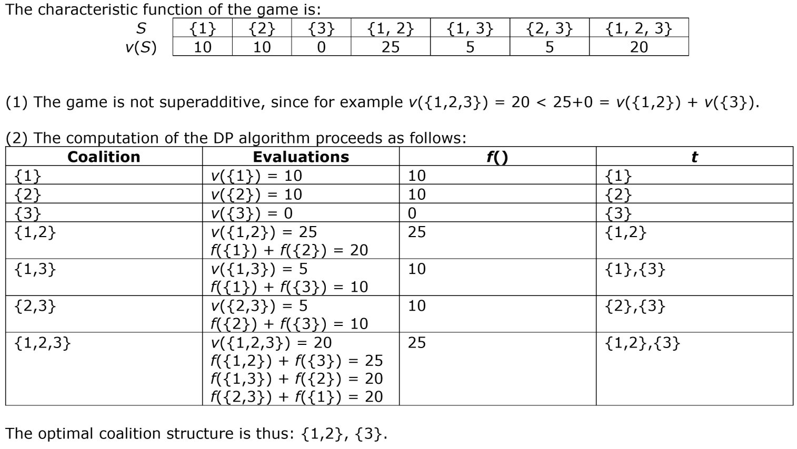

### ==Shehory and Kraus==

By the point o view of agent $i$.

$(1) \ C_i\leftarrow \text{coalitions that include $a_i$}$

$(2) \ C_i^*\leftarrow \arg\max_{C \in C_i}\frac{v(C)}{|C|}$  

$(3) \ \text{broadcast}(a_i,C_i^*),\text{receive}(a_j,C^*_j)$

$(4) \ C_{max}\leftarrow \text{largest set of agents such that, for all $a_j \in C_{max}$},(a_j,C_{max})$

$(5) \ \text{if }a_i \in C_{max} \text{ then join $C_{max}$ and return }$

$(6) \ \text{delete from $C_i$ coalitions that contain agents in $C_{max}$}$

$(7) \ \text{goto}  \ (2)$

This algorithm is performed by all agents in parallel knowing the same information.

### ==Examples==

***First***

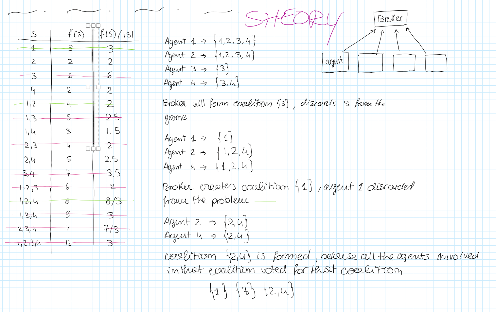

***Second***

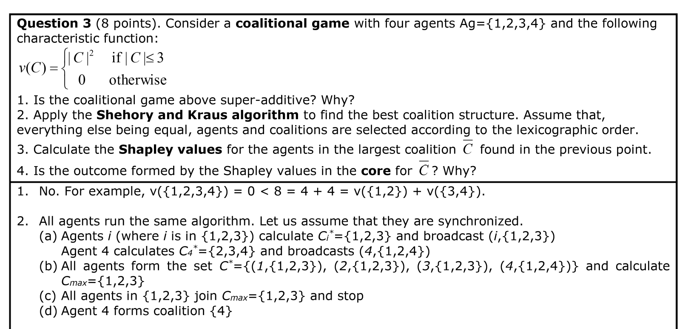

# Decentralized Partially Observable MDPs

### ==Definitions==

- set of agents $I={1,\dots,n}$ 
- set of states $S$, *not known by the agents directly*
- set of actions $A_i$ for each agent. $\bar{A}$ is the set of all joint actions
- $P:S \times S \times \bar{A} \to [0,1]$
- set of observations for each agent $i$: $\Omega_i$ 
- observation function $O:\bar{A} \times S \to \Delta \bar{\Omega}$  
  - $O(\bar{o}|s,\bar{a})$: probability of receiving a joint observation when the world is in $s$ and the joint action is $\bar{a}$
- reward function $R:S \times \bar{A}$

not so sure about this one:
$$
V(s_0,\bar{q})=R(s_0,\bar{a})+\sum_{s',\bar{o}}\color{orange}P(s'|s_0,\bar{a})\color{black}\color{green}O(\bar{o}|\bar{a},s')\color{black}V(s'|\color{red}\bar{q}_\bar{o}\color{black})
$$

### ==Model==

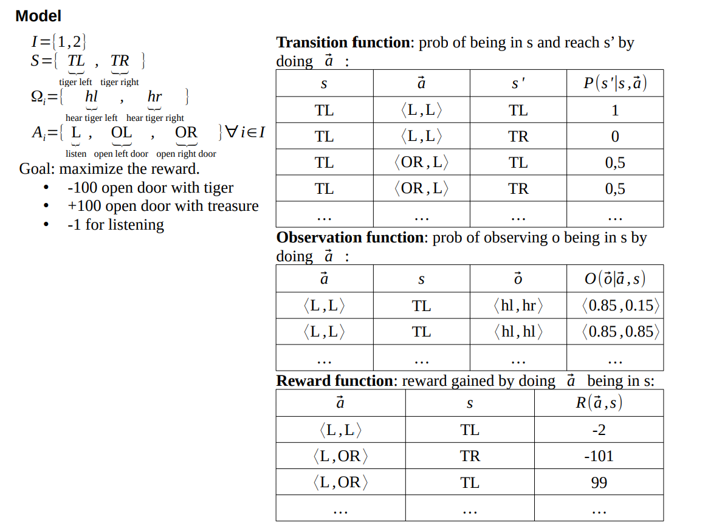

# Constraint Optimization

### ==DPOP - Dynamic Programming Algorithm==

***utils propagation***   
start from the bottom of the tree and report some "util messages" until you reach the root.
$$
U_{i\to j}(Sep_i)=\max_{x_i}\Bigg\{\bigg[(\otimes_{p \in Sep_i}F_{p,i})\bigg] \otimes U_{s \to i}(Sep_s) \Bigg\}
$$
​	where $s$ is $i$'s son in the tree, if it exists, otherwise don't consider $U$.

***value propagation***  
start from the top and send down some "value messages".  
the agent considered computes its best value as $x_i^*=\underset{x_i}{\text{argmax}}\bigg\{U_{s\to i }(x_i) \otimes F_{f, i}(x_f^*,x_i)\bigg\}$.  

where $s$ always denotes $i$'s son and $f$ denotes $i$'s father (if they don't exist don't consider them.  
the agent send to the son the message $V_{i\to s}=\{x_i^*=x_i^*\text{ value}\}$.  in the set there are even other nodes' choices.

***Side Notes on DPOP***

- each agent send a util message to its only parent
- each agent sends a value message to all of its children
- induced width: the maximum number of parents and pseudo parents a node can have in a pseudo tree
- DPOP is always guaranteed to find the optimal solution

### ==MaxSum Algorithm==

***Algorithm***

1. Build the tree
2. at each iteration, each agent sends the following message to its neighbors

$$
m_{i \to j}(x_j)=\alpha_{ij}+max_{x_i}\bigg(F_{ij(x_i,x_j)}+\sum_{A_k \in N_i-\{j\}}m_{k\to i}(x_i)\bigg)
$$

​		At the beginning, the terms in the sum are all set to zero.

3. The algorithm terminates when all the agents receive the same message twice.
4. When convergence is reached, each agent computes a local function $z$:

$$
z_i(x_i)= \sum_{a_k \in N_i}m_{k \to i}(x_i) 
$$

5. agent $i$ selects the value $\tilde{x}_i$ such that:

$$
\tilde{x}_i= \underset{x_i}{\text{argmax}}\Big\{z_i(x_i)\Big\}
$$

***Side Notes on MaxSum***

- I repeat: at a given step, each agent sends a message to each of its neighbors
- the size of a message sent by an agent $a_i$ to its neighbor $a_n$ depends only on the size of the domain of values from which $a_n$ can pick 
- suboptimal algorithm $\to$ in general no guaranteed to converge. if it does converge, it could do so in a local maximum.
- if the initial graph is acyclic, MaxSum converges to the optimal solution
- one could cut some arcs in order to make the graph acyclic and obtain an approximated solution

### ==Asynchronous Backtracking==

(he has never taught it I think).

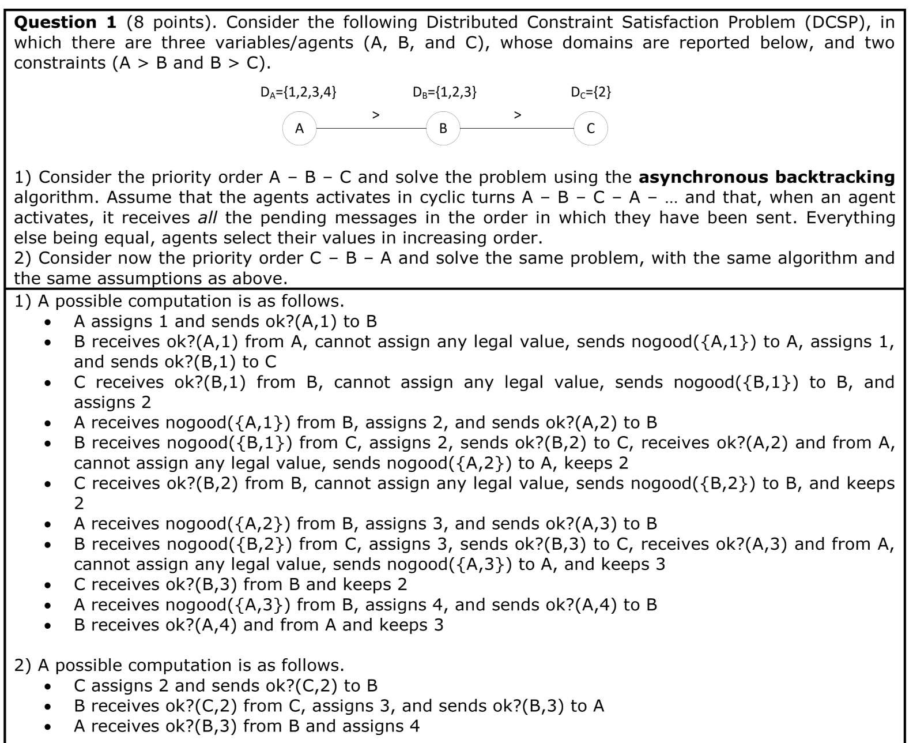

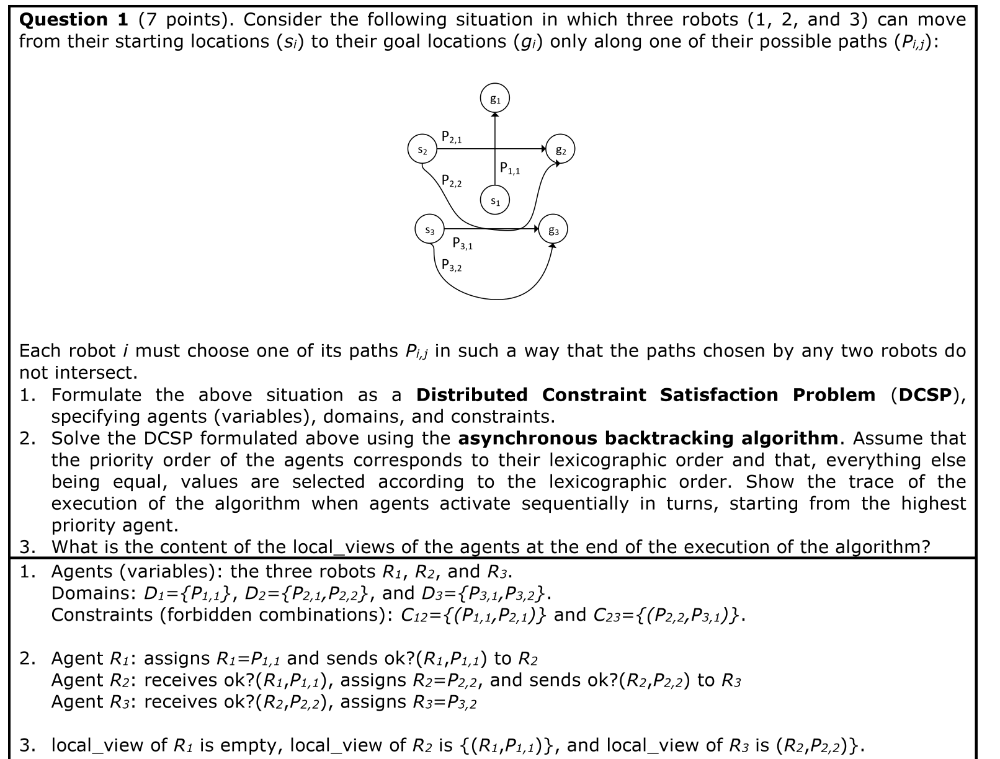

# Combinatorial Auctions

### ==Branch and Bound==

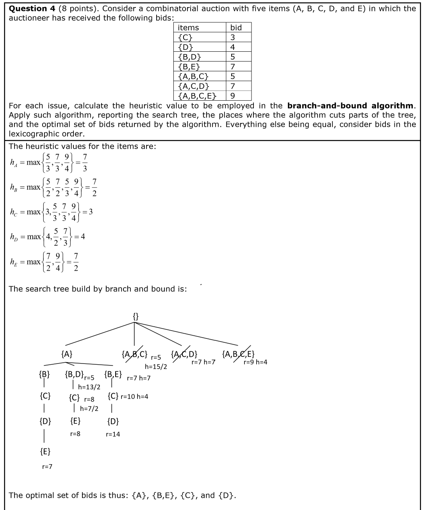

# Multiagent Learning

### ==General==

- now we have a reward function for each agent
- why *learning*? because agents don't know in advance their reward function and transition function
- <u>Factoredness</u>  
  the local goal of an agent is aligned to the global goal $\to$ actions that optimize a reward will optimize other rewards as well
- <u>Learnability</u>  
  how discernible the impact of an action is on an agent's reward function $\to$ higher learnability means it is easier for an agent to take actions that maximize its reward
- factoredness and learnability are complementary concepts
- Multiagent Reinforcement Learning
  - is modeled with Markov Stochastic Games
  - accepts always at least one deterministic Nash Equilibrium if actions are deterministic (we'll see only the case in which actions are deterministic)
  - can be seen as 
    - MDP with multiple agents
    - POMDP with no partial observations

### ==Stochastic Markov Game==

defined by:

- a set of states $S$
- a set of actions for each agent $i$ $A^i$ .  Consequently, the set of join actions $\bar{A}$ is defined as $\bar{A}=A^1\times \dots \times A^n$
- a transition function $p:S\times A^1\times \dots \times A^n\to\Delta(S)$.  
- a reward function $r^i$ for each agent $i$, defined as   $r^i:S\times A^1 \times A^2 \times \dots \times A^n \to \R $
- a policy $\pi^i$ for each agent $i$ defined as $\pi^i:S \to A^i$ (policies will be considered only as deterministic for us)
- an optimal policy $\pi^i_*$ for each agent $i$ that maximizes its reward
- value functions $v^i$, defined below

<u>now we assume the agents don't know the $r^i$ and $p$!</u>

### ==Value Function==

$$
v^i(s,\pi^1,\pi^2,...,\pi^n)=\sum_t{\beta^t}E[r^i_t|\pi^1,\pi^2,\dots,\pi^n,s_0=s]
$$

Our goal is to maximize $v^i$ for all agents.

- <u>big plus!</u>   
  When the environment is deterministic (the transition function is deterministic) it is really easy to compute function $v^i$ because we get rid of the expected value (we have an exact value for each timestep).

### ==Nash Equilibrium==

a set of joint policies$(\pi_*^1,...,\pi_*^n)$ such that 

$$
v^i(s,\pi_*^1,\dots,\pi_*^i,\dots\pi_*^n)\ge v^i(s,\pi_*^1,\dots,\pi^i,\dots\pi_*^n) \ \\ \\ \ \  \forall   \pi^i, \forall s, \forall i
$$

- The goal is to learn policies that are in equilibrium.  
- Reach an equilibrium state is a goal, there is not global utility.
- It is possible to prove that each stochastic game admits a NE. 

### ==Nash-Q Function==

***$Q$-function***

<u>*the $Q$ function of an agent $i$ is a function learnt by all the agents that returns a number for any combination of states $s$ and joint actions $\bar{a}$.*</u>

***Nash $Q$-function***

<u>*Similar to the $Q$-function, but it refers to equilibrium policies* $\pi^1_*,\dots,\pi^n_*$</u>
$$
Q^i_*(s,a^1,\dots,a^n)=r^i(s,a^1,\dots,a^n)+\beta \sum_{s'\in S}P(s'|s,a^1,\dots,a^n)v^i(s',\pi^1_*,\dots,\pi^n_*)
$$

actions performed $a^1,\dots,a^n$ can be any actions, no need to be sampled by the respective $\pi_*$.

- $r_i$ is the reward function of agent $i$
- $\beta$ is the discount factor
- $p$ is the transition function
- $v^i$ is the value function of agent $i$ (i.e. what agent $i$ tries to maximize)

<u>Important:</u>  
if you calculate the Nash Q-function in a given state $s$, you are implicitly defining a strategic game in normal form that is a Stage Game:

### ==Nash-Q Learning Algorithm==

*<u>Following the Nash-Q Learning algorithm , the Q-functions of the agents converge to the corresponding Nash-Q functions</u>*.

- each agent, in order to locally update the $Q$-values during the execution of the algorithm, needs to know
  - the state $s$
  - the actions performed by all the agents
  - the reward received by all the agents

- *learning* because: rewards and transition functions are not known in advance, so agents need to figure it out
- every agent keeps the Q-Nash value of other agents updated
- build a stage game table for every state   
  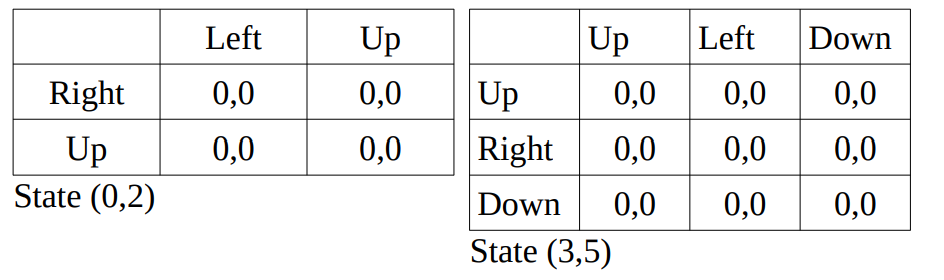

***Algorithm***

1. initialization phase: $Q_{t=0}^i(s,a^1,\dots,a^n)=0 \ \ \ \ \forall s \in S,\forall a^i \in A^i  \ \ \forall i $ 
2. each agent will perceive the state of the world and decide what to do
3. each agent receives its reward and other agents' rewards with the actions they performed
4. update Q-function

$$
\text{known to both agents}

\begin{bmatrix}
a_{t=0}^1=\text{Right}
\\
a_{t=0}^2 =\text{Left   }
\\
r_{t=0}^1=-1 \ \
\\
r_{t=0}^2=-1 \ \
\end{bmatrix}
$$

***Initialization***

set all to $0$:

$Q^1_0(s,a^1,a^2)=0$

$Q^2_0(s,a^1,a^2)=0$

***Formula***

The Q-function of an agent is updated as:
$$
Q^i_{t+1}(s,a^1,\dots,a^n) =(1-\alpha_t)Q_t^i(s,a^1,\dots,a^n)+\alpha_t\bigg(\color{green}r_t^i\color{black}+\color{red}\beta \ \text{Nash}Q_t^i(s')\color{black}\bigg)
$$
$\color{green}\text{Observed Reward}$

$\color{red}\text{The payoff that agent $i$ gets for the NE of the stage game that is defined by the current Q-function}$

*It is possible to prove that this converges to $Q$-functions that are the optimal $Q$-functions* $Q^*$ *(corresponding to the NE)*.

In general a game can have multiple $NE$ $\to$ the same equilibrium is chosen by all the agents.

$\alpha_t$ can have multiple forms, a popular one is the following:
$$
\alpha_t=\frac{1}{x(s,a^1,\dots,a^n)}
$$
***Example***

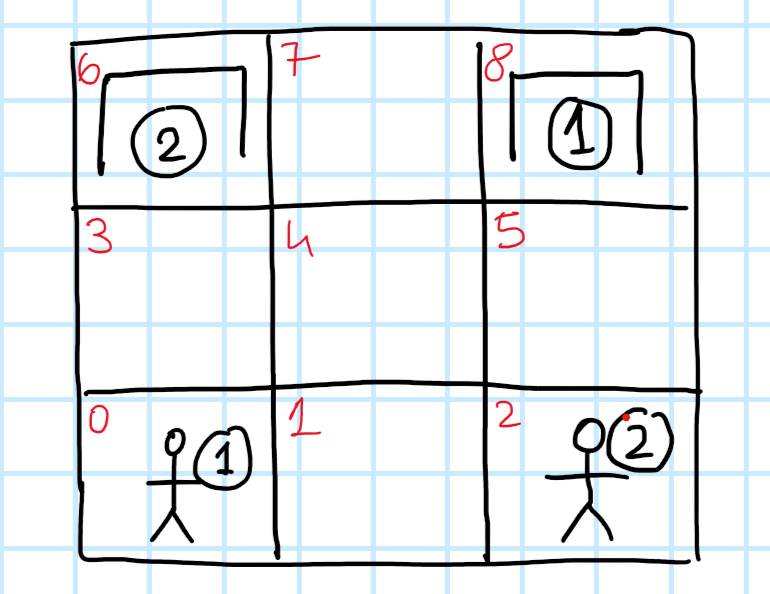

the initial situation, shown only for two of the possible states:

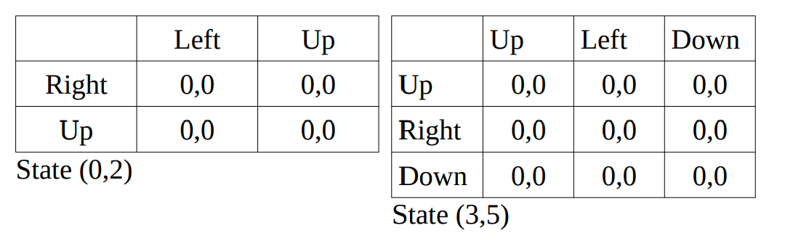

now suppose:

$s_0=(0,2)$

$\bar{a}=\text{\{Right,Left\}}$

$\beta=0.99$

$r^1_t=r^2_t=-1$
$$
Q^1_{t+1}(s_0,\bar{a})=(1-\alpha_t)\cdot 0 + \alpha_t(-1+0.99\cdot\color{red}0\color{black})=-\alpha_t
$$

where $\color{red}0$ is the utility of agent $1$ for the chosen NE (we have chosen randomly one of the 4 NE, let's say the one on the top left).
$$
Q^2_{t+1}(s_0,\bar{a})=\dots = -\alpha_t
$$

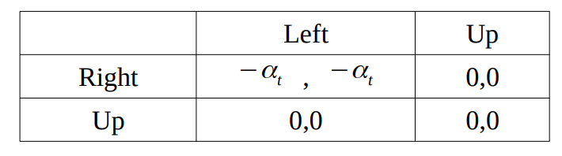

***Exams Exercise***

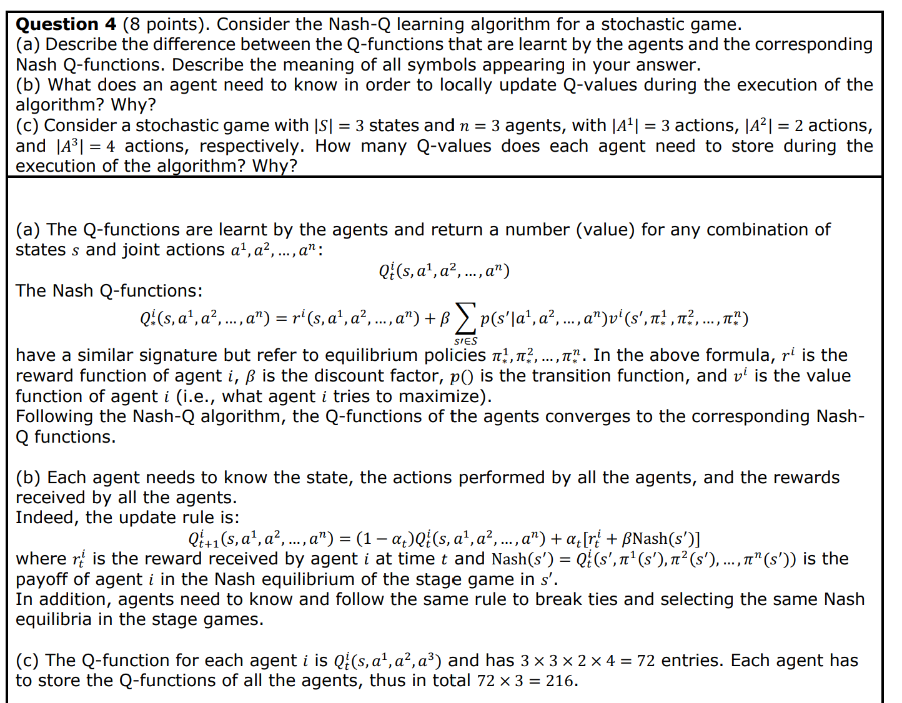

# Never Done

### ==Common Knowledge==

***Example 1***

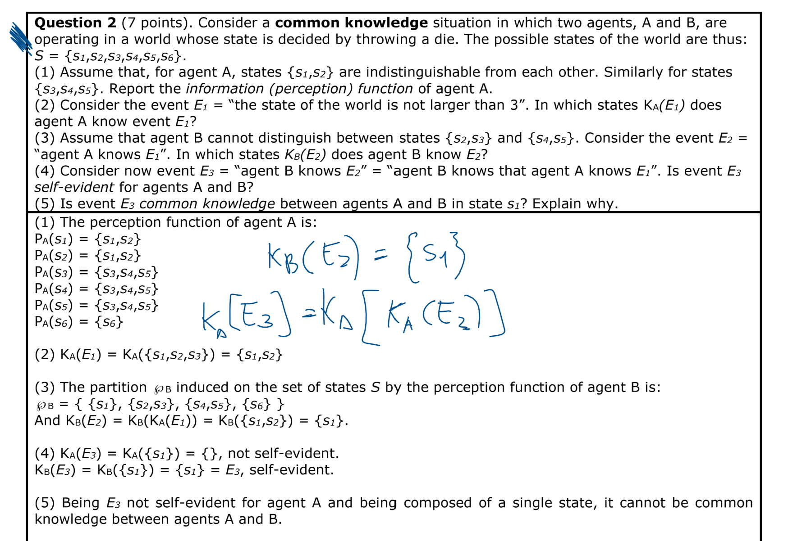

***Example 2***

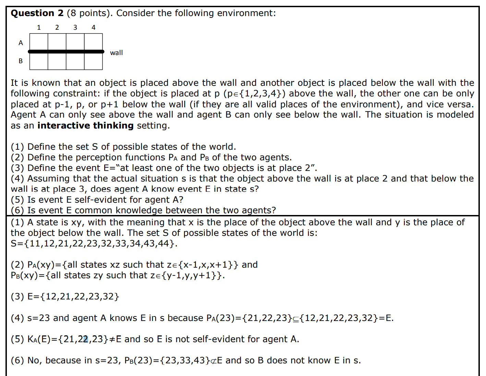