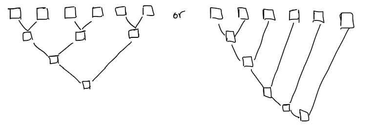
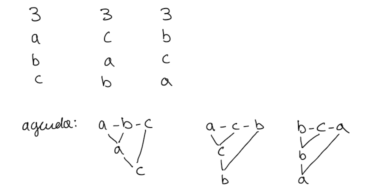

# Autonomous Agents and Multiagent Systems

*A series of notes on the course  AAaMS as taught in Politecnico di Milano by Francesco Amigoni and someone else*

[TOC]

# Negotiation Part 2 - 11/10

We now focus on the agreement found by the agent, not on the policy.

We'll define a protocol, see how the agents behave in it, and the study the possible outcome that will be reached by the agent.

Let's start with the first protocol:

### Rubinstein's Alternating Offer Protocol

I make an offer, the other agent makes a counter offer, I make a new offer, and so on, until we find some agreement.

We assume that we have 2 agents, $a,b$.

We assume there is one issue over which the agents are negotiating. It can be though as an object that can be divided by the 2 agents.   
Let's think of a cake. It can be divided by the 2 agents. We'll call the piece of cake that goes to the agent $a$ $x^a$. $x^b$ is the part of the cake that goes to $b$.

we assume that $x^a+x^b=1$ (it forms the complete cake).

The set of outcomes is trivially the set of all the pairs $(x^a,x^b)$ such that $x^a+x^b=1$.

in math: $O={(x^a,x^b)|x^a+x^b=1}$ where $O$ stands the set of possible Outcomes.

We assume that time is evolving in discrete period: $t=1,2,...$.

We assume that players play in turn, with player $a$ playing first:  
So agents $a$ makes offers in odd timestamps, while $b$ makes offers in even timestamps. This is the core of "Alternating" Offer protocol.

the ones above are all and only the assumptions that the agents must do.

Let's talk about the utility of $a$: it depends on how big the cake is and on the timestamp in which the offer is agreed.
$$
U^a(x^a,t)=x^a\cdot \delta_a^{t-1}
$$
where $\delta_a$ is the discount factor and $0\le \delta_a \le 1$

$\delta=1 \to$ the agent is very patient.

$\delta=0 \to$ the agent must accept the first offer otherwise it gets zero.

and obviously:
$$
U^b(x^b,t)=x^b\cdot \delta_b^{t-1}
$$
Rubinstein shows that it is possible to compute a subgame perfect equilibrium:
$$
x^a=\frac{1-\delta_b}{1-\delta_a\delta_b}
$$

$$
x^b=\frac{\delta_b}{1-\delta_a\delta_b}
$$

It means that the agent will not find convenient to deviate from these values.

we notice that if 
$$
\delta_a=0;\delta_b=1 \to x_a=0; \ x_b=1
$$

$$
\delta_a=1;\delta_b=0 \to x_a=1; \ x_b=0
$$

$$
\delta_a=0.5;\delta_b=0.5 \to x_a=\frac{2}{3}; \ x_b=\frac{1}{3}
$$

in the last case, the agent $a$ gets more cake because it started first.

The cases above have been computed considering that the negotiation can go on forever, but what happens if we have a deadline $t=n$ ? ($n$ is the last timestamp in which an offer can be done).

Let's suppose even that $\delta_a=\delta_b=\delta$

$n=1 \to$ agent $b$ will just accept, can't do anything else. So agent $a$ will propose $offer(1,0)$  
more precisely:
$$
\text{STRAT-A}(1)=\text{OFFER}(1,0)
\\
\text{STRAT-B}(1)=ACCEPT
$$
$n=2$
$$
\text{STRAT-A}(1)=\text{OFFER}(1-\delta,\delta)\\
\text{STRAT-A}(1)=\text{ACCEPT}
$$
  which translates into:
$$
U^a(1-\delta,1)=1-\delta
\\
U^b(\delta,1)=\delta
$$
let's revise what we have just written:  
The agent $a$ prefers to offer to $b$ $\delta$ part of the cake because the utility of $b$ can't be more than $\delta$ (in fact $U^b(1,2)=\delta$), because this way $a$ gets at least $1-\delta$ as utility, so it's a win win.

let's generalize:

deadline $n$, $\delta_a=\delta_b=\delta$
$$
\text{STRAT-A}(n)=
\begin{cases}
\text{if a's turn: OFFER(1,0) }
\\
\text{if b's turn: ACCEPT}
\end{cases}
$$

$$
U^a(n)=
\begin{cases}
\delta^{n-1}
\text{            if it's a's turn}
\\
0 \ \ \ \ \  \ 
\text{             if it's b's turn}
\end{cases}
$$

$t<n$
$$
\text{STRAT-A}(t)=
\begin{cases}
\text{if a's turn: OFFER}(1-\delta x^b(t+1),\delta x^b(t+1))
\\
\text{if b's turn:} \text{ if } U^a(x^a,t)\ge UA(t+1) \text{ then ACCEPT else REJECT}
\end{cases}
$$

### Monotonic Concession Protocol

- agents $a,b$ ;  $U^a,U^b$
- $O$
- simultaneous offer protocol
- $t=1,2,... $

From the point of view of agent $a$:

$\text{1. } x^{(a)}\leftarrow \arg\max_{x \in O}{U^a}(x)$  

$\text{2. propose }x^{(a)}$

$\text{3. receive }x^{(b)}$

$\text{4. if }U^a(x^{(b)}\ge U^a(x^{(a)})) \text{ then ACCEPT } x^{(b)} \text{ and RETURN}
\\
 \ \ \ \ \ \ \ \ \ \ \ \ \ \ \ \ \ \ \ \ \ \ \ \ \ \ \ \ \ \ \ \ \ \ \ \ \ \ \ \ \ \  \  \text{else }x^{(a)}\leftarrow x \in O \text{ such that }U^{b}(x)\ge U^b(x^{(a)}) \text{ and }U^{(a)}\ge0
\\$

$\text{5. goto 2}$

This algorithm can be applied only when you know the utility of the other agent, which does not happen very often in the real world...

Moreover, the converge of this algorithm can b very long. 

Another problem:  It can happen that agent a accepts the offer of agent b and agent a accepts the offer of agent b, but they are not the same! we have two different agreements: we need to introduce some tie-breaking to decide the agreement. we can pickup just one at random , or we can find the middle point of the offer and come up with a single agreement.

There is a variant of this protocol that is called the Zeuthen Strategy

### Zeuthen Strategy

This is the point of view of $a$

$\text{1. } x^{(a)}\leftarrow \arg\max_{x \in O}{U^a}(x)$  

$\text{2. propose }x^{(a)}$

$\text{3. receive }x^{(b)}$

$\text{4. if }U^a(x^{(b)}\ge U^a(x^{(a)})) \text{ then ACCEPT } x^{(b)} \text{ and RETURN}
\\$

$\text{5. }\text{risk}_a \leftarrow \frac{U^a(x^{(a)})-U^a(x^{(b)})}{U^a(x^{(a)})}; \text{risk}_b \leftarrow \frac{U^b(x^{(b)})-U^b(x^{(a)})}{U^b(x^{(b)})}$ 

$\text{6. if } \text{risk}_a <\text{risk}_b \text{ then } x^{(a)}\leftarrow x \in O \text{ such that }\text{risk}_a>\text{risk}_b$

$\text{7. goto 2}$

Property: the final agreement found via this algorithm is a pareto optimal agreement, which means that there is no another agreement that is not worse for one agent and strictly better for the other one.

it finds an agreements which is a Nash BARGAININ solution. It is an agreement that maximizes the product of the two utilities.

# Computational Social Choice - 18/10

Applications:

- Aggregation of preferences.
- Formation of coalitions.
- Sometimes you have multiple robots that have to keep a formation, for example military patterns.  
  It is based on the fact that there is a leader that is moving and all the other robot are keeping a fixed distance and angle from him. They should also avoid to collide with each other.  
  What happens if the leader fails? In this case there is a kind of voting for choosing the new leader, and this is the social choice.

Let's start from the model that we will adopt for studying computational social choice.

we'll have:

- a number of ***agents*** $N=\{1,2...,n\}$
- a set of **alternatives**, also called **candidates** (in the case of political elections for example)  $U$. we assume $|U|\ge2$.
- ***preferences***, denoted by the symbol *preference relation* $>_{\sim i}$ (it is an ordering over the alternatives).  
  for it being a proper ordering we need to constraint such relations in the following way. we need to say that such relation is 
  - complete: $\forall a,b \in U: a >_{\sim i } b \text{ or } b >_{\sim i}a  $  (the or is not generally exclusive)
  - transitive: $\forall a,b,c \in U: \text{if } a >_{\sim i } b \text{ and } b>_{\sim i }c \text{ then }  a >_{\sim i } c$  

Observations: agents and candidates could be disjoint or not depending on the case. In political election agents are people and politicians, while candidates are politicians.

Now let's introduce some symbols:

- ***preference profile*** $R=(>_{\sim 1 },>_{\sim 2 },>_{\sim n })$ (it is an array of preferences, one for each agent).  
  a preference can be structured as a pair of agent, candidate. So a preference profile can be represented as a list of pairs.
- a ***set*** of all possible ***preference relations over $U$*** :   $\scr{R}$$(U)$   
  $>_{\sim i}$ $\in$ $\scr{R}$$(U)$

Mathematicians game:  
We are at a party in which people can drink only one beverage.  
6 mathematicians want to drink, in preference order, milk,wine,beer.  
5 mathematicians want to drink, in preference order, beer,wine,milk.  
4 mathematicians want to drink, in preference order, wine, beer,milk.  
So:

- we have 15 agents: $n=15$.  
- we have 3 alternatives: $|U|=3$
- for the mathematician number $1$, who belongs to the 6 mathematicians cited first, we'll have   
  $\text{milk}$$>_{\sim 1}$ $\text{wine}$ $>_{\sim 1}$$\text{beer}$.  and so on for all the mathematicians.

It is not easy to aggregate together different preference relations with a global choice that is satisfactory for all people. It depends even on the mechanism of voting.

### Social Welfare Function

It is a function that given a preference profile returns a preference relation.

$f: \scr R$$(U)^n \to \scr R$$(U)$ 

$f(R) \ = \ >_\sim$

This is what the function should do, there are different ways to implement it.

We want this function to have the following properties

- <u>Pareto Optimality</u>  
  Informal definition: assume that every agent thinks that candidate $a$ is better than $b$. then it is reasonable to assume that $a$ will be better than $b$ even in the global relation.  
  Formal definition:   
  $\text{if }a >_i b  \ \text{ then }a >b$  
  the one above has been written assuming the following: $a>_{\sim i}b \text{ but not }b >_{\sim i} a$, which is not the general case.  
  the consequence assumes instead that: $a>_\sim b \text{ but not } b >_\sim a$.  
  I had to write the formal definition this way because the actual formal definition would be complex to be written, so Amigoni preferred specifying the assumptions afterwards.

- <u>Independence of irrelevant alternatives (IIA)</u>    
  imagine this starting situation
  $$
  f \begin{cases}
  \color{red}...\color{black}>_{\sim 1}a>_{\sim 1}\color{yellow}...\color{black}>_{\sim 1}b>_{\sim 1}...
  \\
  ...>_{\sim 2}a>_{\sim 2}...>_{\sim 2}b>_{\sim 2}...
  \\
  ...>_{\sim 3}a>_{\sim 3}...>_{\sim 3}b>_{\sim 3}...
  
  \end{cases} 
  \to ...>_{\sim }a>_{\sim }...>_{\sim }b>_{\sim }...
  $$
  In a nutshell we want to say that if you swap the red and yellow elements, and, as we can see, $a$ and $b$ have the same ordering over all the agents, and in case $a$ and $b$ have anyways the same order in the global relation, we can say that our formulation has IIA.

  In case of IIA the ordering of $a$ and $b$ in the global relation does not dependent on how it is called the yellow element.  
  Formally:  
  $\text{if } R|\{a,b\}=R'|\{a,b\} \text{ then } >_\sim|\{a,b\}=>_\sim '|\{a,b\} \text{ where }f(R)=>_\sim \text{ and } f(R')=>_\sim ' $

- <u>Non-Dictatorship</u>  
  A good social welfare function is such that there is no such an agent which imposes the ordering over the other agents. This is Non-Dictatorship.  
  Formally:  
  $\text{there is no }i \in N \text{ such that } f(R)=>_{\sim i} \forall>_{\sim i}$

#### Arrow's Theorem

There is no any social welfare function that satisfies the 3 properties above when you have at least 3 candidates.

The property that is mostly dropped is the IIA.

### Social Choice Function

The Social Welfare Function can be too powerful in many situations. take for example the problem of electing 3 new members in parliament over 10 possible candidates. you just need to know the 3 most voted ones, you don't care about the others.

So now we'll define the social choice function

$f:{\scr R }(U)^n \times {\scr F}(U) \to {\scr F}(U) $

where $\scr F$ is the powerset of $U$: ${\scr F} = 2 ^U$, which is the set of all feasible sets of alternatives.

$A \in {\scr F}(U) \ A \subseteq U$

$f(R,A)=A' \ \ \ \ \ \ A' \subseteq A$

#### Voting Rule

one special case of the social choice function is the ***voting rule***.

Given a preference profile it returns a set of candidates.

$f:{\scr R}(U)^n \to {\scr F}(U)$  
$f(R)\to A' $

$f$ is resolute when $|f(R)|=1$

# Computational Social Choice - 22 - 10

***Example***

| 6    | 5    | 4    |
| ---- | ---- | ---- |
| milk | beer | wine |
| wine | wine | beer |
| beer | milk | milk |

***scoring rules***: rule that gives some point to each alternative according to the ranking related to each agent.
$$
>_\sim(s_1,s_2,...,s_m) \ \ \ \ \ \ \ \ m=|U| \ \ \ \ \ \ s_i\in \R
$$
where $s_i$ is the score of the first alternative in the ranking.
$$
s_1 \ge s_2 \ge... \ge s_m \ \ \ \ \ \ s_1 > s_m
$$

#### Scoring Rules

- <u>Plurality Voting</u>  
  Everyone votes for his preferred alternative. for example, milk gets 6 votes, beer 5 votes, and wine 4.  
  We are considering one point for each vote.  
  $(1,0,0,...,0)$ you consider the first ranked $\to$ milk
- <u>Borda Count</u>  
  $(m-1,m-2,...,0)$  
  $m =$  number of alternatives. 
  In our example we have:  
  milk: $6\cdot 2 + 5 \cdot 0 + 4 \cdot 0 = 12 	$  
  wine: $6 \cdot 1 + 5 \cdot 1 + 4 	\cdot 2	= 19$   
  beer: $6 \cdot 0 + 5 \cdot 2 + 4 \cdot 1= 14$. 
  shortly we have that the last position counts $0$, the second one counts $1$, and the first one counts $2$.

Which one between Borda and Plurality can be considered also social welfare function?  
Which means: which one will return a ranking?  
Borda returns a global ranking among preferences.

#### Pile Wise Majority Voting

A ***==Condorcet Winner==*** is an alternatives that wins against every other alternative in a pile wise majority voting. 

***Pile wise majority voting***: a voting where you have only 2 alternatives and the alternatives that get more points is the winner. 

A Condorcet winner is a very strong candidate because it wins against a every other candidate.

Do we have a Condorcet winner in the beverage example? (we are considering Borda count)

$milk - \color{red}beer $ 

$milk - \color{red}wine$

$\color{red}wine\color{black} - beer$

Yes, wine, because it wins against every other candidate.

A ***==Condorcet Extension==*** is a voting rule that selects a Condorcet winner if a Condorcet winner exists.  

It is not the case of plurality, it may be the case of Borda considering the result but it's actually not:  
No scoring rule is guaranteed to select the Condorcet winner if the Condorcet winner exists, no scoring rule is a Condorcet Extension.

*Example*

| 6    | 3    | 4    | 4    |
| ---- | ---- | ---- | ---- |
| a    | c    | b    | b    |
| b    | a    | a    | c    |
| c    | b    | c    | a    |

17 agents in total. 3 candidates.

is there any condorcet winner?

$\color{red} a \color{black} - b $ ($9$ over $8$)

 $\color{red} a \color{black} - c $ ($10$ over $7$) 

at this point we know $a$ is a condorcet winner.

 $\color{red} b \color{black} - c $ 

Let's see that no scoring rule would have selected $a$:

these are the generical weights associated with preference ranks: $(1,x,0)$

$a: 6\cdot 1+ 3 \cdot x + 4	\cdot 0=6+7x $  
$b:6\cdot x+ b \cdot 0 + +4 \cdot 1 + 4 \cdot 1 =8 + 6x$  
$c: 0+0+3+4 \cdot x= 3 +4x$

There is no legal (between $0$ and $1$) value of $x$ such that $6+7x>8+6x$, in fact we obtain that $x>2$ while we would like an $x$ such that $0<x<1$.

#### Copeland's Rule  

In order to determine the winner you give to each alternative one point every time it is winning against another alternative, you give $1/2$ when there is a tie, $0$ points when it loses.  
$a:2$  
$b:1$  
$c:0$  

#### Plurality with Runoff

So far we considered voting rules that have a single step.    
There are multi step voting rules:  
In voting rules that evolve in steps, the winner is found after several steps. An example is plurality with runoff:

***Plurality with Runoff***: typical in political elections.  
It is a 2 stage voting.  
In the first stage you run a plurality voting.  
Then you take the 2 most voted candidates and run a pairwise majority voting between the 2 (a ballot).

*Example*

| 6    | 5    | 4    |
| ---- | ---- | ---- |
| milk | beer | wine |
| wine | wine | beer |
| beer | milk | milk |

after $1^{st}$ stage:

| milk | beer |
| ---- | ---- |
| 6    | 5    |

after $2^{nd}$ stage:

beer wins over milk ($9$ over $6$):

Conclusion:

Beer wins.

#### Single Transferable Vote (STV)

Run a plurality voting, then the alternatives that are ranked first by the lowest number of agents are eliminated, then you run a new plurality voting without considering the eliminated candidates.  
$N$ candidates $\to$ $N-1$ round to perform. 

*Example*

| 6    | 5    | 4    |
| ---- | ---- | ---- |
| milk | beer | wine |
| wine | wine | beer |
| beer | milk | milk |

I eliminate wine.

| 6    | 5    | 4    |
| ---- | ---- | ---- |
| milk | beer | beer |
| beer | milk | milk |

beer wins over milk ($9$ over $6$):

I eliminate milk.

Beer wins.

Is it a condorcet winner extension? no.

It is not trivial to find a system that selects a good candidate.

#### Sequential Majority Voting

Combine in different ways a sequence of majority voting.

  

*Agenda* : the order in which alternatives are paired in a sequence of pair wise majority voting.

what we are saying in the second sequential majority voting example is:   
let's compare $a$  with $b$ first, and then let's compare the winner with the other one. according to different ways to start there are different final outcomes! So whenever someone says "let's start from evaluating those two" there is something wrong with this kind of reasoning.

According to how we select the agenda we have different winners.   
Selecting the agenda is
not neutral. 

==Sequential Majority Voting is a condorcet extension because the condorcet winner can never
loose in a pair wise==.

#### Strategic Manipulation of vote

Let's consider that we have 4 candidates

| 1    | 2    | 2    | 2    |
| ---- | ---- | ---- | ---- |
| a    | a    | b    | c    |
| b    | c    | a    | b    |
| c    | b    | c    | d    |
| d    | d    | a    | a    |

I'm running plurality voting. who is the winner? candidate $a$ because he gets more votes.

Now let's suppose I'm one of the last two players (fourth column).   
I'm not happy with the outcomes.  
If I know the preference relation of the other candidates what can I do?  
I say: if I vote $c$ the winner bill be $a$. let's vote $b$, even if it is not my favorite candidate, but it will win, and I like him way more than $a$. This is called ***strategic manipulation***.

*any agent can report wrong information in order to get an advantage*

What happens if, in the same example, instead of using plurality voting we use Borda count?

$a: 9$  
$b: 14$  
$c: 13$  
$d: 6$

$b$ wins.

Also Borda count is prone to strategic manipulation..

==***Gibbard–Satterthwaite Theorem***==

*Any voting system is prone to strategic manipulation.*

So you can not avoid strategic manipulation, but you can make it harder to happen.

#### Probabilistic Voting Rule

So far we have considered deterministic voting systems. The winner is deterministically selected. It is also possible to use probabilistic voting rules:  
The rule is not selecting a candidate, but it is giving in output a probability distribution over the candidates. Then you pick up the winner randomly selecting the candidate according to the probability distribution.  
So deterministic voting rule will output something like: the winner is $a$ with 100% probability.  
Probabilistic voting rules will output something like: the winner is $a$ with 70%, $b$ with 10% and so on.

==***Another Gibbard-Satterthwaite Theorem***==

*when*

- *there are more than 2 alternatives*
- *you use a probabilistic voting rule*
- *you impose that your probabilistic voting system is Pareto optimal*
- *and it is no manipulable*  

*then the only probabilistic voting system that is satisfying it is probabilistic dictatorship.*