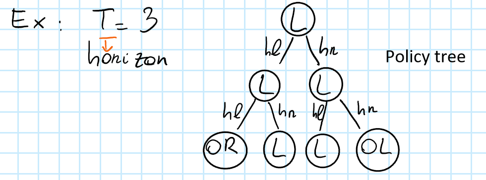
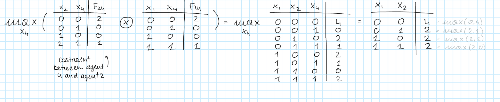
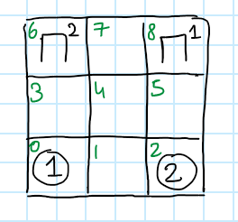
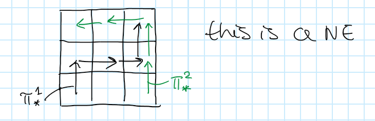
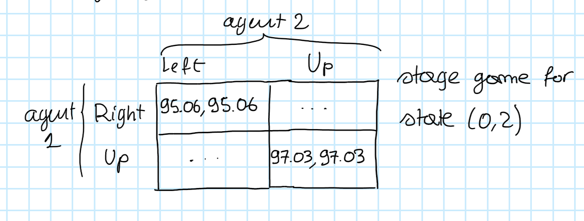

# Autonomous Agents and Multiagent Systems

*A series of notes on the course AAaMS as taught in Politecnico di Milano by Francesco Amigoni and someone else*

[TOC]

# Introduction - 17/09

***Exam mode:*** 4 questions with exercises and theory. 1 hour and a half.

### Definitions

- ***Agent***  
  Anything able to interact with the environment.  
  *Book's Definition*:  
  Systems that can decide for themselves what they need to do in order to satisfy their design objectives.

- ***Interaction***  
  Action made by the agent perceived through sensors.  
  Actions are made through interactors (wheels, arms)

- ***Agent as a software agent***  
  A program interacting in a virtual environment .  
  *Sensors* can be 

  - reading files
  - streaming of data

  *Actions* can be writing

  - writing a file
  - say something to the user
  - deleting something
  - sending some data

- ***Rational Agent***   
  An agent that is able to make the right decision based on what he knows.  He is able to optimize some performance measure.    

In developing a single agent we can have several developing solutions:

A typical way to implement an agent is to make him able to plan $\to$ Reinforcement Learning.  
Single agents area able to maximize some utility function. 

### Autonomy

***Book's definition***: 
"Agents that must operate robustly in rapidly changing, unpredictable, or open environments, where there is a significant possibility that actions can fail are known as intelligent agents, or sometimes autonomous agents"  

***Lecture's notes***

Autonomy is an indicator of how strict the program is imposing what the agent has to do.   
If I'm a designer I can preprogramme everything.   
In this case the agent is not autonomous.  

If I want him to be more autonomous I can provide him 3 things: 

- some *image processing* program
- some *decision making program* $\to$ in such a way that the agent is told by the decision making program what to do:  
  The decision of what the agent should do is now embedded in my program.  
- a program on top of them that has some *learning mechanisms* and can modify some parameters of the decision making program.

Autonomy is not a yes or no, it’s a question of degree.   
We can say if something is more autonomous than another thing, but there is not a threshold.  

The more autonomous the agent is, the less there is direct human supervision. There is no possibility to be completely out of human control. 

### Intelligent Agents

When do we consider an agent to be intelligent?   
For the purposes of this course, an intelligent agent is one that is capable of *flexible* autonomous action in order to meet its design objectives, where ==flexibility== means three things:

- ***Reactivity***  
  intelligent agents are able to perceive their environment, and respond in a *timely fashion* to changes that occur in it in order to satisfy their design objectives.
- ***Pro-Activeness***  
  Intelligent agents are able to exhibit goal-directed behavior by *taking the initiative* in order to satisfy their design objectives.  
  We don’t want the human to remember continuously to the agent what was its purpose. 
- ***Social Ability***  
  Intelligent agents are capable of interacting with other agents (and possibly humans) in order to satisfy their design objectives.

  
We assume that agents can exchange some kind of information, independently from the technology used to exchange those information.

***Kinds of Interaction***

- ***Negotiation***  
  several agents coming up with an agreement on a variable
- ***Voting***  
  agents are able to elect *one agent* to do something
- ***Solution of an optimization problem***  
  the knowledge of the function is distributed over agents, there is no agent that knows it all.
- ***Planning***
- ***Learning***  
  learn somehow also what others are doing in such a way to perform well accordingly to such knowledge.

***Let's wrap it up - Multiagent case***

So we see that we are dealing with two different problems 

- <u>Micro Problem</u>   
  you focus on a single agent
- <u>Macro Problem</u>  
  the multi agent system

In the same way you are designing the single agent environment you can design the interaction between the agents.   
When you design the interaction, you are designing the organization of the agents (the organization can be seen as an entity).   
Example:   
individuals and the structure of the company $\to$ the structure has some properties itself.

<u>Designing the organization of multi agent system is what we care about.</u> 

Agents are often run on different machines. 

When using multi agent systems:

- Physical separation among agents. There is no global goal for the system.
- You logically distinguish different agents: the application doesn’t require to have multiple agents but for some reason you find it convenient to have multiple agents.     

# Agent's building approaches - 20/09

The behavior of an agent can be summarized in a cycle:
$$
\text{Perception} \to \text{Decision} \to \text{Action}
$$
 The classical way to build a single agent has been for many years the following: 

- build a ***Reasoning Agent*** (**deliberative** agent):   
  - you represent some knowledge the agent has and implement some reasoning process over this knowledge.   
  - you have a knowledge base and then the agent is able to react on this knowledge and find some actions that can perform in the     environment $\to$ symbolic reasoning $\to$ **PLANNING**
  - Main problem of this kind of agents: from the computational point of view they are heavy.

 As a reaction to this approach there was a new proposal: 

- build **Reactive agents**:   
  Intelligent behavior as a sort of emerging property with the interactions between a system and its environment.   
  No embedding of knowledge, intelligence.   
  The intelligence of the system will emerge while interacting with the environment.   
  $\to$ elephants don’t play chess. Intelligence does not coincide with abstract reasoning. 
  Till that point intelligence was meant to abstract reasoning. 

- - <u>Subsumption architecture</u>      
    It is a collection of behaviors where each behavior is telling the system      what to do. The idea is that you have multiple of these behaviors in      the same system and they are competing to make the agent do something.       
    You can attach priorities, meta behaviors, etc.  
    Each single behavior is really simple. Global behavior can be called intelligent.   
    Each behavior is a finite state machine. 
  - Main problem of this approach: difficult to predict the interaction among several behaviors. 

Other approaches:

- ***Markov Decision Processes***   
  Explained later.
- ***BDI architecture*** (Belief Desire Intention)   
  Approach that is an evolution of the classical reasoning approaches.   
  In the memory of the agent there are 3 types of knowledge:
  - <u>Believe</u>   
    what you know about the world 
  - <u>Desire</u>   
    goal (long term concept) 
  - <u>Intention</u>   
    what you plan to do next (short term concept).  
    For satisfying one goal you have a limited number of intentions to reach it. 

- ***Layered architectures***  
  Popular architecture.  
  We create an agent that includes part of every architecture already mentioned.    
    
  In the image above there are 3 layers, each Layer proposes an action.  
      
  It tries to keep together all the advantages of the architectures mentioned before.   
  The <u>bottom layer</u> is a *reactive* layer, going up you find more *reasoning* layers.   
  The perceptions from the sensors are received from the bottom layer.  
  if the bottom layer can just implement something like a direct command to the effectors (for example in emergency cases), it is useful when no reasoning is needed.

  If it’s not an emergency, the perception can go up to other layers. 

  ==This is the typical approach for satellites==. 

### Markov Decision Processes, an introduction

It is a formalism that is defined by 4 elements:

- Set of states $S$
- Set of actions $A$
- Transition function: $p(s'|s,a)$
- Reward function: $r(s,a)$

The set of states can be seen as the set of perceptions.

The agent has some knowledge about how the environment is working. Such knowledge is embedded in the transition function. 

The ***transition function*** has $2$ states $s',s$ and one action $a$ $\to$ it returns the probability of ending up in $s'$ starting from s and performing $a$.

When the agent is in state $s$, he decides which action to perform. After the decision is made, what will happen to the environment is not deterministic. The only thing the agent knows is the probability distribution.
$$
\sum_{s' \in S}p(s'|s,a)=1  \ \ \ \ \forall s \in S , \forall a \in A
$$
***Reward function***: given a state $s$ and an action $a$ that the agent performs in that state, it returns a real number that is the gain the agent gets by doing so.

***Example***

$$
p(s_2|s_1,a_1)=0.8
\\
p(s_1|s_1,a_1)=0.2
\\
p(s_3|s_1,a_1)=0 \ \ \ 
\\
\text{deterministic action}:p(s_2|s_3,a_4)=1
$$
***comment on the concept of state***

It is easy to think about the state of the environment as physical locations in the environment, but actually this is an abuse of language, because a state is not the physical location.   
The state could be how long has the agent travelled, or how much battery remained to the agent. 

***Markovian Property***

The next state depends only on the current state, not on the previous ones $\to$ the past is embedded in the current state.

***Policy***

 it’s a function that given a state, returns an action. 
$$
\pi : S \to A
$$
==The decision process is embedded in the policy==.

If you know the policy of an agent, it does not mean that you know the sequence of states that the agent will go through, because what happens to the environment is non deterministic.

 We need to find the optimal policy $\to$

It should maximize the sum of the rewards I will get.

Suppose we have $s, s’, s’’$

and consequently $r(s,a)+r(s’,a’)+r(s’’,a’’)+…$

Idea of looking to the future.

Problem:   
in principle you are summing up an infinite number of rewards, so it doesn’t matter which policy you choose because you will always get to infinite. 

**Discount factor**: 0<λ<1  (sometimes $\gamma$ is used instead)

You are counting less and less in the reward you'll receive in the future;   
You are more interested in close rewards than in far ones. 

Suppose we have
$$
r(s,a)+ λ^1  r(s’,a’)+ λ^2  r(s’’,a’’)+…
$$
This trick makes the sum not infinite. 

If  $λ=0$ $\to$ I just look at what happens now $\to$ shortsighted.

If $λ=1$ $\to$ you wait for the future $\to$ farsighted.

We want $\lambda$ such that: 

$≠0$ because $λ^0= 0^0$ is a problem

$≠1$ you sum to infinite

$=1$ use only in case in which you are sure that the agent cannot run forever $\to$ if there is a sink state. 

So we want a policy that maximizes $r(s,a)+ λ^1 * r(s’, a’) + λ^2 * r(s’’,a’’)+…$

# Markov Decision Process - 24/09

We have already introduced them in the previous lecture, so check it out if you haven't.

***Little Recap***

a *Markov Decision Process* is defined by the followings:

- $S$, a set of states
- $A$, a set of actions
- $P(s',s,a)$, a transition function
- $R(s,a)$, a reward function
- $\gamma$, a discount factor within $0$ and $1$
- $\pi:S\to A$, a policy

***Agent's behavior***   
Considering future in deciding next steps, an agent has to look forward to future reward, not only to immediate reward. example: from $s_3 \to a_3$ better than $s_3 \to a_4$

If we had an *oracle* providing us a sequence of states $s,s',s''$ the agent would maximize $r(s,a)+ λ^1  r(s’,a’)+ λ^2  r(s’’,a’’)$, but we don't know the actual sequence of states so we introduce the *value function*.

### Value Function $V^\pi(s)$

$V$ is a function that, given a state $s$ and a policy $\pi$, will return the estimated total discounted reward for being in states $s$ and following policy $\pi$.

Now look at the image above (the so-called figure 1):

$V^d(s_1)<v^d(s_4)$: for an intuitive point of view, being in state $s_4$ is better than being in state $s_1$.

$V^{d_1}(s_3)<v^{d_2}(s_3)$ if  $d_1:s_3 \to a_4$  and  $d_2:s_3 \to a_3$

***Optimal Policy*** $d^*$

let's call it $\pi^*$, I prefer it.

It is the policy that maximizes the expected total reward.

The value function obtained through $\pi^*$ is referred to as $V^*$.

***Bellman Expectation Equation***
$$
V^\pi(s)= \sum_{a \in A}\pi(a|s)\bigg[R(s,\pi(s))+\lambda\sum_{s' \in S}P\big(s'|s,\pi(s)\big)V^\pi(s')\bigg]
$$
***Bellman Optimality Equation***
$$
V^*(s)=\max_{a\in A}\bigg\{R(s,a)+\lambda\sum_{s' \in S}P(s'|s,a)V^*(s')\bigg\}
$$

- can be computed only if you know $V^*(s') \to$ recursion
- except for the value of $V^*$ everything is known
- $\lambda$ is the discount factor
- composed of 2 parts
  - $R(s,a)$ is the immediate reward
  - the expected value of $V^*$ in the next state.
- summarizing:   
  the value of the current state is the immediate reward $+$ any future reward.  
  we want to maximize this value so we look for the best next action to perform.

***Example***

Let's look back to figure $1$, I'll copy here for visualization purposes:

$$
V^*(s_1)=\max_{(a_1,a_2)}
\begin{bmatrix}
0+\lambda \bigg(0.2V^*(s_1)+0.8V^*(s_2)\bigg)
\\
0+\lambda \bigg(0.2V^*(s_1)+0.8V^*(s_4)\bigg)
\end{bmatrix}
$$
Problem: I'm looking for something that is in my equation.

- solution 1:   
  write all equations, $n$ equations $\to$ $n$ unknowns.  
  It's not linear to solve though, because there is the $\max$ operator.  
  We can use this solution for little problems. 
  1. some assumptions are needed to go to a linear system
  2. solve it
  3. check if the assumptions hold
     1. yes $\to$ done
     2. no $\to$ back to step 1
- solution 2:  We need to solve $V^*(s)$ in order to find the optimal policy

$$
\pi^*(s)=\underset{a\in A}{\text{argmax}}\bigg[R(s,a)+\lambda \sum_{s' \in S}P(s'|s,a)V^*(s')\bigg]
$$
​		==so if we have $V^*$ we have $\pi^*$!=

The second solution is explained in detail here:

### Value Iteration

Iteratively find a better value function until convergence.

$(S,A,P,R,\lambda)$ returns $\hat{V}^*$m that is an approximation of $V^*$

***Algorithm***

_____________________________________________________________________________________________________________________________________________________________________________________________________________________________________

$\text{initialize }\hat{V}^*$

$\text{repeat}$

​			$V \leftarrow \hat{V}^*$

​			$\text{for each $s \in S$ do}$

​						$\hat{V}^*(s) \leftarrow \max_{a \in A}\big[R(s,a)+\lambda\sum_{s'\in S}P(s'|s,a)V(s')\big]$

​			$\text{end for}$

$\text{until }\max_{s \in S}|V(s)-\hat{V}^*(s)|< \varepsilon$

_____________________________________________________________________________________________________________________________________________________________________________________________________________________________________

Here I'm not looking for something that is in my equation, I have an estimate of $V$!

***Properties***

- always converges
- the approximated value will have, between some bounds, the optimal values

***Example***

As always, let's consider figure 1:

and consider $\lambda = 0.5$.

Let's initialize $\hat{V}$.   
we can put them all to $0$ or initialize them randomly. let's go with the first possibility.

|             | $s_1$ | $s_2$ | $s_3$ | $s_4$ |
| ----------- | ----- | ----- | ----- | ----- |
| $\hat{V}^*$ | $0$   | $0$   | $0$   | $0$   |
| $V$         | $0$   | $0$   | $0$   | $0$   |

*Iteration 1:*  
$$
\hat{V}^*(s_1)\leftarrow \max_{(a_1,a_2)}
\begin{bmatrix}
0+0.5 \bigg(0.2\cdot 0+0.8\cdot 0\bigg)
\\
0+0.5 \bigg(0.2\cdot 0+0.8\cdot 0\bigg)
\end{bmatrix}=0
$$
similarly
$$
\hat{V}^*(s_2)\leftarrow \dots =0
$$

$$
\hat{V}^*(s_4)\leftarrow \dots = 0
$$

$$
\hat{V}^*(s_3)\leftarrow \max_{(a_3,a_4)}
\begin{bmatrix}
1+0.5 \bigg(1\cdot 0\bigg)
\\
1+0.5 \bigg(1\cdot 0\bigg)
\end{bmatrix}=1
$$
*Considering* $\varepsilon=0.1$, we have not yet reached convergence, because $1>0.1$.

*Let's update our table*

|             | $s_1$ | $s_2$ | $s_3$          | $s_4$ |
| ----------- | ----- | ----- | -------------- | ----- |
| $\hat{V}^*$ | $0$   | $0$   | $\color{red}1$ | $0$   |
| $V$         | $0$   | $0$   | $0$            | $0$   |

*Iteration 2:*
$$
\hat{V}^*(s_1) \leftarrow \dots = 0
$$

$$
\hat{V}^*(s_2)=\max_{a_2,a_3}
\begin{bmatrix}
0+0.5 \bigg(0.8\cdot 1+0.2 \cdot 0\bigg)
\\
0+0.5 \bigg(0.8\cdot 0+ 0.2 \cdot 0\bigg)
\end{bmatrix}=0.4
$$

$$
\hat{V}^*(s_3)=\max_{a_3,a_4}
\begin{bmatrix}
1+0.5 \bigg(1\cdot 0\bigg)
\\
1+0.5 \bigg(1\cdot 0\bigg)
\end{bmatrix}=1 \text{ (no need to update)}
$$

$$
\hat{V}^*(s_4)\leftarrow \dots =0.45
$$

|             | $s_1$ | $s_2$            | $s_3$            | $s_4$             |
| ----------- | ----- | ---------------- | ---------------- | ----------------- |
| $\hat{V}^*$ | $0$   | $\color{red}0.4$ | $1$              | $\color{red}0.45$ |
| $V$         | $0$   | $0$              | $\color{green}1$ | $0$               |

we have not yet reached convergence, because, if you compute the left term of the inequality we'll obtain  $0.45>0.1$.

So you should continue with the third iteration.

***Complexity of Value Iteration***

It is quadratic in the number of states $\cdot$ number ofactions.

***Comparison between STRIPS and MDP***

- STRIPS  
  - deterministic transition
  - more expensive representation of the states with respect to MDP
- MDP
  - it assumes probabilistic transition (more general)
  - a state is an atomic element (only the designer knows at what real world state corresponds state $ s_i$)

# Game Theory - 01/10

We start from an assumption: agents/players are rational $\to $ every player has a utility function/objective function and will correctly maximize it. 

***Types of Games***

- <u>Non cooperative game theory</u>       
  every player has a utility and maximizes the utility with a mechanism(rules)
- <u>Cooperative game theory</u>  
  I give you the rules and the players;   
  I ask you which are the best strategies the players can have;   
  Players try to find an agreement based on some axiomatic approach; 
- <u>Mechanism design</u>  
  You are required to design the rules of the game; auction. 
- <u>Social choice theory</u>  
  Voting.

 ***Non Cooperative Games***

They can be represented with:

-  a sequential structure (game tree)   

or 

- a normal form: the game tree structure is discarded

***Normal form games***

$(N, A, U)$

- $N$  
  set of players. for example $N=\{1,2,3,…,n\}$
- $A$   
  set of actions of players. for example $A=\{A_1, A_2, A_3,…,A_n\}$ ==where $A_1= \text{set of actions of player } 1$==.
- $U$   
  collection $U=\{U_1, U_2, …, U_n\}$ where $U_1= \text{utility function of player $1$}$.  
  A Utility Function is a function defined as  $U1: A_1\times A_2\times \dots \times A_n \to \R$

 ***Action Profile***

$a=(a_1, a_2,…,a_m)$ denotes the set of  actions for a particular player (I suppose!).

The maximization of its utility is the goal of the player. 

___________________________________________________________________________________

Exercise session on Game Theory, on OneNote.

# Nash Equilibrium - 04/10

***Subgame***

A **subgame** is any part (a subset) of a game that meets the following criteria:

1. It has a single initial node that is the only member of that node's information set.
2. If a node is contained in the subgame then so are all of its successors.
3. If a node in a particular information set is in the subgame then all members of that information set belong to the subgame.

Think of them as subtrees.  
Each subtree can be seen as a smaller game self contained.

Something useful we can do with subgames:

***Sub Perfect Equilibrium***

It's a strategy profile that is in equilibrium in any subgame.

_________

Exercise session on Nash Equilibrium, on OneNote.

# Negotiation Part 1 - 08/10

### Negotiation

Each agent has interests that conflict with the interests of other agents (conflicting interests).

- <u>Agents</u>  
  we assume we have only 2 agents but what we say can be generalized to $n$ agents.  
  Let's call the agents $a$ and $b$.

- <u>Issues</u>  
  the variables over which the negotiation takes place.  
  There can be several issues (price, insurance, modalities in which you pay for example for buying a car ).  
  We will treat negotiations over single issues.

- <u>Outcomes</u>  
  Results of your negotiation process.    
  $$
  \Theta
  $$
  

We need to define the conflicting measures:

- <u>Utility Function</u>  
  function whose domain is the set of outcomes and whose codomain is the set of real numbers.  
  given an outcome, the value of that outcome is different for agent $a$ and agent $b$.  
  $$
  U^i:\Theta \to \R
  $$

- <u>Protocol</u>  
  set of rules of the game.   
  The way the negotiation must be conducted cannot be violated in general (example: if you are the seller, your offer should decrease, if you are the buyers, your offer should increase).  

- <u>Strategies</u>  
  policies the single agents will adopt for conducting the negotiation.  
  within the protocol, the agent decides what to do (example: the seller decides to offer 5 less every time, the buyer to offer 10 more every time).  
  the strategies are decided by the agents.

***Cooperative Approach (Axiomatic Approach)***

The negotiation does not actually take place, you know everything about the agents, you impose some properties over the final result you would like to reach.   
You can calculate a priori what is the final result. If $a$ knows a set of properties , then I can come up with a solution analytically.   
The properties that you are imposing on the solution are like axioms. 

We will focus on the approach just described.

***Non Cooperative Approach (Algorithmic Approach)***

You run the negotiation process, you exchange offers and counteroffers until you reach some agreement. Every agent can actually do what they want, there is no agreement over the agents. 

### Cooperative/Axiomatic Approach

This approach has this structure:

1. We list a number of properties/characteristics that our solution must have
2. We come up with a solution that respects these properties

We assume that the 2 agents are perfectly rational: they prefer outcomes according to their utility function.

We assume that the set of outcomes is partitioned in:

- $A:$ set of possible ***agreements*** (all the legal prices for example).
- $D:$ the ***disagreement***, it is a single element. It is like a special outcome that says that no agreement was found (a special price that says that no agreement was found).

$$
\Theta =A \cup D
$$

- $S= $ ***Bargaining Set***$:$ set of pairs of utilities $S=\{(U^a(z),U^b(z))|z \in A\}$ 

- $d:$ set of pairs of utilities of the agents when the disagreement will happen.  
  $$
  d=(d^a,d^b)=(U^a(D),U^b(D))
  $$

***Bargaining Problem***

A Bargaining problem is defined as the pair $(S,d)$.

the solution to such problem is defined as the result of a function $f$ defined as follows:

given a Bargaining problem $f$ returns *one* element in $S$.
$$
\text{Bargaining Solution}=f:\color{red}(S,d)\color{black}\to\color{orange}(U^a(z),U^b(z)) \in S
$$
$\color{red}Domain\color{black};\color{orange}Codomain$.

A negotiation can be viewed as a search in the space of the pairs of utilities   
connected to the agreement.     
$f$ just picks up one possibility in the bargaining set. the output of $f$ is the ***bargaining solution***.

***Assumptions on the Bargaining Set $S$***

We assume that $S$ is *closed* and *convex*. 

- <u>Convex</u>  
  if we take 2 elements belonging to $S$, their linear combination is still in $S$.  
  $$
  x=(x^a,x^b); \ \ \ \  y=(y^a,y^b) \ \ \ \ \ \ \ \ \ \ \ \ x,y \in S
  $$

  $$
  \theta x+(1-\theta)y \in S \ \ \ \ \ \ \ \ \ \ \ \theta \in [0,1]
  $$

We also assume that there is always an agreement for both agents that will be at least as good as the disagreement $\to$ players will always prefer the agreements with respect to the disagreements $\to$ it is not possible that the disagreement is the best possible result.
$$
S \cap\{(x^a,x^b)|x^a\ge d^a \and x^b \ge d^b\}\ne \empty
$$
(Assuming this we can avoid assuming that $S$ contains the disagreement).

#### Properties we want the Bargain Solution to satisfy

Now we can start to discuss the theory that will bring us to the final result of the axiomatic approach.  
We will list a number of properties we would like the bargaining solution to satisfy.  
At the end we will discover that, if we want our bargain solution to satisfy all these properties, then the bargaining solution will have a certain form.  
First we need to introduce Pareto Efficiency, then I'll list all the properties.

***Pareto Efficiency***

*Pareto efficiency or Pareto optimality is a state of allocation of resources from which it is impossible to reallocate so as to make any one individual or preference criterion better off without making at least one individual or preference criterion worse off*.

if you are maximizing a single objective function, among the outputs $5$ and $7$ you choose $7$.  
Now assume you are maximizing $2$ objective functions:

$(5,7),(8,9),(6,4)$. if we have to compare the first and the third, which one is best?  
You cannot compare them:   
If we consider the first pair and the third pair we notice that $6$ is better than $5$ but $4$ is not better than $7$.  
Surely I can say that the second pair of utilities is better than the first and the third one.  
So we say that $(8,9)$ dominates both first and third pairs.    
Moreover, we notice 2 possibilities:

- One dominates the others
- No comparison is possible:  
  You cannot have a total ordering over the elements because some elements cannot be ordered.

  

The bargaining solution $S=(x^a,x^b)$ is such that:
$$
f(S,d):\nexists(y^a,y^b)\in S| (y^a,y^b)\ge(x^a,x^b) \text{ and }y^i>x^i \text{ for some agent $i$}
$$
Meaning: *It makes no sense to select an outcome that is dominated by another one*.

***Properties***

1. <u>Individual Rationality</u>  
   $$
   \color{red}f\color{orange}(S,d)\color{black}\ge d
   $$
   $\color{red}\text{Bargaining Solution}\color{black};	\color{orange}\text{Bargaining Problem}$.  
   I will accept nothing that gives me less than the disagreement.

2. <u>Symmetry</u>     
   The outcome should not change if the utilities are the same but I swap the names of the agents.   

3. <u>Efficiency</u>  
   The bargaining solution returned by the function $f$ must be *Pareto Efficient*.  
   
4. <u>Invariance</u>  
   The solution that is returned by $f$ should not change if the utilities are linear changes.  
   if I multiply all the utilities by $\alpha$, then the final pair of utilities that is selected as the bargaining solution will be multiplied by $\alpha$ $\to$ it scales but does not change.

5. <u>Independence of irrelevant alternatives</u>  
   $\text{for any  } S' \subseteq S \ \ \ \ \  \text{    such that}\ \ \ \ \ f(S,d) \in S' \ \ \ \ \ \ \text{then } \ \ \   \ \ f(S,d)=f(S',D) $        

    

   My result does not depend on what I left out.

The final result is the ==Nash Bargaining Solution==:   
If you would like to find a bargaining solution $f$ that satisfies all these $5$ properties you have only 1 possibility: Your bargaining solution must be:
$$
f(S,d)=\underset{x=(x^a,x^b) \in S \text{ and } x\ge d}{\text{argmax}}(x^a-d^a)(x^b-d^b)
$$

$$
\text{with }d=(d^a,d^b) \ 
$$

Such solution is unique.  
In this case you don't have to negotiate.  
If you are in a set in which you know everything and you want a solution that satisfies all these properties, you don't need to run a negotiation: just compute the solution.  
This is what we mean with Axiomatic $\to$ no need to run the iterative process, just apply the formula!

# Negotiation Part 2 - 11/10

***Protocols***

We will now focus on the agreement found by the agents, not on the policy.

We'll define a protocol, see how the agents behave in it, and then study the possible outcomes that will be reached by the agents.

Let's start with the first protocol:

### Rubinstein's Alternating Offer Protocol

I make an offer, the other agent makes a counter offer, I make a new offer, and so on, until we find some agreement.

We assume that we have 2 agents, $a,b$.

We assume there is one issue over which the agents are negotiating. It can be thought as an object that can be divided by the 2 agents.   
Let's think of a cake. It can be divided by the 2 agents. We'll call $x^a$ the piece of cake that goes to the agent $a$.   
$x^b$ is the part of the cake that goes to $b$.

we assume that $x^a+x^b=1$ (it forms the complete cake).

The set of outcomes is trivially the set of all the pairs $(x^a,x^b)$ such that $x^a+x^b=1$.

in math: $O={(x^a,x^b)|x^a+x^b=1}$ where $O$ stands for the set of possible outcomes.

We assume that time is evolving in discrete period: $t=1,2,...$.

We assume that players play in turn, with player $a$ playing first:  
==So agent $a$ makes offers in odd timestamps, while $b$ makes offers in even timestamps==. This is the core of "Alternating" Offer protocol.

the ones above are all and only the assumptions that the agents must have.

Let's talk about the utility of $a$: it depends on how big its part of the cake is and on the timestamp in which the offer is agreed.
$$
U^a(x^a,t)=x^a\cdot \delta_a^{t-1}
$$
where $\delta_a$ is the discount factor and $0\le \delta_a \le 1$

$\delta=1 \to$ the agent is very patient.

$\delta=0 \to$ the agent must accept the first offer otherwise it gets zero.

and obviously:
$$
U^b(x^b,t)=x^b\cdot \delta_b^{t-1}
$$
Rubinstein shows that it is possible to compute a ==subgame perfect equilibrium==:
$$
x^a=\frac{1-\delta_b}{1-\delta_a\delta_b}
$$

$$
x^b=\frac{\delta_b- \delta_{a}\delta_b}{1-\delta_a\delta_b}
$$

It means that the agent will not find convenient to deviate from these values.

we notice that if 
$$
\delta_a=0;\delta_b=1 \to x_a=0; \ x_b=1
$$

$$
\delta_a=1;\delta_b=0 \to x_a=1; \ x_b=0
$$

$$
\delta_a=0.5;\delta_b=0.5 \to x_a=\frac{2}{3}; \ x_b=\frac{1}{3}
$$

in the last case, the agent $a$ gets more cake because it started first.

The cases above have been computed considering that the negotiation can go on forever, but what happens if we have a deadline $t=n$ ? ($n$ is the last timestamp in which an offer can be done).

Let's suppose even that $\delta_a=\delta_b=\delta$

$n=1 \to$ agent $b$ will just accept, can't do anything else. So agent $a$ will propose $offer(1,0)$  
more precisely:
$$
\text{STRAT-A}(1)=\text{OFFER}(1,0)
\\
\text{STRAT-B}(1)=ACCEPT
$$
$n=2$  
We have 2 rounds, if you are agent $a$ what do you do? 

*non rational move*:

1. if $a$ offers $(1,0)$ $\to b $ rejects 
2. $b$ offers $(0,1)$ $\to a$ has to accept

so $a$ should not offer $(1,0)$ at the first round.

the last round is in power of agent $b$. 

So, if we consider the non rational move we would have $U^a(x^a,t)=U^a(0,2)=0$ and $U^b(1,2)=\delta$ . 

*rational move*:    
agent $a$ offers to $b$ a fraction equal to $\delta$, this way he would not makes sense for him to refuse. the game ends in time step $1$, without waiting for time step $2$.
$$
\text{STRAT-A}(1)=\text{OFFER}(1-\delta,\delta)\\
\text{STRAT-B}(1)=\text{ACCEPT}
$$
  which translates into:
$$
U^a(1-\delta,1)=1-\delta
\\
U^b(\delta,1)=\delta
$$
let's revise again what we have just written:  
The agent $a$ prefers to offer to $b$ $\delta$ part of the cake because the utility of $b$ can't be more than $\delta$ (in fact $U^b(1,2)=\delta$), because this way $a$ gets at least $1-\delta$ as utility, so it's a win win.

let's generalize:

deadline $n$:   
$\delta_a=\delta_b=\delta$

With "$a$'s turn" we mean that $n$ is odd.  
With "$b$'s turn" we mean that $n$ is even.  
$$
\text{STRAT-A}(n)=
\begin{cases}
\text{if a's turn: OFFER(1,0) }
\\
\text{if b's turn: ACCEPT}
\end{cases}
$$

$$
U^a(n)=
\begin{cases}
\text{if a's turn: }
\delta^{n-1}

\\
\text{if b's turn: }
0 \ \ \ \ \  \ 

\end{cases}
$$

$t<n$
$$
\text{STRAT-A}(t)=
\begin{cases}
\text{if a's turn: OFFER}(1-\delta x^b(t+1),\delta x^b(t+1))
\\
\text{if b's turn:} \text{ if } U^a(x^a,t)\ge UA(t+1) \text{ then ACCEPT else REJECT}
\end{cases}
$$

### Monotonic Concession Protocol

- agents $a,b$ ;  
- utilities $U^a,U^b$
- $O$
- simultaneous offer protocol
- $t=1,2,... $

From the point of view of agent $a$:

$\text{1. } x^{(a)}\leftarrow \arg\max_{x \in O}{U^a}(x)$  

$\text{2. propose }x^{(a)}$

$\text{3. receive }x^{(b)}$

$\text{4. if }U^a(x^{(b)})\ge U^a(x^{(a)}) \text{ then ACCEPT } x^{(b)} \text{ and RETURN}
\\
 \ \ \ \ \ \ \ \ \ \ \ \ \ \ \ \ \ \ \ \ \ \ \ \ \ \ \ \ \ \ \ \ \ \ \ \ \ \ \ \ \ \  \  \text{else }x^{(a)}\leftarrow x \in O \text{ such that }U^{b}(x)\ge U^b(x^{(a)}) \text{ and }U^a(x)\ge0
\\$

$\text{5. goto 2}$

This algorithm can be applied only when you know the utility of the other agent, which does not happen very often in the real world...

Moreover, the convergence of this algorithm can be very long. 

Another problem:  It can happen that, at the same time step, agent $a$ accepts the offer of agent $b$, and $b$ accepts the offer of $a$,  but they are not the same! we have two different agreements: we need to introduce some tie-breaking to decide the agreement. we can pickup just one at random, or we can find the middle point of the offer and come up with a single agreement.

There is a variant of this protocol that is called the Zeuthen Strategy.

### Zeuthen Strategy

This is the point of view of $a$

$\text{1. } x^{(a)}\leftarrow \arg\max_{x \in O}{U^a}(x)$  

$\text{2. propose }x^{(a)}$

$\text{3. receive }x^{(b)}$

$\text{4. if }U^a(x^{(b)})\ge U^a(x^{(a)}) \text{ then ACCEPT } x^{(b)} \text{ and RETURN}
\\$

$\text{5. }\text{risk}_a \leftarrow \frac{U^a(x^{(a)})-U^a(x^{(b)})}{U^a(x^{(a)})}; \text{risk}_b \leftarrow \frac{U^b(x^{(b)})-U^b(x^{(a)})}{U^b(x^{(b)})}$ 

$\text{6. if } \text{risk}_a <\text{risk}_b \text{ then } x^{(a)}\leftarrow x \in O \text{ such that }\text{risk}_a>\text{risk}_b$

$\text{7. goto 2}$

The idea is that you have a high risk when you are close to the situation in which your utility is very small, when you are close to the no-agreement. The agent that has the smallest risk will make the next offer.  
Property: ==the final agreement found via this algorithm is a pareto optimal agreement==, which means that there is no another agreement that is not worse for one agent and strictly better for the other one.

==it finds an agreements which is a Nash BARGAINING solution==. It is an agreement that maximizes the product of the two utilities.

# Computational Social Choice - 18/10

Applications:

- Aggregation of preferences.
- Formation of coalitions.
- Sometimes you have multiple robots that have to keep a formation, for example military patterns.  
  It is based on the fact that there is a leader that is moving and all the other robots are keeping a fixed distance and angle from him. They should also avoid to collide with each other.  
  What happens if the leader fails? In this case there is a kind of voting for choosing the new leader, and this is the social choice.

Let's start from the model that we will adopt for studying computational social choice.

we'll have:

- a number of ***agents*** $N=\{1,2...,n\}$
- a set of **alternatives**, also called **candidates** (in the case of political elections for example)  $U$. we assume $|U|\ge2$.
- ***preferences***, denoted by the symbol ==*preference relation*== $>_{\sim i}$ (it is an ordering over the alternatives).  
  for it being a proper ordering we need to constrain such relations in the following way. we need to say that such relations are 
  - complete: $\forall a,b \in U: a >_{\sim i } b \text{ or } b >_{\sim i}a  $  (the or is not generally exclusive)
  - transitive: $\forall a,b,c \in U: \text{if } a >_{\sim i } b \text{ and } b>_{\sim i }c \text{ then }  a >_{\sim i } c$  

Observations: agents and candidates could be disjoint or not depending on the case. In political elections, agents are people and politicians, while candidates are politicians.

Now let's introduce some symbols:

- ***preference profile*** $R=(>_{\sim 1 },>_{\sim 2 },>_{\sim n })$ (it is an array of preferences, one for each agent).  
  a preference can be structured as a pair of agents, candidate. So a preference profile can be represented as a list of pairs.
- a ***set*** of all possible ***preference relations over $U$*** :   $\scr{R}$$(U)$   
  $>_{\sim i}$ $\in$ $\scr{R}$$(U)$

Mathematicians game:  
We are at a party in which people can drink only one beverage.  
6 mathematicians want to drink, in preference order, milk,wine,beer.  
5 mathematicians want to drink, in preference order, beer,wine,milk.  
4 mathematicians want to drink, in preference order, wine, beer,milk.  
So:

- we have 15 agents: $n=15$.  
- we have 3 alternatives: $|U|=3$
- for the mathematician number $1$, who belongs to the 6 mathematicians cited first, we'll have   
  $\text{milk}$$>_{\sim 1}$ $\text{wine}$ $>_{\sim 1}$$\text{beer}$.  and so on for all the mathematicians.

It is not easy to aggregate together different preference relations with a global choice that is satisfactory for all people. It depends even on the mechanism of voting.

### Social Welfare Function

It is a function that given a preference profile returns a preference relation.

$f: \scr R$$(U)^n \to \scr R$$(U)$ 

$f(R) \ = \ >_\sim$

This is what the function should do, there are different ways to implement it.

We want this function to have the following properties

- <u>Pareto Optimality</u>  
  Informal definition: assume that every agent thinks that candidate $a$ is better than $b$. then it is reasonable to assume that $a$ will be better than $b$ even in the global relation.  
  Formal definition:   
  $\text{if  }\  \forall i \ \ a >_i b  \ \text{ then }a >b$  
  the one above has been written assuming the following: $a>_{\sim i}b \text{ but not }b >_{\sim i} a$, which is not the general case.  
  the consequence assumes instead that: $a>_\sim b \text{ but not } b >_\sim a$.  
  I had to write the formal definition this way because the actual formal definition would be too complex to be written, so Amigoni preferred specifying the assumptions afterwards.

- <u>Independence of irrelevant alternatives (IIA)</u>    
  imagine this starting situation
  $$
  f \begin{cases}
  \color{red}...\color{black}>_{\sim 1}a>_{\sim 1}\color{yellow}...\color{black}>_{\sim 1}b>_{\sim 1}...
  \\
  ...>_{\sim 2}a>_{\sim 2}...>_{\sim 2}b>_{\sim 2}...
  \\
  ...>_{\sim 3}a>_{\sim 3}...>_{\sim 3}b>_{\sim 3}...
  
  \end{cases} 
   \ \ \ \ \ \ \ \ \ \ \ \ \Bigg\}\to ...>_{\sim }a>_{\sim }...>_{\sim }b>_{\sim }...
  $$
  In a nutshell we want to say that if you swap the red and yellow elements, and, as we can see, $a$ and $b$ have the same ordering over all the agents, and in case $a$ and $b$ have anyways the same order in the global relation, we can say that our formulation has IIA.

  In case of IIA the ordering of $a$ and $b$ in the global relation does not dependent on how it is called the yellow element.  
  Formally:  
  $\text{if } R|\{a,b\}=R'|\{a,b\} \text{ then } >_\sim|\{a,b\}=>_\sim '|\{a,b\} \text{ where }f(R)=>_\sim \text{ and } f(R')=>_\sim ' $

- <u>Non-Dictatorship</u>  
  A good social welfare function is such that there is no such an agent which imposes the ordering over the other agents. This is Non-Dictatorship.  
  Formally:  
  $\text{there is no }i \in N \text{ such that } f(R)=>_{\sim i} \forall>_{\sim i}$

#### Arrow's Theorem

There is no any social welfare function that satisfies the 3 properties above when you have at least 3 candidates.

The property that is mostly dropped is the IIA.

### Social Choice Function

The Social Welfare Function can be too powerful in many situations. take for example the problem of electing 3 new members in parliament over 10 possible candidates. you just need to know the 3 most voted ones, you don't care about the others.

So now we'll define the social choice function

$f:{\scr R }(U)^n \times {\scr F}(U) \to {\scr F}(U) $

where $\scr F$ is the powerset of $U$: ${\scr F} = 2 ^U$, which is the set of all feasible sets of alternatives.

$A \in {\scr F}(U), \ A \subseteq U$

$f(R,A)=A', \ \ \ \ \ \ A' \subseteq A$

#### Voting Rule

one special case of the social choice function is the ***voting rule***.

Given a preference profile it returns a set of candidates.

$f:{\scr R}(U)^n \to {\scr F}(U)$  
$f(R)\to A' $

$f$ is resolute when it returns exactly one candidate: $|f(R)|=1$

# Computational Social Choice - 22/10

***Example***

| 6    | 5    | 4    |
| ---- | ---- | ---- |
| milk | beer | wine |
| wine | wine | beer |
| beer | milk | milk |

***scoring rules***: rule that gives some points to each alternative according to the ranking related to each agent.
$$
>_\sim(s_1,s_2,...,s_m) \ \ \ \ \ \ \ \ m=|U| \ \ \ \ \ \ s_i\in \R
$$
where $s_i$ is the score of the $i$-th alternative in the ranking.
$$
s_1 \ge s_2 \ge... \ge s_m \ \ \ \ \ \ s_1 > s_m
$$

#### Scoring Rules

- <u>Plurality Voting</u>  
  Everyone votes for his preferred alternative. for example, milk gets 6 votes, beer 5 votes, and wine 4.  
  We are considering one point for each vote.  
  $(1,0,0,...,0)$ you consider the first ranked $\to$ milk
- <u>Borda Count</u>  
  $(m-1,m-2,...,0)$  
  $m =$  number of alternatives. 
  In our example we have:  
  milk: $6\cdot 2 + 5 \cdot 0 + 4 \cdot 0 = 12 	$  
  wine: $6 \cdot 1 + 5 \cdot 1 + 4 	\cdot 2	= 19$   
  beer: $6 \cdot 0 + 5 \cdot 2 + 4 \cdot 1= 14$. 
  shortly we have that the last position counts $0$, the second one counts $1$, and the first one counts $2$.

Which one between Borda and Plurality can be considered also social welfare function?  
Which means: which one will return a ranking?  
Borda returns a global ranking among preferences.

#### Pile Wise Majority Voting

A ***==Condorcet Winner==*** is an alternative that wins against every other alternative in a pile wise majority voting.   

***Pile wise majority voting***: a voting where you have only 2 alternatives and the alternative that gets more points is the winner. 

I suppose that in order to do a PWMV we need to consider the preference profile of the agents.

A Condorcet winner is a very strong candidate because he wins against every other candidate.

Do we have a Condorcet winner in the beverage example? (we are considering Borda count)

$milk - \color{red}beer $ 

$milk - \color{red}wine$

$\color{red}wine\color{black} - beer$

Yes: wine, because it wins against every other candidate.

A ***==Condorcet Extension==*** is a voting rule that selects a Condorcet winner if a Condorcet winner exists.  

It is not the case of plurality, it may be the case of Borda considering the result but it's actually not:  
No scoring rule is guaranteed to select the Condorcet winner if the Condorcet winner exists, no scoring rule is a Condorcet Extension.

*Example*

| 6    | 3    | 4    | 4    |
| ---- | ---- | ---- | ---- |
| a    | c    | b    | b    |
| b    | a    | a    | c    |
| c    | b    | c    | a    |

17 agents in total. 3 candidates.

is there any condorcet winner? (we are counting the number of times item $i$ is preferred over item $j$)

$\color{red} a \color{black} - b $ ($9$ over $8$)

 $\color{red} a \color{black} - c $ ($10$ over $7$) 

at this point we know $a$ is a condorcet winner.

 $\color{red} b \color{black} - c $ 

Let's see that no scoring rule would have selected $a$:

these are the generical weights associated with preference ranks: $(1,x,0)$

$a: 6\cdot 1+ 3 \cdot x +4 \cdot x + 4	\cdot 0=6+7x $  
$b:6\cdot x+ 3 \cdot 0 + +4 \cdot 1 + 4 \cdot 1 =8 + 6x$  
$c: 0+0+3+4 \cdot x= 3 +4x$

There is no legal (between $0$ and $1$) value of $x$ such that $6+7x>8+6x$, in fact we obtain that $x>2$ while we would like an $x$ such that $0<x<1$.

#### Copeland's Rule  

In order to determine the winner you give to each alternative one point every time it is winning against another alternative, you give $1/2$ when there is a tie, $0$ points when it loses.  
$a:2$  
$b:1$  
$c:0$  

#### Plurality with Runoff

So far we considered voting rules that have a single step.    
There are multi step voting rules:  
In voting rules that evolve in steps, the winner is found after several steps. An example is plurality with runoff:

***Plurality with Runoff***: typical in political elections.  
It is a 2 stage voting.  
In the first stage you run a plurality voting.  
Then you take the 2 most voted candidates and run a pairwise majority voting between the 2 (a ballot).

*Example*

| 6    | 5    | 4    |
| ---- | ---- | ---- |
| milk | beer | wine |
| wine | wine | beer |
| beer | milk | milk |

after $1^{st}$ stage:

| milk | beer |
| ---- | ---- |
| 6    | 5    |

after $2^{nd}$ stage:

beer wins over milk ($9$ over $6$):

Conclusion:

Beer wins.

#### Single Transferable Vote (STV)

Run a plurality voting, then the alternatives that are ranked first by the lowest number of agents are eliminated, then you run a new plurality voting without considering the eliminated candidates.  
$N$ candidates $\to$ $N-1$ round to perform. 

*Example*

| 6    | 5    | 4    |
| ---- | ---- | ---- |
| milk | beer | wine |
| wine | wine | beer |
| beer | milk | milk |

I eliminate wine.

| 6    | 5    | 4    |
| ---- | ---- | ---- |
| milk | beer | beer |
| beer | milk | milk |

beer wins over milk ($9$ over $6$):

I eliminate milk.

Beer wins.

Is it a condorcet winner extension? no.

It is not trivial to find a system that selects a good candidate.

#### Sequential Majority Voting

Combine in different ways a sequence of majority voting.

  

*Agenda* : the order in which alternatives are paired in a sequence of pair wise majority voting.

what we are saying in the second sequential majority voting example is:   
let's compare $a$  with $b$ first, and then let's compare the winner with the other one. according to different ways to start there are different final outcomes! So whenever someone says "let's start from evaluating those two" there is something wrong with this kind of reasoning.

According to how we select the agenda we have different winners.   
Selecting the agenda is
not neutral. 

==Sequential Majority Voting is a condorcet extension because the condorcet winner can never
lose in a pair wise comparison==.

#### Strategic Manipulation of vote

Let's consider that we have 4 candidates

| 1    | 2    | 2    | 2    |
| ---- | ---- | ---- | ---- |
| a    | a    | b    | c    |
| b    | c    | a    | b    |
| c    | b    | c    | d    |
| d    | d    | a    | a    |

I'm running plurality voting. who is the winner? candidate $a$ because he gets more votes.

Now let's suppose I'm one of the last two players (fourth column).   
I'm not happy with the outcomes.  
If I know the preference relation of the other candidates what can I do?  
I say: if I vote $c$ the winner bill be $a$. let's vote $b$, even if it is not my favorite candidate, but it will win, and I like him way more than $a$. This is called ***strategic manipulation***.

*any agent can report wrong information in order to get an advantage*

What happens if, in the same example, instead of using plurality voting we use Borda count?

$a: 9$  
$b: 14$  
$c: 13$  
$d: 6$

$b$ wins.

Also Borda count is prone to strategic manipulation...

==***Gibbard–Satterthwaite Theorem***==

*Any voting system is prone to strategic manipulation.*

So you can not avoid strategic manipulation, but you can make it harder to happen.

#### Probabilistic Voting Rule

So far we have considered deterministic voting systems. The winner is deterministically selected. It is also possible to use probabilistic voting rules:  
The rule is not selecting a candidate, but it is giving in output a probability distribution over the candidates. Then you pick up the winner randomly selecting the candidate according to the probability distribution.  
So, deterministic voting rule will output something like: the winner is $a$ with 100% probability.  
Probabilistic voting rules will output something like: the winner is $a$ with 70%, $b$ with 10% and so on.

==***Another Gibbard-Satterthwaite Theorem***==

*when*

- *there are more than 2 alternatives*
- *you use a probabilistic voting rule*
- *you impose that your probabilistic voting system is Pareto optimal*
- *and it is no manipulable*  

*then the only probabilistic voting system that is satisfying it is probabilistic dictatorship.*

# Auctions - 25/10

Auctions ("aste" in italian) are very useful in the real world, for example: 

- in the stock market
- public concourse

An auction is made out of an auctioneer (usually the one who sells) and some agents (usually the ones who buy).  roles could be the opposite, for example for public concourses, in that case the auctioneer is the one who buys.

When you set up an auction you have to set up the rules of the auction. for example if you are the owner of  Ebay you have to say what is the minimum and maximum price or which user can sell an item.  
You have to set even the rules: for example, is it possible to propose a price and get immediately the item? or we must wait for the end of the auction?

What an agent decides to do is called *strategy*.

***Different kinds of goods' auctions***

- <u>single-good</u>  
  you make an offer only for one item  
  (i.e. Van Gogh's painting auction)
- <u>multi-good</u>  
  you make an offer for some of a set of goods, or all of them, or just one.  
  (i.e. telecommunication auctions)

if you are the buyer you can fix a maximum price that you are willing to offer.  
At the same time, if you are the seller, you can fix a minimum price that you are willing to accept.    
This last price is called ***reservation price***.

#### Canonical Auctions

- <u>English Auctions</u>  
  The auctioneer announces an initial price (the reservation price).  
  The agent can make a new offer with the following constraint: the new offer should be larger than the largest offer made so far by any of the other agents.  
  When the auction in this case ends? when there is no new offer.  
  The agent will pay exactly the amount of money that he has offered.

  - offer made by agents
  - usually big jump of prices
  - the auctioneer is more passive. he has no control

- <u>Japanese Auctions</u>  
  At the beginning all the agents will be standing up. The auctioneer will start from his reservation price and he will call increasing prices.  
  If an agent sits down he is out of the auction forever.  
  The winner is the last standing agent.  
  The amount of money he will pay is the price that the auctioneer has proposed at last.  
  What happens if we have two agents standing and they sit down at the same time?  
  One tie-breaking mechanism is: a new auction is run just for those agents.

  - offer made by auctioneer.
  - more linear.
  - the auctioneer is more in control of the situation.

- <u>Dutch Auctions</u>  
  there is a clock. it does not show the time but the price.  
  it starts from a really high price and goes down.   
  the auction ends when one of the agents stops the clock.  
  The winner is the agent that stopped the clock and the amount of money he will pay is the price that is displayed by the clock at time of stopping.  
  (i.e. for selling flowers, for selling fish. it is really fast. used for selling things that are not of a big value and you have to sell them fast.   
  the auctioneer can set the speed of the clock)

- <u>Sealed-bid Auctions</u>  
  the agents are sending their bids (offer) to the auctioneer using a sealed envelope.  
  There are several families of sealed-bid auctions, but we'll see just two:

  - ***First Price***  
    The auctioneer selects the largest possible offer.  
    The agent that made the best offer will get the item and pays exactly the amount he has offered.
  - ***Second Price*** (also called Vickrey auction)   
    The auctioneer selects the largest possible offer.  
    the winner is the one that made the largest offer but he does not pay his offer, but the second highest.

  (used for allocating public works/concourses). 
  Sealed-Bid auctions are *asynchronous*! no need to have all the agents present at the same time in a specific place.

#### Common value & IPV

if in an auction I'm selling a 1 euro coin, would you pay more than 1 euro for it? no, if it has no special feature.  all the agents agree on a price, that is the ***common value***.  
If such coin was instead a very very rare one? it would have a higher value. 

Another example: I'm going to buy a house. I've to consider many characteristic depending on my needs (if I'm in a wheelchair I will value it more if it develops on just one floor).   
It has a different value depending on the person that is going to buy it.  
In the case above we'll then assume that goods have ***independent private values*** (IPV).

####  Considerations on IPV

***Considerations on Second Price Sealed-Bid Auctions***

Now let's do some considerations on Second Price Sealed-Bid Auction:

==If I'm using Second Price Sealed-Bid Auction, offering your true evaluation of the object is the dominant strategy (if you think that the object is worth 50, you offer 50).==

why? here it is:

Case 1:    
$i$ is going to win this auction.   
$v_i$ is $i$'s monetary evaluation of the object.  
the $y$ axis represents the price paid.

is it wise for $i$ to propose a higher offer? yes, he would still pay the amount offered by $j$.    
Is it wise for $i$ to propose a lower offer? no, he could lose the item.

Case 2:   
$j$ is going to win this auction.

is it wise for $i$ to propose a higher offer? no because if you offer more than $v_i$ you could end up with gaining the item, but paying more than what you value it (you value it $v_i$), which is not rational.  
is it wise for $i$ to propose a lower offer? no because it would reduce his chances of getting the item.  
In a nutshell:    
==Second Price Sealed-bid Auctions enforces the agents to tell the truth!!==

***Considerations on English and Japanese Auctions***

==the winning strategy is to offer an increase until my true evaluation.==

***Considerations on Dutch and First Price Sealed-Bid Auctions***

==There is no dominant strategy in this case.==

There are though some interesting results: 

- strategical equivalence
- equilibrium strategies
- risk neutrality

*Dutch and FPSB are **strategically equivalent**.*

Why?

let's suppose there are 4 agents and I'm involved in a Dutch auction. 
the price starts at 100 and it reaches 80, which is my true value for the item. should I stop or not?   
If I don't know how much the other agents are willing to pay, it could be that it is not the best thing to do to stop the evaluation, because I could end up paying less for the item.   
the same happens with FPSB (if I know that the second highest offered value is 70, I can offer 71, even if my true value is 80).

In this cases we can have some ***equilibrium strategies***: if an agent deviates from his strategy and the others are not changing theirs, such agent is going to lose (same thing as Nash Equilibrium).

If you have $n$ agents, the following is an equilibrium strategy:
$$
\bigg(\frac{n-1}{n}v_1,\frac{n-1}{n}v_2,...,\frac{n-1}{n}v_n\bigg)
$$
where $v_i$ is the true value for agent $i$ (the value he is willing to pay).

#### Risk Neutrality

Agents can be ***risk neutral***:    
Let's explain it via an example.  
I have 0 euro in my pockets. you give me a bill of 10 euros. my utility was zero, now it is 10, good. now let's instead assume I have a million euros in my pocket. you give me 10 euros. the increment is exactly the same in both cases, but in the first case I value more passing from 0 to 10, then from 1 million to 1 million and ten. The scenario just described is *not* risk-neutral.  
==I'm risk neutral if I value in the same way the increment, independent on how much I have.==

#### Auctioneer's Point of View

Let's now talk about the auctioneer:

If I'm going to set up an auction, what mechanism should I choose?

***Revenue Equivalence Theorem***

$n$ risk-neutral agents.

IPV.

the values $v_i$ are uniformly taken from an interval that is $[ \ \underline{v} \ ,\ \overline{v} \ ]$.

if 

- the good is allocated to the agent that made the largest evaluation (not the largest offer!)
- the agent with the smallest evaluation has basically no chance to get the good.   
  (it's expected utility is set to zero)

then

- any kind of auction that satisfies such preconditions provides to the auctioneer the same expected revenue

==all the auctions that we have seen satisfy the preconditions, so all of them are equivalent from the point of view of the auctioneer.==

***things to think about for next lecture***

- take the English auction, try to verify that the good is always allocated to the agent with the largest $v_i$.
- try to think what is the amount of info that agents participating in auctions are disclosing to the others in the different auctions we have seen.

this will show me why sealed bit auctions are very popular in real world scenarios.

# Multiple Items Auctions - 29/10

### Introduction

In this scenario we have that multiple items are auctioned at the same time.

Multiple good/item auctions are combinatorial auctions, they are called this way because we use a combinational approach to solve them.

Example: A company selling stocks in blocks $\to$ you can make an offer for the first and third stock blocks, or for the first and the second one.

the problem is described with the following elements:

- **Agents** $N={1,2,3,…,n}$

- **Goods** $G={1,2,3,…,m}$

- **Valuation function**    
  The domain is the power set (set of all possible subsets) of the goods.   
  The codomain is a real number.   
  To every subset of goods is associated a real number.   
  $$
  v_i:2^G \to \R
  $$
  
- **bid submitted to the auctioneer by agent $i$**   
  $$
  \hat{v}_i
  $$

- $v_i-\hat{v}_i$

- Agents can decide not to make an offer for one or a group of goods.

- Agents can offer less than the real value

***Extension to the combinatorial auction***

Important difference: this time the bid is not a number, it is a function.  
The auctioneer will receive all the bids and will decide which agent is the winner $\to$ difficult to do.

***Complementarity***

The evaluation function can express some sort of complementarity when the value of the union between two disjoint subsets of $G$ is larger than the sum of the two.   
If it holds for every subset it means that agent $i$ thinks that having goods together is better than having them alone.   
That means that the two objects are complementary. (Right and left shoes for example).
$$
T,S \subseteq G; \ \ \ \ T \cap S=\{\}; \ \ \ \ v_i(T\cup S)> v_i(T)+v_i(S)
$$

***Substitutability***

The value that agent $i$ gives to two objects together is less than the value of the sum (two tickets of the same play in different days).

If you are the seller the best thing to do in the substitutability case is to sell one item at the time (same cases of the previous lesson)
$$
T,S \subseteq G; \ \ \ \ T \cap S=\{\}; \ \ \ \ v_i(T\cup S)< v_i(T)+v_i(S)
$$
***Additivity***
$$
T,S \subseteq G; \ \ \ \ T \cap S=\{\}; \ \ \ \ v_i(T\cup S)= v_i(T)+v_i(S)
$$
$\to$ not interested in having them together

### Winner Determination Problem

***Integer Linear Optimization Problem***

Let's make an example showing that complementarity can be a problem.  
You are the auctioneer and you receive this offer:
$$
N=\{1,2,...,n\}=\text{set of buyers}
$$

$$
G=\{1,2,3,4,5\}= \text{set of items}
$$

| $S$ = Item | $\bar{v}(S)$ = Best offer for such item/items |
| ---------- | --------------------------------------------- |
| 1          | 5                                             |
| 2          | 4                                             |
| 5          | 1                                             |
| 1,2        | 6                                             |
| 1,3,5      | 7                                             |
| 1,4        | 5                                             |
| 2,5        | 10                                            |
| 3,5        | 2                                             |

Some items (or subsets of items) have not received any offer.

Let's introduce some notation:

Considering $S\in 2^G,i\in N$:  
The subset of items $S$ goes to agent $i$ if $x_{S,i}=1$. Otherwise $x_{S,i}=0$.

$X$ is a vector called allocation, and corresponds to the distribution of $X_{S,i}$.  
We have to solve the following integer linear optimization problem:
$$
\max \sum_{i \in N}\sum_{S \in G} \hat{v}_i(S)x_{S,i}
$$
$x_{S,i} \in \{0,1\} \ \ \ \  \forall S \subseteq G \ \ \ \ \forall i \in N$

*Constraint $1$*: I can sell every item at most to one buyer
$$
\sum_{S|j \in S}\sum_{i \in N}x_{S,i}\le 1 \ \ \ \ \forall j \in G
$$
*Constraint* $2$: To each buyer is associated one and only one subset of bought items (could be the empty set as well).  
$$
\sum_{S \in G}x_{S,i}=1 \ \ \ \ \forall i \in N
$$
As already said this is an *Integer* linear problem. being so, it is more difficult to solve with respect to typical linear optimization problems.  
It is proved to be $	\text{NP-Hard}$, so it can be solved optimally only for small instances.  
The idea is to find a good solution for the auctioneer, in general.

***Algorithm***

*Step 1: Fill the table*

Let's add to the table all the bids we have not received for $S$ of cardinality $1$ (single item).

| S = Item | $\bar{v}(S)$ = Best offer for such item/items |
| -------- | --------------------------------------------- |
| 1        | 5                                             |
| 2        | 4                                             |
| 5        | 1                                             |
| 1,2      | 6                                             |
| 1,3,5    | 7                                             |
| 1,4      | 5                                             |
| 2,5      | 10                                            |
| 3,5      | 2                                             |
| ==3==    | ==0==                                         |
| ==4==    | ==0==                                         |

*Step 2: Tree Building*

Root = Empty set.  
I will add a child for every bid I have received that

1. contains the smallest items (item $1$ is considered smaller than item $2$, etc) not yet on the path
2. does not contain any item already in the path

$\gamma=\text{cost of a specific path}$

Stop as soon as you have considered all the items in $G$.

Leaves are all the possible allocations of goods (disjoint and containing all the items).

$x^* \leftarrow \{\}$

$g^* \leftarrow 0$

$\text{Branch-On-Items($1$,\{\})}$

with:

$\text{Branch-On-Items($i$,$x$)}$

​	$\text{if bids $S$ in $x$ involve all goods}$

​			$\text{if } \sum_{S \in x}\bar{v}(S)>g^*$  

​						$g^* \leftarrow \sum_{S \in x}\bar{v}(S)$

​						$x^* \leftarrow x$

​			$\text{return}$

​	$\text{for bids $S$ s.t. $i \in S$ and $S \cap (\cup_{S' \in x}S')=\{\}$}$

​			$x' \leftarrow x + s$

​			$\text{if $\sum_{S \in x'}\bar{v}(S)+h(x')>g^*$}$

​					$\text{Branch-On-Items($\color{red}i'\color{black},\color{orange}x'$)}$

$\color{red}\text{smallest item not in $x'$}$.

$\color{orange}\text{new allocation}$.

Let's talk a little about the terms in the algorithm:

- $h(x')$ is a heuristic function: it's an upper bound (gives an overestimate) of what I can get when I allocate items that are not in $'x$
  - how to compute $h(x')$?  
    use this function for example:  
    $h(x')=\sum_{i \in \text{items not in $x'$}}\max_{S|i\in S}\frac{\bar{v}(S)}{|S|}$
  - in our example:  
    $i=1, \ \ \ \ \  \max{\frac{5}{1},\frac{6}{2},\frac{7}{3},\frac{5}{2}}$
- $\bar{v}(S)$ is the value of my current allocation
- $g^*$ is the current best solution.

# Auctions 8/11

Exercise session on Auctions. It's on OneNote.

# Computational Coalition Formulation Part 1 - 12/11 

We are talking about cooperative games:  
agents are playing games in which there are two big differences with respect to classical games that are studied in game theory: 

- there is some benefit in cooperating
- if agents make some agreement, than this agreement is binding (there are ways outside of the game for enforcing this agreement)

In this kind of games, actions are taken by groups of agents.

We are going to look to a specific kind of cooperative game, called ***Transferable Utility Games***: *the utility is not individual, but given to the group of agents in the coalition* (such utility can be then divided within the coalition).

We are going to introduce the concept of ***characteristic function games***: *as a group my utility depends only on what I do, not on what other groups do*.  

### Characteristic Function & TU Games

$$
A=\{a_1,a_2,...,a_n\}  \ \ \ \ \ \ \ \ \text{are agents}
$$

$$
v:2^A\to \R \ \ \ \ \ \ \ \ \text{is our characteristic function}
$$

such function is called characteristic function and associates a real number to a specific coalition.

assumptions:
$$
v(\{\})=0  \\ v(C) \ge0 \ \ \ \ \ \ \ \ \   \forall C \subseteq A
$$
each $C$ is called coalition.

The whole set of agents $A$ is called sometimes *grand coalition*.

**Introductory Example**

There are 3 children.   
Charlie has 6 dollars.  
Marcy has 4 dollars.  
Patty has 3 dollars.  
Charlie wants to buy 500g of ice-cream and it costs 7 dollars. The others are explained mathematically.  
$w_c=500g; \ c_c=7 \$$  
$w_m=750g; \ c_m=9 \$ $    
$w_p=1000g; \ c_p=11\$ $  

$A=\{c,m,p\}$  
Let's write the characteristic function:

$v(\{c\})=v(\{m\})=v(\{p\})=0 $   
$v(\{c,m\})=v(\{c,p\})=750$  
$v(\{m,p\})=500$  
$v(\{c,m,p\})=1000$

We don't know though how these children will split the ice cream.  
Let's introduce the concept of ***outcome***.   
the outcome is a pair $(CS,\bar{x})$  where 

- $CS$ is the ***Coalition Structure***: simply a partition of the set of agents.  
  $CS=\{c_1,c_2,c_3,...,c_k\}$  
  $U_{i=1}^kc_i=A \ \ \ \ c_i \cap c_j=\{\} \  \forall 1\le i,j \le j$
- $\bar{x}$ is the ***Payoff Vector***, $\bar{x}=(x_1,x_2,...,x_n)$   
  $\sum_{i \in C}x_i=v(C) \ \ \ \forall C \in S$

**Another example**

$v(\{1,2,3\})=9$   
$v(\{4,5\})=4$  
$(\color{orange}(\{1,2,3\},\{4,5\})\color{black},\color{red}(3,3,3,3,1)\color{black})$  where the orange part is the $CS$ and the red one is $\bar{x}$.  
This outcome respects the efficiency principle which says that the sum of the individual payoffs should sum up to the coalition's payoff.

#### Superadditivity

An important property that a TU game can have is superadditivity:
$$
v(\{C \cup D\}) \ge v(C) + v(D)
$$
It is always convenient, overall, to form the grand coalition.   

I said overall because individual utilities could be lower than in other coalitions.  
In this case $CS=S= \text{grand coalition}$.

is the game $v(C)=|C|^2$ superadditive? yes it is.  

#### Convex Property

A game is convex when   
$v(C \cup D) +v(C \cap D)\ge v(C)+v(D) \ \  \forall C,D\subseteq A$

If a game is convex then it is even superadditive.

#### Simple Property

$v(C) \in \{0,1\} \ \forall C \in A$

### How to choose the payoff vector?

Let's modify a little the introductory example:

There are 3 children.   
Charlie has 4 dollars.  
Marcy has 3 dollars.  
Patty has 3 dollars.  
Charlie wants to buy 500g worth of ice cream and it costs 7 dollars. The others are explained mathematically.  
$w_c=500g; \ c_c=7 \$$  
$w_m=750g; \ c_m=9 \$ $    
$w_p=1000g; \ c_p=11\$ $ 

$v(\{c\})=v(\{m\})=v(\{p\})=0 $   
$v(\{c,m\})=v(\{c,p\})=500$  
$v(\{m,p\})=0$  
$v(\{c,m,p\})=750$

This game is superadditive so we can say that the grand coalition is going to form.

Now let's look how we can decide the payoff vector

$(A,(0,0,0))$ is possible? no, not efficient.  
$(A,(200,200,350))$: the payoff vector is possible but it's not a good one because Charlie and Marcy are going to get less than Patty. Charlie and Marcy can split from Patty and get more each ($250$ instead of $200$).  
We  say that the above outcome is not ***stable***.  
A stable outcome is captured though the concept of ***core***.

#### Core

$$
\text{core}=\{(CS,\bar{x})|\sum_{i \in C }x_i \ge v(C) \ \ \forall C \subseteq A\}
$$

The core embeds the idea of stability: the sum of payoffs of the agents in any sub-coalition $C$ is at least as large as the amount that these agents could earn by splitting from $A$ and forming $C$. 
So, given a certain $\bar{x}$ we check whether it is a solution acceptable by everyone.  
the payoff $(250,250,250)$ is in the core because, for example, $250\ge 0$ if we consider $C=\{1\}$.  
Even the payoff $(750,0,0)$ is stable, but it is not **fair**!  
Even $(250,250,250)$ is not completely fair because Charlie has more money than the others two so he should get more ice cream.

***Example about stability***

$A=\{1,2,3\}$  
$v(C)= \begin{cases} 1 \ \ if |C|\ge 2 \\ 0 \ \ otherwise \end{cases} $

This game is superadditive and it has no solution in the core.  
The core can tell you if a payoff vector is stable but it cannot tell you if it is not fair.  
Property: ==*the core of a convex game is never empty*==.  

#### Shapley Value

the Shapley value embeds the idea of fairness

***Example about fairness***

$A=\{1,2\}$  
$v(\{1\})=v(\{2\})=5$  
$v(\{1,2\})=20$  
The game is superadditive.  
A fair outcome is $((\{1,2\}),(10,10))$, but even $((\{1,2\}),(5,15))$ and many more.

***Shapley Value***

Let's introduce some terminology:

$\Pi^A=\text{permutations over }A $ (it is an ordering over the agents)

$ c_{\pi}(a_i)\text{the number of the agents that in the ordering p are appearing before agent $a_i$}$ 

$\Delta_\pi(a_i)=v(c_\pi(a_i)\cup \{a_i\})-v(c_\pi(a_i))=\text{marginal contribution of agent $a_i$}$

The formula is:
$$
\varphi_i=\frac{1}{n!}\sum_{\pi \in \Pi^A}\Delta_\pi(a_i)
$$

This was the formula provided by Amigoni, but I prefer the following:
$$
\varphi_i(v)=\sum_{S\subseteq N  \backslash \{i\}}\frac{|S|! \ (n-|S|-1)!}{n!}(v(S \cup \{i\})-v(S))
$$

with $n=|A|$

# Computational Coalition Formulation Part 2 - 15/11

$(A,v)$ with $A=\{a_1,...,a_n\}$

$(CS,\bar{x})$

$\varphi_i=\frac{1}{n!}\sum_{\pi \in \Pi^A}\Delta_\pi(a_i)$

***Shapley Value's Properties***

- <u>Efficiency</u>  
  $\varphi_1+\varphi_2+\dots+\varphi_n=v(A)$  
  a *Dummy Player* (null player) is an agent $a_i$ such that:  
  $v(C)=v(C \cup \{a_i\}) \ \ \ \ \forall C \subseteq A \ \ a_i \notin C$  
  If we have a dummy player then its Shapley Value is $0$.

- <u>Symmetry</u>  
  players $a_i,a_j$ are symmetric if and only if   
  $v(C \cup \{a_i\})= v(C \cup \{a_j\}) \ \ \ \ \forall C \subseteq A \ \ \ \ a_i,a_j \notin C$  
  In this case *their Shapley Values are equal*.

- <u>Additivity</u>    

  Consider $3$ different games  
  $1: (A,v_1)$  
  $2:(A,v_2)$    
  $3:(A,u=v_1+v_2)$  
  $\to$ $\varphi^1_i+\varphi^2_i=\varphi^3_i$

==Shapley Values are the only way to distribute the payoffs that respect all these $3$ properties.==

Can we have a situation in which we can not compute the Shapley Values?  
No, we can always compute a payoff vector with such values.

Is this payoff vector always stable? no, but:

==for convex games, the payoff vector composed of Shapley values is always stable.==

In case of convex games we can say that fair outcomes are also stable.

***Biggest issues***

It's related to the representation of the characteristic function games $(A,v)$.

for every subset of agents $S$, $v$ should return a number. So if we have $100$ agents we need $2^{100}$ numbers to be returned.

The problem is solved If the game is additive. It means that I have to compute $v$ for each agent $\to$ consequently a coalition made of agents $1$ and $2$ will be the sum of the values associated to $1$ and $2$ separately.

### Best Coalition Structure

Let's assume we have $3$ agents: $A=\{a_1,a_2,a_3\}$.   
What are the possible coalitions?
$$
\{a_1\},\{a_2\},\{a_3\},\{a_1,a_2\},\{a_1,a_3\},\{a_2,a_3\},\{a_1a_2a_3\}
$$
How many possible coalition structures do we have? (a coalition structure is a partition of the set of agents)
$$
\Big\{\{a_1\}\{a_2\}\{a_3\}\Big\}
$$

$$
\Big\{\{a_1,a_2\}\{a_3\}\Big\}
$$

$$
\Big\{\{a_1\}\{a_2,a_3\}\Big\}
$$

$$
\Big\{\{a_2\}\{a_1,a_3\}\Big\}
$$

$$
\Big\{\{a_1,a_2,a_3\}\Big\}
$$

In general, what is the number of coalition structures? it is a number $n^{n/2}\le\alpha\le n^n$.   
It is a very large space in which we are looking for.  
Let's define the characteristic function for each coalition, because we'll need it for finding the best coalition structure.

$v(\{a_1\})=30$

$v(\{a_2\})=40$

$v(\{a_3\})=25$

$v(\{a_1,a_2\})=50$

$v(\{a_1,a_3\})=60$

$v(\{a_2,a_3\})=55$

$v(\{a_1,a_2,a_3\})=90$

This game is not superadditive so the grand coalition is not going to form $\to$ we need to find the best coalition structure.    
The best coalition structure is 
$$
CS^*=\arg\max_{CS\in P^A}\sum_{C \in CS}v(C)
$$
So, for this example we have:
$$
\Big\{\{a_1\}\{a_2\}\{a_3\}\Big\}\to90
$$

$$
\Big\{\{a_1,a_2\}\{a_3\}\Big\} \to 75
$$

$$
\Big\{\{a_1\}\{a_2,a_3\}\Big\}\to85
$$

$$
\Big\{\{a_2\}\{a_1,a_3\}\Big\} \to100
$$

$$
\Big\{\{a_1,a_2,a_3\}\Big\}\to90
$$

We select the last but one coalition!

The problem is that if the agents are a lot this is not easily computable because the dimension of $P^A$ would be very huge.  
How to find a more efficient solution?  
There are two possible algorithms:

- Centralized Algorithm
- Distributed Algorithm

#### Centralized Algorithm based on DP

It is based on dynamic programming.  

Notation:

$f(C)=\text{the value of the optimal partition of $C$}$, where $C$ is a coalition.

$t(C)= \text{ the optimal partition of $C$}$
$$
f(C)=	\begin{cases}v(C)  \ \ \ \ \ \  \text{         if $|C|=1$} 
\\
\max\Bigg\{v(C),\max_{\{C',C''\}\in P^C}\Big\{f(C')+f(C'')\Big\} \Bigg\} \ \ \ \ \ \text{otherwise}   
\end{cases}
$$
It is just enough if you iterate over all the possible partitions in two sets.  

We'll exploit this result in the following algorithm:

We'll compute all $f$ and $t$ for all the coalitions of one agent. then we compute such values for all coalitions of two agents, and so on until we consider the coalition with $n$ agents.

| $C$               | $ f(C) $ | $ t(C) $              |
| ----------------- | -------- | --------------------- |
| $\{a_1\}$         | $30$     | $\{a_1\}$             |
| $\{a_2 \}$        | $40$     | $\{a_2\}$             |
| $\{a_3 \}$        | $25$     | $\{a_3\}$             |
| $\{a_1,a_2\}$     | $^*=70$  | $\{a_1\},\{a_2\}$     |
| $\{a_1,a_3\}$     | $60$     | $\{a_1,a_3\}$         |
| $\{a_2,a_3\}$     | $65$     | $\{a_2\},\{a_3\}$     |
| $\{a_1,a_2,a_3\}$ | $**=100$ | $\{a_2\},\{a_1,a_3\}$ |

I'm going to explain just one of the cases in which $|C|=2$. in particular it is the one for which  $C=\{a_1,a_2\}$ 

$^*=$ we are no more in the first case of $f$ because the cardinality is $2$, so let's do the other case:  
We have just one possible pair $(C',C'')$, so:
$$
\max\Bigg\{v(\{a_1,a_2\}),\max\Big\{f(\{a_1\})+f(\{a_2\})\Big\} \Bigg\}
$$

$$
\max\Bigg\{v(\{a_1,a_2\}),\bigg(f(\{a_1\})+f(\{a_2\})\bigg) \Bigg\}
$$

$$
\max\Bigg\{50,\bigg(30+40\bigg) \Bigg\}=70
$$

$** = $ Let's consider $C= A$:

We have $3$ possible pairs $(C',C'')$, so:
$$
\max\Bigg\{v(\{a_1,a_2,a_3\}),\max\Big\{f(\{a_1\})+f(\{a_2,a_3\}) \ , \ f(\{a_2\})+f(\{a_1,a_3\}) \ , \ f(\{a_3\})+f(\{a_1,a_2\}) \Big\} \Bigg\}
$$

$$
\max\Bigg\{90,\max\Big\{30+65 \ , \ 40+60 \ , \ 25+70 \Big\} \Bigg\}
$$

$$
\max\Bigg\{90,\max\Big\{95 \ , \ 100 \ , \ 95 \Big\} \Bigg\}
$$

$$
\max\Bigg\{90,100 \Bigg\}=100
$$

Drawbacks:  

- The number of rows of the table are exponential.  
- I've to look at all possible partitions in each subset (I'm talking about the inner maximum operator)

Observations:

- sometimes $v$ is not equal to $f$. this means that making a partition out of a coalition sometimes is convenient! 

#### Distributed Algorithm (Shehory - Kraus)

$(1) \ C_i\leftarrow \text{coalitions that include $a_i$}$

$(2) \ C_i^*\leftarrow \arg\max_{C \in C_i}\frac{v(C)}{|C|}$  

$(3) \ \text{broadcast}(a_i,C_i^*),\text{receive}(a_j,C^*_j)$

$(4) \ C_{max}\leftarrow \text{largest set of agents such that, for all $a_j \in C_{max}$},(a_j,C_{max})$

$(5) \ \text{if }a_i \in C_{max} \text{ then join $C_{max}$ and return }$

$(6) \ \text{delete from $C_i$ coalitions that contain agents in $C_{max}$}$

$(7) \ \text{goto}  \ (2)$

This algorithm is performed by all agents in parallel knowing the same information.

We'll talk about it next time.

# Multi Agent Planning - 19/11

There is not a local objective for each agent but a global goal for the system.

We can say that agents are cooperative/benevolent.  
We'll be building a plan: a sequence of actions.

*You need to build a plan when your choice or the action that you perform now will affect the action you will perform far in the future.*

***2 big areas of planning***

- <u>Path planning</u>   
  you have a physical environment and you want to find a path in this environment.   
  It can be geometrical or a graph.   
  You have a sequence of actions/vertices that you have to visit one after the other. 
- <u>Task planning</u>   
  the actions are done to perform a task (example: moving a block from one place to another). 

 

 ***2 ways to represent a plan*** 

- <u>Explicitly</u> 
- <u>Implicitly</u>   
  by using a policy.   
  A plan is a policy in Markov decision process. 

### Single agent planning

you can have a planning model like STRIPS or like Markov decision problems.    Kind of knowledge you have to use in both:    
you need to know a model of the environment and a model of how your actions change the environment. 

For single agents this is difficult because the space in which you have to look for your plan grows exponentially with the number of steps of the plan $\to$ the problem of planning is hard for single agents.

### Multi agent planning 

When the action of an agent performed now affects the actions of the agents in the future.   
What we need:

- Model of the environment 
- Model of how your actions impact the environment 
- Some models of the other agent’s plan (what the other agents are doing)

The space of possible plans grows in the number of possible actions and also in the number of agents. 

<u>Features of multi agent planning</u>

1. Agents are cooperative.  
   They try to maximize some joint performance measure, there is a global utility for the system that depends on the joint action performed by the agents.
2. There are some things that depend on single agents and other from a bunch of agents. 
3. Locality.  
   when you plan a sequence of actions for one agent, and for the second, and for the third, one action, performed by one agent, will affect the actions of a small amount of agents. 

 ***Multi Agent Planning Possibilities***

Two main possibilities:

1. You have a multi agent aspect in producing the plan:   
   ==every agent comes up with its own plan==. 
2. You have a multi agent aspect in executing the plan:   
   ==I have a central entity (a supervisor) that builds the plan for the three agents==.   
   Then I will assign this plan to agents and they will execute the plan in a distributed way. 

A combination of the two is also possible. 

*We will have a centralized planner and distributed execution*

***How can we build a plan for several agents?***

$\downarrow$

#### Families of approaches to Multi Agent Planning

- <u>Coordination prior to Local Planning</u>   
  I will set at the beginning some rules for coordination.   
  Then I will leave the agents decide their local plans.      
  I’m assuming that the local plans are built by the agents.   
  The coordination between local plans is achieved because everybody respects some (traffic) rules   
  $\to$ "traffic rules" are "social laws" = rules that everybody knows.   
  Somebody (the designer) has established social laws. Everybody in the system knows that and builds their plans according to social laws.   
  If social laws are well designed, when agents build their local plan, this will be coordinated.   
  You also have to assume that everybody else knows the traffic rules and assumes that everybody knows that you know the traffic rules $\to$ common knowledge.   
  ***Organizational structure***: this is what is done in companies: I impose some constraints on the freedom of the local plan. Rules are established first, if rules are good, everything is then coordinated.
- <u>Local Planning prior to Coordination</u>  
  At the beginning agents make plans as they want, then they are merged and modified to make them coordinated.  
  Different approaches to modify the plan: Freedom in planning $\to$ then modify. 

*In both cases we are trying to detach the problem of planning and the problem of coordination.* 

- <u>Decision Theoretic Multi Agent Planning</u>   
  We interleave at the same time local planning and coordination $\leftarrow$ *we will see this in details*
- <u>Dynamic multi agent planning / Replanning / Interleaving Planning and Execution</u>   
  Each agent builds its own plan, every agent starts executing his plan.   
  Agents decide what to do if something happens. 

####  Stochasticity in Multi Agent Planning

*Elements and observations:*

- transition function:   
  next state determined by current state + joint actions of all the agents  
  $\to$ I can provide a probability distribution over the next state

- The environment is not directly observable:   
  Agents just receive some observations about the environment.   
  They don’t know in which state the environment is. 
- There is a single reward function for the whole system which the agents try to maximize. 

#### DecPOMDPs 

*DECentralized Partially Observable Markov Decision Problems*.

- $\text{Set of Agents I }= \{1,2,...,n \} $  

- $\text{Set of States: }S=\{1,...\} \text{ not known by the agents directly} $  

- $\text{Set of Actions agent $i$ can perform: }A_i$  

  with $\bar{A}=\otimes_{i=1,..,n}A_i$ being the set of joint actions, and $\bar{a}$ denotes a joint action.   

- $\text{Transition Function: }P:S\times \bar{A}\to\Delta S: \text{Set of all the probability distributions over the set $S$}$  
  $P(s'|s,\bar{a})$ is the probability  of reaching $s'$ being in $s$ and performing the joint action $\bar{a} $ 

- $\Omega_i$ is a finite set of observations available to agent $i$ , and $\bar{\Omega}=\otimes_{i=1,..,n}\Omega_i$ is the set of joint observations, where $\bar{o}=<o_1,...,o_n>$ denotes a joint observation.
  
- $\text{Observation Function $\to$ }O:\bar{A}\times S \to \Delta \bar{\Omega}$  
  $O(\bar{o}|\bar{a},s')$ denotes the probability of observing joint observation $\bar{o}$ given that joint action $\bar{a}$ was taken and led to state $s'$.  Here $s' \in S,\bar{a}\in \bar{A}, \bar{o} \in \bar{\Omega}$.

- $\text{Reward Function} \to R(s,\bar{a})$  
  What is the immediate reward the system gets when the world is in $s$ and agents are jointly performing $\bar{a}$.  
  $R$ is global, it's the system's reward. Single agents do not have a reward.

This model is *Partially Observable* because the states are not known to the agents. 

***Example***

You can find a clear explanation of the setting of this example in section 5.1 of this [pdf](https://www.google.it/url?sa=t&rct=j&q=&esrc=s&source=web&cd=18&cad=rja&uact=8&ved=2ahUKEwjApNDww5TnAhVCLFAKHVTFCIEQFjARegQIARAB&url=ftp%3A%2F%2Fftp.cs.brown.edu%2Fpub%2Ftechreports%2F96%2Fcs96-08.pdf&usg=AOvVaw11nB1VK1yw8m5u4TwSM2fL) (it is for the single agent version though).

The are 2 doors, behind one there is a tiger, behind the other a treasure. 

If one agent opens the door with the tiger, both die $\to$ large penalty

If one agent opens the door with the money $\to$ they share the treasure

Immediately after one agent opens a door and receives a reward or penalty, the problem resets, randomly relocating the tiger behind one of the two doors.

$I=\{1,2\} \text{ agents}$

$S=\{T_L,T_R\}$ (the tiger is behind the left door or behind the right door)

$A_i=\{\color{red}O_L\color{black},\color{orange}O_R\color{black},\color{purple}L\color{black}\}$ 

$\color{red}\text{Open Left door}$, $\color{orange}\text{Open Right door}$, $\color{purple}\text{Listen}$.

$\bar{A}=\{<O_L,O_L>,<O_L,O_R>,...\}$

Transition function:  

$P(T_L|T_L,<L,L>)=1 \to$ probability that in the new setting of the world the tiger is behind left, given it was behind left and both agents were listening.

$P(T_R|T_L,<L,L>)=0$

$P(T_L|T_L,<OR,L>)=0.5 \to$ the game restarts randomly when a door is opened, like a next episode.

$P(T_R|T_L,<OR,L>)=0.5 $

$\Omega_i=\{hl,hr\}$ (the agent hears the tiger behind the left or the right door)

$O(<hl,hr>|<L,L>,T_L)=<0.85,0.15> \to$ the tiger is behind the left door. both agents were listening. Agents have the right perception (***h***ear the tiger on the ***l***eft) with probability $0.85$.

$R(<L,L>,*)=-2 \to$ both perform the listening action independently from where the tiger is. Listening has a cost.

$R(<L,O_R>,T_R)=-101$

continues in *Multi Agent Planning Part 2*.

# Shapley Values Exercise Session - 22/11

In my OneNote notes.

# Multi Agent Planning Part 2 - 26/11

Let's continue the example started in *Multi Agent Planning Part 1*.

What is a solution to this problem?

In a MDP a policy is a function that given a state returns an action.  

Right now, being the states not observable, the information that an agent has in this context is the sequence of observation he has done. So we have to change the definition of a policy for this kind of problems.

***Policy***  
The policy $q_i$ is a mapping from a sequence of observations to an action.

***Finite Horizon***  
There’s a finite number of actions in which the game can evolve.   
In this case a tree is the best possible representation for the policy

   

In this case an action $OR$ or $OL$ can be performed only after two listenings.   
In this case we have assumed that the observations are the same for all the agents. The policy tree for the two agents will be binary (left or right for every node), but it’s possible that the possible observations of different agents are different in general. 

The drawn policy refers to agent 1. The policy of agent 2 is the same.

***Infinite Horizon***

The depth of the policy tree can be infinite. So we can’t use a tree for the representation. In this case it’s common to use a finite state machine. 

We can built different finite state controller with any number of states.  
The one in the example is a finite state controller for a single agent.

*How to find the optimal policy*?

For finite horizon: Given an initial state $s_0$ and a given $\bar{q}$, which is the joint policy, I will define a function $V$ that returns the expected reward.
$$
V(s_0,\bar{q})=E\bigg[\sum_{t=0}^{T-1}R(s_t,\bar{a}_t)|s_0,\bar{q}\bigg]
$$
which can be read as the average over the sum of the rewards that I can get starting from a particular state and following a particular sequence of actions.  
The objective is to find a joint policy $\bar{q}$ that maximizes the reward.
$$
\bar{q}^*=\arg\max_{\bar{q}}V(s_0,\bar{q})
$$
How difficult is this problem?  
Given $T$ (horizon $\to$ policy tree length ) the complexity of solving this problem is $NEXP-hard$.  
This means super exponential (more than exponential). In fact I have to build every possible sequence of actions of length $T$ for every agent evaluating the joint probability every time.

For infinite horizon: the goal becomes to find the best among all possible combinations of all the possible finite state controllers having $T$ number of states:
$$
V(s_0,\bar{q})=E\bigg[\sum_{t=0}^{+\infty}d\cdot R(s_t,\bar{a}_t)|s_0,\bar{q}\bigg]
$$
where $d=\text{discount factor}$.

     
In the case of 3 states those are the optimal policies for player $1$ and player $2$.  
One agent checks one door, the other checks the other one and they join the knowledge coordinating themselves.   
We will see a few steps of an actual algorithm to solve this kind of problems (this algorithm is not effective with high $T$).
$$
V(s_0,\bar{q})=R(s_0,\bar{a})+\sum_{s',\bar{o}}\color{orange}P(s'|s_0,\bar{a})\color{black}\color{green}O(\bar{o}|\bar{a},s')\color{black}V(s'|\color{red}\bar{q}_\bar{o}\color{black})
$$
As we can see our expected reward ***depends*** on the $\color{orange}\text{transition function}$, and on the $\color{green}\text{observation function}$.  
$\color{red} \text{joint policy composed of the sub-trees of the initial policy}$.

The meaning of the term $P(s'|s,a)O(\bar{o}|s,\bar{a})$ is that we have to consider all the possible combinations of all the possible actions with all the possible observations.

The underlying idea is to try to solve the problems with an increasing dimension of the horizon:

==$T=1 \to$==

Tree composed of a single level (the possible actions)  
$L \ (q_1),OR \ \ (q_2), OL(q_3) \to \bar{q}=<q_1,q_2,q_3>$.  
All possible combinations of joint policies $(\bar{q}\times \bar{q})$ are $ 9 \ (3\cdot 3)$.

Fixed a particular joint policy $<q_1,q_1>$  
$V(T_L,<q_1,q_1>)=R(T_L,<L,L>)=-2$.   
In this case, on the right member of the equation, we do not have any term $P,O,V$ because $T=1$.

We have to compute $V$ for all the $9$ possible joint policies.

$V(T_L,<q_1,q_2>)=R(TL,<L,OR>)=9$

and so on...

==$T=2 \to$==

  $\dots$ 

The total number of possible different trees for a single agent is $3 \times 3^2 = 27$   
The number of possible joint policies are $27\cdot 27$.

Now consider we fixed the policy for agent $1$: $<q'_1,q'_1>$.

$V(TL,<q_1',q_1'>)=\\ R(TL,<L,L>)+ \\ P(TL|TL,<L,L>)O(<hl,hl>|TL,<L,L>)V(TL,<q_1,q_1>) + \\ P(TL|TL,<L,L>)O(<hl,hr>)... + \\ P(TR|TL,...)...$

Keep in mind the meaning of the tuple $<q_1,q_1>$:

The possible states are $TL,TR \to s'$.

The possible observations are $<hl,hl>,<hl,hr>,<hr,hr>,<hr,hl>\to\bar{o}$.

Considering even the one with probability  associated $=0$.
$$
V(s_0,\bar{q})=R(s_0,\bar{a})+ \sum_{s',\bar{o}}P(s'|s,\bar{a})O(\bar{o}|,s,\bar{a})V(s'|\bar{q}_{\bar{o}})
$$
(the formula above doesn't makes sense: $s$ is probably $s'$, but Amigoni wrote it twice like that... I wrote a senseful version of the formula somewhere earlier).  
Then, all the $q_i,q_j$ combinations have to be considered.

Then $T=3$ has to be considered.

***Possible ways of reducing complexity***

- Consider the dominated and dominating policies. (Very complex, not described)
- Too complex to find the optimal policy $\to$ look for something simpler: *a joint equilibrium policy*.

***Joint Equilibrium Policy***

$<q_i,q_j>$ fixed for agent $1$, find the optimal policy for agent $2$.

$<q_i,q_j> $ fixed for agent $2$, find the optimal policy for agent $1$.

If I can find two policies such that given policy of player $1$, player $2$ can’t find a better policy and vice versa that’s an equilibrium.   
The solution may not be optimal but the complexity is “just” exponential.

# Distributed Constraint Optimization

### Constraint Network

$$
X=\{x_1,x_2,...\} \text{ variables}
$$

$$
D=\{D_1,D_2,...\} \text{ domains}
$$

$$
C=\{C_1,C_2,...\} \text{ constraints}
$$

***Hard constraint***  
relation that enumerates every combination of values for the variables involved in the constraint that are allowed.

- $C_i$ hard $R_i \subseteq D_{i1}\times \dots \times D_{ik}$  
  Scope of $C_i$: $x_{i1},x_{i2},...,x_{ik}$
- $C: x_ix_j,$  $D_i=D_j=\{0,1\}$  
- $R=\{(0,1),(1,0)\}$ list of combinations that are valid.  
  $R$ is the relation representing an hard constraint.

***Soft constraints***  
It's a function that has as domain the cartesian product of the domains and as codomain the set of real numbers.  
*Example*  
$C:x_ix_j,$      $D_i=D_j=\{0,1\}$

$R=\{(0,1),(1,0)\} $  

$F:$

| $x_i$ | $x_j$ | F    |
| ----- | ----- | ---- |
| 0     | 0     | 2    |
| 0     | 1     | 0    |
| 1     | 0     | 0    |
| 1     | 1     | 1    |

$F$ is a cost (or a utility, it depends on the formulation).

### Binary Constraint Networks

every constraint network could be translated in a binary constraint network by adding variables and constraints.

binary relations can be represented as a graph where edges are the constraints and the nodes are the variables:  

Given a constraint network, the solution is an assignment such that an objective function is optimized. In particular, the objective function to be optimized is the sum of the soft constraints
$$
\sum_iF_i
$$
(Maximize or minimize accordingly to the fact that soft constraints are utilities or costs)

### Distributed Constraint Optimization Problem - DCOP

Defined by 
$$
A=\{A_1,A_2,...\}  \  \text{set of agents}
$$

$$
\text{a constraint network}
$$

- In a DCOP each agent can control one variable (in general a set of variables).  
  Variable controls cannot be shared.
- Each agent knows only about the constraints that involve its variable/s.
- An agent can only communicate with its neighbors (with agents that share a constraint).

***Optimal Algorithms***

This algorithm guarantees to find the optimal solution, but its complexity is somehow exponential.  
$2$ types:

1. exponential number of messages to be exchanged by agents (adopt)
2. exchange small number of messages but every message can be exponentially large (DPOP).   
   The size of the messages grows exponentially.  
   This algorithm does not scale to realistically large problems. 
   we will study this last type.

***Suboptimal Algorithm***

Algorithm that does not guarantee to find the optimal solution but it is efficient.

#### DPOP

Let's make it clear: DPOP is a possible algorithm to solve a problem called DCOP.

DPOP stands for Dynamic Programming Optimization Protocol.

where $F_{ij}$ is a utility.

We have $4$ variables, which translates into having $4$ agents.

The goal is to select the values for each variable such that the sum of the soft constraints is maximized (because it is a utility perspective, not a cost one in this case).

solution: give $0$ to every variable.

Who are the neighbors of agents $x_3$? $x_1$ and $x_2$.  
In fact, $x_3$ knows about $F_{2,3}$ and $F_{1,3}$, and he does not know about the existence of $x_4$.

Find a DFS (Depth First Search) arrangement:  
build a tree (pseudo tree) starting from the constraint graph:

- start from a node
- go in depth with $1$ node

I can go no more in depth so I start backtracking:

(I can build different trees)

 

Is the tree on the left completely representing the graph? no, so we introduce *pseudo arcs*.

terminology:

- *induced width*  
  the maximum number of parents and pseudo parents a node can have in a pseudo tree

$x_2$ has $1$ parent

$x_3$ has $2$ parent

$x_4$ has $2$ parent

$x_1$ has $0$ parent

so the induced width is $max(2,2,1)=2$ (considering $x_1$ would be useless).

##### DPOP Computation

1. utils propagation:  
   start from the bottom of the tree and report some "util messages".
2. value propagation:  
   start from the top and send down some "value messages".

*Aim of propagating values messages from top to bottom:*  aggregate info from the bottom to allow agents at the top to make an optimal decision.

*Value messaging*:  
once the top agents make the best decision allow other agents to do the same.

***Separator***

$Sep_i:$  set of nodes that contains parent and pseudo parents of $i$

  
  
  
  

# DCOP - DPOP & MaxSum - 03/12

### DPOP in action

Let's refresh the constraint satisfaction problem seen last time:

| $x_1 $ | $x_2 $ | $F_{ij}$ |
| ------ | ------ | -------- |
| 0      | 0      | 2        |
| 0      | 1      | 0        |
| 1      | 0      | 0        |
| 1      | 1      | 1        |

***Util Propagation - Phase 1***
$$
U_{i\to j}(Sep_i)=\max_{x_i}(\otimes_{p \in Sep_i}F_{p,i})
$$
$U_{i\to j}$ is a message sent by agent $i$ to its parent $j$.

$C_i$ is the set of children of agent $i$.

$P_i$ is the set of parents of agent $i$ (it's a single element).

$PP_i$ is the set of pseudo-parents of agent $i$.

$U_{4\to 2}(Sep_4)=U_{4\to 2}(x_1,x_2)=$ 

= 

What have we done above? we just summed up the values $F_{24}$ and $F_{14}$. Afterwards we selected the maximum $F$ pairwise (considering value $F$ with the same combination of $x_1$ and $x_2$, which means: we selected the value of $x_4$ that maximized $F$).

$Sep_4=(\text{agent $2$, agent $1$})$

  
  

This is the end of the first phase.

We can see here that only few messages were exchanged.

==The complexity is in the size of the messages: the size of the messages can be exponentially large==. But how large?

Which is the main parameter? The size of the separator. 

The worst possible case for the size of the separator = largest messages that they can send = when the separator of an agent is composed by all the other agents. 

***Value Propagation - Phase 2***

Each agent will calculate this value:
$$
x^*_i=\underset{x_i}{\text{argmax}}\Bigg(\sum_{A_j \in C_i} U_{j \to i}(x_i,x^*_p)+ \sum_{A_j \in P_i \cup PP_i}F_{i,j}(x_i,x_j^*)\Bigg)
$$
$x^*_i$ is the value agent $i$ chooses for its variable.

$x_p^*$ is the value already set for some variables.

let's compute it for agent $1$

$x_1^*=\underset{x_1}{\text{argmax}}\bigg(U_{2 \to 1}(x_1)+0\bigg)=0$.

the first term of the argmax is like that because the children of agent $1$ is just agent $2$ (look the pseudo tree).  
the second term of the argmax is zero because agent $1$ has no parents or pseudo parents.

now let's introduce another value:
$$
V_{i\to j} \ = \ \big\{x_i=x_i^*\big\} \ \ \ \  \cup \bigcup_{x_s \in Sep_i \cap Sep_j} \big\{x_s=x_s^*	\big\}
$$
in our example we have that $V_{1\to 2}= \ \big\{x_1=0\big\}$.

the values of agent $2$ are:
$$
x_2^*=\underset{x_2}{\text{argmax}}\bigg(U_{3 \to 2}(x_1^*,x_2)+U_{4 \to 2} (x_1^*,x_2)+F_{1,2}(x_1^*,x_2)\bigg)=0
$$

$$
V_{2 \to 3}=\{x_2=0\}\cup \{x_1=0\}
$$

$$
V_{2 \to 4}= \{x_2=0\} \cup \{x_1=0\}
$$

the size of the messages $V$ is not so big.

### MaxSum Algorithm

now we switch from DPOP to another algorithm that is suboptimal (the optimal solution is not guaranteed, it does not even guarantee to terminate).

MaxSum is based on the concept of semi-ring. it belongs to the class GDL (Generalized Distributed Law).

How does it work? iteratively exchanges messages with its neighbors. 

What messages do they exchange? just one type:
$$
m_{i \to j}(x_j)=\alpha_{ij}+max_{x_i}\bigg(F_{ij(x_i,x_j)}+\sum_{A_k \in N_i-\{j\}}m_{k\to i}(x_i)\bigg)
$$
where all $m_{k\to i}$ in the summation are the messages that agent $i$ receives from its neighbors, without considering the message received from the neighbor $j$.

$\alpha_{ij}$ is set in such a way that the sum of the messages is $0$ $(\sum_{x_j}m_{i\to j}=0)$. It's a normalization constant.
$$
m_{1 \to 2}(x_2)=\max_{x_1}(F_{1,2}(x_1,x_2)+m_{3 \to 1}(x_1)+m_{4 \to 1}(x_1))
$$
=   

at the beginning of the algorithm, the second and the third term in the max above are zero.

the messages to be exchanged are $m_{1 \to 3},m_{1 \to 4},m_{2 \to 1},m_{2 \to 3},m_{2 \to 4}$.

When does the algorithm terminate? When you reach convergence: when all the agents will receive the same message twice. ‘Two consecutive times’ is hard to formalize because the messages are asynchronous. The problem of termination is a hard problem. 

We assume there is some mechanism to stop computation.

Assume we reached convergence, what is the solution? Each agent can calculate a local function $z$.

***Comments on $\alpha$:***

If you sum continuously things it is hard to have something equal for two steps. We need to normalize something in order not to sum everything. We sum at all steps but at some point we need to normalize. This is the role of alpha.

normalizing (=scaling some values).

***Other comments:***

MaxSum is a suboptimal algorithm, in general it has no guarantee to converge, it may continue forever. However if it convergences it does it to a neighborhood maximum (like a local maximum). 

==If the initial graph is acyclic (no cycles) it is possible to prove that MaxSum convergences and it convergences at the optimal solution.==

This is also the idea to prove some ***approximation properties***:

MaxSum reaches solution that are at a bounded distance from the optimal solution. 

If you have a graph that is cyclic then you eliminate some constraints and you get the acyclic graph -> you do the MaxSum algorithm and you know what is the maximum approximation that you have from the optimal solution $\to$ you have a bounded version of MaxSum. 

Which arcs should be cut? It’s a hard problem, according to what you cut you have a different approximation bound. 

MaxSum is suboptimal in general but this trick allows to have a bounded MaxSum.

If you look at DPOP and MaxSum, we need to know the values that other agents have chosen for their variables (at some point, or we can reconstruct those values somehow). In some application this is something that you don’t want $\to$ there are over-complicated versions so that you can use some sort of cryptography. There are algorithms such that you can promise a global function using local variable and never disclosing which are those values. Right now it is completely unpractical. 

# Multiagent Learning - 6/12

### Introduction

The difference with what we have seen before is that now we have $n$ reward functions.

This is the last topic of the course.

your system is operating in some context and you'd like it to adapt to the particular contest and change it if the contest changes. this is the general idea of single agents.  
What changes in multi-agent? 

- very big space of states ( the space of joint actions is way larger with respect to the space of single actions)
- there is a problem of credit assignment (both in single and multiagent: problem of distributing the rewards over the sequence of actions that you have performed. this problem is still true in multiagent.
- you don't have only a problem of assigning a credit over a sequence of actions but you even have to assign a credit to agents based on how much they contributed to the result

***Factoredness and Learnability - two complementary concepts***

aspects of multi agent learning:

- it can happen that the local goal of an agent is aligned to the global goal *(Factoredness)*
- *learnability*: how much the actions performed by one agent affect the goal of that agent, or how much the goal of an agent depends on the actions that that agent perform.  
  example: 
  - if every agent is acting in a way that is completely independent from the other agent, this means that learnability is at maximum. (what I will do is just to maximize my local utility).  
  - in the opposite case we have that the factoredness is at maximum and learnability is at minimum.

we'll introduce a multi agent version of Markov decision processes.

we have a system that through a process of trial and error tries to perform better in a specific environment. in order for the model to work we need the environment to be episodic.

### Stochastic Markov Games

this is the model that we will consider.

we assume

- $n$ agents.
- there is a world that can be in a set of different states $S$
- for each agent we have a set of actions that such agent can perform. $A^1,...,A^n$ where $A_1 $ is the set of actions that agent $1$ can perform and so on.
- transition function $p:S\times A^1\times \dots \times A^n\to\Delta(S)$.  
  given a state of the world $s$ and a joint action it will return a probability distribution over the next states of the world.
- there are $R$ reward functions, one for each agent: $r^1,r^2,...,r^n$.  
  $r^i:S\times A^1 \times A^2 \times \dots \times A^n \to R $

in other models we assumed that all the info above are given. now we assume that the agent does not know what are the reward functions and the transition function.

a policy $\pi^i:S \to A^i$ tells, given a state, what is the action that agent $i$ should perform (we are considering the case that policies are deterministic, but it does not need to be the case. policies could be defined as probability distributions over states)

let's define a value function:
$$
v^i(s,\pi^1,\pi^2,...,\pi^n)=\sum_t{\beta^t}E[r^i_t|\pi^1,\pi^2,\dots,\pi^n,s_0=s]
$$
where $\beta$ is the discount factor, $t$ is time, $s_0$ is the initial state.

 Example:

The goal of agent 1 is to reach docking station $1$.   
Agents receive a negative reward if they bump into each other.
$$
A^i=\{W,E,N,S\}
\\
S=\{(0,0),(0,1),(0,2),...\}
$$

$$
p((0,2),E,W)=(0,2) \\
p((0,2),N,N)=(3,5) \\
\dots
$$

$$
r^i=\begin{cases}100 \  \text{if one agent reaches its goal} \\ -1 \ \text{if the agents try to go to the same cell} \\ 
0 \ \text{otherwise}

\end{cases}
$$

agents do not know reward and transition functions a priori.

we do not care who reaches his station, but that one of them does.

Nash equilibrium: a set of joint policies

 $(\pi_*^1,...,\pi_*^n)$ such that 
$$
v^i(s,\pi_*^1,\dots,\pi_*^i,\dots\pi_*^n)\ge v^i(s,\pi_*^1,\dots,\pi^i,\dots\pi_*^n) \ \\ \\ \ \  \forall   \pi^i, \forall s, \forall i
$$
The goal is to learn policies that are in equilibrium.  
Reach an equilibrium state is a goal, there is not global utility.

It is possible to prove that each stochastic game admits a NE. 

let's now define policies in such a way that they are dependent only on the agent using it (we do it for agent $1$): 

| $s$   | $\pi^1$ |
| ----- | ------- |
| (0,-) | N       |
| (3,-) | E       |
| (4,-) | E       |
| (5,-) | N       |

in this case we avoided to specify the distribution on actions for each state because the environment is ***deterministic*** and I know what happens deterministically once I find myself in a state and perform an action (I mean, I do, not the agent). It is not always the case, usually it is not deterministic, so one can have an intended path but it's not sure it will be walked.

now imagine we write a policy for agent 2 that says: go up,up,left,left.

this two policies are a Nash equilibrium. in this case there are many Nash equilibria (agent 2 can keep on doing left,right,left,right and it would still be a NE).

When the environment is deterministic it is really easy to compute function $v^i$ because we get rid of the expected value (we have an exact value for each timestep).

# DPOP - CSP - 10/12

 Not written yet. On OneNote.  

# Multiagent Learning part 2 - 17/12

***Multi Agent Learning***

$S$

$A^1,\dots,A^n$

$r^1,\dots, r^n$

$P$

$\pi^i$

$V^i(s,\pi^1,\dots,\pi^n))$ value function

$\pi^1_*,\dots, \pi^n_*$ Nash Equilibrium

***Example***

$S=\{(0,0),(0,1),\dots\}$ set of states

$s_0=(0,2)$ initial state: agent $1$ is in cell $0$ while agent $2$ is in cell $2$.

$A^1=A^2=\{\text{left,right,up,down}\}$

$r^1=r^2$

when at least one agent reaches its station both get $100$.

we assume that the transition function is fully deterministic.

Here a policy is a path:

value function:

$V^1((0,2),\pi^1_*,\pi^2_*)=0.99^0\cdot 0+0.99\cdot 0+0.99^2\cdot 0+0.99^3\cdot100=97.03$

$V^1((3,5),\pi^1_*,\pi^2_*)=98.01$

$\beta = 0.99$

### Nash Q-function

$$
Q^i_*(s,a^1,\dots,a^n)=r^i(s,a^1,\dots,a^n)+\beta \sum_{s'\in S}P(s'|s,a^1,\dots,a^n)V^i(s',\pi^1_*,\dots,\pi^n_*)
$$

It is similar to the value function:

==The value function is defined over policies/strategies== (like a sequence of steps, a path in a deterministic world), ==while the Nash Q-function is defined over actions==

In our example:
$$
Q^1_*\big((0,2),\text{right},\text{left}\big)=r^1((0,2),\text{right},\text{left})+ \beta \cdot V^1\big((0,2),\pi^1_*,\pi^2_*\big)=
$$

$$
=-1+0.99\cdot 97.03=95.06
$$

This is the value of the Nash Q function when starting in $(0,2)$ and performing $\text{right, left}$.

What if agents instead, starting from $(0,2)$, go $\text{up,up}$?

$Q^1_1((0,2),\text{up,up})=0+0.99 \cdot V^1((3,5).\pi^1_*,\pi^2_*)=0+0.99\cdot 98.01=97.03$

You can do the same for agent $2$.

At the end, if you calculate the Nash Q-function, you are implicitly defining a strategic game in normal form that is a Stage Game:

==the Nash Q values for a given state are defining a stage game==.

***Stage game in our example***

In what sense the game is stochastic?...

### Nash Q-learning algorithm

Can we learn by trial and error policies that are in Nash Equilibrium? yes, via the Nash Q-learning equilibrium.

$S$

$A^1,\dots,A^n$

$\color{red}\text{NO  } r^1,\dots, r^n$

$\color{red}\text{NO }P$

$\pi^i$

$V^i(s,\pi^1,\dots,\pi^n))$ value function

$\pi^1_*,\dots, \pi^n_*$ Nash Equilibrium

***Assumptions***

we assume agents are able to observe:

- the actions performed by the other agents
- the reward got by other agents
- the state of the environment

each agent will learn the Q-function of all the other agents

$Q^i_t(s,a^1,\dots,a^n)$ is the Q-function of agent $i$ at time $t$

in our example:

$Q^1_t(s,a^1,a^2)$

with $|S|=57, |A^1|=4,|A^2|=4$

***Algorithm***

1. initialization phase
2. each agent will perceive the state of the world and decide what to do
3. each agent receives its reward and other agents' rewards with the actions they performed
4. update Q-function

***Initialization***

set all to $0$:

$Q^1_0(s,a^1,a^2)=0$

$Q^2_0(s,a^1,a^2)=0$

***Formula***

The Q-function of an agent can be updated in this way:
$$
Q^i_{t+1}(s,a^1,\dots,a^n) =(1-\alpha_t)Q_t^i(s,a^1,\dots,a^n)+\alpha_t\bigg(\color{green}r_t^i\color{black}+\color{red}\beta \ \text{Nash}Q_t^i(s')\color{black}\bigg)
$$
$\color{green}\text{Observed Reward}$

$\color{red}\text{The payoff that agent $i$ gets for the NE of the stage game that is defined by the current Q-function}$

In general a game can have multiple $NE$ $\to$ the same equilibrium is chosen by all the agents.

It is possible to prove that this converges to $Q$-functions that are the optimal $Q$-functions $Q^*$ (corresponding to the NE).

An agent will observe the state of the world and then decide what to do: balance between exploration and exploitation.  
At the beginning the agent tends to do random actions to explore.  
Then when your tables will be full of numbers, you try to switch from exploration to exploitation (selecting actions that are the NE given by your $Q$-functions).

For updating a single $Q$-function you need to calculate the stage game, so you need to know the $Q$ function of every other agent.

***Learning Rate***

$\alpha_t$ can have multiple forms, a popular one is the following:
$$
\alpha_t=\frac{1}{x(s,a^1,\dots,a^n)}
$$
***Example***

we assume each agent initialized their $Q$ functions at $0$.

agent $1$ plays $\text{right}$, agent $2$ plays $\text{left}$.

They receive $-1$.

# Multiagent Learning - Evolutionary Game Theory

The teacher just read from the slides, so read those.