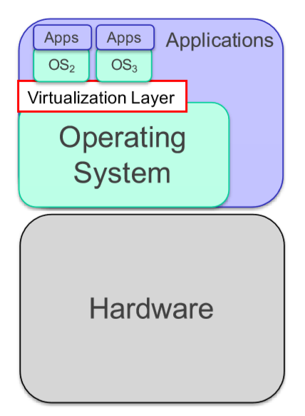

# Notes of Computing Infrastructures

*A series of overly incomprehensible notes of the course Computing Infrastructures as taught in PoliMi.  
Check for document updates on [GitHub](https://github.com/WilliamBonvini/PolimiNotes).*

 

[TOC]

 

# Data Centers

## Data Center Architecture

The IT equipment is stored into corridors, and organized into racks. We will return on this later.

IT equipment generates a lot of heat: the cooling system is usually a very expensive component of the datacenter, and it is composed by coolers, heat-exchangers and cold water tanks.

In order to protect against power failure, battery and diesel generators are used to backup the external supply.

## Data Center Corridors

Corridors where servers are located are split into cold aisle, where the front panels of the equipment is reachable, and warm aisle, where the back connections are located.

Cold air flows from the front (cool aisle), cools down the equipment, and leave the room from the back (warm aisle).

 

## Data Center Racks

Racks are special shelves that accommodate all the IT equipment and allow their interconnection. 

IT equipment must conform to specific sizes to fit into the rack shelves.

**Rack Modules**

Four types of equipment are usually present into racks:

- Servers
- Communication Equipment
- Storage Units
- Power Distribution Units

### Servers

They are the main processing equipment.

They are like ordinary PC, but with a form factor that allows to fit them into the racks.

They may differ in:

- Number and type of CPUs
- Available RAM
- Locally attached disks (HDD, SSD or not installed)
- Other special purpose devices (like GPUs, DSPs and coprocessors)

 

### Communication Equipment

They allows network interconnections among the devices.

They can be:

- Hubs
- Routers
- DNS or DHCP servers
- Load balancers
- Technology switches
- Firewalls 

### Storage Units

Storage units holds large amount of data.

They are:

- JBOD (Just a Bunch Of Disks)
- RAID controllers
- NAS heads

They can use:

- HDD
- SSD
- Ram disks

### Power Distribution Units

Power Distribution Units (PDUs) are the last type of devices that can be fit into racks.

They are usually not consider as IT equipment, but they consume rack units.
The distribute the energy to the devices inside the rack.
They can provide additional feature such as energy consumption monitoring and remote turn on/off.

## Data Center Network Architectures

It has been proven that in most data-centers what really limits the performances of the infrastructure is the network.
Several different configurations have been tested. The most important are:

- Three layers

- Fat-tree
- D-Cell

 

### Three Layers

Three layer architecture configures the network in three different layers:

- Core
- Aggregation
- Access

Three layer architecture reflects the topology of the data center: 

 

#### Access

Switches at the access layer can be put into two positions:

- *Top-Of-the-Rack (TOR):*  
  Access switches are put at the top of each rack. The number of cables is limited. The number of ports per switch is also limited (lower costs). However the scalability is also limited.
- *End-Of-the-Line (EOL):*  
  Switches are positioned one per corridor, at the end of a line of rack. Switches must have a larger number of ports, and longer cables are required (higher costs). However the system can scale to have a larger number of machines.

Bandwidth can be increased by increasing the switches at the core and aggregation layers, and by using routing protocols such as Equal Cost Multiple Path (ECMP) that equally shares the traffic among different routes.

This solution is very simple, but can be very expensive in large data-centers since:

- Upper layers require faster network equipments. For example:
  - 1 GB Ethernet at the access layer
  - 10 GB Ethernet at the aggregation layer
  - 25 GB Optical connections at the core layer
- The cost in term of acquisition and energy consumption can be very high.

 

### Fat-Tree

Fat-tree topologies use a larger number of slower speed switches and connections. In particular, nodes are divided into pods characterized by the same number of nodes and switches.

In every pods, switches are divided into two layers, and they are connected to half of the nodes (or half of the lower layer switches).

There is a division in 

- Core Layers
- Aggregation Layers
- Edge Layer

 

### D-Cell

D-Cell topology, defines the network in recursive way. Cells are organized in levels. Switches connects nodes at the lower level.

### Comparison between 3L-FT-DC

**FT over 3L**  
The advantage of Fat-tree over three layer, is that it only uses slower switches, which are much less expensive than the one required at the aggregation or core layers.

**3L over FT**  
Fat-Tree's limit is that it requires a high number of switches and cables.

**DC over FT**  
The advantage of DCell is that it requires fewer switches and less cables than the Fat-tree. 

**FT over DC**  
However, some nodes of DC must be configured as router: this can limit their performance, introduce network administration problems, and requires special routing protocols that are not fully standardized yet, this does not happen in FT.

 

# Performance

## Basics

- in interactive systems we can't use little's law because we have thinking users.
- ***Workload Intensity***   
  The rate at which customers arrive.
- ***Service Demand***  
  Average service requirement of a customer.
- ***Utilization***   
  The proportion of time the server is busy.
- ***Residence Time***   
  The average time spent at the service center by a customer, both queueing and receiving service.
- ***Response Time***  
  The intuitive notion of perceived system response time.
- ***Queue Length***   
  The average number of customers at the service center, both waiting and receiving service.
- ***Throughput***   
  The rate at which customers pass through the service center.

 

## Unbalanced Systems

## Open Models  

$$
X(\lambda) \le \frac{1}{D_{max}} \ \ \ \ \ \ \ \ \ \ \ \ \ \ \ \ D \le R(\lambda)
\\
\downarrow
\\
X(\lambda) \le \frac{1}{D_{max}} \ \ \ \ \ \ \ \ \ \ \ \ \ \ \ \ \frac{D}{1-\lambda D_{avg}} \le R(\lambda) \le \frac{D}{1-\lambda D_{max}} 
$$

- $X_k(\lambda)=\lambda V_k$

 

## Closed Queuing Models 

### Without Z

$$
\max(ND_{max},D) \ \ \ \ \ \ \  \le  \ \ \ \ \ \ \ R(N) \ \ \ \ \ \ \  \le \ \ \ \ \ \ \  ND 
\\ 
\
\\
\frac{1}{D} \ \ \ \ \ \ \  \le \ \ \ \ \ \ \ X(N) \ \ \ \ \ \ \  \le \ \ \ \ \ \ \  \min\bigg(\frac{N}{D},\frac{1}{D_{max}}\bigg)
$$

### With Z

$$
\max(ND_{max}-Z,D) \ \ \ \ \ \ \  \le  \ \ \ \ \ \ \ R(N) \ \ \ \ \ \ \  \le \ \ \ \ \ \ \  ND 
\\ 
\
\\
\frac{N}{ND+Z} \ \ \ \ \ \ \  \le \ \ \ \ \ \ \ X(N) \ \ \ \ \ \ \  \le \ \ \ \ \ \ \  \min\bigg(\frac{N}{D+Z},\frac{1}{D_{max}}\bigg)
$$

$$
N^*=\frac{D+Z}{D_{max}}
$$

### Balanced without Z

$$
D_{avg}=\frac{D}{number \ of \ stations}
$$

$$
\max\Bigg(ND_{max},D+(N-1)D_{avg}\Bigg) \ \ \ \ \ \ \  \le \ \ \ \ \ \ \  R(N) \ \ \ \ \ \ \  \le \ \ \ \ \ \ \  D +(N-1)D_{max}
$$

$$
\frac{N}{D+(N-1)D_{max}
} \ \ \ \ \ \ \  \le \ \ \ \ \ \ \  X(N) \ \ \ \ \ \ \  \le \ \ \ \ \ \ \  
\min\Bigg(\frac{1}{D_{max}},\frac{N}{D+(N-1)D_{avg}}\Bigg)
$$

### Balanced with Z

$$
D_{avg}=\frac{D}{number \ of \ stations}
$$

$$
\max\Bigg(ND_{max}-Z,D+\frac{(N-1)D_{avg}}{1+\frac{Z}{D}}\Bigg) \ \ \ \ \ \ \  \le \ \ \ \ \ \ \  R(N) \ \ \ \ \ \ \  \le \ \ \ \ \ \ \  D +\frac{(N-1)D_{max}}{1+\frac{Z}{ND}}
$$

$$
\frac{N}{D+Z+\frac{(N-1)D_{max}}{1+\frac{Z}{ND}}} \ \ \ \ \ \ \  \le \ \ \ \ \ \ \  X(N) \ \ \ \ \ \ \  \le \ \ \ \ \ \ \  \min\Bigg(\frac{1}{D_{max}},\frac{N}{D+Z+\frac{(N-1)D_{avg}}{1+\frac{Z}{D}}}\Bigg)
$$

$$
N^+=\frac{(D+Z)^2-D\cdot D_{avg}}{(D+Z)D_{max}-D \cdot D_{avg}}
$$

 

## Closed Batch Models

### Standard

$$
\max(ND_{max},D) \ \ \ \ \ \ \  \le \ \ \ \ \ \ \  R(N) \ \ \ \ \ \ \  \le \ \ \ \ \ \ \  ND
\\
\ 
\\
\frac{1}{D} \ \ \ \ \ \ \  \le \ \ \ \ \ \ \  X(N) \ \ \ \ \ \ \  \le \ \ \ \ \ \ \  \min\bigg(\frac{N}{D},\frac{1}{D_{max}}\bigg)
$$

$$
N^*=\frac{D}{D_{max}}
$$

### Balanced

$$
\max(ND_{max},D+(N-1)D_{avg}) \ \ \ \ \ \ \  \le \ \ \ \ \ \ \  R(N) \ \ \ \ \ \ \  \le \ \ \ \ \ \ \  D+(N-1)D_{max}
$$

$$
\frac{N}{D+(N-1)D_{max}} \le X(N) \le \min(\frac{1}{D_{max}},\frac{N}{D+(N-1)D_{avg}})
$$

$$
N^+=\frac{D-D_{avg}}{D_{max}-D_{avg}}
$$

## Single-Class Multi Station Systems with two stations

- ${R_1=r_1V_1}$
- ${R_2=r_2V_2}$
- ${R=R_1+R_2}$

## Availability

- $A=\frac{MTTF}{MTTF+MTTR}$
- $A_{serial}=A_1A_2A_3...A_n$
- $A_{parallel}=1-\prod(1-A_i)$

## Reliability

- $R(t)=e^{-\frac{t}{MTTF}}$
- $R_{serial}=R_1R_2...R_n$
- $R_{parallel}=1-(1-R_A(t))(1-R_B(t))$

## MTTF

- Serial Configuration
  $$
  MTTF_{Serial}=\frac{1}{\frac{1}{MTTF_A}+\frac{1}{MTTF_B}}
  $$

- Parallel Configuration  
  $$
  MTTF_{//}=MTTF_A+MTTF_B+\frac{1}{\frac{1}{MTTF_A}+\frac{1}{MTTF_B}}
  $$
  

 

# Virtualization

## Virtual Resources

The main contribution of a VMM (Virtual Machines Manager) is handling virtual resources:  
it presents to the guest OS the interface of a real resource and understands the OS requests and emulates them.    

Virtualization maps virtual resources to a set of managed ones, which are often physical and in rare cases are virtual, it can provide

1. The same interface (virtualization):  
   *Advantage:*   
   quality of performances improves.  
   *Disadvantage:*   
   it is not always possible

2. A different interface (emulation):  
   *Advantage:*   
   compatibility, interoperability and flexibility 
   *Disadvantage:*   
   lower performances.

   

**Physical Into Virtual Resources Mapping** (three ways)

- *One to one*

- *One to many* 
  Sharing, the main benefits are isolation, flexibility and resource management, it can be implemented using time or space multiplexing

- *Many to one*  
  Aggregation, the main benefits are scalability, reliability and simplification   

  

### CPU   

The host must be able to execute the guest instructions, via emulation if there is a different ISA which prevents direct native execution.  
Usually, a core is shared among any virtual machines by partitioning it. 
It should be avoided to assign each machine a number of virtual cores that is greater than the total number of cores of the physical device, as the only way in which it can be implemented is time sharing a core and it leads to bad performances. 

However, when more than one virtual machine is running, the total amount of their core can be greater than the physical one, since usually the machines are in a waiting state and therefore the cores are sufficient to execute something on one machine at a time.   

It is also possible to set an execution cap, that is the maximum amount of time a core can be used by a machine, it allows to select less important machines and ensure they don’t interfere with the execution on the most important ones.   

### Memory   

The sum of the memory allocated for each machine should be less than the total physical memory, but it can lead to a poor utilization of the real memory.  
So, it is preferred to assign memories that, if summed, result greater than the physical one.  

Allocating new memory can be done in two ways:

- *Memory ballooning:*  
  the VMM asks the host for the list of free pages when it needs more memory.  
  it is possible only when the VMM is aware to be virtual (para virtualization)
- *Overcommit:*   
  the VMM rewrites the pages it supposes to be less used, it happens when it is not aware to be virtual and so it believes to have the entire memory available 

Conventional operative systems virtualize memory since they load only a few pages into the RAM and, if another page is needed, one of those in the RAM is put back into the disk and then another one is loaded. 

With virtualization, another saga structure is needed, it is called *Memory* *Management Unit (MMU)* and it allows to separate the process address space from the physical one.   
*For each virtual page, it contains the physical address and three flags that tell whether or not the page is loaded into memory, whether or not it has been changed and whether or not it is free.*    
Each virtual machine has its own virtual memory, so it is necessary to maintain synchronization and consistency among them.  
It can be done in two ways. 

**Virtual resources** 

1. *Shadow pages*  
   which are maintained by the VMM and consist of the mapping of the virtual pages of the guest into the physical ones of the host.  
   They are used by the hardware to translate the addresses and they are synchronized with the host’s page table by the VMM.  
The counter effect is a lot of overhead when they are updated.
   
2. *Nested pages*  
   which remove the overhead in translating but require a hardware that is able to support it.  
   The Translation Lookaside Buffer is able to cache the translation to make it faster. 

   

### I/O devices   

The VMM builds a virtual version of the devices, it intercepts and handles the requests.  
Devices can be dedicated (keyboard, mouse, …), partitioned (large disks) or shared (network adapter)  .

 

### Virtual disks   

They can convert the entire HDD into a file.

there are two types

- Fixed size format creates a file that has the dimension of the entire HDD
- Variable size format starts with a reduced size and can grow up to the whole size of the disk, it stores only the used blocks.

Both of them allow the user to create snapshots, which consist of saving the content of the disk to allow to return to it if needed.   
The first one is really saved, for the followings only the differences with the previous one are stored.

### Network Virtualization   

There are 4 kinds of Virtual Network Adapters (VNA):

- Network Address Translation (NAT)
- Bridged Networking
- Host Networking
- Internal Networking

#### NAT

- Each VM has a different Private Virtual Network that connects it just to the host OS
- The VMM is treated as any other application.
- port-forwarding must be enabled

 

#### Bridged Networking

- the VM seems to be actually connected to the real network
- no port-forwarding should be setup

#### Host-only Networking

- VMs are not directly connected to the external network
- Allows the connection between the Host and the Guest VMs only
- the host and the VMs can communicate among each other using this special virtual network card

 

#### Internal Networking

- Creates a network that connects only the VMs, and it is not reachable from the outside

 

## Virtual Machines

### Instructions' Levels

In a machine there are 6 levels of instructions (from 0 to 5), to move from one level to a lower one a translator is needed. 

***Level 2*** is the one of the *Instruction Set Architecture* (***ISA***), which represents the bunch of instructions the machine can execute. 

The **ISA** is divided into:

- ***User ISA***  
  It's visible to application programs.
-  ***System ISA***  
  It can be seen only by the OS.    

Another important component is the *Application Binary Interface* (***ABI***) which allows the program to access to hardware resources. 

The **ABI** is composed by:

- ***User ISA***
- ***System calls***  
  which allows a program to indirectly interact with OS-managed resources. 

 

### Virtualization

It's not possible to run on instructions that were not meant for that machine, but **the hardware can be virtualized**:  
Java runs in every architecture for which an interpreter exists, as it uses a specific set of instructions which is translated by the Java Runtime Environment into machine instructions.  
The same technique can be used to run software on a machine that is meant for another machine, by using **emulators**.  
Emulators understand the behavior of the CPU and of the RAM and reproduce it into the physical system on which it is running. Both the ABI and the ISA are reproduced.  

  

### Virtual Machines - Definition and Types

A **virtual machine** is a logical abstraction able to provide a virtual execution environment.   
It maps virtual resources into physical ones and it uses the physical machine instructions to execute virtual ones.  
The **host** is the software that runs in the virtual machine while the **guest** is the underlying platform that supports it.  

***There are two types of Virtual Machines:***

1. ***Process Virtual Machines***  
   The ABI provides the interface between the physical machine and the virtual one, onto which *it is possible to execute processes but no other operative systems.*  
   The virtualization software is called **runtime software**, it emulates user-level ISA and operating system calls, meaning that it must rely on the software of the physical machine to access the hardware as it supports the level 0-3 of the architecture.  
   PVM uses:
   - User ISA
   - Syscalls
2. ***System Virtual Machines***  
   The ISA provides the interface between the two machines, meaning that *each machine can run its own operative system and interact independently with resources*, either via an underlying OS or directly communicating with the hardware, which includes also the I/O resources.   
   The virtualizing software is the **Virtual Machine Monitor (VMM)**, it supports the level 0-2 of the architecture, as it does not include the software.   
   SVM uses:  
   - User ISA
   - System ISA

 

### VM's Architecture Dependency

A great problem is the slowing down of the machine due to the need of translating the instructions, but it can be solved (not always) exploiting the fact that the languages of the two machines coincide, which means that they have the same ABI for process VMs or the same ISA for system ones. 

- ***Same architecture:***   
  depending on the level, it can be the same ABI or the same ISA
  - *<u>Process VMs</u>*  
    Same ABI.  
    This technique is used to allow multiple users to run in the same machine, but *it is not considered a real virtual machine*.
  - <u>*System VMs*</u>  
    Same ISA.  
    The machine is on the bare hardware and the VMM can connect it directly with the I/O and the memory.  
    If the machine runs on top of another operative system, it is called *hosted VM*.
- ***Different architecture:***   
  <u>*Emulation*</u> is required, it refers to those techniques developed to allow an application to run in an environment different from that originally intended.  
  Two methods can be implemented in two ways, through interpretation or binary translation, which is faster as it converts blocks of instructions at runtime and caches them.
  - <u>*Process VMs*</u>  
    Every application has a different execution environment, the VMM translates the byte code of the applications, which are sandboxed, into that of the machine.
  - <u>*System VMs*</u>  
    Usually they run on top of another OS.  
    In this case the VM must emulate the entire hardware environment. 

 

### Virtualization

***How do we implement it?***

Given a typical layered architecture of a system, we add layers between execution stack layers.  

Virtualization must be implemented if the machine needs to execute instructions meant for another ISA or another ABI.  
Depending on the level where it is placed, it is possible to obtain different types of virtualization:

***Virtualization Types:***

- ***Hardware-Level Virtualization***  
  It is placed between the hardware and the operative system   

  

  

- ***Application-level Virtualization***   
  It is put between the operative system and some application, which run in its environment independently and can also be a software.   
  

- ***System-level Virtualization***  
  The virtualization layer provides the interface of a physical machine to a secondary OS and a set of applications running in it, allowing them to run on top of an existing OS.  
  

 

### Virtual Machine Manager 

The VMM is an application that manages the virtual machines, mediates the access to the hardware resources and handles any privileged or protected instruction issued by the virtual machines.  
It is crucial to support cloud computing. 

There are three terms, which have a slightly different meaning:

- ***Virtual Machine Monitor***  
  The virtualization software
- ***Hypervisor***  
  A virtualization software that runs directly on the hardware.
- ***Virtual Machine Manager***  
  A VMM or Hypervisor that is also used to create, configure and maintain virtualized resource.  
  It provides a user-friendly interface  to the underlying virtualization software.

#### Hypervisor

Let’s focus on the hypervisor, it can be

- ***Bare Metal (type 1)***  
  which takes direct control of the hardware and was sometimes used to provide hacks for certain OS. 
  

  - *Monolithic:*  
    the drivers are installed on the hypervisor, so they need to be available for that software, it leads to better performances and isolation

  - *Microkernel:*  
    the drivers are installed on a service virtual machine, so those specific for the OS and also 3rd party ones (even if difficult) can be used, this allows also to keep the hypervisor small.  

    

 

- ***Hosted (type 2)***  
  which is characterized by at least two operative systems, the host where the VMM runs and the guest where the virtual machine runs. It is more flexible and simpler, but special care must be taken to avoid conflicts between the systems and to keep low the resources consumed by the guest.   
  

#### VMM Properties

VMM must ensure the following properties:

- ***Partition***
- ***Isolation***
- ***Encapsulation*** (the state can be saved in a file)
- ***Hardware independence*** 

#### Virtualization Types

There are three types of virtualization:

1. ***Para-virtualization***  
   The interface is similar but not identical to that if the underlying hardware, the guest OS can require the host to execute some instructions that would be virtualized thus making them faster; only some modified guest OS can be installed in these machines.
2. ***Full virtualization***  
   The guest OS does not need to be modified, but the hypervisor must mediate, and some hardware support is required
3. ***Kernel-level virtualization***   
   The virtualization is at the OS level, it does not allow multiple OS to run but it can be used to support private servers, it requires some kernel level modification   

 

### Implementing Full Virtualization

The machine being virtualized is composed of:

- *E, executable storage*
- *M, the system mode (user or kernel)*
- *P, the program counter*
- *R, it represents the memory relocation registers* which is a pair (l, b) where l is the physical address of the virtual memory and b its bound   

Instructions are classified in three categories 

1. ***Privileged***  
   those which need a trap to be executed 
2. ***Control sensitive***  
   which affect the configuration of resources
3. ***Behavior sensitive***  
   their result depends on the configuration of the resources   

*Requirements for a system-level VM* 

1. ***Efficiency***  
   the instructions that need the VM intervention must be less than those that can be executed without it
2. ***Equivalence***  
   the behavior of the program must be identical to that in a physical machine
3. ***Resource control***  
   the VMM hat control completely the virtualized resources. 

### Popek and Goldberg Theorem 

A VMM may be built if the privileged instructions are a subset of control/behavior sensitive ones.

The following properties must be guaranteed 

1. ***Resource control***  
   instructions that could prevent the correct functioning of the VMM are trapped and handled by the VMM itself
2. ***Efficiency***  
   non-privileged instructions must not be controlled by the VMM
3. ***Equivalence***  
   the virtual machine accesses virtual resources in executing sensitive instructions, so they need to be handled by the VMM 

 

# Cloud Computing

### Intro

***Virtualization*** allows to have:

- Hardware independence of the software
- High flexibility
- The operative system and the applications can be handed as a "single entity"  

***Consolidation*** means migrating from physical to virtual machines, servers are connected one another so it is possible to:

- Perform live migration, which is moving one server to another physical architecture without switching it off, thus making the system more scalable
- Automatically balance the workloads, without the machines feeling the difference
- Protect the machines from hardware or system failures, as if a physical machine fails the other continue running, so the virtual machines do not need to be stopped even if they could be slowed down.   

It leads to a higher hardware utilization, it allows different operative systems to run on the same hardware and to continue to use legacy software (Linux applications on Linux, Windows on Windows, …) as the applications are independent from the hardware.   

 

### Definition & Services

***Cloud Computing*** is a model for enabling convenient, on-demand network access to a shared pool of configurable computing resources, as network, servers, storage, applications and services that can be rapidly provisioned and released with minimal management effort or service provider interaction. 

1. ***Cloud Application*** (software as a service)   
   The user accesses resources which are provided through the internet without needing to install or know anything.
2. ***Cloud Software Environment*** (platform as a service)  
   The users are application developers, they are supplied with a platform where they can code and with the needed API, to accelerate the deployment and support scalability of the so built applications.
3. ***Cloud Software Infrastructure***  
   it provides resources to the higher level, it might be bypassed by the lower ones.
   1. *<u>Computational Resources</u>* (Infrastructure As A Service)  
      Virtual machines allow flexibility and root access to the machines, but they could lead to performance inefficiencies and to the inability to provide strong guarantees about the service levels.
   2. <u>*Storage*</u> (Data As A Service):  
      They allow users to store and retrieve data (usually through specific applications), the key points are a high dependability, replication and data consistency.
   3. *<u>Communications</u>* (Communication As A Service):  
      It becomes a vital component, it must provide security (encryption) and monitoring and be service-oriented, configurable, schedulable, reliable and predictable, so it is necessary to make previsions on the traffic with the aim of guaranteeing a maximum delay of message.
4. ***Software Kernel***  
   it provides the basic software management for the servers. 
5. ***Firmware/Hardware*** (Hardware As A Service):  
   The users are big IT enterprises with high software requirements, they do not want to worry about the hardware, so they rent it, the provider must guarantee also the needed management and upgrade. 

Usually, the role of service provider is divided into two parts: the service provider, who serves the end users, rents its infrastructure by another provider who manages the cloud platform and is called infrastructure provider; the chain can become even longer, as the latter can become the user for a lower level product.

 

### Cloud Infrastructures Belonging Categories

Cloud infrastructures can belong to four different categories.

1. ***Public***   
   A company rents its infrastructure to private users or to other companies, it is characterised by the virtualization of the operative systems and by a service level agreement. The main feature is the fact that it is entirely web-based, the "pay-as-you-go" policy allows users to select the service they need, to pay for it and to use it almost immediately.
2. ***Private***   
   It is an internally managed data-center, a huge company buys the hardware and takes care of everything, the total control has the side effect of loose flexibility.
3. ***Community***   
   Some organizations share a single cloud, so resources can be used by one of the partners when the others are not using them; it is similar to private cloud, but it has a more complex accounting system.  
   Usually it is hosted locally, the participants share their infrastructures, but sometimes it is submitted to a specific separate organization or to a small subset of the partners.
4. ***Hybrid***    
   It is a mixture of the others, it can be used by an IT company that has its own resources but is subject to unpredictable and rare peaks in computation demand so, when they happen, it rents the resources to deal with them only for the needed time

### Pros & Cons

***Pros***

- Lower IT costs.
- Improved performances.
- Instant software updates.
- Unlimited storage capacity.
- Data reliability.
- Documents can be accessed everywhere and on every device. 

***Cons***

- It requires a constant and fast internet connection, as it does not work well with low-speed connections.
- The features might be limited.
- Can be slow due to virtualization.
- Stored data might not be secure and might be lost. 

### Fog Computing

A further development consists in Fog  Computing.  
It stays in the middle between the objects and the cloud:  
the computation is split.  
The fog pre-processes the data and, if it is able, it takes a decision, otherwise it sends them to the cloud to exploit its major computation power. 

 

# Storage

## RAIDS

The aim is to emulate a very expensive disk buying a bunch of less expensive ones:  
In order to increase the performance, the size and the reliability of storage systems, several independent disks are considered as a single one.  
Data are striped across the disk and accessed in parallel, thus gaining high parallelism in accessing them and load balancing.     
Two techniques must be implemented on RAID disks.

- ***Data striping:***  
  data are written sequentially according to a cyclic algorithm (round robin), it allows reading and writing in parallel.
  - Stripe unit:  
      the amount of data written on a single disk
  - Stripe width:  
    the number of disks considered by the algorithm, which can be less than the total amount of disks. 
  
- ***Redundancy:***  
  it is necessary since the probability of failure rises with the growing of the number of disks.  
  It consists of error-correcting codes, that are stored on different disks than the data and can be used to reconstruct data after a failure.  
  The main drawback is the slowing down of writing operations, as these values must be computed and stored along with the data.   

There are many types of architectures, the choice should be done accordingly to the required features.   

 

## RAID 0  

Data are written on a single logical disk and then split by the controller among several physical disks.   
It has the lowest costs and the best write performance of all the levels, but the failure of a single disk will cause the loss of data, so it is used where performance and capacity are very important while data reliability is not an issue.   

$$
MTTDL=\frac{MTTF}{n}
$$

## RAID 1 

Data are duplicated, two physical disks contain the same data;   
it has a high reliability, and read and write performance are not bad, as data can be accessed in parallel without the need of computing parity bits;  
the main drawback is the cost, as only 50% of the capacity can be used.   
In theory, data could be copied on more than one disk, but this solution is never used due to the prohibitive costs.  

$$
MTTDL=\frac{MTTF^{(n)}}{n \cdot MTTR^{(n-1)}}
$$

 

## Combinations of 0 and 1

If several disks are available, RAIDs can be combined:  
$x+y$ means that there are ${n\cdot m}$ disks in total $\to$ RAID ${x}$ is applied to groups of ${n}$ disks, that are treated like a single one onto which is applied RAID ${y}$.  
Two very used configurations are ${0+1}$ and ${1+0}$, the former places redundancy at a higher level, thus becoming less fault tolerant as there are only two groups of RAID1:  
if two disks on different groups fail, the controller cannot realize that their copies could still be found on the other RAID $0$ level, so data are lost.  
Performances and storage capacity are the same.    

***Raid 0 + 1***

$$
MTTDL=2\cdot \frac{MTTF^2}{n^2\cdot MTTR}
$$

***Raid 1 + 0***  

$$
MTTDL=\frac{MTTF^2}{n\cdot MTTR}
$$

 

## RAID 2 

It's not used.  
The number of redundant disks is proportional to the log of the total number of disks.  
The parity is calculated for several subset of overlapped data, the number of disks where parity bits are stored is proportional to the logarithm of the disks that contain data. When a block fails, several of the parity blocks will have inconsistent value, the failed component is the one held in common by each incorrect subset.  

## RAID 3 

Here the failed disk is assumed to be known, which is realistic as the controller is usually able to detect the failed component.  
Data are interleaved byte-wise over the data disks.  
There is a single disk to store parity bits, while all the others contain data, meaning that only one request can be served at a time.  

${Byte \space Parity =byte_0 \ XOR \ byte_1 \ XOR \ byte_2 \ byte_3}$

Having the following 3 bytes:

${a) \ 01100011 \ XOR}$  
${b) \ 10101010 \ XOR}$  
${c) \ 11001010=}$  
${p) \ 00000011}$  

Suppose losing ${a)}$.   
We can reconstruct it:   

${p) \ 00000011 \ XOR }$
${b) \ 10101010 \ XOR}$  
${c) \ 11001010=}$  
${a) \ 01100011 }$

 

## RAID 4 

It is similar to level 3, the main difference is that <u>parity is calculated for strips that have the same position in all the disks and then stored in that aimed for redundancy.</u>   
The single disk for redundant data (parity disk, accessed at each write) can easily become the bottleneck:  all the write must access it, so they can't be parallelized.  
This level is able to recover from the failure of one disk.   

## RAID 5 

It is exactly identical to level 4, but the parity blocks are uniformly distributed over the disks, thus avoiding the bottleneck on the parity disk and allowing load balancing among data disks.  
It loses data if more than one disk fails.  

$$
MTTDL=\frac{MTTF^2}{(n)(n-1)MTTR}
$$

 

## RAID 6 

This level is able to recover from the failure of up to two disks, as it uses two redundancy schemes P and Q which are independent.  
On the other hand, it needs a greater computational overhead, so it must be used only for very critical applications.   

However, its efficiency grows with the number of disks, as does the probability of having two failures. 

Legenda:  

- ${D_i = }$ the ${i}$-th data block ${(i=0...n-1)}$ 
- ${P=}$ Parity Value number 1
- ${Q=}$ Parity Value number 2
- ${g=}$ a generator value (a constant) needed to compute ${Q}$ . 
- ${n=}$ the number of blocks of a disk reserved to store data 

The two parity values are computed as follows:  

$$
P=\sum_{i=0}^{n-1}D_i
$$

$$
Q=\sum_{i=0}^{n-1}g^iD_i\ \ \ \ \  g \neq 1
$$
​    
The repairing technique depends on which disk (or disks) have failed: 

1. <u>*A data disk:*</u>  
   ${D_i=P-\sum_{j=0,j\neq i}^{n-1}D_j}$   

2. *<u>A parity bit:</u>*  
   simply recompute it, data are still available.

3. *<u>A data disk and the Q block:</u>*  
   data are reconstructed as  
   ${D_i=P-\sum_{j=0,j\neq i}^{n-1}D_j}$ and then use it to recompute ${Q}$  

4. *<u>A data disk and the ${P}$ block:</u>*  
   data are reconstructed as 
   $$
   D_i=\frac{(Q-\sum_{j=0,j \neq i}^{n-1}g^jD_j)}{g^i}  
   $$
   
and then used to reconstruct P   
   

 
   
5. *<u>Two data disks ${D_i}$ and ${D_j}$:</u>*   
   a system of equation must be solved, calling 
   $$
   P^*=\sum_{k=0,k\neq i, k \neq j}^{n-1}D_k
   $$
   
   $$
   Q^*=\sum_{k=0,k\neq i,k\neq j}^{n-1}g^kD_k
   $$
   

   the values of the parity bits computed without the broken disks, the two equations are  
   
   $$
   \begin{cases}P=P^*+D_i+D_j \\Q=Q^*+g^i D_i+g^j D_j \end{cases}
   $$
   

   With a few data blocks, the system above is very easy to compute by hand, otherwise, an efficient way of solving such system of equations is to precompute two coefficients and use them to recover ${D_i}$ and ${D_j}$.    
   
   $$
   A_{ij}=-\frac{g^{j-i}}{1-g^{j-i}}
   $$

   $$
   B_{ij}=-\frac{g^{-i}}{1-g^{j-i}}
   $$

   and then:    

$$
   D_i=A_{ij}(P-P^*)+B_{ij}(Q-Q^*)
$$

$$
   D_j=P-P^*-D_i
$$

However, these technique works only for machines with infinite precision, that do not exist. The solution is to use a special algebra, called Galois Fields, that includes only the integer that are powers of prime numbers and allows to perform all the previous mentioned operations using numbers that can fit into a byte.

$$
MTTDL=\frac{2MTTF^3}{(n)(n-1)(n-2)MTTR^2}
$$

## RAID 7

not standardized yet, we will not see it.

 

## Storage Systems 

There are three main types of storage systems   

1. ***Direct Attached Storage (DAS)***   
   It is a system directly attached to a server or a workstation, it has a limited scalability, a complex management and low performances and it is difficult to read files on other machines. It can be an internal drive as well as an external disk, connected with a "point to point" network.

2. ***Network Attached Storage (NAS)***   
   A NAS unit is a computer connected to a network that provides only file-based storage to other services in the network, it has its own IP address and the system is very scalable. It is designed as a self-contained solution to share files over the network, so its performance depends mainly on its speed and congestion. It is used for low-volume access to a large amount of storage by many users.

3. ***Storage Area Network (SAN)***   
   They are remote storage units that are connected to the PC with a specific network technology, it does not provide the file system and it is seen by the operative system simply as a disk, differently than NAS that is visible as a server. It is used for petabytes of storage and multiple, simultaneous access to files (Netflix), it is highly scalable. 

   

### Fibre Channel Interface

A special interface is needed to access Storage Units.  
The TCP/IP stack over ethernet leads to many issues, that is not needed for the specific purpose, so a specific protocol called *Fibre channel* is implemented.  
It is a high-speed network technology that is well established in the open system environment.  
They are accessed using the standard ethernet using an appliance called *NAS head*.

 

## Storage Structures

For the operative system, a disk is a collection of data blocks that can be read or written independently.  
In order to allow their management, each block is characterized by the ***Logical block address (LBA)***, which is a unique numerical address.  
In order to simplify the access, blocks are grouped into clusters, which are the smallest unit that an operative system can read or write on a disk. 

They can contain file data, the actual content of a file, as well as metadata, which is the information required to support the file system and contain the file name, the owner, the permissions, the list of the blocks that contain the actual data, the size, the type, the creation, modification and last access dates. 

So, the disk can contain four kinds of files.  
***Files Kinds:***  

- Fixed-position metadata, to bootstrap the file system.
- Variable-position metadata, to hold the folders structure.
- File data.
- Unused space.   

The system can perform three actions on a file.  
***System Actions on Files***

- ***Read***  
  The metadata must be accessed to locate the blocks, then the real content is read from them 
- ***Write***  
  The free space is located by accessing the metadata, then the file is written, but it is possible to access only clusters, so on each writing some space is lost due to the difference between the size of the clusters that must be written and the actual size of the file.  
  This loss is called internal fragmentation. Also, there might not be enough contiguous clusters to store all the file, so it is split and put into the free clusters, that are spread all over the disk causing the so-called external fragmentation. 
- ***Delete***  
  It is the simplest operation as it needs to access only the metadata, the clusters on which the file was stored are added to the free list. 

 

### HDD Structure

$$
LBA=(C\cdot heads \ per \ cylinder \ + \ H)\cdot \ sector \ per \ track \ + \ (S-1)
$$

$$
C=\frac{LBA}{head \ per \ cylinder \cdot \ sector \ per \ track}
$$

$$
H=\frac{LBA}{sector \ per \ track} \ (mod \ head \ per \ cylinder)
$$

#### Definitions

- ***Response time***  
  The sum of the *time spent in the queue waiting* and of the *service time*, which is the time effectively spent to read the data.  
  We will evaluate only the latter.
- ***Seek time***  
  head movement time
- ***Rotational Latency:***  
  the time to wait for the sector, which is assumed to be half a round.
- ***Data transfer time***  
  a function of the rotation speed, the storing density and the cylinder position
- ***Controller overhead***  
  the time required to send the data.   

#### Formulas

- **Rotational Latency of a disk**  
  The rotational latency of a disk is half of the time required to perform one rotation  
  $$
  T_{rotational \ latency}=\frac{1}{2 \cdot rs}
  $$
  where ${rs}$ is the rotation speed expressed in ${ms}$ 

- **Transfer Time**
  $$
  T_{TRANSF} = \frac{sector \ to \ be \ transfered}{data \ transfer \ rate }
  $$

$$
S_{TT}=T_{LAT}+T_{SEEK} +T_{TRANSF}+T_{OHCONTROLLER}
$$

- **Service Time - N Blocks**

$$
S_{TT}=n(T_{LAT}+T_{SEEK})+T_{TRANF}+T_{OHCONTROLLER}
$$

 

- **Service Time with locality**  

$$
S_{TT}=n\bigg[ (1-l)(T_{LAT}+T_{SEEK})+T_{TRANSF} + T_{OHCONTROLLER}\bigg]
\\
or \ equivalently
\\
S_{TT}=n \bigg[ l(T_{TRANSF}+T_{OHCONTROLLER})+(1-l)(T_{TRANSF}+T_{OHCONTROLLER}+T_{SEEK}+T_{LAT})\bigg]
$$

$$
n=number \ of \ blocks=\frac{File \ Size}{Block \ Size}
$$

#### Example

if you have 

- block size
- mean I/O service time per block (with no locality)
- transfer time of 1 block
- overhead controller
- file dimension

$$
\bigg(\frac{filedim\cdot1024}{blocksize}\bigg)\bigg[(loc)(ohc+transf\ time \ per \ block) + (1-loc)(I/O \ service \ time \ with \ no \ locality)\bigg]
$$

 

### SSD Structure

Data are stored in an array of NAND cells, which can be of two types   
***NAND cells types:***

- Single layer, that store only one bit

- Multiple layer, that store more than one (typically two) bit by multilevel voltage, they have a higher capacity but a smaller data reliability.  

 A page can be in three states.  
***Page States:***

- *Empty:*  
  it is possible to write only on them
- *Dirty:*  
  the content has been marked as "can be deleted", but it has not been deleted yet
- *In Use:*   
  it is meaningful to read them. 

Reading a single page consists of transferring it to the data register and then outputting it, while reading more than one occurs in the "cache mode":  
***Negative Aspects:***

- Higher cost if compared with HDD.
- The memory can be modified only a small number of times:
  - Shorter lifetime
  - Error-correcting codes
  - Over-provisioning
- Different read/write speed, as the write performances degrades with the writings.
- The controller becomes the real bottleneck.
- Data must not be defragmented, as it could damage the disk. 

 

# Doubts

