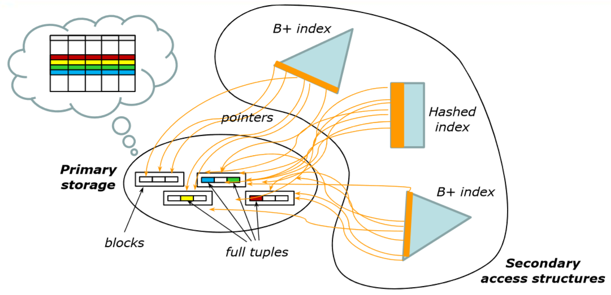

# Notes of Database 2

*A series of not yet structured notes on the course of Database 2 as taught in Politecnico di Milano by Sara Comai.*

 

[TOC]

 

# Physical Access Structures Introduction

Each table is stored into exactly one primary physical access structure, and may have one or many optional secondary access structures.

- *<u>Primary Structure</u>*
  - Contains all the tuples of a table
  - Its main purpose is to store the table content
- *<u>Secondary Structures</u>*
  - Used to index primary structures, and only contain the values of some fields, interleaved with pointers to the blocks of the primary structure
  - Their main purpose is to speed up the search for specific tuples within the table, according to some search criterion 

 

# Physical Access Structure Types

<u>Legenda</u> :

- $val(A_j)$ = number of distinct values of the attribute $A_j$ in the table $T$

<u>Three types</u> :

#### Sequential Structures

Three types:

- *<u>Entry - Sequenced</u>*
  - In an Entry - Sequenced organization, the sequence of the tuples is dictated by their order of entry
  - Optimality
    - Optimal for 
      1. Space occupancy
      2. Carrying out sequential reading and writing
    - Non - Optimal for
      1. Searching specific data units
      2. Updates that increase the size of tuple, in fact all following tuples must be shifted on.
- *<u>Array</u>*
  - In an array organization, the tuples (all of the same size) are arranged as in an array, and their position depend on the values of an index (or indexes)
  - Appropriate only when the tuples are of fixed length
- *<u>Sequentially - Ordered</u>*
  - In a Sequentially - Ordered organization, the tuples are ordered according o the value of a key (typically one field, but may be obtained by combining more than one attribute)
  - Main problem: 
    Insertions and Updates could increase the data size, this means that such structures require reordering techniques for the tuples already present. There are some techniques to avoid such reordering problem (i.e. leaving a certain number of slots free at the time of first loading, followed by 'local reordering' operations) 

#### Hash - Based Access Structures

Such structures assure an efficient associative access to data, based on the value of a key field to which the hash is applied.
Hash - Based structures have N_B buckets, each typically of the size of 1 block.
A hash algorithm is applied to the key field so as to compute a value between $0$ and $N_B - 1$.

- When is it used?
  This is the most efficient structure for queries with equality predicates, but it is rather inefficient for interval queries

#### Tree Structures

Gives associative access based on the value of a key field.

Each tree has:

- One root node
- Several intermediate nodes
- Several leaf nodes

Each node corresponds to a block.

The links between nodes are established by pointers to mass memory.

*Search technique* :

Suppose we are looking for a tuple with key value V, so at each intermediate node we do the following:

- If V < K_1 follow P_0
- if V >= K_F follow P_F
- Otherwise, follow P_J such that K_J <= V <K_j+1

The nodes can be organized in two ways:

- *<u>B+ trees</u>*
  - Pointers to the tuples are only contained in the leaf nodes
  - The leaf nodes are linked in a chain ordered by he key
  - Supports interval queries efficiently
  - The most used by relational DBMSs
- *<u>B trees</u>*
  - Pointers to the tuples can also be contained in intermediate nodes.
    In this way, for tuples with V = K_i , we don't kneed to descend the tree down to the leaves.
  - No chain links for leaf nodes, namely there is no support for intervals

# Costs

- **Sequential Structures**

  - Cost of Equality Lookups: 
    a full scan, because lookups are no supported
  - Cost of Interval Lookups: 
    a full scan, because lookups are not supported

- **Hash and Tree Structures**

  - Cost of Equality Lookups:   
    The lookup is supported only if A_i is the key attribute on which the structure is built, otherwise, a full scan is required.
    Lookup cost depends on 

    - The storage type (primary/secondary)
    - The structure type (tree/hash)
    - The key type (unique/non-unique)

    *<u>If it is a primary hash:</u>*

    A lookup for A_i = v  needs to find the block(s) storing the tuples with the same hash for A_i as those with v.
    The Hash function is applied to v, the right bucket is therefore immediately identified.
    The bucket contains the searched tuples

    - Cost = 1
      if the hash has no overflow chains
    - Cost = 1 + (average size of the overflow chain)
      if the hash has overflow chains

    *<u>If it is a secondary hash </u>*   
    The lookup for A_i = v works exactly in the same way, only the aim is to find the block(s) storing the pointers to the tuples with the same hash for A_i as those with v.
    The Hash function is applied to v, the right bucket is identified, and the corresponding block(s) are retrieved.

    - Cost = 1 (for the initial bucket block) + 
                  (average overflow blocks) (if any) + 
                  1 block per pointer to be followed)     

    ​    

  - Cost of Interval Lookups:   
    lookups based on intervals are not supported

- **B+ Structures**

  - Cost of equality Lookups :  
    *<u>If it is a primary B+</u>*  
    A lookup for A_i = v needs to find the block(s) storing all tuples indexed by the key value v.
    the root is read first, then, a node per intermediate level is read, until the first leaf node that stores tuples with A_i = v is reached.
    If the searched tuples are all stored in that leaf block, stop.
    Else, continue in the leaf blocks chain until v changes to v'

    - Cost = (1 block per intermediate level) + 
                  (as many leaf blocks as necessary to store all the tuples with A_i = v)

    *<u>If it is a secondary B+</u>*  
    The lookup for A_i = v needs to find the block(s) storing all the pointers that point to all tuples with the key value v for A_i.
    The root is read first, then a node per intermediate level is read, until the first leaf node that sores pointers A_i = v is reached.
    If the pointers are all stored in that leaf block, stop.
    Else, continue in the leaf blocks chain until v changes to v'.

    - Cost = (1 block per intermediate level) + 
                  (as many leaf blocks as necess. to store the pointers pointing to the tuples with A_i = v) + 
                  (1 block per each pointer)  

  - Cost of Interval Lookups  

    *<u>If it is a primary B+</u>*  
    We consider a lookup for v_1<=A_i<=v_2 as the general case.
    If (A_i < v) or (v < A_i) we just assume that the other edge of the interval is the first/last value in the structure.
    The root is read first, then a node per intermediate level is read, until the first leaf node that stores tuples with A_i = v_1 is reached.
    if the searched tuples are all stored in that leaf block stop.
    Else continue in the leaf blocks chain until v_2 is reached.

    - Cost = (1 block per intermediate level) +
                  (as many leaf blocks as necess. to store all the tuples in the interval)

    *<u>If it is a secondary B+</u>*  

    We still consider a lookup for v_1<=A_i<=v_2 as the general case.
    The root is read first, then a node per intermediate level is read, until the first leaf node that stores a the pointers pointing to the tuples with A_i = v_1 is reached.
    If all the pointers (up to v_2) are in that leaf block, stop.
    Else, continue in the leaf blocks chain until v_2 is reached.

    - Cost = (1 block per intermediate level) +
                  (as many leaf blocks as necess. to store all pointers to the tuples in the interval) +
                  (1 block per each such pointer, in order to retrieve the tuples)

  

### Cost of Joins

I cannot talk about the cost of joins regarding each type of structure independently, that's because joins are to do among different tables, that can be represented in different structures one from the other.

Legenda:

- b_A = Number of blocks of the table A
- t_A = Number of tuples of a block of the table A 
- E = External table
- I = Internal table
- L = Left
- R = Right

Type of joins:

- *<u>Nested - Loop Join Cost (Assuming not enough free pages to host an entire table in the buffer)</u>*

  compares the tuples of a block of table T_E with all the tuples of all the blocks of T_I before moving to the next block T_E.

  - $Cost = b_E * b_I$

- *<u>Nested - Loop Join Cost (Assuming enough free pages to host an entire table in the buffer)</u>*  
  the table in the buffer is chosen as internal table.

  - $Cost = b_E + b_I$

- *<u>Nested - Loop Join Cost (Assuming that one table supports indexed access in the form of a lookup based on the join predicate)</u>*  
  such table is chosen as internal

  - $Cost = b_E + (t_E * (cost  \ of  \ one  \ indexed  \ access \  to \  T_I)$

- *<u>Merge - Scan Join Cost (Assuming the primary storage to be sequentially ordered or B+)</u>*  
  This join is possible only if both tables are ordered according to the same key attribute, that is also the attribute used in the join predicate.
  The cost is linear in the size of the table.

  - $Cost = b_L + b_R$

- *<u>Hashed Joins (Assuming the two hashes to be both primary storages)</u>*  
  This join is possible only if bot tables are hashed according to the same key attribute, that is the same used in the join predicate.
  The cost is linear in the size of the hashes

  - $Cost = b_L + b_R$

# Query Planning 

What cost to assign to a plan?

- Construct a decision tree, in which each node corresponds to a choice, each leaf node corresponds to a specific execution plan

- Assign to each plan a cost
  $$
  C_{total}=C_{I/O}n_{I/O} +C_{cpu}n_{cpu}
  $$

- Choose the plan with the lowest cost, based on operations research (branch and bound)

Example of decision tree:

