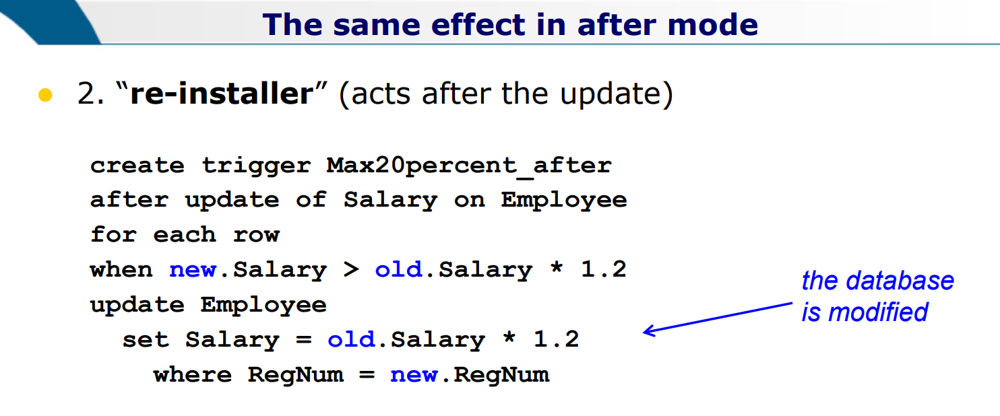
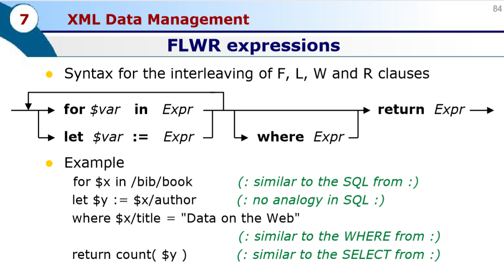

# Notes of Database 2

*A series of not yet structured notes on the course Database 2 as taught in Politecnico di Milano by Sara Comai during the academic year 2018/2019.*

Edited by: William Bonvini

[TOC]

<div style="page-break-after: always;"></div> 
# Transactions

***what is a transaction?***

an elementary, atomic unit of work performed by an application.

each transaction is encapsulated within two commands:

- begin transaction (bot)
- end transaction (eot)

within a transaction, exactly one of the commands below is executed

- commit
- roll-back

***Properties of a transaction***

- Atomicity
  - can't be divided in a smaller entity
- Consistency
  - data should make sense before and after the transaction
- Isolation
  - the execution of a transaction must be independent from the concurrent execution of other transactions $\to $ concurrency control
- Durability
  - the effect of a transaction should last forever

# Concurrency Control

## Anomalies

**Lost Update** $\to r_1-r_2-w_2-w_1$

**Dirty Read** $\to r_1-w_1-r_2-abort_1-w_2$

**Non-Repeat Read** $\to r_1-r_2-w_2-r_1$

**Phantom Update** $\to r_1-r_2-w_2-r_1$ (last $r_1$ reads an inconsistent value)

**Phantom Insert** $r_1-w_2\text{(new data)}-r_1$

## Core Concepts

- **Goal:**  
  reject schedules that cause anomalies
- **Scheduler:**  
  a component that accepts or rejects the operations requested by the transaction
- **Serial Schedule:**  
  a schedule in which the actions of each transaction occur in a contiguous sequence
- **Serializable Schedule:**  
  If it produces the same result of a serial schedule of some transactions.
- **Assumption Commit-Projection:**  
  Transaction are observed "in the past" and we decide whether the corresponding schedule is correct.

## Class Hierarchy

$$
!CSR \implies (\ !2PL \ \and \  !TS\_ MONO)
$$

$$
CSR \implies VSR
$$

$$
!2PL\implies!2PL\_STRICT
$$


<div style="page-break-after: always;"></div> 
## VSR - View Serializability

***Preliminary Definitions***

- *<u>Reads-From</u>*  
  $r_i(x)$ ***reads-from*** $w_j(x)$ in a schedule $S$ when $w_j(x)$ precedes $r_i(x)$ and there is no $w_k(x)$ in $S$ between $r_i(x)$ and $w_j(x)$
- *<u>Final Write</u>*  
  $w_i(x)$ in a schedule $S$ is a ***final write*** if it is the last write on $x$ that occurs in $S$

***View Equivalence***  
Two schedules are ***view-equivalent*** $(S_i \approx_\mathbf{v} S_j)$ if: they have the same 

- *operations*
- *reads-from* relations
- *final writes*

***View Serializable***  
A schedule is ***view-serializable*** if it is view-equivalent to a serial schedule of the same transactions

The class of View-Serializable schedules is named ***VSR***.

***Blind Writes***  

a write $w_i(X)$ is said to be ***blind*** if it is not the last action on resource $X$ and the following action on $X$ is a write $w_j(X)$.

*(disclaimer: if something is not clear in the following 3 notes, you'll understand it in the next section (CSR - Conflict Serializability)*

***VSR Property*** 

each schedule $S \in VSR$ and $S\notin CSR$ has, in its conflict graph, cycles of arcs due to *pairs* of blind writes.  These can be swapped without modifying the *reads-from* and *final-writes* relationships.  
Once the graph is acyclic it is possible to find a serial schedule view-equivalent to the initial one.

***How to find out if a schedule is in VSR?***

Do the Conflict Graph.  
If such graph is cyclic, consider the cycles that are due to blind writes.   
Switch such writes (switch the direction of the arrow).   
If now the graph is acyclic we can say it is in VSR.

***What's an easy way to build a View Equivalent serial schedule?***  
Look at the conflict graph and find a node that does not have any incoming arc.   
Select it and delete all its outcoming arcs.  
Repeat the procedure until you have considered all the nodes of the graph.

<div style="page-break-after: always;"></div> 
## CSR -  Conflict Serializability

***Conflict***  
Two operations $o_i$ and $o_j$ $(i\neq j)$ are in ***conflict*** if they address the same resource and at least one of them is a write.  
Thus, the possible conflicts are: 

- *read-write* conflicts 
- *write-write* conflicts.

***Conflict-Equivalence***  
Two schedules are ***conflict-equivalent*** $(S_i \approx_{\mathbf{C}}S_j)$ if:  
$S_i$ and $S_j$ contain the same operations and all conflicting pairs occur in the same order

***Conflict-Serializable***  
A schedule is ***conflict-serializable*** if it is conflict-equivalent to a serial schedule of the same transactions. 
The class of conflict-serializable schedules is named ***CSR***.

***How to find out if a schedule is in CSR?***  
We need to do the *Conflict Graph*:

- One node for each transaction $T_i$.
- One arc from $T_i$ to $T_j$ if there exists at least one conflict between an operation $o_i$ of $T_i$ and an operation $o_j$ of $T_j$ such that $o_i$ precedes $o_j$.

A schedule is in ***CSR*** if and only if its conflict graph is acyclic.


***How do we check acyclicity in practice?***  
A node can be part of a cycle if and only if it has incoming **and** outcoming arcs.  
Nodes with only incoming or only outgoing arcs cannot, and can be (recursively) ignored.  
The same holds for arc adjacent to such nodes.    
This way, we not only check for acyclicity, but also identify a serial schedule that is view-equivalent to the given one (if transactions are considered in the order in which the corresponding nodes are deleted)


<div style="page-break-after: always;"> </div> 
## 2PL

| **OBJECT STATES**    | **PRIMITIVES(OPERATIONS)** |
| -------------------- | -------------------------- |
| free                 | r-lock                     |
| r-locked (1 or more) | w-lock                     |
| w-locked (exclusive) | unlock                     |

**Rule:** a transaction cannot acquire any other lock after releasing a lock


**how to actually draw the scheme?**  
What I've come up with so far is to :

1. list in the page all the read and writes in order of execution (just write them in pencil)
2. under such list create the empty table with resources as rows. 
3. for each row copy the corresponding read and write in the correspond position
4. now complete the table with all the arrows.


==for each transaction we'll draw a vertical line that tells us "from now on I can only release it"==

## 2PL Strict

So far we used the hypothesis of *commit-projection* (no transaction in the schedule aborts).  
2PL so far does not protect against dirty reads (and therefore neither do VSR nor CSR).  
In order to remove such hypothesis we need to add a constraint to 2PL, that defines *2PL Strict*:  
*Locks held by a transaction can be released only* ***after*** *commit/rollback*. 


in 2PL strict, if, for example,  I unlock the transition $3$, I need to unlock it immediately for all the resources.  
$\to$ in practice it means that in the table with all the read and write I should put all the downward arrows at the end.


<div style="page-break-after: always;"></div> 
## TS - Mono

TimeStamp - based concurrency control is characterized by the fact that:

- the scheduler has two counters ***RTM(x)*** and ***WTM(x)*** for each object.
- the scheduler receives read/write requests tagged with timestamps.  

Let's clarify:

- $read(x,ts)$:
  - if $ts < WTM(x)$ the request is ***rejected*** and the transaction is killed
  - else, access is ***granted*** and the $RTM(x)$ is set to $\max(RTM(x),ts)$ 
- $write(x,ts)$: 
  - if $ts<RTM(x)$ or $ts<WTM(x)$ the request is ***rejected*** and the transaction is killed
  - else, access is ***granted*** and $WTM(x)$ is set to $ts$

In order to work without the commit-projection hypothesis, it needs to "buffer" write operations until commit, which introduces waits. 

2PL and TS are incomparable, doesn't make sense to compare them since a schedule could be in TS but not in 2PL, the other way around, or even both in TS and in 2PL.

***How to find out if a scheduler is in TS in practice***?

The fastest way consists in considering the transaction resource-wise and do the following.

*for each resource we want to have each pair of operations*       $r_i-w_j$ ;       $w_i-w_j$  

*ordered increasingly $(i<j)$* .

Thomas Rule is an improvement to TS which considers legit even resources with such pairs ordered decreasingly.


## TS - Multi

- $read(x,ts)$:    
  reads are **always accepted**. a copy $x_k$ is selected for reading such that:
  - if $ts > WTM_N(x)$ then $k=N$
  - else take $k$ such that $WTM_k(x)<ts<WTM_{k+1}(x)$
- $write(x,ts)$: 
  - if $ts<RTM(x)$ the request is ***rejected*** and the transaction is killed
  - else, a new version is created ($N$ is incremented) with $WTM_N(x)=ts$ 

***How to check TS - Multi in practice?***

Check it in the same way we check *TS - Mono*, but this time the reasons due to *reads* are excused.  
So you need to check the order only for *write* operations.


## Hierarchical Locks

***Conflicts***

(if you want to remember the table by heart you could observe that requests/resource states are displayed in alphabetical order)


***Example***


<div style="page-break-after :always"> </div>

### 

# Reliability

### Failure

**<u>*Soft Failure*</u>**

- loss of the content of part of the main memory
- requires warm restart

***<u>Hard Failure</u>***

- loss of part of the secondary memory devices
- requires cold restart

***<u>Checkpoint</u>***

operation performed periodically to identify "consistent" time points

- all transactions that committed their work write their data from the buffer to the disk 
- all active transactions (not committed yet) are recorded
- no commits are accepted during checkpoint execution

##### ***<u>Warm Restart</u>***

- log records are read starting from the last checkpoint
  - this identifies the active transactions
- active transactions are divided in two sets
  - UNDO set: transactions to be undone
  - REDO set: transactions to be redone
- UNDO and REDO actions are executed

<u>*What are the steps?*</u>

disclaimer: the two sets must be disjointed so move transactions from a set to the other if needed

1. find the last checkpoint  
   - UNDO = arguments of the ckpt
   - REDO = empty
2. read from log $\text{[ B(), C(), A() ]}$   
   - add transactions that begin after ckpt to UNDO 
   - add transactions that commit after ckpt to REDO
3. return to the first operation of the oldest active transaction while performing UNDO actions (in reverse log order)
4. execution of REDO actions (in log order) until the top of the log, then restart the system


*<u>Example</u>*


# Triggers

### Skeleton

$\text{create trigger <TriggerName>} \\$  
$\text{{before|after}}$  
$\text{{insert | delete | update [of <Column>] } on <Table>}$  

$\color{grey}\text{[referencing \{[old table [as] <OldTableAlias>]}$

​                         $\color{grey} \text{[new table [as] <NewTableAlias>] |}$

​                         $\color{grey} \text{[old [row] [as] <OldTupleName>] |}$

​                         $\color{grey} \text{[new [row] [as] <OldTupleName>] |}$

$\text{[for each {row|statement}]}$

$\text{[when <Condition>]}$

$\text{<SQLProceduralStatement>}$

### Before or After

***Before***

the trigger is considered before the database status changes

***After***

the trigger is considered after the event 

### For Each Statement or Row

***for each statement***   
(statement level granularity)  
DEFAULT!  
the trigger is considered only once for each activating statement, independently of the number of affected tuples in the target table, even if no tuple is affected!

***for each row***   
(row level granularity)  
the trigger is considered once for each tuple affected by the activating statement

### The Referencing Clause

*depends on the granularity*

- if statement level
  - two transition tables (old table and new table) contain respectively the old and the new value of all the affected rows
- if row level
  - two transition variables (old and new) represent the value respectively prior and following the modification of the row

variables *old* and *old table* are undefined in triggers whose event is *insert*

variables *new* and *new table* are undefined in triggers whose event is *delete*




### Conflicts on execution of Multiple Triggers

if several triggers are associated with the same event

- <u>Before</u> triggers $\to$ statement-level first, row-level then
- <u>After</u> triggers $\to$ row-level first, statement-level then

### Termination Analysis

***The Triggering Graph***

- a node $i$ for each trigger $t_i$
- an arc from a node $i$ to a node $j$ if the execution of trigger $t_i$'s action ***may*** activate trigger $t_j$
- if the graph is acyclic, the system is guaranteed to terminate
- if the graph has some cycles, it ***may*** be non-terminating

### Triggers for Replicas and View Maintenance

base table updates must be propagated to views.

***Example of materialized view***

$\text{CREATE MATERIALIZED VIEW EmployeeReplica}$

$\text{REFRESH FAST AS}$

$\text{SELECT * FROM}$

$\text{DBMaster.Employee@mastersite.world}$

```sql
CREATE MATERIALIZED VIEW PesonnelDepost(DpN,SalarySum) AS
select DeptN, sum(Salary)
from Employee
group by DeptN;
```

***View Maintenance - Naive approach***

materialized views are helpful whenever a query is performed more frequently wrt the updates that may change its result.  
A naive approach consists in re-computing the view whenever the base table is modified (usually it is an overkill because many operations don't change the info in the view, or change info in only one tuple).

Important: notice that this approach is statement-level (for each statement).

```sql
create trigger NaiveRecompute_upd
after update on Employee
begin
	delete from PersonnelDepCost;
	insert into PersonnelDepCost
		select DeptN, sum(Salary)
		from Employee
		group by DeptN;
end;
```

***View Maintenance - Incremental Approach***

better way to do it. to be used whenever the computational effort required to deal with the delta in the view is significantly smaller than that of fully re-computing the view.

Important: notice that this approach is row-level (for each row)

```sql
create trigger Incremental_InsEmp
after insert on Employee
for each row
update PersonnelDepCost
	set SalarySum = SalarySum + new.salary
	where DpN =new.DeptN
	
create trigger Incremental_SalaryUpdate
after update of Salary on Employee
for each row
update PersonnelDepCost
	set SalarySum = SalarySum + new.Salary - old.Salary
	where DpN = new.DeptN 
```

### Recursion Management

it can happen that you have a hierarchy of products, suppose you want to delete a product $	\to $ recursion can be applied simply by writing a trigger that may activate itself.

### Triggers for Access Control

- use BEFORE triggers with STATEMENT granularity

```mysql
create trigger ForbidSalaryUpdate
before insert on Employee
DECLARE not_weekend EXPECTION; not_workingHours EXCEPTION;
begin
	if(to_char(sysdate,'dy')) = 'sat' OR to_char(sysdate,'dy')='sun')
		raise not_weekend;
    endif;
    if (to_char(sysdate,'HH24')) < 8 OR to_char(sysdate,'HH24')>18)
    	raise not_workinghours;
    endif;
end;	
```

```mysql
expection
	when not_weekend
		then raise_application_error(-20324,"cannot modify Employee table during week-end");
    when not_workinghours
    	then raie_application_error(-20325,"cannot modify Employee table outside working hours");
end;    
```


# XML

## XPATH

### Basics

Path expression are made of ***steps***. The most common steps are:

- *Nodename*
  - Selects all child nodes of the current node
- */* 
  - Selects from the root node
- *//* 
  - Selects nodes in the document from the current node that match the selection no matter where they are
- *.* 
  - Selects the current node
- ..
  - Selects the parent of the current node 
- *@*
  - Qualifies attribute names

### Conditions

- ***doc(“books.xml”)/bookstore/book[publisher=‘Macmillan’]/title***
  - returns the title of the books published by Macmillan
- ***doc(“books.xml”)/bookstore/book[2]***
  - returns the second book of the structure
-  ***doc(“books.xml”)/bookstore/book[2]/*** 
  - returns all the elements (*=with any tagname) contained into the second book*
-  ***[generic node]//@lang***
  - returns all attributes that are named lang
- ***/bookstore/book[1]*** 
  - selects the first book
- ***/bookstore/book[last()]*** 
  - selects the last book
- ***/bookstore/book[last()-1]***  
  - selects the last but one book
- ***/bookstore/book[position()<3]***
  - selects the first two books
- ***//title[@lang]*** 
  - selects all the title elements that have an attribute named lang
- ***//title[@lang='eng']*** 
  - selects all the title elements that have an attribute named lang with a value of 'eng' 
- ***/bookstore/book[price>35.00]*** 
  - selects all the book elements of the bookstore element having a price element with a value greater than 35.00

### Wildcards 

XPath wildcards can be used to select unknown XML elements

- ***/\**** 
  - matches any element node
- ***/@\****
  - matches any attribute node
- ***/node()***
  - matches any node of any kind
- **/ancestor-or-self::\***
  - returns any ancestor plus itself

so far example, if I write in a path  *//title[@\*]*, I will select all title elements which have any attribute

## XQuery

### FLWR Expressions

FLWR stands for:

- **F**or
- **L**et
- **W**here
- (Order By)
- **R**eturn




<div style="page-break-after :always"> </div>
# Physical Access Structures Introduction

Each table is stored into exactly one primary physical access structure, and may have one or many optional secondary access structures.


- *<u>Primary Structure</u>*
  - Contains all the tuples of a table
  - Its main purpose is to store the table content
- *<u>Secondary Structures</u>*
  - Used to index primary structures, and only contains the values of some fields, interleaved with pointers to the blocks of the primary structure
  - Their main purpose is to speed up the search for specific tuples within the table, according to some search criterion 


<div style="page-break-after: always;"></div> 
## Physical Access Structure Types

<u>Legenda</u> :

- $val(A_j)$ = number of distinct values of the attribute $A_j$ in the table $T$

<u>Three types</u> :

#### Sequential Structures

Three types:

- *<u>Entry - Sequenced</u>*
  - In an Entry - Sequenced organization, the sequence of the tuples is dictated by their order of entry
  - Optimality
    - Optimal for 
      1. Space occupancy
      2. Carrying out sequential reading and writing
    - Non - Optimal for
      1. Searching specific data units
      2. Updates that increase the size of tuple, in fact all following tuples must be shifted on.
- *<u>Array</u>*
  - In an array organization, the tuples (all of the same size) are arranged as in an array, and their position depends on the values of an index (or indexes)
  - Appropriate only when the tuples are of fixed length
- *<u>Sequentially - Ordered</u>*
  - In a Sequentially - Ordered organization, the tuples are ordered according o the value of a key (typically one field, but may be obtained by combining more than one attribute)
  - Main problem: 
    Insertions and Updates could increase the data size, this means that such structures require reordering techniques for the tuples already present. There are some techniques to avoid such reordering problem (i.e. leaving a certain number of slots free at the time of first loading, followed by 'local reordering' operations) 


#### Hash - Based Access Structures

Such structures assure an efficient associative access to data, based on the value of a key field to which the hash is applied.
Hash - Based structures have N_B buckets, each typically of the size of 1 block.
A hash algorithm is applied to the key field so as to compute a value between $0$ and $N_B - 1$.

- When is it used?
  This is the most efficient structure for queries with equality predicates, but it is rather inefficient for interval queries

<div style="page-break-after: always;"></div>
#### Tree Structures


Gives associative access based on the value of a key field.

Each tree has:

- One root node
- Several intermediate nodes
- Several leaf nodes

Each node corresponds to a block.

The links between nodes are established by pointers to mass memory.

*Search technique* :


Suppose we are looking for a tuple with key value V, so at each intermediate node we do the following:

- If $V < K_1$ follow $P_0$
- if $V \ge K_F$ follow $P_F$
- Otherwise, follow $P_J$ such that $K_J \le V <K_j+1$

The nodes can be organized in two ways:

- *<u>B+ trees</u>*
  - Pointers to the tuples are only contained in the leaf nodes
  - The leaf nodes are linked in a chain ordered by he key
  - Supports interval queries efficiently
  - The most used by relational DBMSs
- *<u>B trees</u>*
  - Pointers to the tuples can also be contained in intermediate nodes.
    In this way, for tuples with $V = K_i$ , we don't kneed to descend the tree down to the leaves.
  - No chain links for leaf nodes, namely there is no support for intervals

<div style="page-break-after: always;"></div>
## Costs

- **Sequential Structures**

  - Cost of Equality Lookups: 
    a full scan, because lookups are no supported
  - Cost of Interval Lookups: 
    a full scan, because lookups are not supported

- **Hash and Tree Structures**

  - Cost of Equality Lookups:   
    The lookup is supported only if A_i is the key attribute on which the structure is built, otherwise, a full scan is required.
    Lookup cost depends on 

    - The storage type (primary/secondary)
    - The structure type (tree/hash)
    - The key type (unique/non-unique)

    *<u>If it is a primary hash:</u>*

    A lookup for $A_i = v$  needs to find the block(s) storing the tuples with the same hash for $A_i$ as those with $v$.
    The hash function is applied to $v$, the right bucket is therefore immediately identified.
    The bucket contains the searched tuples

    - $Cost = 1$
      if the hash has no overflow chains
    - $Cost = 1 + (average  \ size \  of  \ the \  overflow \  chain)$
      if the hash has overflow chains

    *<u>If it is a secondary hash:</u>*   
    The lookup for $A_i = v$ works exactly in the same way, only the aim is to find the block(s) storing the pointers to the tuples with the same hash for $A_i$ as those with $v$.
    The Hash function is applied to $v$, the right bucket is identified, and the corresponding block(s) are retrieved.

    - $Cost =   \\ 1 (comment: \ for  \ the  \ initial  \ bucket  \ block) + \\  (average  \ overflow  \ blocks)  (comment: \ if  \  any)  +  \\ (1 \  block  \ per  \ pointer \ to  \ be  \ followed)$   
    
  - Cost of Interval Lookups:   
    lookups based on intervals are not supported

- **B+ Structures**

  - Cost of equality Lookups :  
    *<u>If it is a primary B+</u>*  
    A lookup for $A_i = v$ needs to find the block(s) storing all tuples indexed by the key value $v$.
    the root is read first, then, a node per intermediate level is read, until the first leaf node that stores tuples with $A_i = v$ is reached.
    If the searched tuples are all stored in that leaf block, stop.
    Else, continue in the leaf blocks chain until $v$ changes to $v'$

    - $Cost =  \\ (1 \  block  \ per  \ intermediate  \ level) +  \\
                  (as \  many  \ leaf  \ blocks  \ as  \ necessary  \ to  \ store  \ all \ the  \ tuples  \ with \  A_i = v)$

    *<u>If it is a secondary B+</u>*  
    The lookup for $A_i = v$ needs to find the block(s) storing all the pointers that point to all tuples with the key value $v$ for $A_i$.
    The root is read first, then a node per intermediate level is read, until the first leaf node that sores pointers $A_i = v$ is reached.
    If the pointers are all stored in that leaf block, stop.
    Else, continue in the leaf blocks chain until $v$ changes to $v'$.

    - $Cost =  \\ (1 \  block  \ per  \ intermediate  \ level) +  \\ 
                  (as \  many  \ leaf  \ blocks  \ as  \ necess. \  to  \ store  \ the  \ pointers  \ pointing  \ to  \ the  \ tuples  \ with  \  A_i = v) +  \\
                  (1  \ block \  per  \ each  \ pointer)$

  - Cost of Interval Lookups  

    *<u>If it is a primary B+</u>*  
    We consider a lookup for $v_1 \le A_i \le v_2$ as the general case.
    If $(A_i < v)$ or $(v < A_i)$ we just assume that the other edge of the interval is the first/last value in the structure.
    The root is read first, then a node per intermediate level is read, until the first leaf node that stores tuples with $A_i = v_1$ is reached.
    if the searched tuples are all stored in that leaf block stop.
    Else continue in the leaf blocks chain until $v_2$ is reached.

    - $Cost  =  \\ (1 \  block  \ per  \ intermediate  \ level) + \\
                  (as  \ many  \ leaf \  blocks  \ as  \ necess.  \ to  \ store  \ all  \ the  \ tuples  \ in  \ the  \ interval)$

    *<u>If it is a secondary B+</u>*  

    We still consider a lookup for $v_1 \le A_i \le  v_2$ as the general case.
    The root is read first, then a node per intermediate level is read, until the first leaf node that stores a the pointers pointing to the tuples with $A_i = v_1$ is reached.
    If all the pointers (up to $v_2$) are in that leaf block, stop.
    Else, continue in the leaf blocks chain until $v_2$ is reached.

    - $Cost = \\  (1  \ block \  per \  intermediate  \ level) + \\
                  (as  \ many  \ leaf \ blocks  \ as  \ necess. \  to  \ store  \ all \  pointers  \ to  \ the \ tuples \  in  \ the interval) \  + \\ 
                  (1  \ block \  per \  each  \ such  \ pointer, \  in \  order \  to  \ retrieve  \ the  \ tuples)$


<div style="page-break-after: always;"></div> 

### Cost of Joins

I cannot talk about the cost of joins regarding each type of structure independently, that's because joins are to do among different tables, that can be represented in different structures one from the other.

Legenda:

- $b_A$ = Number of blocks of the table A
- $t_A$ = Number of tuples of a block of the table A 
- $E$ = External table
- $I$ = Internal table
- $L$ = Left
- $R$ = Right

Type of joins:

- *<u>Nested - Loop Join Cost (Assuming not enough free pages to host an entire table in the buffer)</u>*

  compares the tuples of a block of table $T_E$ with all the tuples of all the blocks of $T_I$ before moving to the next block $T_E$.

  - $Cost = b_E * b_I$

- *<u>Nested - Loop Join Cost (Assuming enough free pages to host an entire table in the buffer)</u>*  
  the table in the buffer is chosen as internal table.

  - $Cost = b_E + b_I$

- *<u>Nested - Loop Join Cost (Assuming that one table supports indexed access in the form of a lookup based on the join predicate)</u>*  
  such table is chosen as internal

  - $Cost = b_E + (t_E * (cost  \ of  \ one  \ indexed  \ access \  to \  T_I)$

- *<u>Merge - Scan Join Cost (Assuming the primary storage to be sequentially ordered or B+)</u>*  
  This join is possible only if both tables are ordered according to the same key attribute, that is also the attribute used in the join predicate.
  The cost is linear in the size of the table.

  - $Cost = b_L + b_R$

- *<u>Hashed Joins (Assuming the two hashes to be both primary storages)</u>*  
  This join is possible only if bot tables are hashed according to the same key attribute, that is the same used in the join predicate.
  The cost is linear in the size of the hashes

  - $Cost = b_L + b_R$

<div style="page-break-after: always;"></div>
## Query Planning 

What cost to assign to a plan?

- Construct a decision tree, in which each node corresponds to a choice, each leaf node corresponds to a specific execution plan

- Assign to each plan a cost
  $$
  C_{total}=C_{I/O}n_{I/O} +C_{cpu}n_{cpu}
  $$

- Choose the plan with the lowest cost, based on operations research (branch and bound)

Example of decision tree:


smvj55csddbdh95