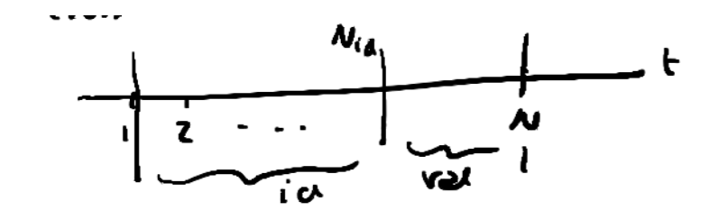

# Questions MIDA 1

*A series of answered questions from past exams of the course MIDA 1 as taught in Politecnico di Milano by Sergio Bittanti*

[TOC]

 
### 1 - Define the correlation $p$ between two random variables $v_1$ and $v_2$. Also, prove that $|p|\le1$.

two random variables can be condensed in a random vector, which is, in fact, a set of random variables.

let's say that 

$v=\begin{bmatrix}v_1 \\v_2\end{bmatrix}$.

$p$ is called *correlation* or *covariance coefficient* and it tells us how much two random variables are correlated the one with the other.
$$
p=\frac{\lambda_{12}}{\sqrt{\lambda_{11}} \sqrt{\lambda_{22}}}
$$
where $\lambda_{12}$ is the covariance between $v_1$ and $v_2$, $\lambda_{11}$ is the variance of $v_1$ and $\lambda_{22}$ is the variance of $v_2$.

To prove that $|p|\le 1$ let's define what is the variance of $v$, expressed as a matrix:
$$
var[v]=\begin{bmatrix} \lambda_{11} & \lambda_{12} \\ \lambda_{21} & \lambda_{22}\end{bmatrix}
$$
$var[v]$ is a positive semi-definite matrix. This means that the quadratic form is a positive semi-definite matrix $A$.
$$
f(x_1,x_2)=\begin{bmatrix}
x_1 &x_2\end{bmatrix}A\begin{bmatrix} x_1 \\ x_2\end{bmatrix}
$$
we have that $\det A\ge0 \to \lambda_{11}\lambda_{22}-\lambda_{12}\lambda_{21}\ge0$

Given that the variance is a positive semi-definite matrix we can conclude that 
$$
|p|\le 1
$$

 
### 2 - In order to find the appropriate complexity of a model, ne can use the cross-validation method. Explain the basic principle behind it

It consists in splitting the data points into two sets, one that is used to perform identification, while the other is used exclusively for the performance evaluation (validation set).
By using this approach, we are ”wasting” some of the data, because they cannot be used in the identification process.  

Specifically, we set an interval of possible values for the order of $n$, let's say $n_1\le n\le n_2$.  
For each $n$ we identify the optimal model, intended as the as the model that better explains the portion of identification-data.  
Afterwards we compare the prediction abilities of such optimal models (each associated with a different $n$) by computing the mean quadratic error for each model, on the validation set. The best model is the that minimizes such criterion.

For high values of $n$ we obtain models that learn the noise of the data $\to$ overfitting, so they don't perform well on the validation set.  

 
### 3 - Explain what is the purpose of the final prediction error FPE method and how it can be used in practice given a set of data

It is an alternative to crossvalidation.   
It allows not to waste any of the data we can exploit!  
FPE is an evaluation method used to choose the complexity of a model.  
It is used in order to obtain an objective evaluation of a certain model wrt the data collected.
$$
\bar{J}=E\bigg[\big(y(t)-\hat{y}_\theta(t)\big)^2\bigg]=E_s\bigg[\big(y(t,s)-\hat{y}_\theta (t,s)\big)^2\bigg]
$$

Where $\hat{y}_\theta$ is the prediction obtained wrt the real system, not wrt the obtained model. This quantity tells us the average goodness of the model, compute over all the possible data strings.

Moeover, so far , we have always estimated the parameters with the vector $\hat{\theta}_N$, obtained by minimizing the loss $J$; though, even $\hat{\theta}_N$ depends on chance, which means on the data strings we have chosen to use for the identification itself. We can then write:
$$
\hat{\theta}_N(s)
$$
And compute the FPE as:
$$
FPE=E\bigg[\bar{J}\big(\hat{\theta}_N(s)\big)\bigg]
$$
It represents the average adherence (to all possible data strings) of all models that can be estimated starting from some data strings.

We notice than that this quantity is not dependent on chance! Moreover, the following equivalence is valid:
$$
FPE=\frac{N+n}{N-n}J
$$
where $J$ is the subjective loss function, $N$ is the number of data, $n$ is the number of parameters of the model.

the $FPE$ is usually used for the estimation of ARX and ARMAX models, even though it has been developed to deal with AR models.

It can be used in practice to obtain an objective evaluation of our model. we just need to compute $J$, and insert the known values $N$ and $n$ into the equation. If we want to choose the complexity of our model we can try with different $n$ and look for the one that minimizes the FPE.

 
### 4 - Explain the Bayes problem and discuss the Bayes formula

modulo 1 or modulo 2?

 
### 5 - In HTE prediction theory for stationary processes in external representation form i.e. input/output models, the canonical representation has a main role, explain what it is meant by canonical representation specifying what is the input signal and what is the output signal of the representation and then highlight its properties. what is the role of this properties in the prediction theory?

 
### 6 - A measure problem in model identification is the choice of the model type and the selection of its appropriate complexity. Concisely present the available methods.

- Cross Validation
- FPE
- AIC

{TODO}

