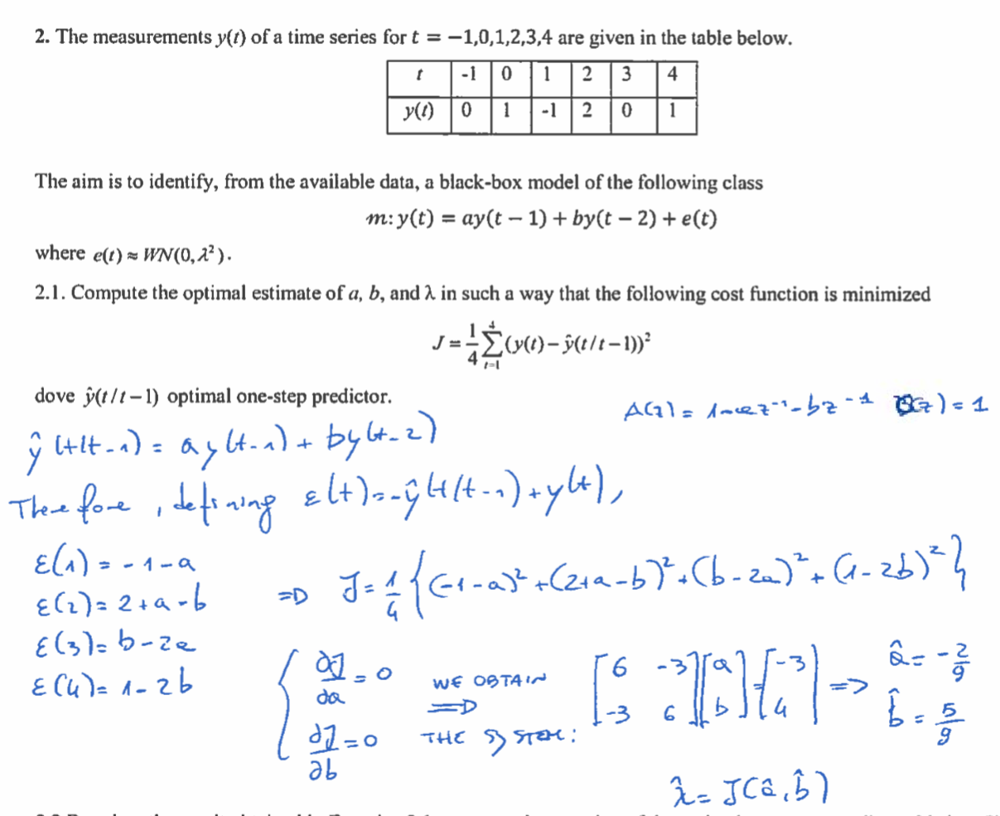

# Notes of Model Identification and Data Analysis

*A series of notes on the course MIDA modulo 1 as taught in Politecnico di Milano by Sergio Bittanti during the academic year 2018/2019*

[TOC]

 
# Side Notes

## Childhood Memories

- ${ae^{jw}=acos(w)+jasin(w)}$

- ${|z_1|^2=z_1\bar{z}_1}$

- ${e^{j\omega}+e^{j(-\omega)}=2cos(\omega)}$

- ***Gain of a transfer function***  
  if it's mathematically doable, ${\mu = G(s=0)=G(jw=0)}$, so in model analysis ${\mu=G(z=1)}$ since ${z=e^{jw}}$ 
  
- ***From the algebraic form to the exponential one***   
  ${z=a+jb=re^{jw}}$  
  $$
  r=\sqrt{a^2+b^2}
  $$
  
  $$
  \theta \in (-\pi,\pi] = \begin{cases} \frac{\pi}{2} \ \ \ \ \ \ \  \ \ \ \ \ \ \ \ \ \ \ \ \ \ \ \ \ se \ a=0,b>0 \\
  -\frac{\pi}{2} \ \ \ \ \ \ \ \ \ \ \ \ \ \ \ \ \ \ \ \  \ se  \ a=0,b<0 \\
  non \ definito \ \ \ \  \ se  \ a=0,b=0 \\
  \arctan(\frac{b}{a}) \ \ \ \ \ \ \  \ \  \ se \ a >0,b\ge0 \\
  \arctan(\frac{b}{a})+\pi \ \ \ se \ a <0,b\ge0 \\
  \arctan(\frac{b}{a})-\pi \ \ \ se \ a <0,b<0 \\
  \end{cases}
  $$
  
  $$
  \theta \in [0,2\pi) = \begin{cases} \frac{\pi}{2} \ \ \ \ \ \ \ \ \ \ \ \ \ \ \ \ \ \ \ \ \ \ \ \ \ \ se \ a=0,b>0 \\
  \frac{3\pi}{2} \ \ \ \ \ \  \ \ \ \ \ \ \ \ \ \ \ \ \ \ \ \ \ \  \ se  \ a=0,b<0 \\
  non \ definito \ \ \ \ \ \   \ se  \ a=0,b=0 \\
  \arctan(\frac{b}{a}) \ \ \ \ \ \ \ \ \  \ \  \ se \ a >0,b\ge0 \\
  \arctan(\frac{b}{a})+2\pi \ \ \ se \ a >0,b<0 \\
  \arctan(\frac{b}{a})+\pi \ \ \ \  \ se \ a <0,b \ qualsiasi \\
  \end{cases}
  $$
  
- ***Frequency Response Theorem***  
  Let ${u(t)=A\sin(\bar{w}t+\varphi)}$. If the system is asymptotically stable, at the end of the initial transitory, the output is sinusoidal as well.  
  $$
  y(t)=B\sin(\bar{w}t+\theta)
  $$

  $$
  \begin{cases} 
  B=A|G(j\bar{\omega})| \\
  \theta=\varphi+\ang{Gj\bar{\omega}}
  
  \end{cases}
  $$

   

## Observations

- in an ${MA(n)}$ all the covariances ${\gamma(\tau)}$ with ${\tau>n}$ are equal to zero: ${\gamma(tau>n)=0}$ 
- A process is stationary if its transfer function is stable (usually it means poles ${\le |1|}$) and it's fed by a stationary signal (i.e., a white noise).  
  NB: if the transfer function is in canonical form, it is surely stable.
- ${2\eta(t) \ \ \eta\sim WN(0,\lambda^2)\to\tilde{\eta}\sim WN(0,\lambda^22^2)}$
- In case the transfer function is fed by a white noise with ${E[\eta(t)]=0}$ we can simplify the expression in: 
  ${\gamma(y(t))=E[\space (\space y(t)\space)^2\space]}$

 

## Doubts

- is ${c_0}$ in MA processes always equal to 1?
- how to find out if a closed-loop system is stable? 
- why the results of the predictor found via PEM or via long division are different? when should I use one and why should I use the other? (page 28 exams pdf)
- if a signal has a zero, does its spectrum surely goes to zero at certain frequencies ? (page 33 exams pdf)

## Canonical Form

A stochastic process is in canonical form if its transfer function has the following properties:

- $N(z)$ and $D(z)$ have the same order
- $N(z)$ and $D(z)$ are monic (the coefficient of the highest degree variable is 1)
- $N(z)$ and $D(z)$ are coprime (no roots in common)
- zeros and poles are inside the unitary circle $(|z|\le1$ and $|p|\le1)$ 

 
# Exercises on Covariance & Spectra

**Variance and Spectra Properties**

If two signals ${\alpha}$ and ${\beta}$ are independent and ${\varphi=\alpha+\gamma}$:

- ${\gamma_\varphi=\gamma_\alpha+\gamma_\beta}$
- ${\Gamma(\varphi(t))=\Gamma(\alpha(t))+\Gamma(\beta(t))}$

**All Pass Filter**

${y(t)=\frac{1+az}{1+\frac{1}{a}z}\varphi(t)=(\frac{1}{a}\frac{1+az}{1+\frac{1}{a}z})a\varphi(t)=a\varphi(t)}$

## Covariance

### General method to compute variance and covariance of a process 

Transform your process in time domain:  
${y(t)= a_1y(t-1)+a_2y(t-2)+c_o\eta(t)+c_1\eta(t-1)}$

If we recognize that it is an ${MA(n)}$, we can use a shortcut. We wrote it somewhere, go find it. 

Compute ${E\big[y(t)\big]}$. if it is different from zero, transform it into an equivalent process with expected value equal to zero. =={TODO}==

Since ${E \big[ y(t)\big]=0}$ we see that  
${\gamma_y(0)=E\big[y(t)^2\big]-E\big[y(t)\big]^2=E\big[y(t)^2\big]}$ 

${\gamma_y(k)=E\bigg[\bigg(y(t)-E[y(t)]\bigg) \bigg( y(t-k)-E[y(t-k)]\bigg)\bigg]=E\bigg[y(t)y(t-k)\bigg]}$  

In order to compute the variance of ${y}$  do the following:

${\gamma_y(0)=E[y(t)y(t)]=E\Bigg[y(t)\bigg(a_1y(t-1)+a_2y(t-2)+c_o\eta(t)+c_1\eta(t-1)\bigg)\Bigg]}$  

now multiply all the members with one another and take in mind that:

- ${E\Big[y(t-k)\eta(t-j)\Big]=0}$   if ${k>j}$

- ${E\Big[y(t-k)\eta(t-k)\Big]=E\Big[y(t)\eta(t)\Big]=E\Bigg[\bigg(a_1y(t-1)+a_2y(t-2)+c_o\eta(t)+c_1\eta(t-1)\bigg)\eta(t)\Bigg]}$

- Once you compute ${\gamma_y(0)}$ or ${\gamma_y(1)}$ (or even other covariances...) you could obtain values dependent from other covariances, for example ${\gamma_y(0)=2\gamma_y(1)}$, but don't worry, in the end you'll have a system of ${n}$ unknown covariances and ${n}$ equations.

   

**Compute the Variance of an AR(1) process ${y(z)=\frac{1}{A(z)}\eta (z)}$**

1. Transform the function in the domain of time
2. knowing that ${\gamma_{y(t)}(0)=\gamma_{y(t-1)}(0)}$ and that ${y(t)=y(t-1)+\eta(t)}$ then ${\gamma_y(0)=\gamma_y(0)+\gamma_\eta(0)}$ if and only if ${y}$ and ${\eta}$ are independent, we can solve the last equation because usually the variance of ${\eta}$ is known.  
   Another important property of the variance is that ${\gamma(ay(t))=a^2 \gamma(y(t))}$ , given that ${a}$ is a constant.

### Draw the diagram of the prediction error variance as a function of the prediction horizon ${k}$

If they ask you such question, probably they already asked you to do the long division for ${k}$ steps.

Well, use the information gathered from that task, you'll use ${Q_1,Q_2,...,Q_k}$.

keep in mind that 
$$
\varepsilon (t|t-k)=Q_k(z)\tilde{e}(t)
$$
where ${\tilde{e}(t)}$ is the $WN$ of the process in canonical form.

${Q_k}$ are all known, so just propagate the variance within the equation:   ${Var(\varepsilon(t|t-k))=Var(Q_k\tilde{e}(t))}$ 

To do the diagram just put the ${k}$ in the ${x}$ axis, and ${variance(\varepsilon)}$ in the ${y}$ axis.

## Spectra

### Compute the spectrum via definition

$$
\Gamma(\omega)=\sum_{t=-\tau}^{+\tau}\gamma(t)e^{-j\omega t}
$$

### Compute the spectrum via magic formula

$$
\Gamma(\omega)=|W(e^{jw})|^2var(\eta(t))
$$

 
# Exercise on Minimum Variance Controller

(This is probably just for MIDA2)

**First step: compute the ${k}$-steps predictor**

1. Make sure to be in canonical form.  
2. Compute the long division of the transfer function of ${\eta}$, which is ${\frac{C(z)}{A(z)}}$. we stop at the ${k}$-th iteration and we obtain ${R_k}$ and ${Q_k}$ (sometimes called ${E_k}$).
3. the ${k}$-steps predictor is:  
   ${\hat{y}(t|t-k)=\frac{\hat{R}_k}{C(z)}y(t-k)+\frac{B(z)Q_k}{C(z)}u(t-k)}$

**Knowing the predictor ${y(t+2|t)}$, design the Minimum Variance Controller for the system, considering a reference signal ${y^0(t)}$.**    
$$
y(t)=\frac{C(z)}{A(z)}\eta(t)+\frac{B(z)}{A(z)}u(t-k)
$$
We set ${\hat{y}(t+2|t)=y^0(t)}$.  
We are able to set it this way if and only if ${B(z)}$ has ${|z|<1}$.

Isolate ${u(t)}$. 

**Draw the block diagram of the control system ${X}$**  
the input is ${y^0(t)}$, the output is ${y(t)}$.  take the expression of ${y}$ that is provided to you by the text.

 
# Optimal Estimates of Parameters via PEM

### Tips

- sometimes, in order to solve the systems it's handy to compute, for example, ${(c_1+c_2)^2=\frac{\gamma(0)+2\gamma(1)}{var(e(t))}}$ and ${(c_1-c_2)^2}=\frac{\gamma(0)-2\gamma(1)}{var(e(t))}.$ 

### For ${MA}$ Processes 

 **Suppose to have infinitely many data generated by the following system:**
$$
\delta: y(t)=2\eta (t) +4\eta(n-2)
$$
**where ${\eta(t)\sim WN(0.1)}$ **

**For such data, consider the model classes:**
$$
M_1(a):y(t)=a_1y(t-1)+\xi_1(t)
$$

$$
M_2(a):y(t)=a_1y(t-2)+\xi_2(t)
$$

**where ${\xi_1(t)\sim WN(0,\lambda_1^2) \ and \ \xi_2(t)\sim 	wn(0,\lambda_2^2)}$**

**By using the prediction error minimization method, find the optimal estimates of parameters ${a_1}$ and ${a_2}$.**

in this case we have a ${MA(2)}$ for ${\delta}$. 

This means that we can compute the covariances in the following way:  
Knowing that ${y(t)=c_0\eta(t)+c_1\eta(t-1)+...}$
$$
\gamma(0)=(c_0^2+c_1^2+...c_{n-1}^2)\gamma(\varepsilon(t))
$$

$$
\gamma(1)=(c_0c_1+c_1c_2+...+c_{n-2}c_{n-1})\gamma(\varepsilon(t))
$$

$$
\gamma(2)=(c_0c_2+c_1c_3+...+c_{n-3}c_{n-1})\gamma(\varepsilon(t))
$$

$$
\gamma(3)=(c_0c_3+c_1c_4+...+c_{n-4}c_{n-1})\gamma(\varepsilon(t))
$$

Let's consider only the first model:  
$$
M_1(a):y(t)=a_1y(t-1)+\xi_1(t)
$$
we want it in the form:
$$
y(t)=\frac{C(z)}{A(z)}\xi_1(t)
$$
and we obtain:
$$
C(z)=1 ; \ \ A(z)=1-a_1z^{-1}
$$
we can now write the predictor of ${y}$:
$$
\hat{y}(t|t-1)=\frac{C(z)-A(z)}{C(z)}y(t)=a_1z^{-1}y(t)
$$
And thus compute the prediction error ${\varepsilon}$:  
$$
\varepsilon(t)=y(t)-\hat{y}(t|t-1)=y(t)-a_1z^{-1}y(t)
$$
Now we can compute ${J}$, the performance index based on the prediction error:
$$
J=E[(\varepsilon(t))^2 ]=E[(y(t)-a_1y(t-1))^2]=E[y^2(t)]+a_1E[y^2(t-1)]-2a_1E[y(t)y(t-1)]
$$
We know that, being ${\eta\sim WN(0,1)}$, we have ${E[y^2(t)]=\gamma_y(0)=E[y(t-1)]}$

so:
$$
J=\gamma_y(0)+a_1^2\gamma_y(0)-2a_1\gamma_y(1)
$$
and we derive ${J}$ wrt ${a_1}$ and equal it to zero
$$
\frac{\delta J}{\delta a_1}=...=2(-\gamma_y(1)+a_1\gamma_y(0))=0
$$
Thus obtaining
$$
\hat{a}_1=0
$$
We repeat the process to find ${a_2}$ using the model ​ ${M_2}$

 
### For ${AR}$ Processes  

**Knowing that ${\gamma_v(0)=10,\gamma_v(\pm 1)=0,\gamma_v(\pm2)=0,\gamma_v(\pm3)=3,\gamma_v(\tau)=0 \ \forall\tau:|\tau|\ge4  }$.  
Consider the model class**
$$
M:v(t)=av(t-1)+bv(t-2)+cv(t-3)+\eta(t)
$$
**with ${\eta \sim WN(0,\lambda^2)}$**

**By using the prediction error minimization method, find the optimal estimates of the parameters ${a}$, ${b}$ and ${c}$.**

The predictor is equal to the starting equation but for the ${\eta}$ component:
$$
\hat{v}(t|t-1)=av(t-1)+bv(t-2)+cv(t-3)
$$
The prediction error ${\varepsilon}$ is always:
$$
\varepsilon(t)=v(t)-\hat{v}(t|t-1)
$$
Now let's compute ${J}$:
$$
J=E[(\varepsilon(t))^2]=
$$

$$
E[v^2(t)+a^2v^2(t-1)+b^2v^2(t-1)+c^2v^2(t-3)+
$$

$$
-2av(t)v(t-1)-2bv(t)v(t-2)-2cv(t)v(t-3)+
$$

$$
2abv(t-1)v(t-2)+2acv(t-1)v(t-3)+2bcv(t-2)v(t-3)]=
$$

$$
\gamma_v(0)+a^2\gamma_v(0)+b^2\gamma_v(0)+c^2\gamma_v(0)-2a\gamma_v(1)-2b\gamma_v(2)-2c\gamma_v(3)+2ab\gamma_v(1)+2ac\gamma_v(2)+2bc\gamma_v(1)
$$

$$
J=\gamma_v(0)( 1+a^2+b^2+c^2)-2c\gamma_v(3)
$$

To minimize ${J}$ we observe that we should impose ${\hat{a}=\hat{b}=0}$

and, as always, let's derive wrt ${c}$:
$$
\frac{\delta J}{\delta c}=2c\gamma_v(0)-2\gamma_v(3)\to \hat{c}=\frac{\gamma_v(3)}{\gamma_v(0)}=\frac{3}{10}
$$

 
# Parameter Estimation 

## Knowing Variance

**MA**

Usually asks which is the most suitable model class for representing the available data.  
If you notice that ${\gamma(\tau)=0}$ for ${\tau>n}$, where ${n}$ is a finite number, you can say that the most suitable model class is a ${MA(n)}$.

Write the general equation for MA processes:
$$
v(t)=e(t)+a_1e(t-1)+a_2e(t-2)+...a_ne(t-n)
$$
and use the known formulas for the covariances of MA processes to build a system of ${n+1}$ equations, then solve it. 

## Knowing Measurements

 

# Optimal Predictors via Long Division (only $e(t)$ case)

- take the process equation and put it in canonical form

- once you do it you'll have something in the form ${y(t)=\frac{C(z)}{A(z)}e(t)}$

- $C(z)$ on the left, $A(z)$ on the right. Do the long division:  
  Let's for example compute the optimal 1-step predictor:  
  Do the long division between $C(z)$ and $A(z)$. 
  you'll obtain a quotient ${Q_1}$ and a remainder ${R_1}$, and such remainder can be called the 1-step remainder. ${R_1}$ and ${Q_1}$ will be used for the 1-step predictor in the following way:  
  $$
  \hat{y}(t|t-1)=\frac{R_1}{C(z)}y(t)
  $$
  
  So, if you want to compute the k-step predictor, just compute ${Q_K}$ and ${R_k}$ (which are the results of the ${k}$-th iteration of the long division) and use the generalize formula:  
  $$
  \hat{y}(t|t-k)=\frac{R_k}{C(z)}y(t)
  $$
  take care, if a ${z}$ term is missing, for example ${y(t)=1-z^{-2}}$, the predictor of the missing ${z}$ term is the same of the predictor of the next ${z}$ term's corresponding step. so in this case the 1-step predictor is the same of the 2-steps predictor.

 
