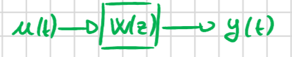
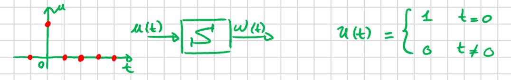
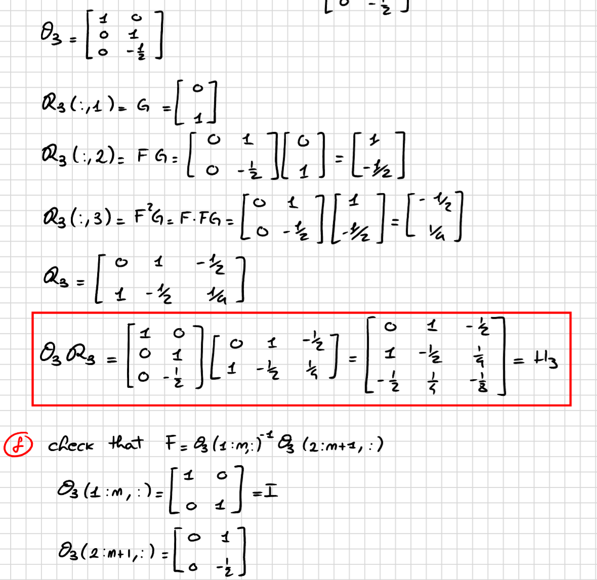

# Notes of Model Identification and Data Analysis Modulo 2

*A series of notes on the course MIDA Modulo 2 as taught in Politecnico di Milano by Savaresi during the academic year 2018/2019.*

[TOC]

 

## Childhood Memories

- Geometric Series
  $$
  \sum_{k=0}^\infty a^i=\frac{1}{1-a}
  $$

- Matrix's Inverse
  $$
  A^{-1}=\frac{1}{|A|}
  \begin{bmatrix}
  c_{11} & c_{12} & \dots & c_{1n}
  \\
  c_{21} & c_{22} & c_{23} & c_{2n}
  \\
  \vdots & \vdots & \ddots & \vdots
  \\
  c_{n1} & c_{n2} & \dots & c_{nn}
  \end{bmatrix}^T
  $$

- Zero-Pole Cancellation
  $$
  W_1(z)=\frac{(z+2)}{(z+\frac{1}{2})(z+2)}\to W_2(z)=\frac{1}{z+\frac{1}{2}}
  $$
  $W_1$ and $W_2$ are the same: they represent the same input output relationship.
  That said,  
  $$
  W_1(z)=\frac{(z+2)}{(z+\frac{1}{2})(z+2)}=\frac{z+2}{z^2+\frac{5}{2}z+1} \leftarrow 2^{nd} \ order  \ unstable \  system
  \\
  W_2(z)=\frac{1}{z+\frac{1}{2}} \leftarrow 1^{st} \ order \ stable \ system \color{red} \ (WRONG \ CONCLUSION)
  \\
  \color{red}DO \ NOT \ CANCEL \ NUMERATOR \ - \ DENOMINATOR \ COMMON \ TERMS!
  $$
  

 

# Session 1 & 2

## Write the system of difference equations

$$
\begin{cases}
x(t+1)=Fx(t)+Gu(t) \leftarrow state \ equation 
\\
y(t)=Hx(t)+Ku(t) \ \ \ \ \ \  \leftarrow output \ equation  
\end{cases}
$$

$$
x(t)= 
\begin{bmatrix} 
x_1(t) 
\\
.
\\
.
\\
.
\\
x_n(t)
\end{bmatrix}
\in \R^n
\\
$$

$$
y(t),u(t) \in \R^1
$$

 

## Compute the system transfer function

$$
y(t)=W(z)u(t)
$$

The transfer function is a representation of the input-output relationship.

There are two methods available.

### First Method - $z$ Transformation

Apply the z-transformation directly to the system of difference equations.
$$
v(t+1)=z\cdot v(t)
$$
Solve the system wrt to $u$.  
Your goal is to end up with a representation of $y$ in function of $u$.  
The coefficient of $u$ is  $W$, the transfer function.

### Second Method - Transformation Formula

We use the transformation formula.
$$
W(z)=H(zI-F)^{-1}+D
$$

1. Compute $zI-F$
2. Compute $det(zI-F)$
3. Compute $(zI-F)^{-1}$
4. Compute $W(z)=H(zI-F)^{-1}+D$

 

## Compute the first 4 impulse response elements

What is impulse response?

Simply the output you obtain after you have an impulse input in your system. the input is $u(t)$.

There are four methods to compute it.

### First Method - From Difference Equations 

From the system of difference equations.

Let's say for example the difference equations are
$$
\begin{cases}
x(t+1)=\frac{1}{2}x(t)+2u(t)
\\
y(t)=3x(t)
\end{cases}
$$
The definition of impulse is the following:
$$
u(t)=
\begin{cases}
1 & t=0
\\
0 & t \neq 0
\end{cases}
$$
if it is not specified consider the initial state equal to zero: $x(0)=0$.

Let's do the math:
$$
t=0 \ \ \ \ \ \ \ \ \ \ x(0)=0  \ \ \ \ \ \ \ \ \ \ \ \ \ \ \ \ \ \ \ \ \ \ \ \ \ \  \  \ \ \ \ \ \ \ \ \ \ \ \ \ \ \ \ \ \ \ \  \ \ \ \ \ \ \ \ \ \  \ \ \ \ \ \ \ \ \ \  \ \ \ \ \ \ \ \ \ \   y(0)=3x(0)=0
\\
t=1\ \ \ \ \ \ \ \ \ \  x(1)=\frac{1}{2}x(0)+2u(0)=2 \ \ \ \ \ \ \ \ \ \ \ \ \ \ \ \ \ \ \ \  \ \ \ \ \ \ \ \ \ \  \ \ \ \ \ \ \ \ \ \  \ \ \ \ \ \ \  y(1)=3x(1)=6
\\
t=2
\ \ \ \ \ \ \ \ \ \ x(2)=\frac{1}{2}x(1)+2u(1)=1	\ \ \ \ \ \ \ \ \ \ \ \ \ \ \ \ \ \ \ \  \ \ \ \ \ \ \ \ \ \  \ \ \ \ \ \ \ \ \ \  \ \ \ \ \ \ \ y(2)=3x(2)=3
\\
t=3
\ \ \ \ \ \ \ \ \ \ x(3)=\frac{1}{2}x(2)+2u(2)=\frac{1}{2} 	 \ \ \ \ \ \ \ \ \ \ \ \ \ \ \ \ \ \ \  \ \ \ \ \ \ \ \ \ \  \ \ \ \ \ \ \ \ \ \  \ \ \ \ \ \ \ y(3)=3x(3)=\frac{3}{2}
\\
t=4
\ \ \ \ \ \ \ \ \ \  x(4)=\frac{1}{2}x(3)+2u(3)=\frac{1}{4}	 \ \ \ \ \ \ \ \ \ \ \ \ \ \ \ \ \ \ \  \ \ \ \ \ \ \ \ \ \  \ \ \ \ \ \ \ \ \ \  \ \ \ \ \ \ \ y(4)=3x(4)=\frac{3}{4}
\\
t=5
\ \ \ \ \ \ \ \ \ \  x(5)=\frac{1}{2}x(4)+2u(4)=\frac{1}{8}	 \ \ \ \ \ \ \ \ \ \ \ \ \ \ \ \ \ \ \  \ \ \ \ \ \ \ \ \ \  \ \ \ \ \ \ \ \ \ \  \ \ \ \ \ \ \ y(5)=3x(5)=\frac{3}{8}
$$

The impulse responses are given by the value of $y$ at each timestep $t$:
$$
w(0)=0;
\\
w(1)=6;
\\
w(2)=3;
\\
w(3)=\frac{3}{2};
\\
w(4)=\frac{3}{4};
\\
w(5)=\frac{3}{8};
$$

### Second Method - Matrix Multiplication Formula

The following formula is always the definition of impulse, but it's expressed in a way that is valid only for strictly proper systems.
$$
w(t)=
\begin{cases}
0 & t=0
\\
HF^{t-1}G & t>0
\end{cases}
$$
Let's consider the following matrices to go along with the example:
$$
H=\begin{bmatrix}1 & 0\end{bmatrix}
\\
G=\begin{bmatrix} 0 \\ 2 \end{bmatrix}
\\
F=\begin{bmatrix} 0 & 1 \\ \frac{1}{2} & 0\end{bmatrix}
\\
D=0
$$
Let's start:

$w(0)=0$  

$w(1)=HG=\begin{bmatrix}  1 & 0\end{bmatrix} \begin{bmatrix}0 \\ 2 \end{bmatrix}$

$w(2)=HFG=2$

$w(3)=HF^2G=0$

$w(4)=HF^3G=1$

$w(5)=HF^4G=0$

from $HFG$ on we can exploit the previous computation (for example, in order to compute $w(3)$ we can exploit $HF$ found for computing $w(2)$).

### Third Method - Long Division

Long division.

The output is represented like this:
$$
y(t)=w(0)u(t)+w(1)u(t-1)+w(2)u(t-2)+...
$$
If we want the first 4 impulse responses we should write the above equation until the  $w(4)u(t-4)$ component.

And we do the following:
$$
y(t)=\bigg(w(0)+w(1)z^{-1}+w(2)z^{-2}+...\bigg)u(t)
$$

$$
W(z)=\frac{B(z)}{A(z)}=w(0)+w(1)z^{-1}+w(2)z^{-2}+...
\\
\uparrow \ \  \ \ \ \ \ \ \ \ \ \ \ \ \ \ \ \ \ \ \ \ \ \ \  \ \ \  
\\
long  \ division \ \ \ \ \ \ \ \ \ \ \ \ \ \ \ \ \ \ \ \ \ \ \ \ \ \ \ \
$$

We already know $B$ and $A$.   
Let's do the long division and equal it to the right member of the equation above.

Once done the long division you'll easily find the values for $w(0),w(1),w(2),w(3)$ and $w(4)$ just by looking at the coefficients of $z$ terms.

You can stop doing the long division ass soon as you get the coefficients you are looking for, no need to go further obviously.

### Fourth Method - Geometric Series Trick

Probably it's useful when the matrices are one-dimensional.  
First of all we need to compute the transfer function.
$$
W(z)=H(zI-F)^{-1}+D
$$
You'll obtain a transfer function that hides a geometric series inside.  
In an exercise I found:
$$
W(z)=\dots=\frac{6}{z-\frac{1}{2}}=\frac{6z^{-1}}{1-\frac{1}{2}z^{-1}}=6z^{-1}\Bigg(\frac{1}{1-\frac{1}{2}z^{-1}}\Bigg)=6z^{-1}\Bigg(\sum_{k=0}^\infty \bigg(\frac{1}{2}z^{-1}\bigg)^k\Bigg)
\\
=6z^{-1}\Bigg(1+\frac{1}{2}z^{-1}+\frac{1}{4}z^{-2}+\frac{1}{8}z^{-3}+\frac{1}{16}z^{-4}+\frac{1}{32}z^{-5}+\dots\Bigg)=
\\
=6z^{-1}+3z^{-2}+\frac{3}{2}z^{-3}+\frac{3}{4}z^{-4}+\frac{3}{8}z^{-5}+\dots
\\
\downarrow
w(0)=0; \ \ \ \ w(1)=6; \ \ \ \ w(2)=3; \ \ \ \ w(3)=\frac{3}{2}; \ \ \ \ w(4)=\frac{3}{4}; \ \ \ \ w(5)=\frac{3}{8}
$$

 

## Check the system observability and reachability 

### Observability

$J$ is observable if and only if the observability matrix $\theta$ is full rank $(det\neq 0)$.  
Where 
$$
\theta = 
\begin{bmatrix}  
H
\\
HF
\\
HF^2
\\ 
\vdots
\\
FF^{n-1}
\end{bmatrix}
$$
What does it mean that $J$ is not observable?  
For example, a zero-pole cancellation correspond to a hidden part of the system: something that the I/O representation cannot catch.

In this case there is a non-observable part:

### Reachability

$J$ is reachable if and only if the reachability matrix $\mathscr{R}$ is full rank $(det \neq 0)$.  
Where
$$
\mathscr{R}=\begin{bmatrix}G \ \ \  \ FG \  \ \ \ F^2G \ \ \ \ \dots \ \  \ \ F^{n-1}G \end{bmatrix}
$$
   

 

## Compute the Hankel Matrix of order $n$

### Definition

$$
H_n=
\begin{bmatrix} 
w(1) & w(2) & w(3) & \dots &w(n-1) & w(n)
\\
w(2) & w(3) & w(4) & \dots &w(n) & w(n+1)
\\
w(3) & w(4) & w(5) & \dots &w(n-2) & w(n-1)
\\
\vdots
\\
w(n) & w(n+1) & w(n+2) & \dots &w(2n-2) & w(2n-1)

\end{bmatrix}
$$

### Shortcut

$$
H_n=\theta \mathscr{R}
$$

 

## Given the input response compute the  transfer function

Let's explain it with an example:

Input Response:
$$
w(t)=
\begin{cases} 
0 & t\le 1
\\
(-2)^{2-t} & t>1
\end{cases}
$$
May be helpful to draw the input response from some instants $t$.

The thing we need to remember is that
$$
y(t)=w(0)+w(1)u(t-1)+w(2)u(t-2)+ \dots
$$
so we know $w(t)  \  \forall t$ and we end up having
$$
y(t)=z^{-2}\bigg(1-\frac{1}{2}z^{-1}+\frac{1}{4}z^{-4}+\dots \bigg)u(t)
\\
=z^{-2}\Bigg(\sum_{k=0}^\infty \bigg(-\frac{1}{2}z^{-1}\bigg)^k\Bigg)u(t)
\\
=\color{blue}z^{-2}\Bigg(\frac{1}{1+\frac{1}{2}z^{-1}}\Bigg)\color{black}u(t)
$$
The blue colored part of the equation is our transfer function $W$.

 

## Write the state space representation 

### Control Form

The state space system in control form is given by 
$$
W(z)=\frac{b_0z^{n-1}+b_1z^{n-2}+\dots + b_{n-1}}{z^n+a_1z^{n-1}+\dots+a_n}
$$
(This means that we want the transfer function expressed with all exponents of the $z$ terms greater or equal to zero).

$n=$the order of $A$.
$$
F=
\begin{bmatrix}
0 & 1 & 0 & 0 & 0 & 0 & 0 & 0 
\\  
0 & 0 & 1 & 0 & 0 & 0 & 0 & 0 
\\
0 & 0 & 0 & 1 & 0 & 0 & 0 & 0 
\\
0 & 0 & 0 & 0 & 1 & 0 & 0 & 0 
\\
0 & 0 & 0 & 0 & 0 & 1 & 0 & 0 
\\
0 & 0 & 0 & 0 & 0 & 0 & 1 & 0 
\\ 
0 & 0 & 0 & 0 & 0 & 0 & 0 & 1 
\\
-a_n & -a_{n-1} & \dots & \dots & \dots & \dots & \dots& -a_1  
\end{bmatrix}
$$

$$
G=
\begin{bmatrix}
0
\\
\vdots
\\
0
\\
1
\end{bmatrix}
$$

$$
H=\begin{bmatrix} b_{n-1} & \dots & b_0  \end{bmatrix}
$$

$$
D=\begin{bmatrix} 0 \end{bmatrix}
$$

In order to check whether you have computed correctly such matrixes you can make sure that
$$
W(z)=H(zI-F)^{-1}+D
$$

### 4SID method

1. ***Identify the system order***  
   Start by considering $i=1$, compute the rank, and increase $i$. Compute the new rank. as soon as the rank stops increasing you have found the order of the system.   
   Schematized below. 

   $rank(H_i)=n \ \ \ \ i \ge n \to n \ is \ the \ system \ order$  
   $$
   the \ rank \ stops \ increasing \begin{cases} rank(H_{n-1})<n
   \\
   rank(H_n)=n
   \\
   rank(H_{n+1})=n
   \end{cases}
   $$
   Example:  
    

2. ***Build*** $H_{n+1}$

3. ***Find a factorization of*** $H_{n+1}= \theta_{n+1} \mathscr{R}_{n+1}$  
   How to do it?  

   - put $n$ independent rows of $H_{n+1}$ in $\mathscr{R}_{n+1}$ 
   - fill the rows of $\theta_{n+1}$ such that $H_{n+1}=\theta_{n+1}\mathscr{R}_{n+1}$ 

   Example:  
   

4. ***Extract matrices*** $\hat{F},\hat{G},\hat{H},\hat{D}$   
   $\hat{F}=\theta_{n+1}(1:n,:)^{-1}\theta_{n+1}(2:n+1,:)$  
   $\hat{G}=\mathscr{R}_{n+1}(:,1)$  
   $\hat{H}=\theta_ {n+1}(1,:)$  
   $\hat{D}=0$ $\to$ usually like this, since the system is usually strictly proper $(w(0)=0)$.

We get new system matrices wrt the original ones $\to$ we have found an equivalent state space representation.

### $\hat{D} \neq 0$ case

If $w(0) \neq 0$ (in this case we are told that $w(0)=1$) the system is not strictly proper and $\hat{D} \neq 0$.

In this case let's consider a general state space system (SISO).
$$
\begin{cases}
x(t+1)=Fx(t)+Gu(t)
\\
y(t)=Hx(t)+Du(t)
\end{cases}
$$
Always consider $x(0)=0$  if no one tells you differently

and 

$u(t)=\begin{cases} 1 & t=0 \\ 0 & t \neq 0\end{cases}$ 

We infer that:

$t=0$           $y(0)=Hx(0)+Du(0)=D$    

$D$ is the first sample of the impulse response!
$$
\hat{D}=w(0)=1
$$

 

## Apply the change of variable $\tilde{x}=Tx$ with $T=\begin{bmatrix} 1 & 1 \\ 1 & -1 \end{bmatrix}$ to the difference equations

The difference equations are
$$
\begin{cases}
x(t+1)=Fx(t)+Gu(t)
\\
y(t)=Hx(t)+Ku(t) 
\end{cases}
\\
\ 
\\
\
\\
\tilde{x}(t)=Tx(t)
\\
\ 
\\
\
\\
\color{blue}
\begin{cases}
\tilde{x}(t+1)=\tilde{F}\tilde{x}(t)+\tilde{G}u(t) 
\\
y(t)=\tilde{H}\tilde{x}(t)+\tilde{K}u(t) 
\end{cases}
\color{black}
\\ 
\
\\
\
\\

x(t)=T^{-1}\tilde{x}(t)
\\
\
\\ 
\
\\
\begin{cases}
T^{-1}\tilde{x}(t+1)=FT^{-1}\tilde{x}(t)+Gu(t) 
\\
y(t)=HT^{-1}\tilde{x}(t)+Ku(t) 
\end{cases}
\\
\
\\
\downarrow
\\
\
\\
\begin{cases}
\tilde{x}(t+1)=TFT^{-1}\tilde{x}(t)+TGu(t) 
\\
y(t)=HT^{-1}\tilde{x}(t)+Ku(t) 
\end{cases}

$$

The first and the second systems (black one and blue one) are ***equivalent***: they have the same input output relationships.

All the transformations are done on the black system, the source one, in order to find the blue one, characterized by $\tilde{F},\tilde{G},\tilde{H}$ and $\tilde{K}$.
$$
\tilde{F}=TFT^{-1}
\\
\tilde{G}=TG
\\
\tilde{H}=HT^{-1}
\\
\tilde{K}=K
$$
Once we have such formulas we just need to compute the new matrices and get the new difference equations.

 

 

# Doubts

-   
  non capisco la dicitura $\theta(1:n,:)$, non dovrebbe essere: considera le le riga dalla $1$ alla $n$ e tutte le colonne?