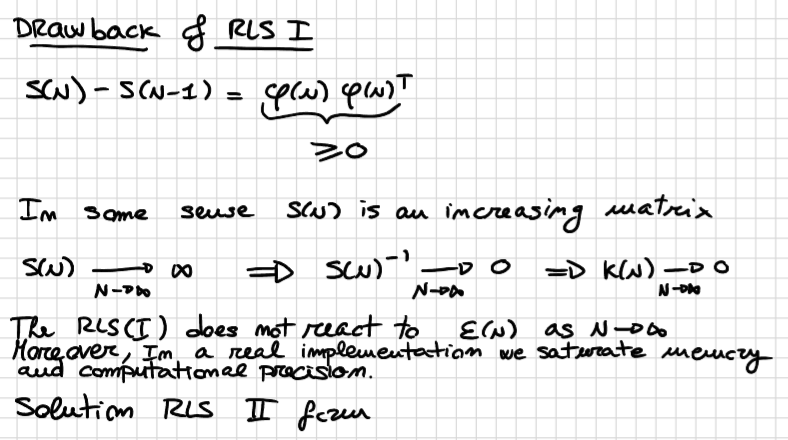

# Notes of Model Identification and Data Analysis Modulo 2

*A series of notes on the course MIDA Modulo 2 as taught in Politecnico di Milano by Savaresi during the academic year 2018/2019.*

[TOC]

## Childhood Memories

- Geometric Series
  $$
  \sum_{k=0}^\infty a^i=\frac{1}{1-a}
  $$

- Matrix's Inverse
  $$
  A^{-1}=\frac{1}{|A|}
  \begin{bmatrix}
  c_{11} & c_{12} & \dots & c_{1n}
  \\
  c_{21} & c_{22} & c_{23} & c_{2n}
  \\
  \vdots & \vdots & \ddots & \vdots
  \\
  c_{n1} & c_{n2} & \dots & c_{nn}
  \end{bmatrix}^T
  $$

- Zero-Pole Cancellation
  $$
  W_1(z)=\frac{(z+2)}{(z+\frac{1}{2})(z+2)}\to W_2(z)=\frac{1}{z+\frac{1}{2}}
  $$
  $W_1$ and $W_2$ are the same: they represent the same input output relationship.
  That said,  
  $$
  W_1(z)=\frac{(z+2)}{(z+\frac{1}{2})(z+2)}=\frac{z+2}{z^2+\frac{5}{2}z+1} \leftarrow 2^{nd} \ order  \ unstable \  system
  \\
  W_2(z)=\frac{1}{z+\frac{1}{2}} \leftarrow 1^{st} \ order \ stable \ system \color{red} \ (WRONG \ CONCLUSION)
  \\
  \color{red}DO \ NOT \ CANCEL \ NUMERATOR \ - \ DENOMINATOR \ COMMON \ TERMS!
  $$
  

 
# Session 1 & 2

## Write the system of difference equations

$$
\begin{cases}
x(t+1)=Fx(t)+Gu(t) \leftarrow state \ equation 
\\
y(t)=Hx(t)+Ku(t) \ \ \ \ \ \  \leftarrow output \ equation  
\end{cases}
$$

$$
x(t)= 
\begin{bmatrix} 
x_1(t) 
\\
\vdots
\\
x_n(t)
\end{bmatrix}
\in \R^n
\\
$$

$$
y(t),u(t) \in \R^1
$$

## Compute the system transfer function

$$
y(t)=W(z)u(t)
$$

The transfer function is a representation of the input-output relationship.

There are two methods available.

### First Method - $z$ Transformation

Apply the z-transformation directly to the system of difference equations.
$$
v(t+1)=z\cdot v(t)
$$
Solve the system wrt to $u$.  
Your goal is to end up with a representation of $y$ in function of $u$.  
The coefficient of $u$ is  $W$, the transfer function.

### Second Method - Transformation Formula

We use the transformation formula.
$$
W(z)=H(zI-F)^{-1}+D
$$

1. Compute $zI-F$
2. Compute $det(zI-F)$
3. Compute $(zI-F)^{-1}$
4. Compute $W(z)=H(zI-F)^{-1}+D$

 
## Compute the first 4 impulse response elements

What is impulse response?

Simply the output you obtain after you have an impulse input in your system. the input is $u(t)$.

There are four methods to compute it.

### First Method - From Difference Equations 

Let's say for example the difference equations are
$$
\begin{cases}
x(t+1)=\frac{1}{2}x(t)+2u(t)
\\
y(t)=3x(t)
\end{cases}
$$
The definition of impulse is the following:
$$
u(t)=
\begin{cases}
1 & t=0
\\
0 & t \neq 0
\end{cases}
$$
if it is not specified consider the initial state equal to zero: $x(0)=0$.

Let's do the math:
$$
t=0 \ \ \ \ \ \ \ \ \ \ x(0)=0  \ \ \ \ \ \ \ \ \ \ \ \ \ \ \ \ \ \ \ \ \ \ \ \ \ \  \  \ \ \ \ \ \ \ \ \ \ \ \ \ \ \ \ \ \ \ \  \ \ \ \ \ \ \ \ \ \  \ \ \ \ \ \ \ \ \ \  \ \ \ \ \ \ \ \ \ \   y(0)=3x(0)=0
\\
t=1\ \ \ \ \ \ \ \ \ \  x(1)=\frac{1}{2}x(0)+2u(0)=2 \ \ \ \ \ \ \ \ \ \ \ \ \ \ \ \ \ \ \ \  \ \ \ \ \ \ \ \ \ \  \ \ \ \ \ \ \ \ \ \  \ \ \ \ \ \ \  y(1)=3x(1)=6
\\
t=2
\ \ \ \ \ \ \ \ \ \ x(2)=\frac{1}{2}x(1)+2u(1)=1	\ \ \ \ \ \ \ \ \ \ \ \ \ \ \ \ \ \ \ \  \ \ \ \ \ \ \ \ \ \  \ \ \ \ \ \ \ \ \ \  \ \ \ \ \ \ \ y(2)=3x(2)=3
\\
t=3
\ \ \ \ \ \ \ \ \ \ x(3)=\frac{1}{2}x(2)+2u(2)=\frac{1}{2} 	 \ \ \ \ \ \ \ \ \ \ \ \ \ \ \ \ \ \ \  \ \ \ \ \ \ \ \ \ \  \ \ \ \ \ \ \ \ \ \  \ \ \ \ \ \ \ y(3)=3x(3)=\frac{3}{2}
\\
t=4
\ \ \ \ \ \ \ \ \ \  x(4)=\frac{1}{2}x(3)+2u(3)=\frac{1}{4}	 \ \ \ \ \ \ \ \ \ \ \ \ \ \ \ \ \ \ \  \ \ \ \ \ \ \ \ \ \  \ \ \ \ \ \ \ \ \ \  \ \ \ \ \ \ \ y(4)=3x(4)=\frac{3}{4}
\\
t=5
\ \ \ \ \ \ \ \ \ \  x(5)=\frac{1}{2}x(4)+2u(4)=\frac{1}{8}	 \ \ \ \ \ \ \ \ \ \ \ \ \ \ \ \ \ \ \  \ \ \ \ \ \ \ \ \ \  \ \ \ \ \ \ \ \ \ \  \ \ \ \ \ \ \ y(5)=3x(5)=\frac{3}{8}
$$

The impulse responses are given by the value of $y$ at each timestep $t$:
$$
w(0)=0; \ \ 
w(1)=6;\ \ 
w(2)=3;\ \ 
w(3)=\frac{3}{2};\ \ 
w(4)=\frac{3}{4};\ \ 
w(5)=\frac{3}{8};\ \ 
$$

 
### Second Method - Matrix Multiplication Formula

The following formula is always the definition of impulse, but it's expressed in a way that is valid only for strictly proper systems.
$$
w(t)=
\begin{cases}
0 & t=0
\\
HF^{t-1}G & t>0
\end{cases}
$$
Let's consider the following matrices to go along with the example:
$$
H=\begin{bmatrix}1 & 0\end{bmatrix}
\\
G=\begin{bmatrix} 0 \\ 2 \end{bmatrix}
\\
F=\begin{bmatrix} 0 & 1 \\ \frac{1}{2} & 0\end{bmatrix}
\\
D=0
$$
Let's start:

$w(0)=0$  

$w(1)=HG=\begin{bmatrix}  1 & 0\end{bmatrix} \begin{bmatrix}0 \\ 2 \end{bmatrix}$

$w(2)=HFG=2$

$w(3)=HF^2G=0$

$w(4)=HF^3G=1$

$w(5)=HF^4G=0$

from $HFG$ on we can exploit the previous computation (for example, in order to compute $w(3)$ we can exploit $HF$ found for computing $w(2)$).

 
### Third Method - Long Division

The output is represented like this:
$$
y(t)=w(0)u(t)+w(1)u(t-1)+w(2)u(t-2)+...
$$
If we want the first 4 impulse responses we should write the above equation until the  $w(4)u(t-4)$ component.

And we do the following:
$$
y(t)=\bigg(w(0)+w(1)z^{-1}+w(2)z^{-2}+...\bigg)u(t)
$$

$$
W(z)=\frac{B(z)}{A(z)}=w(0)+w(1)z^{-1}+w(2)z^{-2}+...
\\
\uparrow \ \  \ \ \ \ \ \ \ \ \ \ \ \ \ \ \ \ \ \ \ \ \ \ \  \ \ \  
\\
long  \ division \ \ \ \ \ \ \ \ \ \ \ \ \ \ \ \ \ \ \ \ \ \ \ \ \ \ \ \
$$

We already know $B$ and $A$.   
Let's do the long division and equal it to the right member of the equation above.

Once done the long division you'll easily find the values for $w(0),w(1),w(2),w(3)$ and $w(4)$ just by looking at the coefficients of $z$ terms.

You can stop doing the long division ass soon as you get the coefficients you are looking for, no need to go further obviously.

### Fourth Method - Geometric Series Trick

Probably it's useful when the matrices are one-dimensional.  
First of all we need to compute the transfer function.
$$
W(z)=H(zI-F)^{-1}+D
$$
You'll obtain a transfer function that hides a geometric series inside.  
In an exercise I found:
$$
W(z)=\dots=\frac{6}{z-\frac{1}{2}}=\frac{6z^{-1}}{1-\frac{1}{2}z^{-1}}=6z^{-1}\Bigg(\frac{1}{1-\frac{1}{2}z^{-1}}\Bigg)=6z^{-1}\Bigg(\sum_{k=0}^\infty \bigg(\frac{1}{2}z^{-1}\bigg)^k\Bigg)
\\
=6z^{-1}\Bigg(1+\frac{1}{2}z^{-1}+\frac{1}{4}z^{-2}+\frac{1}{8}z^{-3}+\frac{1}{16}z^{-4}+\frac{1}{32}z^{-5}+\dots\Bigg)=
\\
=6z^{-1}+3z^{-2}+\frac{3}{2}z^{-3}+\frac{3}{4}z^{-4}+\frac{3}{8}z^{-5}+\dots
\\
\downarrow
w(0)=0; \ \ \ \ w(1)=6; \ \ \ \ w(2)=3; \ \ \ \ w(3)=\frac{3}{2}; \ \ \ \ w(4)=\frac{3}{4}; \ \ \ \ w(5)=\frac{3}{8}
$$

 
## Check the system observability and reachability 

### Observability

$J$ is observable if and only if the observability matrix $\theta$ is full rank $(det\neq 0)$.  
Where 
$$
\theta = 
\begin{bmatrix}  
H
\\
HF
\\
HF^2
\\ 
\vdots
\\
FF^{n-1}
\end{bmatrix}
$$
What does it mean that $J$ is not observable?  
For example, a zero-pole cancellation correspond to a hidden part of the system: something that the I/O representation cannot catch.

In this case there is a non-observable part:

### Reachability

***Method 1***

$J$ is reachable if and only if the reachability matrix $\mathscr{R}$ is full rank $(det \neq 0)$.  Where:
$$
\mathscr{R}=\begin{bmatrix}G \ \ \  \ FG \  \ \ \ F^2G \ \ \ \ \dots \ \  \ \ F^{n-1}G \end{bmatrix}
$$
***Method 2***

Another way to prove reachability is by applying the PBH test:  
$$
rank([F-\lambda I  \ \ \ \ \ \  G])=n \ \ \ \forall\lambda \in \Lambda(F)
$$

###  PBH Test

The PBH test is useful even for another reason:

The pair $(A,B)$ is 

- ***Stabilizable*** if and only if $rank([\lambda I - A  \ \ \ \ \ \  B])=n \ \ \ \forall\lambda \in \Lambda(A) \and \lambda \in \C^+ $
- ***Controllable*** if and only if $rank([\lambda I - A  \ \ \ \ \ \  B])=n \ \ \ \forall\lambda \in \Lambda(A) \and \lambda \in \C$

 

## Compute the Hankel Matrix of order $n$

### Definition

$$
H_n=
\begin{bmatrix} 
w(1) & w(2) & w(3) & \dots &w(n-1) & w(n)
\\
w(2) & w(3) & w(4) & \dots &w(n) & w(n+1)
\\
w(3) & w(4) & w(5) & \dots &w(n+1) & w(n+2)
\\
\vdots
\\
w(n) & w(n+1) & w(n+2) & \dots &w(2n-2) & w(2n-1)

\end{bmatrix}
$$

### Shortcut

$$
H_n=\theta \mathscr{R}
$$

## Given the impulse response compute the  transfer function

Let's explain it with an example:

Impulse Response:
$$
w(t)=
\begin{cases} 
0 & t\le 1
\\
(-2)^{2-t} & t>1
\end{cases}
$$
May be helpful to draw the impulse response from some instants $t$.

The one thing we need to remember is that
$$
y(t)=w(0)+w(1)u(t-1)+w(2)u(t-2)+ \dots
$$
so we know $w(t)  \  \forall t$ and we end up having
$$
y(t)=z^{-2}\bigg(1-\frac{1}{2}z^{-1}+\frac{1}{4}z^{-4}+\dots \bigg)u(t)
\\
=z^{-2}\Bigg(\sum_{k=0}^\infty \bigg(-\frac{1}{2}z^{-1}\bigg)^k\Bigg)u(t)
\\
=\color{blue}z^{-2}\Bigg(\frac{1}{1+\frac{1}{2}z^{-1}}\Bigg)\color{black}u(t)
$$
The blue colored part of the equation is our transfer function $W$.

 
## Write the state space representation in Control Form

It consists in writing down the matrices $F,G,H,D$.

### Starting from the Transfer Function

You'll be provided with a transfer function, make sure it is in this form, otherwise make it happen. 
$$
W(z)=\frac{b_0z^{n-1}+b_1z^{n-2}+\dots + b_{n-1}}{z^n+a_1z^{n-1}+\dots+a_n}
$$
(This means that we want the transfer function expressed with all exponents of the $z$ terms greater or equal to zero).

$n=$the order of $A$.
$$
F=
\begin{bmatrix}
0 & 1 & 0 & 0 & 0 & 0 & 0 & 0 
\\  
0 & 0 & 1 & 0 & 0 & 0 & 0 & 0 
\\
0 & 0 & 0 & 1 & 0 & 0 & 0 & 0 
\\
0 & 0 & 0 & 0 & 1 & 0 & 0 & 0 
\\
0 & 0 & 0 & 0 & 0 & 1 & 0 & 0 
\\
0 & 0 & 0 & 0 & 0 & 0 & 1 & 0 
\\ 
0 & 0 & 0 & 0 & 0 & 0 & 0 & 1 
\\
-a_n & -a_{n-1} & \dots & \dots & \dots & \dots & \dots& -a_1  
\end{bmatrix}
$$

$$
G=
\begin{bmatrix}
0
\\
\vdots
\\
0
\\
1
\end{bmatrix}
$$

$$
H=\begin{bmatrix} b_{n-1} & \dots & b_0  \end{bmatrix}
$$

$$
D=\begin{bmatrix} 0 \end{bmatrix}
$$

In order to check whether you have computed correctly such matrixes you can make sure that
$$
W(z)=H(zI-F)^{-1}+D
$$

 
### 4SID method

Starting from the impulse responses.

1. ***Identify the system's order***  
   Start by considering $i=1$, compute the rank, and increase $i$. Compute the new rank. as soon as the rank stops increasing you have found the order of the system.   
   Schematized below. 

   $rank(H_i)=n \ \ \ \ i \ge n \to n \ is \ the \ system \ order$  
   $$
   the \ rank \ stops \ increasing \begin{cases} rank(H_{n-1})<n
   \\
   rank(H_n)=n
   \\
   rank(H_{n+1})=n
   \end{cases}
   $$
   Example:  
    

2. ***Build*** $H_{n+1}$

3. ***Find a factorization of*** $H_{n+1}= \theta_{n+1} \mathscr{R}_{n+1}$  
   How to do it?  

   - put $n$ independent rows of $H_{n+1}$ in $\mathscr{R}_{n+1}$ 
   - fill the rows of $\theta_{n+1}$ such that $H_{n+1}=\theta_{n+1}\mathscr{R}_{n+1}$ 

   Example:  
   

4. ***Extract matrices*** $\hat{F},\hat{G},\hat{H},\hat{D}$   
   $\hat{F}=\theta_{n+1}(1:n,:)^{-1}\theta_{n+1}(2:n+1,:)$  
   $\hat{G}=\mathscr{R}_{n+1}(:,1)$  
   $\hat{H}=\theta_ {n+1}(1,:)$  
   $\hat{D}=0$ $\to$ usually like this, since the system is usually strictly proper $(w(0)=0)$.

We get new system matrices wrt the original ones $\to$ we have found an equivalent state space representation.

 
###  $\hat{D} \neq 0$ case

If $w(0) \neq 0$ (in this case we are told that $w(0)=1$) the system is not strictly proper and $\hat{D} \neq 0$.

In this case let's consider a general state space system (SISO).
$$
\begin{cases}
x(t+1)=Fx(t)+Gu(t)
\\
y(t)=Hx(t)+Du(t)
\end{cases}
$$
Always consider $x(0)=0$  if no one tells you differently

and 

$u(t)=\begin{cases} 1 & t=0 \\ 0 & t \neq 0\end{cases}$ 

We infer that:

$y(0)=Hx(0)+Du(0)=D$    

$D$ is the first sample of the impulse response!
$$
\hat{D}=w(0)=1
$$

 
## Apply the change of variable  $\tilde{x}=Tx$ with  $T=\begin{bmatrix} 1 & 1 \\ 1 & -1 \end{bmatrix}$ to the difference equations

The difference equations are
$$
\begin{cases}
x(t+1)=Fx(t)+Gu(t)
\\
y(t)=Hx(t)+Ku(t) 
\end{cases}
\\
\ 
\\
\
\\
\tilde{x}(t)=Tx(t)
\\
\ 
\\
\
\\
\color{blue}
\begin{cases}
\tilde{x}(t+1)=\tilde{F}\tilde{x}(t)+\tilde{G}u(t) 
\\
y(t)=\tilde{H}\tilde{x}(t)+\tilde{K}u(t) 
\end{cases}
\color{black}
\\ 
\
\\
\
\\

x(t)=T^{-1}\tilde{x}(t)
\\
\
\\ 
\
\\
\begin{cases}
T^{-1}\tilde{x}(t+1)=FT^{-1}\tilde{x}(t)+Gu(t) 
\\
y(t)=HT^{-1}\tilde{x}(t)+Ku(t) 
\end{cases}
\\
\
\\
\downarrow
\\
\
\\
\begin{cases}
\tilde{x}(t+1)=TFT^{-1}\tilde{x}(t)+TGu(t) 
\\
y(t)=HT^{-1}\tilde{x}(t)+Ku(t) 
\end{cases}
$$

The first and the second systems (black one and blue one) are ***equivalent***: they have the same input output relationships.

All the transformations are done on the black system, the source one, in order to find the blue one, characterized by $\tilde{F},\tilde{G},\tilde{H}$ and $\tilde{K}$.
$$
\tilde{F}=TFT^{-1}
\\
\tilde{G}=TG
\\
\tilde{H}=HT^{-1}
\\
\tilde{K}=K
$$
Once we have such formulas we just need to compute the new matrices and get the new difference equations.

 
# Session 3  & 4- Kalman Filter

## Compute the 1-step Kalman predictor

given, for example, the system 
$$
\begin{cases}
x(t+1)=\frac{2}{5}x(t)+v_1(t) && v_1\sim WN\big(0,\frac{123}{125}\big)
\\
y(t)=3x(t)+v_2(t) && v_2 \sim WN(0,1)
\\
v_1 \perp v_2
\end{cases}
$$
The one-step predictor is  given by 

$V_1$ is the variance of $v_1$, $V_2$ is the variance of $v_2$, $V_{12}$ is the covariance between $v_1$ and $v_2$.
$$
\begin{cases}
\hat{x}(t+1|t)=F\hat{x}(t|t-1)+K(t)e(t) && (state \ prediction)
\\
\hat{y}(t|t-1)=H\hat{x}(t|t-1) && (output \ prediction)
\\
e(t)=y(t)-\hat{y}(t|t-1) && (innovation)
\\
K(t)=(FP(t)H^T+V_{12})(HP(t)H^T+V_2)^{-1} && (filter \ gain)
\\
P(t+1)=FP(t)F^T+V_1-(FP(t)H^T+V_{12})(HP(t)H^T+V_2)^{-1}(FP(t)H^T+V_{12})^T && (DRE)
\\
P(t)\ge 0

\end{cases}
$$
The five equations above will be condensed in the following three:
$$
\begin{cases}
\hat{x}(t+1|t)=\color{blue}\bigg(F-K(t)H\bigg)\color{black}\hat{x}(t|t-1)+\color{blue}K(t)\color{black}y(t)
\\
P(t+1)=FP(t)F^T+V_1-(FP(t)H^T+V_{12})(HP(t)H^T+V_2)^{-1}(FP(t)H^T+V_{12})^{T}
\\
\hat{y}(t|t-1)=H\hat{x}(t|t-1)
\end{cases}
$$
Initial conditions:
$$
\hat{x}(1|0)=x_0  \to  guess \ of \ the \ initial \ state
\\
P(1)=P_0 \to Represents \ how \ much \ we \ trust \ the \ initial \ guess
$$

1. Compute the DRE
2. Compute the filter gain
3. Write the first system of equations I wrote
4. Condense it into the second system of equations I wrote

 
## Compute the steady state 1-step Kalman predictor

***Asymptotic Kalman Predictor***

$K(t) \to$ the Kalman predictor is time varying.

The asymptotic Kalman predictor exists if

- $K(t)\to_{t\to\infty}\bar{K}$
- The Kalman predictor is stable

$K(t)=f(P(t))$      $K(t) \to \bar{K} \ \ \ if \ \ \  P(t) \to \bar{P}$ 

$P(t+1)=P(t)=\bar{P}$

$\bar{P}=F\bar{P}F^T+V_1-(F\bar{P}H^T+V_{12})(H\bar{P}H^T+V_2)^{-1}(F\bar{P}H^T+V_{12})^T$

$\bar{K}=(F\bar{P}H^T+V_{12})(H\bar{P}H^T+V_2)^{-1}$

we have to check if 

$P(t)\to \bar{P}$

and if

$F-\bar{K}H$ is stable.  

There are two methods:

### Method 1 - Graphical Method

1. ***Compute the ARE, $\bar{P}$***    
   Just replace $P(t)$ and $P(t+1)$ with $\bar{P}$ and isolate $\bar{P}$.  
   You'll probably end up with a positive and a negative solution.   
   Choose the positive one.  
   In fact the ARE has one and only one positive definitive solution

2. ***Draw $P(t+1)=f(P(t))$***  

   You have the equation of $P(t+1)$.  
   Compute the horizontal (considering $P(t)\to \infty$) and vertical asymptote (denom $=0$).  
   Compute the axis intersection.  
   Draw it.  
   You'll obtain something like this, for example:  
     
   Let's analyze this graphical representation.  
   Let's say we know the value for $P(1)$. thanks to our function $f$ we are able to compute $P(t+1)=P(2)$. So far nothing new.  
   Now we want to compute $P(3)$ in function of $P(2)$, so how to do it?  
   First of all let's draw the $y=x$ line.  
   The first thing we did was computing $P(2)$ in function of $P(1)$, so now we see where $P(2)$ is on the $y$ axis. Well, we want it on the $x$ axis now, because we want to treat it as the input for computing $P(3)$.  
   Draw an horizontal line from $(P(t)=P(1),P(t+1)=P(2))$ until you reach the $y=x$ line. Then go straight down until you intersect the $x$ axis. Now you found the point where $P(2)$ resides in the $x$ axis.  
   Repeat the procedure until convergence $(P(t)=P(t+1))$.  
   Not always convergence is reached.

3. ***Compute the gain and check stability***   

   $K(t)=f(P(t))\to_{t \to \infty}K(t)=f(\bar{P})=\bar{K}$  
   $F-\bar{K}H=\alpha$  
   for stability all the eigenvalue of $F-KH$ must be inside the unitary circle $\to \alpha < 1$. 

4. ***Write the steady state 1-step predictor***  
   If stability is satisfied we can write the steady state 1-step predictor:    
   Usually expressed in the following way:  
   $$
      \begin{cases}
      \hat{x}(t+1|t)=F\hat{x}(t|t-1)+\bar{K}\bigg(y(t)-\hat{y}(t|t-1)\bigg)
      \\
      
      \hat{y}(t|t-1)=H\hat{x}(t|t-1)
      \end{cases}
   $$
   But if you prefer you can use this notation:
   $$
   \begin{cases}
   \hat{x}(t+1|t)=(F-\bar{K}H)\hat{x}(t|t-1)+\bar{K}y(t)
   \\
   \hat{y}(t|t-1)=H\hat{x}(t|t-1)
   \end{cases}
   $$

 
### Method 2 - Asymptotic Theorems

***Theorem 1***

if 

- the system is asymptotically stable  
  (the system is asymptotically stable if and only if all the eigenvalues of $F$ are inside the unitary circle)
- $V_{12}=0$

then

*ARE has one and only one positive semidefinite solution $\bar{P}\ge0$.  
DRE converges to $\bar{P}\ \ \  \forall P_0 \ge 0 $.  
The corresponding $\bar{K}$ is such that $F-\bar{K}H$ is asymptotically stable.*

***Theorem 2***

Premise: $\Gamma$ is the standard deviation of $v_1$.

if

- $V_{12}=0$
- $(F,H)$ is observable
- $(F,\Gamma)$ is reachable $(\Gamma \Gamma^T=V_1)$

then

*ARE has one and only one positive definite solution $\bar{P} >0$.  
DRE converges to $\bar{P} \ \ \ \forall P_0 \ge 0$.  
The corresponding $\bar{K}$ is such that $F-\bar{K}H$ is asymptotically stable*

***In practice***

Check for the assumptions of such theorems, if the assumptions hold for one of the theorems we can obviously ignore the other one.

{TODO} how does he actually compute $\bar{P}$ and $\bar{K}$ afterwards?

In the end we will get:
$$
\begin{cases}
\bar{x}(t+1|t)=(F-\bar{K}H)\bar{x}(t|t-1)+\bar{K}y(t)
\\
\bar{y}(t|t-1)=H\bar{x}(t|t-1)
\end{cases}
$$

 

### Method 3 - PBH Test

NB: It could be that looking at the whole system neither THM1 nor THM2 can be applied.  
But maybe the system is composed of two autonomous subsystems and we can try to analyze one subsystem at a time. If both systems are stable we can say that the whole system is stable $\to$  the asymptotic state prediction error is bounded.

If one subsystem is stable and the other one is not, we can prove convergence to $\bar{P}$ if the unstable system is ***stabilizable*** and ***detectable***. 

***Stabilizable*** means that
$$
\begin{bmatrix}\lambda^*I-F && G\end{bmatrix} \text{has rank n} \to (F,G) \text{ is stabilizable}
$$

***Detectable*** means that
$$
\begin{bmatrix}
H\\
\lambda ^* I-F
\end{bmatrix} \text{has  rank=n} \to \text{ (F,H) is  detectable }
$$

Moreover we can say that the *steady Kalman predictor is stable* $\to$ in view of the general convergence theorem $F-\bar{K}H$ is stable, where $\bar{K}$ is the asymptotic Kalman predictor.

 
## Find the steady state 3-step predictor

K-Step Predictor:
$$
\begin{cases}
\hat{x}(t+k|t)=F^{k-1}\hat{x}(t+1|t)
\\
\hat{y}(t+k|t)=H\hat{x}(t+k|t)
\end{cases}
$$
That's all you need.

## Find the state equation of the Kalman filter

***Kalman Filter***

***if F is not singular***
$$
\hat{x}(t|t)=F^{-1}\hat{x}(t+1|t)
$$

$$
\hat{x}(t+1|t)=Fx(t|t)
$$

In this case it could be we'll need to do some *manipulation*.   
For example:

***otherwise, assuming $V_{12}=0$***
$$
\begin{cases}
\hat{x}(t|t)=F\hat{x}(t-1|t-1)+K_F(t)e(t) 
\\
\hat{y}(t|t-1)=H\hat{x}(t|t-1) 
\\
e(t)=y(t)-\hat{y}(t|t-1) 
\\
K_F(t)=P(t)H^T(HP(t)H^T+V_2)^{-1}
\\
P(t+1)=FP(t)F^T+V_1-(FP(t)H^T)(HP(t)H^T+V_2)^{-1}(FP(t)H^T)^T 
\end{cases}
$$

 
## Compute the variance of the state estimation using the filter, at steady state

$$
P(t)=var[x(t)-\hat{x}(t|t-1)]
\\
P(t+1)=var[x(t+1)-\hat{x}(t+1|t)]
$$

$$
var[x(t)-\hat{x}(t|t)]\le var[x(t)-\hat{x}(t|t-1)]
$$

Example:

 
# Session 5 - Minimum Variance Control

## Check the assumption for the design of the Minimum Variance Controller

Consider for example the ARMAX system
$$
y(t)=\frac{1}{2}y(t-1)+u(t-1)+e(t)+\frac{1}{3}e(t-1) \ \ \ \ \ \ \ e(t)\sim WN(0,1)
$$
***Assumption for MVC design***

Given a general ARMAX system
$$
y(t)=\frac{B(z)}{A(z)}u(t-k)+\frac{C(z)}{A(z)}e(t)
$$
We want

- $b_0\neq 0$

- $B(z)$ in minimum phase (no roots outside the unitary circle)

- $\frac{C(z)}{A(z)}$ is in canonical form

## Compute the k-step predictor

Done via the long division. Already explained it in MIDA Modulo 1.   
Go check it out at [PolimiNotes](https://github.com/WilliamBonvini/PolimiNotes/tree/master/Model_Identification_and_Data_Analysis_Modulo_1).

 
## Compute the MVC

***Minimum Variance Control***

General control objective: find $u(t)$ such that $y(t) \cong y^0(t)$.

 ***Minimum Variance Control flow***:
$$
u(t)=\arg \min_{u(t)} \bigg\{E\bigg[\big(y(t)-y^0(t)\big)^2\bigg]\bigg\}=\arg\min_{u(t)}\bigg\{E\bigg[\big(\hat{y}(t|t-k)-y^0(t)\big)^2\bigg]\bigg\}
$$
The solution can be found imposing $\hat{y}(t|t-k)=y^0(t)$
$$
\frac{B(z)E(z)}{C(z)}u(t-k)+\frac{\tilde{R}(z)}{C(z)}y(t-k)=y^0(t)
$$
We can do a time shift without any problem:
$$
\frac{B(z)E(z)}{C(z)}u(t)+\frac{\tilde{R}(z)}{C(z)}y(t)=y^0(t+k)
$$
Moreover, $y^0(t)$ is completely unpredictable so:
$$
y^0(t+k)=y^0(t)
$$
And thus:
$$
\frac{B(z)E(z)}{C(z)}u(t)+\frac{\tilde{R}(z)}{C(z)}y(t)=y^0(t)
$$
Now we just need to isolate $u(t)$:
$$
u(t)=\frac{1}{B(z)E(z)}\bigg(C(z)y^0(t)-\tilde{R}(z)y(t)\bigg)
$$

## Draw the closed loop block scheme

 
## Find the transfer function from $y^0(t)$ to $y(t)$ and from $e(t)$ to $y(t)$

### Method 1 - Signal replace

You'll start from something like this, for example:
$$
y(t)=\frac{1}{1-\frac{1}{2}z^{-1}}u(t-1)+\frac{1+\frac{1}{3}z^{-1}}{1-\frac{1}{2}z^{-1}}e(t)
$$
replace $u(t-1)=u(t)z^{-1}$ with the MVC you've found in the previous steps and find the transfer functions consequently.

### Method 2 - Block scheme

 
## Compute the transfer functions from $y^0$ to $u$ and from $\eta$ to $u$

 
## Check the closed loop asymptotic stability

What we do is always imposing the input signals equal to zero.  So usually we'll have something like $y^0(t)=e(t)=0$.  
Then we can study the system.

***Loop function*** $\to L(z)=$ Multiply together all the blocks *inside* the loop.

***Forward Function*** $\to F_{y_1,y_2}(z)=$ Multiply together all the blocks you meet starting from the considered input to reach the considered output, no loops considered.

$F_{y_1,y_2}(z)$ depends on the I/O signals.
$$
L(z)=\frac{1}{B(z)E(z)}\frac{z^{-k}B(z)}{A(z)}\tilde{R}(z)
$$
*A system is asymptotically stable if the roots of the characteristic polynomial $(\chi)$ are strictly inside the unitary circle.*

$N_L(z)=$ everything on the numerators of the blocks in the Loop Function (all the blocks)

$D_L(z)=$ everything on the denominators of the blocks in the Loop Function (all the blocks) 

### Negative Feedback System

Every Transfer Function is $W_{y_1,y_2}(z)=\frac{F_{y_1,y_2}(z)}{1+L(z)}$

$$
\chi(z)=N_L(z)+D_L(z)=
\\
=z^{-k}B(z)\tilde{R}(z)+B(z)E(z)A(z)
=B(z)[z^{-k}\tilde{R}(z)+E(z)A(z)]=
\\
=B(z)C(z) \ \ \ \ \ \ \ \ \ \ \ \ \ \ \ \ \ \ \ \ \ \ \ \ \ \ \ \ \ \ \ \ \ \ \ \ \ \ \ 
$$

### Positive Feedback System

Every Transfer Function is $W_{y_1,y_2}(z)=\frac{F_{y_1,y_2}(z)}{1-L(z)}$

$$
\chi(z)=D_L(z)-N_L(z)
$$

 
# Session 6 & 7

## Generalized Minimum Variance Controller

In case the assumption for making an MVC are not satisfied we can compute a Generalized MVC:
$$
MVC \to J=	E\bigg[(\hat{y}(t+k|t)-y^0(t))^2\bigg]
$$

$$
GMVC \to J=	E\bigg[\big(\color{blue}P(z)\color{black}\hat{y}(t+k|t)-y^0(t)+\color{red}Q(z)u(t)\color{black}\big)^2\bigg]
$$

## Implement the MVC in a system that is fed by a non-zero mean signal

 
## Constant Signal case

In this exercise section we encountered a signal $\xi(t)=1$ in the following expression of $y(t)$:
$$
y(t)=\frac{1}{1-\alpha z^{-1}}\eta(t)+\frac{1}{1+\alpha z^{-1}}\xi(t)=\frac{1}{1-\alpha z^{-1}}\eta(t)+\frac{1}{1+\alpha z^{-1}}1
$$
When we have a transfer function that multiplies a constant signal, we have enough information to evaluate the transfer function in $z=1$.  
The result is thus:
$$
y(t)=\frac{1}{1-\alpha z^{-1}}\eta(t)+\frac{1}{1+\alpha}
$$
We can now use this expression to compute for example $E\big[(y(t))^2\big]$.

 
## Recursive Identification

Outline:

- ARX Identification
  - Least Square (already seen in MIDA 1)
  - Recursive Least Square $(I,II,III$ form$)$
  - Recursive Least Square with forgetting factor
- ARMAX  Identification
  - Maximum Likelihood (already seen in MIDA 1)
  - Recursive Maximum Likelihood

### ARX Identification

$$
y(t)=\frac{B(z)}{A(z)}u(t-1)+\frac{1}{A(z)}e(t)
$$

$$
e(t)\sim WN(m_e,\lambda ^2_e)
\\
B(z)=b_0+b_1z^{-1}+\dots+b_pz^{-p}
\\
A(z)=1+a_1z^{-1}+\dots +a_n z^{-n}
\\
y(t)=a_1y(t-1)-\dots-a_n y(t-n)+b_0u(t-1)+\dots+b_pu(t-p-1)+e(t)
$$

Define:
$$
\theta =\begin{bmatrix} a_1\\\vdots\\a_n\\b_0\\ \vdots \\b_p\end{bmatrix}
$$

$$
\varphi(t)=\begin{bmatrix} -y(t-1)\\\vdots\\-y(t-n)\\u(t-1)\\ \vdots \\u(t-p-1)\end{bmatrix}
$$

$$
\implies y(t)=\varphi(t)^T\theta +e(t)
$$

Objective: identify $\theta$ starting from an available dataset:
$$
\{u(1)\dots u(n)\}
$$

$$
\{y(1)\dots y(n)\}
$$

 
#### Least Square

***PEM*** = Prediction Error Method
$$
\hat{\theta}_N=\arg\min_{\theta}\bigg\{ J_\theta(N)=\frac{1}{N}\sum_{t=1}^N\Big(y(t)-\hat{y}(t|t-1,\theta)\Big)^2 \bigg\}
$$
We need a model predictor.
$$
y(t)=\color{blue}\varphi(t)^T\theta \color{black}+\color{red}e(t)
$$
$\color{blue}blue\to$ Known at time $t-1$

$\color{red}red \to$ Unpredictable at time $t-1$

The predictor is:
$$
\hat{y}(t|t-1)=\varphi(t)^T\theta \leftarrow \color{green} optimal \ predictor
$$

$J_\theta(N)=\frac{1}{N}\sum_{t=1}^N\Big(y(t)-\hat{y}(t|t-1,\theta)\Big)^2$ is a quadratic function so it is possible to compute the solution explicitly.

$\frac{dJ_N(\theta)}{d \theta}\vert_{\theta=\hat{\theta}_N}=0$

The main formula are:
$$
\hat{\theta}_N=S(N)^{-1}\sum_{t=1}^N\varphi(t)y(t)
$$

$$
S(N)^{-1}=\sum_{t=1}^N\varphi(t)\varphi(t)^T
$$

***What are the drawbacks of Least Square?***

When you get new measurements you don't use the previous identification, you have to redo all the computation.   
Solution? Recursive Least Square!

 
#### Recursive Least Square

RLS is a method that updates the identification 

Advantages:

- Lower computation effort
- You save memory allocation

***I Form***

 
All the following topics are discussed in the last exercise session (2019 - 05 - 30). 
I won't write them in the document just because I've already took notes in my notebook, sorry guys.

***II Form***

...

***III Form***

...

#### Recursive Least Square With Forgetting Factor

...

 
### ARMAX Identification

#### Maximum Likelihood

...

#### Recursive Maximum Likelihood

...

 
# Doubts

-   
  non capisco la dicitura $\theta(1:n,:)$, non dovrebbe essere: considera le le riga dalla $1$ alla $n$ e tutte le colonne?

 

# Reminders with fil

## Prove that DRE converges

Method 1:

apply one of the Asymptotic Theorems

## Write the recursive Kalman Predictor Equations in stationary conditions

$$
\hat{x}(t+1|t)=F\hat{x}(t|t-1)+\bar{K}\bigg(y(t)-H\hat{x}(t|t-1)\bigg)
$$

